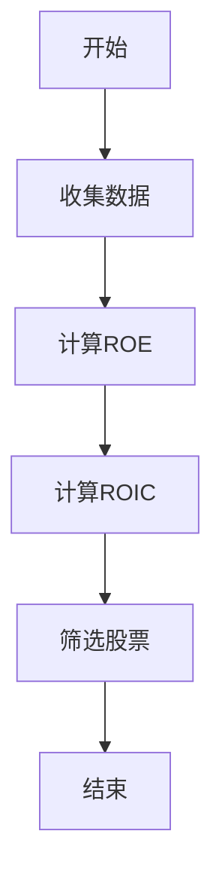

                 


# 《乔尔·格林布拉特的魔术公式投资法》

---

## 关键词：  
乔尔·格林布拉特、魔术公式、投资法、ROE、ROIC、股票筛选、投资策略

---

## 摘要：  
《乔尔·格林布拉特的魔术公式投资法》是一本深入探讨如何利用魔术公式进行股票投资的实践指南。书中详细解析了魔术公式的核心原理，包括ROE和ROIC等关键指标的计算方法，以及如何通过这些指标筛选出具有投资价值的股票。通过系统化的分析和实战案例，读者将学会如何构建高效的投资组合，并在不同市场环境下灵活调整投资策略。本书不仅适合投资新手，也适合有经验的投资者深入理解和优化其投资方法。

---

## 第一部分：魔术公式投资法的背景与核心概念

### 第1章：魔术公式投资法的起源与背景

#### 1.1 投资学的演变与格林布拉特的贡献

- **1.1.1 传统价值投资与成长投资的局限性**  
  - 传统价值投资强调低市盈率、低市净率等指标，但忽视了公司盈利能力的真实情况。  
  - 成长投资则过于关注高增长，可能导致估值过高的问题。  
  - 魔术公式试图在两者之间找到平衡点，兼顾价值与成长。

- **1.1.2 格林布拉特的学术背景与投资实践**  
  - 格林布拉特是哥伦比亚大学的博士，拥有深厚的金融理论基础。  
  - 他在投资实践中发现，许多高增长公司由于估值过高，难以实现长期收益。  
  - 通过研究中小盘股，他发现了魔术公式的核心指标ROE和ROIC。

- **1.1.3 魔术公式投资法的诞生与核心理念**  
  - 魔术公式投资法的核心理念是寻找那些估值合理、盈利能力强的公司。  
  - 通过量化指标筛选股票，避免了主观判断的干扰。  
  - 该方法特别适合中小盘股投资，因为这些股票往往被市场忽视，但具有较高的潜在回报。

#### 1.2 魔术公式投资法的核心问题背景

- **1.2.1 传统投资方法的不足**  
  - 价值投资过于依赖市盈率、市净率等估值指标，忽视了盈利能力。  
  - 成长投资过于关注收入和利润增长率，忽视了估值的合理性。  
  - 魔术公式通过结合ROE和ROIC，弥补了这些不足。

- **1.2.2 中小盘股投资的机遇与挑战**  
  - 中小盘股通常具有较高的增长潜力，但估值也可能过高。  
  - 中小盘股的流动性较低，市场关注度较低，但这也意味着潜在的市场机会。  
  - 魔术公式通过量化筛选，帮助投资者发现被低估的中小盘股。

- **1.2.3 如何平衡价值与成长的矛盾**  
  - 价值投资与成长投资的矛盾在于，前者追求低估值，后者追求高增长。  
  - 魔术公式通过同时关注ROE和ROIC，找到了两者的平衡点。  
  - 通过公式计算，投资者可以筛选出那些估值合理、盈利能力强的公司。

#### 1.3 魔术公式投资法的边界与外延

- **1.3.1 魔术公式适用的市场环境**  
  - 魔术公式特别适用于中小盘股投资，因为这些股票的估值和盈利能力更容易被忽视。  
  - 该方法在非有效市场中表现尤为突出，因为非有效市场中存在较多的市场套利机会。  
  - 在有效市场中，魔术公式的表现可能受到限制，但仍能作为投资组合的一部分。

- **1.3.2 魔术公式与非有效市场的适应性**  
  - 在非有效市场中，股票价格往往偏离其内在价值，为投资者提供了套利机会。  
  - 魔术公式通过量化筛选，帮助投资者发现这些机会。  
  - 但在有效市场中，股票价格反映所有公开信息，套利机会较少，魔术公式的表现可能不如预期。

- **1.3.3 魔术公式与其他投资策略的对比**  
  - 魔术公式与传统价值投资的对比：  
    - 传统价值投资更注重估值指标（如市盈率、市净率），而魔术公式更注重盈利能力指标（如ROE、ROIC）。  
  - 魔术公式与成长投资的对比：  
    - 成长投资更注重收入和利润增长率，而魔术公式更注重盈利能力与估值的结合。  
  - 魔术公式与指数投资的对比：  
    - 指数投资通过分散投资降低风险，而魔术公式通过筛选优质股票降低风险。  
    - 魔术公式适合主动管理型投资，而指数投资适合被动管理型投资。

#### 1.4 核心概念的结构与组成

- **1.4.1 魔术公式的核心概念**  
  - 魔术公式的核心概念包括ROE（净资产收益率）和ROIC（投资资本回报率）。  
  - ROE衡量了公司的盈利能力，而ROIC衡量了公司使用资本的效率。  
  - 通过结合这两个指标，魔术公式可以帮助投资者筛选出那些盈利能力强且估值合理的公司。

- **1.4.2 核心概念的属性特征对比**  
  | 指标 | 定义 | 作用 | 计算公式 |  
  |------|------|------|----------|  
  | ROE | 净资产收益率 | 衡量公司盈利能力 | 净利润 / 平均净资产 |  
  | ROIC | 投资资本回报率 | 衡量公司使用资本的效率 | 净利润 / （总负债 + 所有者权益） |  

- **1.4.3 实体关系图（ER图）**  
  以下是一个简单的ER图，展示魔术公式中涉及的核心概念：  
  ```mermaid
  graph TD
    A[ROE] --> B[公司]
    C[ROIC] --> B[公司]
  ```

---

## 第二部分：魔术公式投资法的核心概念与联系

### 第2章：魔术公式的核心原理与算法

#### 2.1 魔术公式的核心原理

- **2.1.1 ROE与ROIC的定义与计算**  
  - ROE（净资产收益率）：ROE = 净利润 / 平均净资产  
  - ROIC（投资资本回报率）：ROIC = 净利润 / （总负债 + 所有者权益）  

- **2.1.2 ROE与ROIC的区别与联系**  
  - ROE衡量的是公司使用股东资产的效率，而ROIC衡量的是公司使用所有资本的效率。  
  - ROE和ROIC都反映了公司的盈利能力，但ROIC更全面，因为它考虑了所有资本来源。  

- **2.1.3 魔术公式的核心公式**  
  - 魔术公式：ROE + ROIC + 其他调整项  
  - 通常，魔术公式通过加权平均或其他方式结合ROE和ROIC，以筛选出符合条件的股票。

#### 2.2 魔术公式算法流程图

以下是一个魔术公式算法的流程图：  


#### 2.3 魔术公式投资法的数学模型

- **2.3.1 ROE的数学模型**  
  $$ROE = \frac{\text{净利润}}{\text{平均净资产}}$$  
  其中，平均净资产 = （期初净资产 + 期末净资产） / 2  

- **2.3.2 ROIC的数学模型**  
  $$ROIC = \frac{\text{净利润}}{\text{总负债 + 所有者权益}}$$  

- **2.3.3 魔术公式的综合评价模型**  
  $$\text{综合评分} = \alpha \times ROE + \beta \times ROIC$$  
  其中，α 和 β 是权重系数，通常根据具体情况进行调整。

#### 2.4 魔术公式投资法的算法实现

- **2.4.1 数据收集与预处理**  
  - 数据来源：可以从Yahoo Finance、Google Finance等平台获取。  
  - 数据格式：通常包括公司名称、股价、净利润、总资产、总负债等。  

- **2.4.2 数据分析与计算**  
  - 计算ROE和ROIC。  
  - 根据计算结果，筛选出符合一定条件的股票。  

- **2.4.3 结果可视化与解读**  
  - 使用图表展示筛选结果，如柱状图、折线图等。  
  - 对筛选出的股票进行进一步分析，如行业分布、财务状况等。  

#### 2.5 魔术公式投资法的系统架构设计

- **2.5.1 系统功能设计**  
  - 数据获取模块：从Yahoo Finance获取实时数据。  
  - 数据计算模块：计算ROE和ROIC。  
  - 筛选模块：根据设定的条件筛选股票。  
  - 可视化模块：展示筛选结果。  

- **2.5.2 系统架构图**  
  ```mermaid
  graph TD
    A[数据获取模块] --> B[数据计算模块]
    B --> C[筛选模块]
    C --> D[可视化模块]
  ```

- **2.5.3 系统接口设计**  
  - 数据获取接口：通过API获取股票数据。  
  - 计算接口：将数据传递给计算模块。  
  - 筛选接口：根据条件筛选股票。  
  - 可视化接口：将结果传递给可视化模块。  

---

## 第三部分：魔术公式投资法的系统分析与架构设计

### 第3章：魔术公式投资法的系统分析

#### 3.1 问题场景介绍

- **3.1.1 投资者面临的挑战**  
  - 信息过载：投资者需要处理大量的数据，难以快速找到符合条件的股票。  
  - 主观判断：传统投资方法依赖主观判断，容易受到情绪影响。  
  - 市场波动：市场波动大，投资者需要灵活调整投资策略。  

- **3.1.2 系统化投资的重要性**  
  - 系统化投资可以帮助投资者减少情绪干扰，提高决策的科学性。  
  - 系统化投资可以提高效率，帮助投资者快速筛选出符合条件的股票。  

#### 3.2 项目介绍

- **3.2.1 项目目标**  
  - 构建一个基于魔术公式的投资系统，帮助投资者快速筛选出符合条件的股票。  
  - 提供实时数据获取、自动计算、智能筛选等功能。  

- **3.2.2 项目需求**  
  - 数据获取：支持从Yahoo Finance等平台获取实时数据。  
  - 数据计算：自动计算ROE和ROIC。  
  - 筛选功能：根据设定的条件筛选股票。  
  - 可视化功能：展示筛选结果。  

#### 3.3 系统功能设计

- **3.3.1 数据获取模块**  
  - 通过API获取股票数据。  
  - 支持多线程下载，提高效率。  

- **3.3.2 数据计算模块**  
  - 计算ROE和ROIC。  
  - 提供数据清洗功能，处理缺失值。  

- **3.3.3 筛选模块**  
  - 根据设定的条件筛选股票。  
  - 提供多种筛选条件，如ROE > 15%，ROIC > 10%等。  

- **3.3.4 可视化模块**  
  - 展示筛选结果，如柱状图、折线图等。  
  - 提供交互式界面，方便用户查看详细信息。  

#### 3.4 系统架构设计

- **3.4.1 系统架构图**  
  ```mermaid
  graph TD
    A[数据获取模块] --> B[数据计算模块]
    B --> C[筛选模块]
    C --> D[可视化模块]
  ```

- **3.4.2 系统交互设计**  
  ```mermaid
  graph TD
    A[用户] --> B[数据获取模块]
    B --> C[数据计算模块]
    C --> D[筛选模块]
    D --> E[可视化模块]
    E --> F[用户]
  ```

---

## 第四部分：魔术公式投资法的项目实战

### 第4章：魔术公式投资法的项目实战

#### 4.1 环境安装与配置

- **4.1.1 安装Python环境**  
  - 安装Python 3.8 或更高版本。  
  - 安装Jupyter Notebook或PyCharm等开发工具。  

- **4.1.2 安装第三方库**  
  - 使用pip安装必要的库：  
    ```bash
    pip install pandas numpy matplotlib requests
    ```

#### 4.2 核心代码实现

- **4.2.1 数据获取模块**  
  ```python
  import requests
  import pandas as pd

  def get_stock_data(ticker):
      url = f"https://query1.finance.yahoo.com/ws/v1/finance/quote/{ticker}"
      response = requests.get(url)
      data = response.json()
      return pd.DataFrame(data['quoteResponse']['result'][0])
  ```

- **4.2.2 数据计算模块**  
  ```python
  def calculate_roe(df):
      roe = df['netProfit'].mean() / df['average_equity'].mean()
      return roe

  def calculate_roic(df):
      roic = df['netProfit'].mean() / (df['totalDebt'].mean() + df['equity'].mean())
      return roic
  ```

- **4.2.3 筛选模块**  
  ```python
  def screen_stocks(roe, roic, threshold_roe=0.15, threshold_roic=0.1):
      selected = []
      for stock in stocks:
          if calculate_roe(stock) > threshold_roe and calculate_roic(stock) > threshold_roic:
              selected.append(stock)
      return selected
  ```

- **4.2.4 可视化模块**  
  ```python
  import matplotlib.pyplot as plt

  def visualize_results(selected_stocks):
      plt.bar(range(len(selected_stocks)), [stock['roe'] for stock in selected_stocks])
      plt.title('Selected Stocks - ROE')
      plt.xlabel('Stock Index')
      plt.ylabel('ROE')
      plt.show()
  ```

#### 4.3 项目实战案例分析

- **4.3.1 案例背景**  
  - 假设我们有一个包含10只股票的数据集，需要从中筛选出ROE > 15%且ROIC > 10%的股票。  

- **4.3.2 数据获取与计算**  
  - 使用上述代码获取每只股票的ROE和ROIC。  

- **4.3.3 筛选与可视化**  
  - 根据筛选条件选出符合条件的股票，并用图表展示结果。  

#### 4.4 项目总结与优化建议

- **4.4.1 项目总结**  
  - 通过魔术公式投资法，我们成功筛选出符合条件的股票。  
  - 该方法可以帮助投资者快速找到具有投资价值的股票。  

- **4.4.2 优化建议**  
  - 可以进一步优化筛选条件，根据市场环境调整权重。  
  - 引入更多指标，如市盈率、市净率等，提高筛选的准确性。  

---

## 第五部分：魔术公式投资法的系统优化与未来展望

### 第5章：魔术公式投资法的系统优化

#### 5.1 系统优化方案

- **5.1.1 数据获取模块的优化**  
  - 使用多线程或异步请求，提高数据获取效率。  
  - 引入缓存机制，减少重复请求。  

- **5.1.2 数据计算模块的优化**  
  - 使用并行计算，加速数据处理。  
  - 引入机器学习算法，提高预测准确性。  

- **5.1.3 筛选模块的优化**  
  - 根据市场环境动态调整筛选条件。  
  - 引入更多指标，如市盈率、市净率等，提高筛选的准确性。  

#### 5.2 系统架构的未来展望

- **5.2.1 微服务架构**  
  - 将系统拆分为多个微服务，如数据获取服务、数据计算服务、筛选服务等。  
  - 通过API Gateway统一接口，提高系统的可扩展性。  

- **5.2.2 人工智能的引入**  
  - 引入机器学习算法，如随机森林、支持向量机等，提高筛选的准确性。  
  - 使用深度学习算法，分析历史数据，预测未来走势。  

---

## 总结

《乔尔·格林布拉特的魔术公式投资法》是一本深入探讨如何利用魔术公式进行股票投资的实践指南。通过系统化的分析和实战案例，读者将学会如何构建高效的投资组合，并在不同市场环境下灵活调整投资策略。本书不仅适合投资新手，也适合有经验的投资者深入理解和优化其投资方法。

---

## 作者：AI天才研究院 & 禅与计算机程序设计艺术

