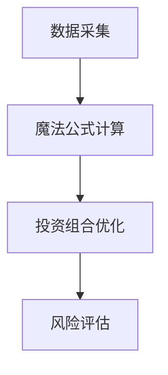
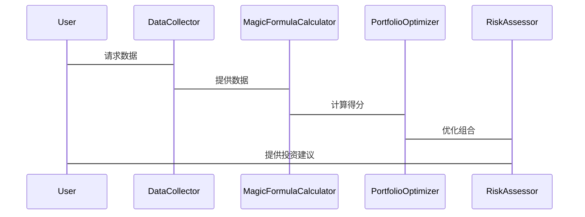

                 


# 乔尔·格林布拉特的魔法公式投资策略

> 关键词：魔法公式, 投资策略, 乔尔·格林布拉特, 股票筛选, 价值投资

> 摘要：本文详细介绍了乔尔·格林布拉特的魔法公式投资策略，从其背景、核心原理到实际应用，结合数学模型、算法实现和系统架构，全面解析了该策略在投资决策中的作用。通过实际案例分析和系统设计，展示了如何利用魔法公式进行有效的股票筛选和投资组合优化。

---

## 第一章: 魔法公式投资策略的背景与概念

### 1.1 投资策略的演变与魔法公式的起源

传统投资策略主要依赖于基本面分析和市场趋势预测，但这些方法在实际操作中往往面临信息不对称、市场波动大等问题。乔尔·格林布拉特提出的魔法公式作为一种量化投资策略，试图通过简单的数学模型来解决这些问题。

#### 1.1.1 传统投资策略的局限性
- 基于情绪的交易容易导致非理性决策。
- 基于市场趋势的预测难以准确把握短期波动。
- 基于基本面分析需要大量人工判断，耗时且成本高。

#### 1.1.2 乔尔·格林布拉特与魔法公式的提出
乔尔·格林布拉特是一位著名投资经理，他在《魔法公式投资》一书中首次提出了这一策略。魔法公式的核心思想是通过量化指标筛选出具有高收益潜力的股票，同时避免了传统投资中的主观判断问题。

#### 1.1.3 魔法公式在投资领域的应用现状
- 魔法公式已被广泛应用于股票筛选和投资组合优化。
- 许多机构投资者和散户通过魔法公式实现了超额收益。
- 随着大数据和人工智能技术的发展，魔法公式被进一步优化和扩展。

### 1.2 魔法公式的核心概念与定义

魔法公式的数学表达式如下：
$$
\text{Magic Formula} = \frac{E}{V} \times \frac{1}{P} \times \text{ROE}
$$

其中：
- $E$ 表示企业价值（EV）。
- $V$ 表示市净率（P/B）。
- $P$ 表示市盈率（P/E）。
- $\text{ROE}$ 表示净资产收益率。

#### 核心指标的解释
- **企业价值（EV）**：衡量一家公司的整体价值，包括股权和债务。
- **市净率（P/B）**：衡量股票价格与公司资产的比率。
- **市盈率（P/E）**：衡量股票价格与公司盈利的比率。
- **净资产收益率（ROE）**：衡量公司盈利能力的重要指标。

### 1.3 魔法公式与传统投资策略的对比

#### 1.3.1 传统价值投资的局限性
- 过度依赖主观判断，难以量化。
- 需要大量人工分析，效率低下。
- 易受市场情绪影响，难以避免非理性决策。

#### 1.3.2 魔法公式的优势与创新
- 量化指标，易于计算和比较。
- 简化了基本面分析过程，提高了效率。
- 能够同时考虑多个因素，避免主观偏差。

#### 1.3.3 魔法公式与成长型投资的结合
- 魔法公式不仅关注价值，还考虑成长性。
- 通过ROE和EV指标，筛选出具有高成长潜力的公司。

---

## 第二章: 魔法公式的核心原理与数学模型

### 2.1 魔法公式的数学推导

#### 2.1.1 魔法公式的公式分解
$$
\text{Magic Formula} = \frac{E}{V} \times \frac{1}{P} \times \text{ROE}
$$

各部分的含义：
- $\frac{E}{V}$：衡量公司价值与资产的比率。
- $\frac{1}{P}$：市盈率的倒数，表示盈利能力的相对性。
- $\text{ROE}$：净资产收益率，反映公司的盈利能力。

#### 2.1.2 各变量的数学关系
- $E$ 与 $V$ 的关系：企业价值与资产价值成正比。
- $P$ 对投资决策的影响：市盈率低意味着股价可能被低估。
- $\text{ROE}$ 的计算与企业盈利能力的关联：ROE高表示公司盈利能力强。

### 2.2 魔法公式的核心算法

#### 2.2.1 投资评分的计算流程
1. 计算企业价值 $E$。
2. 计算市净率 $V$。
3. 计算市盈率 $P$。
4. 计算净资产收益率 $\text{ROE}$。
5. 综合计算魔法公式得分。

#### 2.2.2 算法实现的步骤
1. 收集目标公司的财务数据。
2. 计算各项指标。
3. 代入公式计算得分。
4. 根据得分筛选股票。

### 2.3 魔法公式的核心优势

#### 2.3.1 参数调整的必要性
- 根据市场变化调整权重。
- 根据行业特点优化参数。

#### 2.3.2 不同行业的魔法公式适用性
- 部分行业可能需要调整公式中的权重。
- 特定行业的数据可能影响公式的效果。

#### 2.3.3 魔法公式与市场周期的关系
- 在不同市场周期下，公式的表现可能不同。
- 需要结合市场环境进行动态调整。

---

## 第三章: 魔法公式在实际投资中的应用

### 3.1 魔法公式选股策略的步骤

#### 3.1.1 确定投资目标与筛选标准
- 设定目标收益率。
- 确定投资期限。
- 设定行业限制。

#### 3.1.2 选取符合魔法公式的候选股票
- 计算每家公司的魔法公式得分。
- 根据得分排序，筛选出高分股票。

#### 3.1.3 进行基本面分析与风险评估
- 进一步分析公司财务状况。
- 评估公司治理和管理团队。
- 评估行业风险和宏观经济风险。

### 3.2 魔法公式与行业分析的结合

#### 3.2.1 不同行业的魔法公式应用案例
- **科技行业**：高ROE，高增长潜力。
- **金融行业**：低市净率，高ROE。
- **消费行业**：稳定增长，低波动性。

#### 3.2.2 魔法公式在科技、金融、消费等行业的表现对比
- 科技行业：ROE可能较低，但增长潜力大。
- 金融行业：ROE高，但受宏观经济影响较大。
- 消费行业：ROE稳定，波动性小。

#### 3.2.3 行业周期对魔法公式投资效果的影响
- 在行业上升周期，魔法公式表现较好。
- 在行业下降周期，可能需要调整权重。

### 3.3 魔法公式与组合投资策略

#### 3.3.1 组合投资的必要性与优势
- 分散风险。
- 优化收益。
- 提高抗跌性。

#### 3.3.2 魔法公式在组合投资中的应用
- 根据得分筛选股票。
- 根据行业分散投资。
- 根据市场变化动态调整。

#### 3.3.3 如何通过魔法公式构建风险可控的股票组合
- 确定投资目标和风险承受能力。
- 根据得分筛选股票。
- 根据行业和资产分配构建组合。
- 定期评估和调整。

---

## 第四章: 魔法公式投资策略的系统架构与实现

### 4.1 系统架构设计

#### 4.1.1 系统功能模块划分
- 数据采集模块：收集公司财务数据和市场数据。
- 魔法公式计算模块：计算各项指标和得分。
- 投资组合优化模块：根据得分构建投资组合。
- 风险评估模块：评估投资组合的风险。

#### 4.1.2 系统架构图（Mermaid）



### 4.2 系统实现细节

#### 4.2.1 数据采集模块

```python
import pandas as pd
import requests
from bs4 import BeautifulSoup

def get_finance_data(ticker):
    url = f"https://finance.yahoo.com/quote/{ticker}"
    response = requests.get(url)
    soup = BeautifulSoup(response.text, 'html.parser')
    data = {}
    # Extract financial data
    # Example: extracting P/E ratio
    pe_ratio = soup.find('div', {'data-reactid': '41'}).text
    data['P/E'] = float(pe_ratio)
    # More data extraction logic...
    return data
```

#### 4.2.2 魔法公式计算模块

```python
def calculate_magic_formula(E, V, P, ROE):
    magic_formula = (E / V) * (1 / P) * ROE
    return magic_formula
```

#### 4.2.3 投资组合优化模块

```python
import numpy as np
from scipy.optimize import minimize

def optimize_portfolio(weights, returns, risk_free_rate=0.01):
    # 定义优化目标函数
    def objective(weight):
        return -weight.T.dot(returns).dot(weight)
    # 定义约束条件
    constraints = [
        {'type': 'eq', 'fun': lambda w: np.sum(w) - 1}
    ]
    # 使用scipy.optimize.minimize进行优化
    result = minimize(objective, weights, method='SLSQP', constraints=constraints)
    return result.x
```

#### 4.2.4 系统交互流程



---

## 第五章: 总结与展望

### 5.1 魔法公式投资策略的核心优势

- 简化了投资决策过程。
- 提高了投资决策的效率。
- 降低了投资决策的主观性。

### 5.2 魔法公式投资策略的实际效果

- 在长期投资中表现稳定。
- 在不同市场环境下表现各异。
- 需要结合其他策略进行优化。

### 5.3 魔法公式投资策略的未来发展

- 结合人工智能技术进行优化。
- 在大数据环境下进一步扩展应用。
- 进一步研究其在不同市场和行业的表现。

---

## 作者：AI天才研究院/AI Genius Institute & 禅与计算机程序设计艺术 /Zen And The Art of Computer Programming

