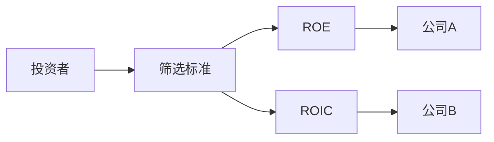
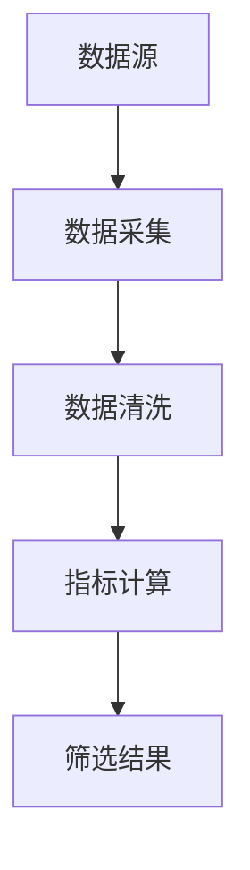
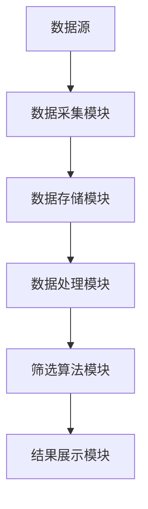

                 


# 乔尔格林布拉特的价值投资筛选

## 关键词：
- 价值投资
- 格林布拉特
- 投资筛选
- 财务指标
- 投资组合
- 价值投资策略
- 投资分析

## 摘要：
本文深入探讨了乔尔·格林布拉特的价值投资筛选方法，分析了其核心概念、数学模型、系统架构以及实际应用。通过结合技术语言和专业分析，详细阐述了如何利用格林布拉特的策略进行投资决策，并提供了具体的代码实现和案例分析。文章旨在为投资者和技术人员提供一个全面的视角，理解并应用这一经典价值投资方法。

---

## 第一部分: 背景介绍

### 第1章: 价值投资的核心概念

#### 1.1 价值投资的定义与背景
- **价值投资**：一种以低于内在价值的价格买入优质股票的投资策略，强调长期持有和安全边际。
- **格林布拉特的贡献**：提出了一套基于基本面分析和数学模型的投资筛选方法，将定性和定量分析相结合。
- **与传统投资的区别**：价值投资注重内在价值，而传统投资可能更多关注短期价格波动。

#### 1.2 格林布拉特投资方法的背景
- **问题背景**：传统投资方法难以量化，导致投资者难以系统化筛选标的。
- **问题描述**：如何通过数学模型和财务指标，系统化地筛选出具有投资价值的股票。
- **问题解决**：格林布拉特提出了一套基于ROE、ROIC等指标的筛选模型，解决了投资决策的系统化问题。
- **边界与外延**：适用于上市公司，不适用于非上市公司或初创企业。
- **核心要素**：ROE、ROIC、财务健康性、行业地位。

---

## 第二部分: 核心概念与联系

### 第2章: 核心概念与联系

#### 2.1 核心概念原理
- **ROE（净资产收益率）**：衡量公司盈利能力的重要指标，计算公式为 $ROE = \frac{\text{净利润}}{\text{净资产}}$。
- **ROIC（投资资本回报率）**：衡量公司投资回报能力的指标，计算公式为 $ROIC = \frac{\text{净利润}}{\text{投资资本}}$。
- **财务健康性**：包括现金流、负债率等指标，确保公司财务状况稳健。

#### 2.2 指标对比表格
| 指标   | 定义                          | 重要性 |
|--------|-------------------------------|--------|
| ROE    | 净利润与净资产的比率          | 高     |
| ROIC   | 净利润与投资资本的比率        | 高     |
| 现金流 | 现金流入与流出的净额          | 中     |

#### 2.3 实体关系图（Mermaid）


---

## 第三部分: 算法原理与数学模型

### 第3章: 算法原理

#### 3.1 算法流程
- 数据采集：收集目标公司的财务数据。
- 数据清洗：处理缺失值和异常值。
- 指标计算：计算ROE、ROIC等指标。
- 标准筛选：根据设定的阈值筛选出符合条件的公司。

#### 3.2 算法流程图（Mermaid）


#### 3.3 数学模型
- 筛选公式：
  $$ \text{筛选条件} = (ROE > 阈值) \land (ROIC > 阈值) \land (现金流 > 0) $$

---

## 第四部分: 系统架构与设计

### 第4章: 系统架构设计

#### 4.1 系统功能需求
- 数据采集模块：从数据库或API获取数据。
- 数据处理模块：清洗和转换数据。
- 筛选算法模块：应用格林布拉特模型进行筛选。
- 结果展示模块：可视化筛选结果。

#### 4.2 系统架构图（Mermaid）


---

## 第五部分: 项目实战与代码实现

### 第5章: 项目实战

#### 5.1 环境安装与数据准备
- 安装Python和必要的库（如Pandas、NumPy）。
- 数据来源：从公开数据库获取股票数据。

#### 5.2 核心代码实现
```python
import pandas as pd

# 数据读取
data = pd.read_csv('stock_data.csv')

# 数据清洗
data.dropna(inplace=True)

# 计算ROE和ROIC
data['ROE'] = data['净利润'] / data['净资产']
data['ROIC'] = data['净利润'] / data['投资资本']

# 筛选条件
threshold Roe = 0.1
threshold Roic = 0.1

筛选结果 = data[(data['ROE'] > Roe 阈值) & (data['ROIC'] > Roic 阈值) & (data['现金流'] > 0)]
```

#### 5.3 案例分析
- 以某公司为例，计算ROE和ROIC，判断是否符合筛选条件。

---

## 第六部分: 最佳实践与小结

### 第6章: 最佳实践

#### 6.1 关键点总结
- 选择可靠的财务数据源。
- 灵活调整筛选阈值，适应市场变化。
- 结合行业分析，避免单一指标误导。

#### 6.2 注意事项
- 数据质量对结果影响重大，需谨慎处理。
- 避免过度依赖单一指标，结合多维度分析。

#### 6.3 拓展阅读
- 格林布拉特的书籍《The New Bernstein》深入探讨了他的投资理念。
- 结合机器学习，优化筛选模型。

---

## 结语

通过本文的详细讲解，读者可以系统地理解并应用格林布拉特的价值投资筛选方法。这种方法不仅提供了明确的筛选标准，还通过数学模型和系统架构的设计，为投资者提供了科学的决策依据。

---

## 作者信息

作者：AI天才研究院/AI Genius Institute & 禅与计算机程序设计艺术 /Zen And The Art of Computer Programming

