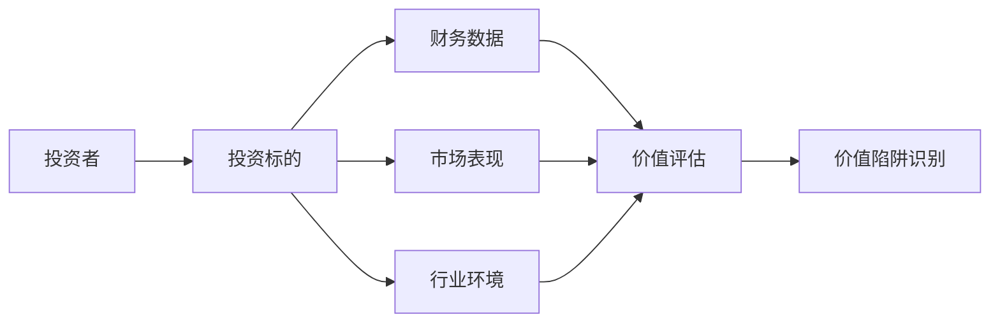

                 

# 人工智能辅助识别价值陷阱

> 关键词：人工智能，价值陷阱，金融分析，文本挖掘，异常检测，机器学习

> 摘要：价值陷阱是指在投资中，投资者可能误判的高风险或低质量投资标的。本文通过分析人工智能技术，探讨如何利用自然语言处理和机器学习算法，识别和预测这些潜在风险，为投资者提供决策支持。文章从理论基础到算法实现，再到系统架构，详细讲解了AI在识别价值陷阱中的应用，最后通过项目实战展示了如何构建一个完整的AI辅助识别系统。

---

## 第一部分: 人工智能辅助识别价值陷阱的基础

### 第1章: 价值陷阱的定义与背景

#### 1.1 价值陷阱的定义与特征
价值陷阱是指那些看似有吸引力，但实际上存在隐藏风险或质量问题的投资标的。这些标的通常具有误导性财务数据、行业环境恶化或市场表现不佳等特点，容易使投资者误判。

#### 1.2 人工智能在价值识别中的作用
人工智能技术能够通过分析大量非结构化数据（如新闻、财报、社交媒体等），识别隐藏的风险信号，帮助投资者更准确地识别价值陷阱。

---

### 第2章: 价值陷阱的核心概念与联系

#### 2.1 核心概念原理
价值陷阱的核心在于识别标的的质量和潜在风险。人工智能通过自然语言处理和机器学习技术，能够提取隐藏的信息，帮助投资者做出更明智的决策。

#### 2.2 核心概念属性特征对比
| 属性       | 价值陷阱识别       | 人工智能技术       |
|------------|--------------------|--------------------|
| 数据来源   | 财务数据、新闻、社交媒体 | 文本、结构化数据等   |
| 分析方法   | 财务分析、文本挖掘   | 机器学习、NLP       |
| 输出结果   | 风险评分、预警信号   | 分类结果、预测模型   |

#### 2.3 ER实体关系图

---

## 第二部分: 人工智能辅助识别价值陷阱的算法原理

### 第3章: 文本挖掘与情感分析

#### 3.1 文本挖掘的基本原理
文本挖掘通过对非结构化文本数据进行预处理、特征提取和分类，帮助识别隐藏的信息。例如，分析新闻稿中的关键词和情感倾向，评估公司前景。

#### 3.2 情感分析算法
使用自然语言处理技术，对文本进行情感分类，识别负面情绪，预警潜在风险。例如，使用词袋模型和Naive Bayes算法进行分类。

---

### 第4章: 异常检测与分类

#### 4.1 异常检测算法
通过机器学习算法，识别财务数据中的异常值，预警潜在风险。例如，使用LSTM模型进行时间序列分析，发现异常波动。

#### 4.2 分类算法
使用随机森林或支持向量机（SVM）对投资标的进行分类，识别高风险类别。例如，根据财务指标和市场表现，分类为“价值陷阱”或“优质标的”。

---

## 第三部分: 系统架构与实现

### 第5章: 系统架构设计

#### 5.1 功能设计
系统包括数据采集、特征提取、模型训练和结果展示等功能模块。

#### 5.2 架构设计

#### 5.3 接口设计
系统通过API接口与外部数据源对接，实时获取最新数据。

#### 5.4 交互流程

---

## 第四部分: 项目实战

### 第6章: 项目实战

#### 6.1 环境搭建
安装Python、TensorFlow、Keras等工具，配置开发环境。

#### 6.2 核心实现
编写代码实现数据采集、特征提取和模型训练功能。

#### 6.3 实际案例分析
通过具体案例，展示如何识别价值陷阱，帮助投资者做出明智决策。

---

## 第五部分: 总结与展望

### 第7章: 总结与展望

#### 7.1 总结
人工智能技术能够有效识别价值陷阱，帮助投资者规避风险，提高投资效率。

#### 7.2 展望
未来，随着技术的进步，AI在金融领域的应用将更加广泛，识别价值陷阱的准确性也将进一步提高。

---

## 作者

作者：AI天才研究院/AI Genius Institute & 禅与计算机程序设计艺术 /Zen And The Art of Computer Programming

---

这篇文章通过系统化的分析和具体的实现，展示了人工智能在识别价值陷阱中的应用，为投资者提供了有力的技术支持。希望读者能够通过本文，深入了解AI在金融分析中的潜力，并将其应用于实际投资中。

