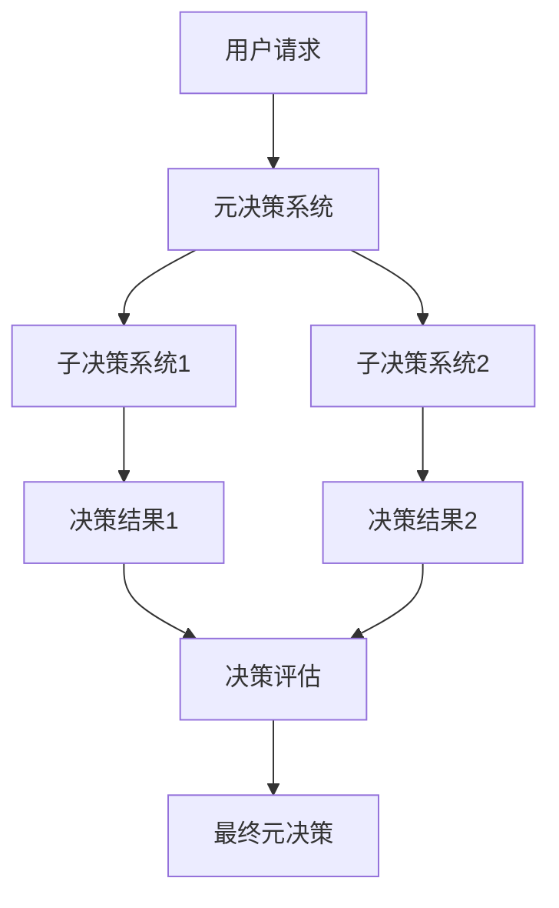

                 


## 第二章: 元决策系统的应用与挑战

### 第5章: 元决策系统的应用与挑战

#### 5.1 应用场景
- **自动驾驶**：自动驾驶汽车需要在复杂的交通环境中做出决策，元决策系统可以帮助协调不同子系统的决策（如路径规划、速度控制、避障等）。
- **智能医疗**：在医疗领域，元决策系统可以协调不同的诊断和治疗方案，确保患者得到最优的治疗。
- **金融投资**：在金融领域，元决策系统可以协调多个投资策略，优化投资组合。

#### 5.2 当前技术的挑战
- **数据依赖性**：元决策系统高度依赖子决策系统的数据输入，数据的质量和完整性直接影响元决策的准确性。
- **可解释性**：元决策系统的决策过程可能复杂且难以解释，这在金融、医疗等高风险领域尤为重要。
- **动态环境适应性**：实际环境是动态变化的，元决策系统需要能够快速适应新的情况，这增加了系统的复杂性。

#### 5.3 解决方案
- **多模态数据融合**：通过整合来自不同来源和类型的数据，提高决策的准确性和鲁棒性。
- **可解释性增强**：采用可解释性算法，如规则-based方法或对抗网络，确保决策过程透明。
- **自适应学习机制**：通过强化学习等方法，让系统能够根据反馈不断优化决策策略。

---

## 第三章: 系统设计与实现

### 第6章: 系统设计与实现

#### 6.1 系统架构设计
- **功能模块划分**：
  - **元决策协调模块**：负责协调多个子决策系统，评估子决策的优劣。
  - **决策规则库**：存储和管理决策规则，用于评估子决策。
  - **决策评估模块**：对子决策进行评估，选择最优的子决策。
  - **执行模块**：将最终的元决策输出到执行系统。

#### 6.2 系统交互流程


#### 6.3 系统实现
- **代码实现**：
  ```python
  class MetaDecisionSystem:
      def __init__(self, sub_decision_systems):
          self.sub_decision_systems = sub_decision_systems
          self.rules = self.load_rules()

      def load_rules(self):
          # 加载决策规则
          return {
              'rule1': '优先选择最优子决策',
              'rule2': '若多个子决策冲突，选择风险最低的决策'
          }

      def evaluate_decision(self, decision):
          # 根据规则评估决策
          for rule in self.rules:
              if rule applies to decision:
                  return evaluation_score
          return default_score

      def make_decision(self):
          best_decision = None
          best_score = -1
          for decision_system in self.sub_decision_systems:
              decision = decision_system.make_decision()
              score = self.evaluate_decision(decision)
              if score > best_score:
                  best_score = score
                  best_decision = decision
          return best_decision
  ```

---

## 第四章: 项目实战与案例分析

### 第7章: 项目实战与案例分析

#### 7.1 项目背景与需求分析
- **项目背景**：设计一个基于元决策系统的智能客服系统，协调不同的客服策略（如自动回复、人工客服、转接专家）。
- **需求分析**：
  - 实现自动判断客户问题类型。
  - 协调不同子决策系统（如自动回复系统、人工客服系统）。
  - 根据客户满意度优化决策策略。

#### 7.2 系统设计与实现
- **系统架构**：
  ```mermaid
  classDiagram
  class 元决策系统 {
      - 子决策系统1
      - 子决策系统2
      - 决策规则库
  }
  ```

- **代码实现**：
  ```python
  # 子决策系统：自动回复系统
  class AutoReplySystem:
      def make_decision(self, user_query):
          if self.can_answer(user_query):
              return '自动回复'
          else:
              return '需要人工处理'

      def can_answer(self, query):
          # 判断是否可以自动回答
          return True if query in self.knowledge_base else False

  # 子决策系统：人工客服系统
  class ManualSupportSystem:
      def make_decision(self, user_query):
          return '转接人工客服'

  # 元决策系统
  class MetaDecisionSystem:
      def __init__(self):
          self.sub_systems = [AutoReplySystem(), ManualSupportSystem()]
          self.rules = {'rule1': '优先使用自动回复'}

      def make_decision(self, user_query):
          decisions = [sys.make_decision(user_query) for sys in self.sub_systems]
          # 根据规则评估决策
          if '自动回复' in decisions:
              return '自动回复'
          else:
              return '转接人工客服'
  ```

#### 7.3 案例分析
- **案例分析**：
  - 当用户的问题可以在知识库中找到答案时，元决策系统会选择自动回复。
  - 当用户的问题无法自动回答时，系统会选择转接人工客服。
  - 通过规则库的优化，可以逐步提高自动回复的准确率，减少人工干预。

---

## 第五章: 优化与展望

### 第8章: 优化与展望

#### 8.1 当前系统的优化方向
- **计算效率优化**：通过并行计算和分布式系统提高决策效率。
- **可扩展性增强**：设计模块化的系统架构，方便扩展新的子决策系统。
- **强化学习优化**：引入强化学习算法，动态优化决策规则。

#### 8.2 未来发展趋势
- **边缘计算结合**：元决策系统可以与边缘计算结合，实现更高效的决策。
- **人机协作增强**：通过人机协作，提高决策的可解释性和用户体验。
- **多模态数据融合**：整合文本、图像、语音等多种数据源，提升决策的准确性和丰富性。

#### 8.3 总结
元决策系统作为一种新型的决策架构，为复杂的决策问题提供了一个高效的解决方案。通过不断优化和创新，元决策系统将在更多领域得到广泛应用，推动人工智能技术的发展。

---

## 作者

作者：AI天才研究院/AI Genius Institute & 禅与计算机程序设计艺术 /Zen And The Art of Computer Programming

---

以上是《从零开始：AI Agent的元决策系统》的完整目录和部分内容，涵盖了从基本概念到实际应用的各个方面，通过理论与实践相结合的方式，帮助读者逐步理解并掌握元决策系统的构建与应用。

