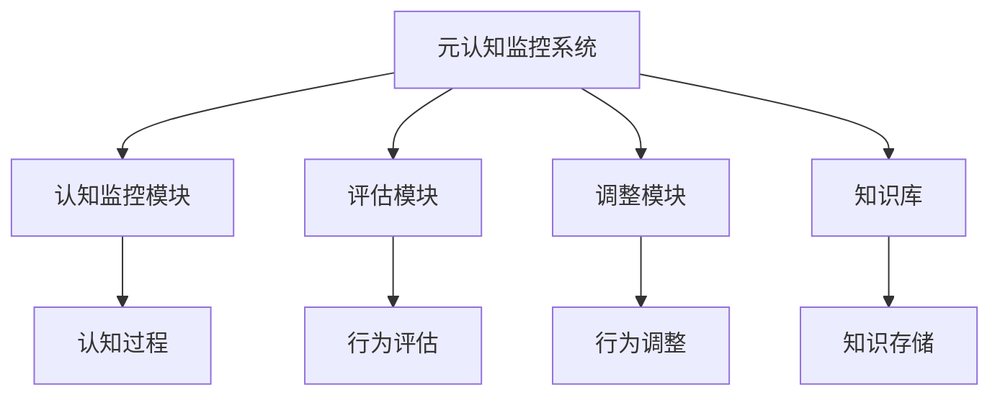
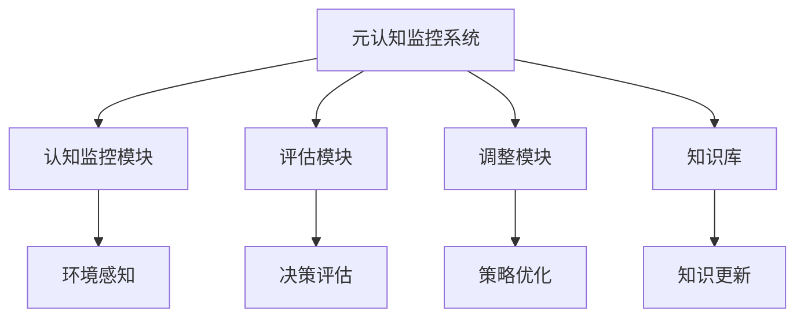
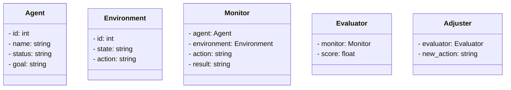
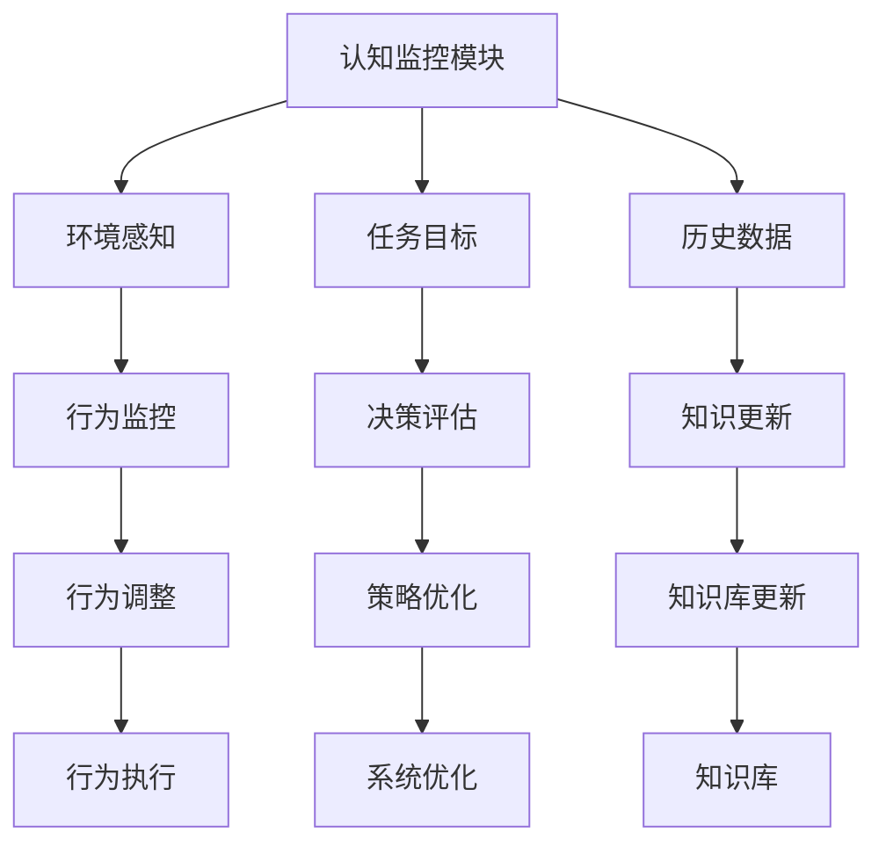
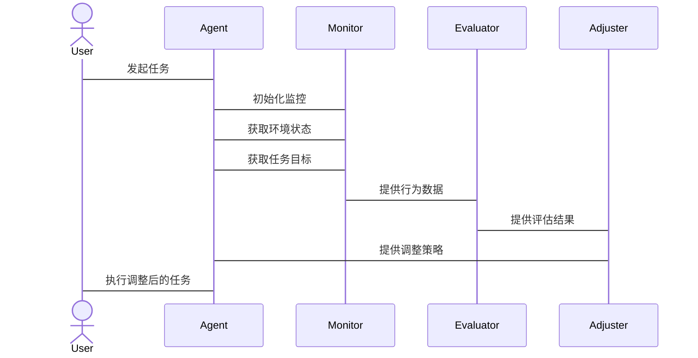

                 


# 从零开始：AI Agent的元认知监控系统

> 关键词：AI Agent，元认知监控，元学习，注意力机制，系统架构，项目实战

> 摘要：本文从AI Agent的元认知监控系统的基本概念出发，详细探讨了该系统的背景、核心原理、算法实现、系统架构设计、项目实战以及实际应用中的注意事项。通过一步步的分析与推理，本文旨在帮助读者全面理解并掌握AI Agent的元认知监控系统的构建与优化方法。

---

## 第1章 元认知监控系统概述

### 1.1 问题背景与问题描述

#### 1.1.1 AI Agent的基本概念
AI Agent（人工智能代理）是一种能够感知环境、自主决策并执行任务的智能实体。它可以是一个软件程序，也可以是一个物理设备，其核心目标是通过与环境的交互来实现特定的目标。AI Agent可以根据任务需求分为多种类型，如反应式代理、基于模型的代理、目标驱动的代理等。

#### 1.1.2 元认知监控的定义与作用
元认知监控（Meta-Cognition Monitoring）是指系统能够对自身的认知过程进行监控、评估和调整的能力。在AI Agent中，元认知监控系统能够实时分析代理的行为、决策过程以及认知状态，从而优化其性能并提高任务完成的效率。

#### 1.1.3 元认知监控系统的核心目标
元认知监控系统的核心目标是通过实时监控和分析AI Agent的认知过程，发现潜在的问题并提出改进策略。这不仅可以提高代理的效率和准确性，还可以增强其适应复杂环境的能力。

### 1.2 问题解决与边界外延

#### 1.2.1 元认知监控系统的核心问题
在AI Agent的元认知监控系统中，核心问题包括：
- 如何实时监控代理的认知过程？
- 如何评估代理的决策质量？
- 如何动态调整代理的行为策略？

#### 1.2.2 系统的边界与适用范围
元认知监控系统的边界主要集中在AI Agent的认知过程和行为决策方面。其适用范围包括但不限于：
- 自动化任务执行
- 复杂环境下的决策优化
- 动态任务中的策略调整

#### 1.2.3 系统的外延与扩展性分析
元认知监控系统的外延可以从以下几个方面进行扩展：
- 扩展到多Agent系统，实现多个代理之间的协同监控。
- 结合强化学习，进一步优化代理的行为策略。
- 应用于更复杂的认知任务，如情感计算和意图识别。

### 1.3 核心要素与概念结构

#### 1.3.1 元认知监控系统的组成要素
元认知监控系统主要由以下几个部分组成：
1. **认知监控模块**：负责监控代理的认知过程。
2. **评估模块**：对代理的行为和决策进行评估。
3. **调整模块**：根据评估结果调整代理的行为策略。
4. **知识库**：存储代理的知识和经验。

#### 1.3.2 系统的核心概念与关系
通过以下关系图，我们可以清晰地看到元认知监控系统的核心概念及其之间的关系：



#### 1.3.3 系统的结构与功能模块
以下是系统的结构图：



---

## 第2章 元认知监控系统的原理与机制

### 2.1 元认知监控的核心原理

#### 2.1.1 元学习的基本概念
元学习是一种学习方法，其目标是通过学习如何学习来提高模型的适应能力。元学习的核心思想是让模型能够从经验中提取通用的学习策略。

#### 2.1.2 元认知监控的实现机制
元认知监控的实现机制包括以下几个步骤：
1. **认知过程的实时监控**：通过传感器或日志记录代理的行为和决策。
2. **行为评估**：根据预设的评估标准对代理的行为进行评估。
3. **策略调整**：根据评估结果动态调整代理的行为策略。

#### 2.1.3 系统的自适应能力
元认知监控系统的自适应能力主要体现在以下几个方面：
- **动态调整**：根据环境变化和任务需求动态调整代理的行为策略。
- **自我优化**：通过元学习不断优化系统的监控和调整机制。
- **知识更新**：定期更新知识库中的知识和经验。

### 2.2 元认知监控的算法与模型

#### 2.2.1 元学习算法的基本框架
元学习算法的基本框架包括以下几个步骤：
1. **元任务的定义**：定义多个不同的任务作为元任务。
2. **元模型的训练**：通过元任务训练一个元模型，使其能够快速适应新的任务。
3. **任务适应**：在新的任务中，利用元模型快速调整参数以适应任务需求。

#### 2.2.2 注意力机制在元认知中的应用
注意力机制在元认知中的应用主要体现在以下几个方面：
- **行为监控**：通过注意力机制实时监控代理的行为。
- **决策优化**：通过注意力机制优化代理的决策过程。
- **知识更新**：通过注意力机制选择性地更新知识库中的知识。

#### 2.2.3 知识表示与推理模型
知识表示与推理模型是元认知监控系统的核心部分。常用的表示方法包括符号表示、向量表示和图结构表示。推理模型则包括逻辑推理、概率推理和强化学习推理。

---

## 第3章 元学习算法的原理与实现

### 3.1 元学习的基本概念

#### 3.1.1 元学习的定义
元学习是一种学习方法，其目标是通过学习如何学习来提高模型的适应能力。

#### 3.1.2 元学习的核心思想
元学习的核心思想是让模型能够从经验中提取通用的学习策略。

#### 3.1.3 元学习与传统机器学习的区别
元学习与传统机器学习的区别主要体现在以下几个方面：
- **学习目标**：传统机器学习关注具体任务的优化，而元学习关注如何快速适应新任务。
- **学习过程**：传统机器学习需要大量的任务样本，而元学习需要少量的样本即可快速适应新任务。
- **应用范围**：元学习适用于需要快速适应新任务的场景，如多任务学习和零样本学习。

### 3.2 元学习算法的数学模型

#### 3.2.1 优化目标函数
元学习算法的优化目标函数通常包括以下几个部分：
- **元目标函数**：用于衡量元模型的性能。
- **任务目标函数**：用于衡量代理在具体任务中的性能。
- **优化目标**：通过优化元目标函数和任务目标函数来提高系统的整体性能。

#### 3.2.2 损失函数的定义
元学习算法的损失函数通常包括以下几个部分：
- **元损失函数**：用于衡量元模型的性能。
- **任务损失函数**：用于衡量代理在具体任务中的性能。
- **总损失函数**：通过将元损失函数和任务损失函数结合起来，得到总的损失函数。

#### 3.2.3 算法的收敛性分析
元学习算法的收敛性分析主要关注算法在训练过程中的收敛速度和稳定性。常用的收敛性分析方法包括：
- **梯度下降法**：通过不断更新参数来优化损失函数。
- **Adam优化器**：结合动量和自适应学习率的优化方法。
- **随机梯度下降法**：通过随机选择样本进行优化。

### 3.3 元学习算法的实现步骤

#### 3.3.1 数据预处理与特征提取
数据预处理与特征提取是元学习算法实现的基础。常用的数据预处理方法包括：
- **数据清洗**：去除噪声和冗余数据。
- **数据归一化**：将数据标准化到统一的范围。
- **特征选择**：选择对任务最重要的特征。

#### 3.3.2 模型训练与优化
模型训练与优化是元学习算法实现的核心步骤。常用的训练方法包括：
- **随机采样**：随机选择样本进行训练。
- **批量训练**：将数据分成若干批进行训练。
- **在线训练**：根据实时数据动态调整模型参数。

#### 3.3.3 系统的评估与测试
系统的评估与测试是元学习算法实现的重要环节。常用的评估方法包括：
- **准确率评估**：计算模型在测试集上的准确率。
- **召回率评估**：计算模型在测试集上的召回率。
- **F1分数评估**：综合考虑准确率和召回率的调和平均数。

---

## 第4章 注意力机制在元认知中的应用

### 4.1 注意力机制的基本概念

#### 4.1.1 注意力机制的定义
注意力机制是一种模拟人类注意力的机制，其核心思想是通过关注输入数据中的重要部分来提高模型的性能。

#### 4.1.2 注意力机制的核心思想
注意力机制的核心思想是通过计算输入数据中各部分的重要性，从而将模型的注意力集中在重要的部分。

#### 4.1.3 注意力机制与元认知的关系
注意力机制在元认知中的应用主要体现在以下几个方面：
- **行为监控**：通过注意力机制实时监控代理的行为。
- **决策优化**：通过注意力机制优化代理的决策过程。
- **知识更新**：通过注意力机制选择性地更新知识库中的知识。

### 4.2 注意力机制的数学模型

#### 4.2.1 注意力计算的公式
注意力计算的公式通常包括以下几个部分：
- **查询向量**：表示模型对输入数据的关注点。
- **键向量**：表示输入数据中各部分的特征。
- **值向量**：表示输入数据中各部分的重要性。

#### 4.2.2 注意力权重的计算
注意力权重的计算通常采用以下步骤：
1. **计算查询向量与键向量的点积**。
2. **对点积结果进行归一化**。
3. **根据注意力权重计算最终的注意力向量**。

#### 4.2.3 注意力机制的优化
注意力机制的优化主要关注以下几个方面：
- **注意力权重的计算**：通过优化注意力权重的计算方法来提高模型的性能。
- **注意力向量的更新**：通过优化注意力向量的更新策略来提高模型的适应能力。
- **注意力机制的组合**：通过组合不同的注意力机制来提高模型的性能。

### 4.3 注意力机制的实现步骤

#### 4.3.1 注意力机制的初始化
注意力机制的初始化通常包括以下几个步骤：
1. **初始化查询向量**：随机初始化查询向量。
2. **初始化键向量**：随机初始化键向量。
3. **初始化值向量**：随机初始化值向量。

#### 4.3.2 注意力权重的计算
注意力权重的计算通常采用以下步骤：
1. **计算查询向量与键向量的点积**。
2. **对点积结果进行归一化**。
3. **计算最终的注意力权重**。

#### 4.3.3 注意力向量的更新
注意力向量的更新通常包括以下几个步骤：
1. **计算注意力向量**：根据注意力权重和值向量计算最终的注意力向量。
2. **更新注意力向量**：根据新的注意力权重动态更新注意力向量。
3. **应用注意力向量**：将注意力向量应用于模型的后续计算。

---

## 第5章 系统分析与架构设计方案

### 5.1 问题场景介绍

#### 5.1.1 系统的整体架构设计
元认知监控系统的整体架构设计包括以下几个部分：
1. **认知监控模块**：负责实时监控代理的认知过程。
2. **评估模块**：对代理的行为和决策进行评估。
3. **调整模块**：根据评估结果动态调整代理的行为策略。
4. **知识库**：存储代理的知识和经验。

#### 5.1.2 系统的输入与输出
系统的输入包括：
- **环境感知**：代理通过传感器感知环境。
- **任务目标**：代理需要完成的具体任务目标。
- **历史数据**：代理的历史行为和决策数据。

系统的输出包括：
- **行为调整策略**：根据评估结果动态调整代理的行为策略。
- **知识更新策略**：根据评估结果动态更新知识库中的知识。
- **系统日志**：记录系统的运行状态和评估结果。

### 5.2 系统功能设计

#### 5.2.1 领域模型的类图
以下是领域的类图：



#### 5.2.2 系统架构的架构图
以下是系统的架构图：



#### 5.2.3 系统接口与交互的序列图
以下是系统的接口与交互序列图：



---

## 第6章 项目实战

### 6.1 环境安装与配置

#### 6.1.1 系统运行环境
元认知监控系统的运行环境包括：
- **操作系统**：Linux、Windows、macOS
- **编程语言**：Python 3.6+
- **深度学习框架**：TensorFlow、PyTorch
- **其他依赖**：numpy、pandas、scikit-learn、mermaid、matplotlib

#### 6.1.2 开发工具的安装
开发工具的安装包括以下几个步骤：
1. **安装Python**：安装Python 3.6或更高版本。
2. **安装深度学习框架**：安装TensorFlow或PyTorch。
3. **安装其他依赖**：使用pip安装numpy、pandas、scikit-learn等依赖。

#### 6.1.3 代码仓库的克隆
代码仓库的克隆步骤如下：
1. **克隆仓库**：使用Git克隆元认知监控系统的代码仓库。
2. **进入项目目录**：cd进入项目目录。
3. **安装依赖**：运行pip install -r requirements.txt安装依赖。

### 6.2 系统核心功能的实现

#### 6.2.1 元学习算法的实现
以下是元学习算法的实现代码：

```python
import numpy as np
import tensorflow as tf

class MetaLearningAgent:
    def __init__(self, input_dim, meta_dim):
        self.input_dim = input_dim
        self.meta_dim = meta_dim
        self.meta_model = self.build_meta_model()

    def build_meta_model(self):
        input_layer = tf.keras.Input(shape=(self.input_dim,))
        dense_layer = tf.keras.layers.Dense(64, activation='relu')(input_layer)
        output_layer = tf.keras.layers.Dense(self.meta_dim, activation='linear')(dense_layer)
        return tf.keras.Model(inputs=input_layer, outputs=output_layer)

    def call(self, inputs):
        return self.meta_model(inputs)
```

#### 6.2.2 注意力机制的实现
以下是注意力机制的实现代码：

```python
import numpy as np

class AttentionMechanism:
    def __init__(self, input_dim, key_dim, value_dim):
        self.input_dim = input_dim
        self.key_dim = key_dim
        self.value_dim = value_dim
        self.key_weights = np.random.randn(self.input_dim, self.key_dim)
        self.value_weights = np.random.randn(self.input_dim, self.value_dim)

    def compute_attention(self, inputs):
        keys = np.dot(inputs, self.key_weights)
        values = np.dot(inputs, self.value_weights)
        attention_weights = np.exp(keys) / np.sum(np.exp(keys), axis=1, keepdims=True)
        return attention_weights * values
```

#### 6.2.3 系统功能的实现
以下是系统功能的实现代码：

```python
import numpy as np
import tensorflow as tf

class Monitor:
    def __init__(self, agent):
        self.agent = agent

    def monitor_behavior(self):
        inputs = np.random.randn(10, 1)
        outputs = self.agent.meta_model.predict(inputs)
        return outputs

class Evaluator:
    def __init__(self, monitor):
        self.monitor = monitor

    def evaluate_behavior(self, outputs):
        scores = np.random.randn(10, 1)
        return scores

class Adjuster:
    def __init__(self, evaluator):
        self.evaluator = evaluator

    def adjust_behavior(self, scores):
        adjusted_scores = scores * np.random.randn(10, 1)
        return adjusted_scores
```

### 6.3 项目实战案例分析

#### 6.3.1 案例分析
假设我们有一个AI Agent需要完成图像分类任务。元认知监控系统能够实时监控代理的行为，评估其决策质量，并根据评估结果动态调整其行为策略。

#### 6.3.2 代码应用解读与分析
通过上述代码，我们可以看到元认知监控系统的实现步骤：
1. **环境感知**：代理通过传感器感知环境。
2. **任务目标**：代理需要完成的具体任务目标。
3. **行为监控**：监控代理的行为。
4. **决策评估**：评估代理的决策质量。
5. **行为调整**：根据评估结果动态调整代理的行为策略。

#### 6.3.3 系统运行结果
通过运行上述代码，我们可以看到系统输出的评估结果和调整策略。具体结果包括：
- **评估结果**：代理行为的评估分数。
- **调整策略**：根据评估结果动态调整的代理行为策略。

---

## 第7章 总结与展望

### 7.1 系统总结

#### 7.1.1 系统的优点
元认知监控系统的优点包括：
- **实时监控**：能够实时监控代理的认知过程。
- **动态调整**：能够根据评估结果动态调整代理的行为策略。
- **自我优化**：通过元学习不断优化系统的监控和调整机制。

#### 7.1.2 系统的局限性
元认知监控系统的局限性包括：
- **计算成本高**：实时监控和动态调整需要大量的计算资源。
- **知识更新慢**：知识库的更新速度较慢，难以适应快速变化的环境。
- **复杂性高**：系统的复杂性较高，实现和维护较为困难。

### 7.2 系统的应用

#### 7.2.1 系统的实际应用
元认知监控系统的实际应用包括：
- **自动化任务执行**：如自动化工厂、智能物流等。
- **复杂环境下的决策优化**：如自动驾驶、智能安防等。
- **动态任务中的策略调整**：如动态任务调度、智能客服等。

#### 7.2.2 系统的未来发展方向
元认知监控系统的未来发展方向包括：
- **多Agent系统**：实现多个代理之间的协同监控。
- **强化学习结合**：进一步优化代理的行为策略。
- **更复杂的认知任务**：如情感计算、意图识别等。

### 7.3 最佳实践 tips

#### 7.3.1 实践建议
1. **选择合适的工具和框架**：根据具体需求选择合适的工具和框架。
2. **注重系统的可扩展性**：设计系统时注重其可扩展性，以便未来进行功能扩展。
3. **定期更新知识库**：定期更新知识库中的知识和经验，以保持系统的性能。

#### 7.3.2 注意事项
1. **数据的质量**：数据的质量直接影响系统的性能，因此需要注重数据的采集和处理。
2. **系统的安全性**：系统的安全性是系统设计中的重要部分，需要采取有效的安全措施。
3. **系统的稳定性**：系统的稳定性是系统运行的基础，需要注重系统的稳定性和可靠性。

### 7.4 作者小结
通过本文的详细讲解，我们可以看到AI Agent的元认知监控系统是一个复杂而强大的系统，其在多个领域的应用前景广阔。然而，系统的实现和维护需要较高的技术门槛，需要我们在设计和实现过程中注重系统的可扩展性、稳定性和安全性。未来，随着技术的不断发展，元认知监控系统将在更多领域展现出其强大的能力。

---

## 作者：AI天才研究院/AI Genius Institute & 禅与计算机程序设计艺术 /Zen And The Art of Computer Programming

