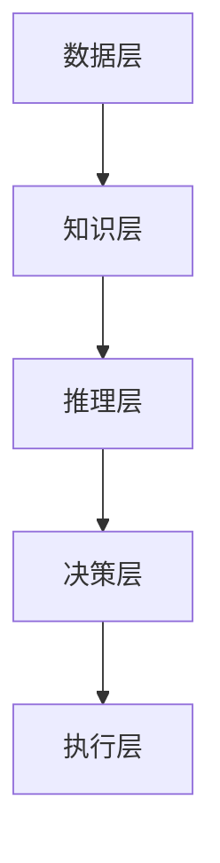
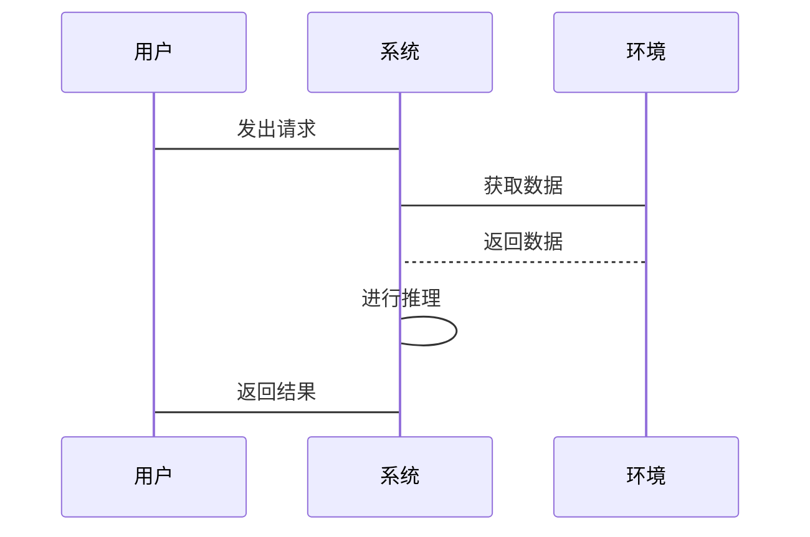

                 


# 从零开始：AI Agent的元认知能力实现

> 关键词：AI Agent, 元认知能力, 知识表示, 推理算法, 系统架构, 实战项目

> 摘要：本文从AI Agent的基本概念出发，详细探讨了元认知能力的实现过程，包括知识表示、推理算法、系统架构设计以及实战项目的实现。文章通过逐步分析和推理，结合实际案例，帮助读者深入理解AI Agent的元认知能力，并掌握其实现方法。

---

# 第一部分: AI Agent与元认知的背景

# 第1章: AI Agent的基本概念

## 1.1 AI Agent的定义与特点

### 1.1.1 什么是AI Agent

AI Agent（人工智能代理）是一种能够感知环境、自主决策并执行任务的智能体。它能够根据环境中的信息做出决策，并通过执行动作与环境进行交互。

### 1.1.2 AI Agent的核心特点

1. **自主性**：AI Agent能够在没有外部干预的情况下自主运行。
2. **反应性**：能够实时感知环境并做出反应。
3. **目标导向**：具备明确的目标，并根据目标做出决策。
4. **学习能力**：能够通过经验或数据进行学习和优化。

### 1.1.3 AI Agent与传统程序的区别

AI Agent与传统程序的主要区别在于其自主性和智能性。传统程序通常需要明确的输入和指令，而AI Agent能够自主感知环境、做出决策并执行任务。

---

## 1.2 元认知能力的定义与作用

### 1.2.1 元认知的定义

元认知是指“关于认知的认知”，即对自身认知过程的认知。在AI Agent中，元认知能力是指AI Agent能够理解、监控和管理自身的认知过程。

### 1.2.2 元认知能力在AI Agent中的作用

1. **自我监控**：AI Agent能够监控自身的认知过程，发现并纠正错误。
2. **自我调整**：能够根据环境的变化调整自身的认知策略。
3. **知识整合**：能够将不同来源的知识进行整合，形成更完整的认知。

### 1.2.3 元认知与AI Agent的结合

元认知能力的引入使得AI Agent更加智能和灵活，能够更好地适应复杂多变的环境。

---

## 1.3 AI Agent的元认知能力实现的背景

### 1.3.1 当前AI Agent的发展现状

AI Agent已经在多个领域得到了广泛应用，如智能助手、自动驾驶、智能推荐等。然而，大多数AI Agent仍缺乏元认知能力，无法进行自我监控和调整。

### 1.3.2 元认知能力在AI Agent中的必要性

随着AI Agent的应用场景越来越复杂，仅仅依靠固定的规则和预设的知识难以满足需求。元认知能力的引入能够使AI Agent具备更强的适应性和灵活性。

### 1.3.3 元认知能力实现的挑战与机遇

实现元认知能力的挑战主要在于如何构建能够自我监控和调整的系统。而机遇则在于，元认知能力的实现将极大地提升AI Agent的智能水平，使其能够更好地服务于人类。

---

## 1.4 本章小结

本章介绍了AI Agent的基本概念及其特点，并详细探讨了元认知能力的定义和作用。通过分析当前AI Agent的发展现状，指出了元认知能力实现的必要性和面临的挑战与机遇。

---

# 第二部分: 元认知能力的核心概念与体系结构

# 第2章: 元认知模型的构建

## 2.1 元认知模型的构成

### 2.1.1 知识表征

知识表征是元认知模型的核心部分，它决定了AI Agent如何理解和表示知识。常见的知识表征方法包括符号表示、向量表示和图表示。

### 2.1.2 推理机制

推理机制是元认知模型中用于从已知知识中推导出新知识的部分。常用的推理方法包括逻辑推理、概率推理和基于规则的推理。

### 2.1.3 学习机制

学习机制是元认知模型中用于从经验中学习和优化的部分。常见的学习方法包括监督学习、无监督学习和强化学习。

---

## 2.2 元认知能力的核心要素

### 2.2.1 知识获取与处理

知识获取与处理是元认知能力的基础，包括从多种来源获取知识，并对其进行整理和加工。

### 2.2.2 知识推理与验证

知识推理与验证是元认知能力的关键部分，通过推理得出结论，并对结论进行验证。

### 2.2.3 知识应用与反馈

知识应用与反馈是元认知能力的最终目标，通过应用知识完成任务，并根据反馈进行调整。

---

## 2.3 元认知模型的体系结构

### 2.3.1 分层结构

元认知模型通常采用分层结构，包括感知层、知识层、推理层和决策层。

### 2.3.2 模块化设计

元认知模型的模块化设计使其能够更好地适应不同的应用场景。每个模块负责特定的功能，如知识获取、推理和决策。

### 2.3.3 组件之间的关系

组件之间的关系是元认知模型体系结构的重要部分。通过合理设计组件之间的关系，可以提高模型的整体效率和性能。

---

## 2.4 本章小结

本章详细探讨了元认知模型的构成及其核心要素，并提出了元认知模型的体系结构。通过分层和模块化设计，元认知模型能够更好地实现自我监控和调整。

---

# 第三部分: 元认知能力的算法原理

# 第3章: 知识表示与推理算法

## 3.1 知识表示的向量空间模型

### 3.1.1 向量空间模型的定义

向量空间模型是一种将知识表示为向量的方法。每个向量的维度对应一个特征，向量的值表示该特征的重要性。

### 3.1.2 向量空间模型的实现

向量空间模型的实现通常包括文本预处理、特征提取和向量表示三个步骤。

### 3.1.3 向量空间模型的优缺点

向量空间模型的优点是简单高效，缺点是难以处理语义信息。

---

## 3.2 基于逻辑的推理算法

### 3.2.1 逻辑推理的基本原理

逻辑推理是基于逻辑规则的推理方法，通常用于处理确定性问题。

### 3.2.2 逻辑推理的实现步骤

逻辑推理的实现步骤包括知识表示、规则匹配和结论推理。

### 3.2.3 逻辑推理的优缺点

逻辑推理的优点是精确性高，缺点是难以处理不确定性问题。

---

## 3.3 基于概率的推理算法

### 3.3.1 概率推理的基本原理

概率推理是基于概率论的推理方法，通常用于处理不确定性问题。

### 3.3.2 概率推理的实现步骤

概率推理的实现步骤包括知识表示、概率计算和结论推理。

### 3.3.3 概率推理的优缺点

概率推理的优点是能够处理不确定性问题，缺点是计算复杂度较高。

---

## 3.4 知识表示与推理算法的对比

### 3.4.1 向量空间模型与逻辑推理的对比

向量空间模型适用于文本处理，而逻辑推理适用于确定性问题。

### 3.4.2 逻辑推理与概率推理的对比

逻辑推理适用于确定性问题，而概率推理适用于不确定性问题。

### 3.4.3 知识表示与推理算法的综合应用

根据具体场景选择合适的知识表示和推理算法，可以提高系统的整体性能。

---

## 3.5 本章小结

本章详细探讨了知识表示与推理算法的原理和实现方法，并对不同算法的优缺点进行了对比分析。

---

# 第四部分: 系统设计与架构

# 第4章: 系统设计与架构

## 4.1 系统设计概述

### 4.1.1 问题场景介绍

本系统的目标是实现一个具备元认知能力的AI Agent，能够自主感知环境、推理知识并做出决策。

### 4.1.2 系统功能设计

系统功能设计包括知识获取、知识推理、决策执行和反馈优化四个部分。

### 4.1.3 系统架构设计

系统架构采用分层设计，包括数据层、知识层、推理层和决策层。

---

## 4.2 系统功能设计

### 4.2.1 知识获取模块

知识获取模块负责从多种来源获取知识，并进行预处理和存储。

### 4.2.2 知识推理模块

知识推理模块负责根据知识进行推理，得出结论。

### 4.2.3 决策执行模块

决策执行模块根据推理结果做出决策，并执行相应的动作。

### 4.2.4 反馈优化模块

反馈优化模块根据执行结果进行反馈，并优化系统参数。

---

## 4.3 系统架构设计

### 4.3.1 系统架构图



### 4.3.2 系统接口设计

系统接口设计包括知识获取接口、推理接口和决策接口。

### 4.3.3 系统交互流程图



---

## 4.4 本章小结

本章详细设计了具备元认知能力的AI Agent系统的功能模块和系统架构，并通过图示展示了系统的交互流程。

---

# 第五部分: 项目实战

# 第5章: 项目实战

## 5.1 环境安装与配置

### 5.1.1 安装Python

安装Python 3.8及以上版本。

### 5.1.2 安装依赖库

安装numpy、pandas、scikit-learn等依赖库。

## 5.2 知识表示与推理算法实现

### 5.2.1 向量空间模型实现

```python
from sklearn.feature_extraction.text import TfidfVectorizer

vectorizer = TfidfVectorizer()
X = vectorizer.fit_transform(["这是一个测试句子"])
print(vectorizer.get_feature_names_out())
```

### 5.2.2 逻辑推理实现

```python
def logical_inference(rules, facts):
    # rules: list of tuples (antecedent, consequent)
    # facts: list of facts
    for rule in rules:
        antecedent, consequent = rule
        if all(fact in facts for fact in antecedent):
            return consequent
    return None

rules = [("fact1", "conclusion")]
facts = ["fact1"]
result = logical_inference(rules, facts)
print(result)
```

### 5.2.3 概率推理实现

```python
from sklearn.naive_bayes import GaussianNB

model = GaussianNB()
X_train = [[1, 2], [3, 4]]
y_train = [0, 1]
model.fit(X_train, y_train)
X_test = [[2, 3]]
y_pred = model.predict(X_test)
print(y_pred)
```

## 5.3 系统功能实现

### 5.3.1 知识获取模块实现

```python
def get_knowledge():
    return "获取到的知识"
```

### 5.3.2 知识推理模块实现

```python
def infer_knowledge(knowledge):
    return "推理结果"
```

### 5.3.3 决策执行模块实现

```python
def execute_decision(decision):
    print(f"执行决策：{decision}")
```

### 5.3.4 反馈优化模块实现

```python
def optimize_feedback(feedback):
    print(f"优化反馈：{feedback}")
```

## 5.4 项目案例分析

### 5.4.1 案例背景

假设我们有一个智能助手AI Agent，需要能够理解用户的问题并给出合理的回答。

### 5.4.2 知识表示与推理

将用户的问题进行向量表示，并通过推理得出答案。

### 5.4.3 系统实现

```python
def main():
    knowledge = get_knowledge()
    decision = infer_knowledge(knowledge)
    execute_decision(decision)
    feedback = input("请输入反馈：")
    optimize_feedback(feedback)

if __name__ == "__main__":
    main()
```

## 5.5 项目小结

本章通过实际项目展示了AI Agent元认知能力的实现过程，包括环境安装、算法实现和系统功能实现。

---

# 第六部分: 总结与展望

## 6.1 本章总结

本文从AI Agent的基本概念出发，详细探讨了元认知能力的实现过程，包括知识表示、推理算法、系统架构设计以及实战项目的实现。

## 6.2 未来展望

未来的研究方向包括更加复杂的元认知模型、多模态知识表示以及更高效的推理算法。

---

作者：AI天才研究院 & 禅与计算机程序设计艺术

