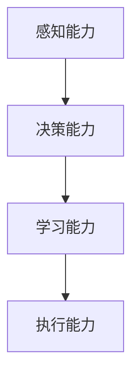
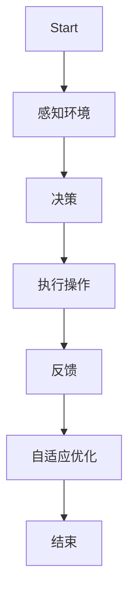
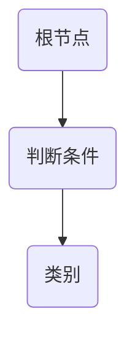
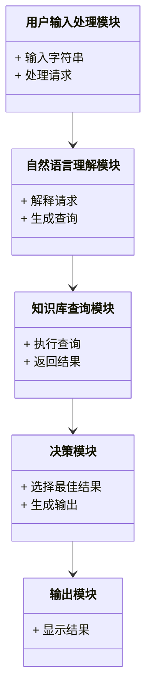

                 


# 从零开始：AI Agent的概念学习系统

---

## 关键词：AI Agent、人工智能、机器学习、强化学习、自然语言处理、系统设计

---

## 摘要：  
本文旨在为读者提供一个全面而系统的AI Agent学习框架，从基础概念到复杂算法，再到实际应用场景，逐步引导读者掌握AI Agent的核心原理与实现方法。通过理论与实践相结合的方式，本文深入分析了AI Agent的定义、分类、数学模型、系统架构、项目实现等多个方面，并通过丰富的案例和代码示例，帮助读者构建完整的AI Agent知识体系。

---

## 第1章: 引言

### 1.1 AI Agent的基本概念  
AI Agent（人工智能代理）是指能够感知环境、自主决策并执行任务的智能体。它能够通过与环境的交互，实现特定目标，如问题解决、信息检索、自动化操作等。  

### 1.2 AI Agent的发展背景  
AI技术的快速发展推动了AI Agent的应用，从简单的规则驱动代理到复杂的自主学习代理，AI Agent在各个领域展现出了巨大的潜力。  

### 1.3 本书的目的与范围  
本书旨在帮助读者从零开始，系统地学习AI Agent的核心概念、算法原理和实际应用。通过理论与实践相结合的方式，读者可以逐步掌握AI Agent的设计与实现方法。

---

## 第2章: AI Agent的核心概念与背景

### 2.1 AI Agent的定义与分类  
AI Agent的定义可以从感知、决策、执行三个维度进行描述。根据功能和智能水平，AI Agent可以分为简单反射式Agent、基于模型的反射式Agent、实用推理Agent和问题解决Agent。  

#### 表2-1: AI Agent的分类与对比  
| 类型              | 特点                           | 优缺点               |  
|-------------------|-------------------------------|----------------------|  
| 简单反射式Agent  | 基于规则，反应迅速               | 适用于简单场景，但缺乏灵活性 |  
| 基于模型的反射式Agent | 基于环境模型，具有更强的推理能力 | 适用于复杂场景，但实现复杂 |  
| 实用推理Agent     | 基于效用函数，优化决策           | 适用于多目标优化场景，但计算成本高 |  
| 问题解决Agent     | 基于问题求解，具有更强的目标导向性 | 适用于复杂任务，但需要大量训练数据 |  

### 2.2 AI Agent的核心能力  
AI Agent的核心能力包括感知能力、决策能力、学习能力和执行能力。  

#### 图2-1: AI Agent的核心能力关系图  


### 2.3 AI Agent的工作原理  
AI Agent的工作原理包括感知与理解、决策与规划、执行与反馈、自适应与优化四个阶段。  

#### 图2-2: AI Agent的工作流程图  


---

## 第3章: AI Agent的数学模型与算法原理

### 3.1 决策树算法  
决策树是一种用于分类和回归的树状结构，通过构建树状决策图来实现问题求解。  

#### 图3-1: 决策树的结构图  


#### 代码示例：  
```python
from sklearn.tree import DecisionTreeClassifier
import numpy as np

# 示例数据
X = np.array([[2, 3], [5, 6], [7, 8], [1, 2]])
y = np.array([0, 1, 1, 0])

# 创建决策树模型
model = DecisionTreeClassifier()
model.fit(X, y)

# 预测新数据
new_data = np.array([[6, 7]])
print(model.predict(new_data))
```

---

## 第4章: AI Agent的系统设计与实现

### 4.1 问题场景介绍  
以一个简单的智能助手为例，设计一个能够回答用户问题的AI Agent系统。  

### 4.2 系统功能设计  
系统功能模块包括：用户输入处理模块、自然语言理解模块、知识库查询模块、决策模块和输出模块。  

#### 图4-1: 系统功能模块图  


### 4.3 系统架构设计  
系统架构采用分层架构，包括前端界面、后端逻辑和知识库服务。  

#### 图4-2: 系统架构图  
```mermaid
archi
    1. 前端界面 --> 2. 后端逻辑
    2. 后端逻辑 --> 3. 知识库服务
```

---

## 第5章: 项目实战

### 5.1 环境安装  
需要安装Python、scikit-learn、numpy等库。  

### 5.2 系统核心实现  
实现一个简单的基于决策树的智能问答系统。  

#### 代码示例：  
```python
from sklearn.tree import DecisionTreeClassifier
import numpy as np

# 训练数据
X = np.array([
    [0, 0],
    [0, 1],
    [1, 0],
    [1, 1]
])
y = np.array([0, 1, 1, 0])

# 创建模型
model = DecisionTreeClassifier()
model.fit(X, y)

# 测试数据
test_data = np.array([[1, 0]])
print("预测结果:", model.predict(test_data))
```

---

## 第6章: 总结与展望

### 6.1 小结  
通过本篇文章，读者可以系统地了解AI Agent的核心概念、算法原理和系统设计方法。  

### 6.2 最佳实践  
在实际应用中，建议结合具体场景选择合适的算法，并注重系统的可扩展性和可维护性。  

### 6.3 展望  
随着AI技术的不断发展，AI Agent将在更多领域展现出其强大的应用潜力。

---

## 作者：AI天才研究院 & 禅与计算机程序设计艺术

