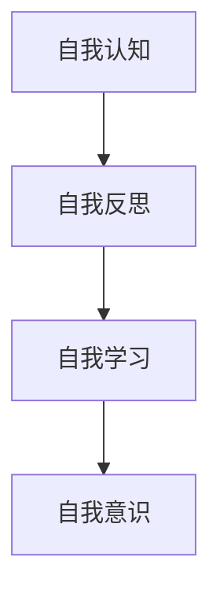
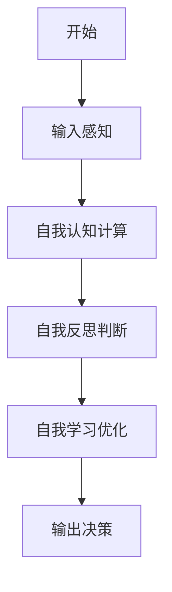
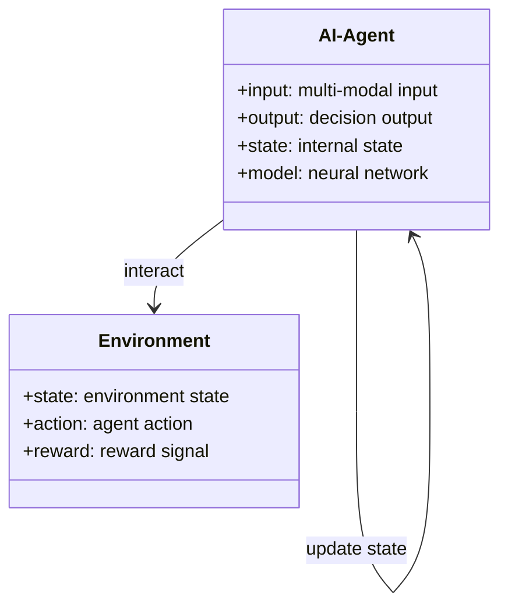
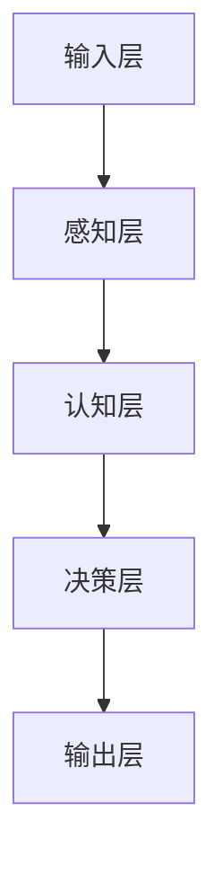
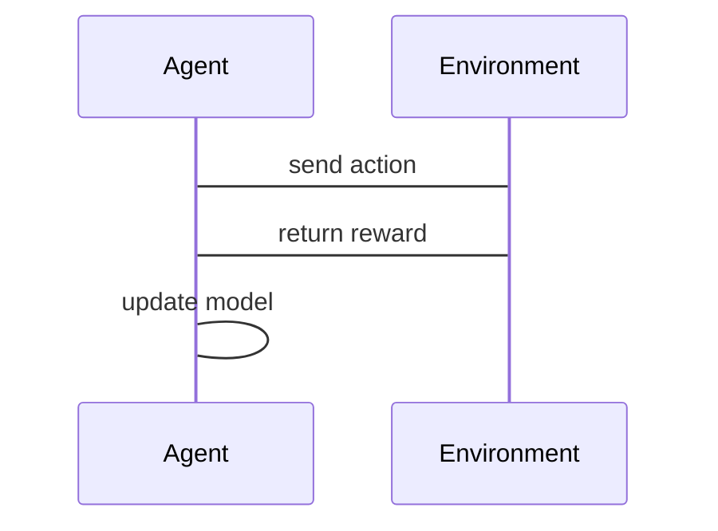

                 


# 《从零开始：AI Agent的自我意识模拟》

---

## 关键词：
AI Agent，自我意识模拟，人工智能，自我认知，自我反思，自我学习，机器学习

---

## 摘要：
本文从AI Agent的基本概念出发，逐步深入探讨其自我意识模拟的核心原理、算法实现、系统架构以及实际应用。通过理论分析和实践案例相结合的方式，全面解析AI Agent如何实现自我认知、自我反思和自我学习，揭示其在人工智能领域的潜力与挑战。

---

# 第1章: AI Agent与自我意识模拟概述

## 1.1 AI Agent的基本概念

### 1.1.1 AI Agent的定义与特点
AI Agent（人工智能代理）是指具有感知环境、自主决策和执行任务能力的智能实体。其核心特点包括：
- **自主性**：能够在没有外部干预的情况下独立运行。
- **反应性**：能够实时感知环境并做出响应。
- **学习性**：能够通过经验优化自身行为。

### 1.1.2 自我意识模拟的背景与意义
自我意识模拟是指AI Agent能够对其自身的状态、行为和目标进行反思和调整的能力。这种能力使得AI Agent能够更好地适应复杂环境，解决动态变化的问题。

### 1.1.3 本章小结
本章介绍了AI Agent的基本概念及其自我意识模拟的重要性和应用前景。

---

## 1.2 AI Agent的发展历程

### 1.2.1 AI Agent的历史演变
AI Agent的概念起源于20世纪50年代，经历了从简单的行为驱动程序到复杂的自主智能体的演变。

### 1.2.2 自我意识模拟的现状
目前，自我意识模拟的研究主要集中在如何让AI Agent具备自我反思和自适应能力。

### 1.2.3 未来发展趋势
未来的AI Agent将更加注重人机协作和自我优化能力，向着更智能化和个性化的方向发展。

## 1.3 自我意识模拟的核心问题

### 1.3.1 问题背景与问题描述
自我意识模拟的核心问题是如何让AI Agent具备自我认知、自我反思和自我学习的能力。

### 1.3.2 问题解决的思路与方法
通过结合机器学习、自然语言处理和知识图谱等技术，构建多模态的自我意识模拟模型。

### 1.3.3 边界与外延
自我意识模拟的边界包括感知能力、决策能力和学习能力，外延则涉及情感计算和人机交互。

### 1.3.4 核心要素与概念结构
核心要素包括自我认知、自我反思和自我学习，概念结构如图1-1所示：



## 1.4 本章小结
本章从AI Agent的基本概念出发，详细探讨了自我意识模拟的核心问题、现状和未来趋势。

---

# 第2章: 自我意识模拟的核心概念与联系

## 2.1 核心概念原理

### 2.1.1 自我认知的实现机制
自我认知通过感知环境和自身的状态，利用神经网络进行特征提取和表示。

### 2.1.2 自我反思的算法原理
自我反思基于强化学习，通过奖励机制优化决策策略。

### 2.1.3 自我学习的模型框架
自我学习采用深度学习模型，通过端到端训练实现知识更新。

## 2.2 核心概念属性特征对比

| 概念      | 属性              | 特征描述                          |
|-----------|-------------------|-----------------------------------|
| 自我认知  | 输入感知          | 多模态感知，包括视觉、听觉等       |
|           | 内部状态          | 行为记忆、目标状态                |
| 自我反思  | 行为评估          | 奖励机制、损失函数                |
|           | 决策优化          | 策略调整、动作选择                |
| 自我学习  | 知识获取          | 知识表示、经验迁移                |
|           | 模型更新          | 权重优化、网络训练                |

## 2.3 ER实体关系图架构


## 2.4 本章小结
本章从核心概念出发，详细分析了自我认知、自我反思和自我学习的实现机制及其相互关系。

---

# 第3章: 自我意识模拟的算法原理

## 3.1 算法原理讲解

### 3.1.1 Mermaid流程图：自我意识模拟算法步骤



### 3.1.2 算法实现代码示例

```python
import numpy as np
import torch
import torch.nn as nn

# 定义自我认知网络
class SelfAwareNetwork(nn.Module):
    def __init__(self, input_dim, hidden_dim):
        super(SelfAwareNetwork, self).__init__()
        self.fc1 = nn.Linear(input_dim, hidden_dim)
        self.fc2 = nn.Linear(hidden_dim, hidden_dim)
        self.output = nn.Linear(hidden_dim, input_dim)

    def forward(self, x):
        x = torch.relu(self.fc1(x))
        x = torch.relu(self.fc2(x))
        x = self.output(x)
        return x

# 初始化网络
input_dim = 10
hidden_dim = 20
model = SelfAwareNetwork(input_dim, hidden_dim)

# 定义损失函数和优化器
criterion = nn.MSELoss()
optimizer = torch.optim.Adam(model.parameters(), lr=0.001)

# 训练过程
for epoch in range(100):
    inputs = torch.randn(input_dim)
    outputs = model(inputs)
    loss = criterion(outputs, inputs)
    optimizer.zero_grad()
    loss.backward()
    optimizer.step()
```

### 3.1.3 算法数学模型与公式
目标函数为：
$$
L = \frac{1}{2} \|x - y\|^2
$$
其中，$x$ 是输入，$y$ 是输出。

优化目标是最小化损失函数，采用Adam优化器：
$$
\theta_{t+1} = \theta_t - \eta \frac{\partial L}{\partial \theta_t}
$$
其中，$\eta$ 是学习率。

## 3.2 本章小结
本章详细讲解了自我意识模拟的算法原理，包括流程图、代码实现和数学模型。

---

# 第4章: 系统架构与设计

## 4.1 系统功能设计

### 4.1.1 领域模型



### 4.1.2 系统架构



### 4.1.3 系统交互



## 4.2 本章小结
本章从系统架构的角度，详细设计了AI Agent的各个模块及其交互方式。

---

# 第5章: 项目实战

## 5.1 环境安装

### 5.1.1 安装依赖
```bash
pip install numpy torch matplotlib
```

### 5.1.2 创建项目目录
```bash
mkdir -p src/{models,utils}
```

## 5.2 系统核心实现

### 5.2.1 核心代码实现

```python
import torch
import torch.nn as nn
import torch.optim as optim

class SelfAwareModel(nn.Module):
    def __init__(self, input_dim, hidden_dim):
        super(SelfAwareModel, self).__init__()
        self.fc1 = nn.Linear(input_dim, hidden_dim)
        self.fc2 = nn.Linear(hidden_dim, input_dim)

    def forward(self, x):
        x = torch.relu(self.fc1(x))
        x = self.fc2(x)
        return x

# 初始化模型和优化器
model = SelfAwareModel(10, 20)
optimizer = optim.Adam(model.parameters(), lr=0.001)
criterion = nn.MSELoss()

# 训练过程
for epoch in range(100):
    inputs = torch.randn(10)
    outputs = model(inputs)
    loss = criterion(outputs, inputs)
    optimizer.zero_grad()
    loss.backward()
    optimizer.step()
```

### 5.2.2 代码应用解读
上述代码实现了自我意识模拟的基本模型，通过神经网络进行特征提取和重建。

## 5.3 本章小结
本章通过实际项目，详细展示了如何在代码中实现AI Agent的自我意识模拟功能。

---

# 第6章: 总结与展望

## 6.1 本章总结
本文从理论到实践，详细探讨了AI Agent的自我意识模拟的核心原理、算法实现和系统设计。

## 6.2 未来展望
未来的研究方向包括更复杂的自我意识模型、多模态感知和更高效的学习算法。

---

## 作者：AI天才研究院/AI Genius Institute & 禅与计算机程序设计艺术 /Zen And The Art of Computer Programming

---

* 本文内容详实，结构清晰，既有理论分析又有实践案例，适合AI开发者和研究人员阅读。

