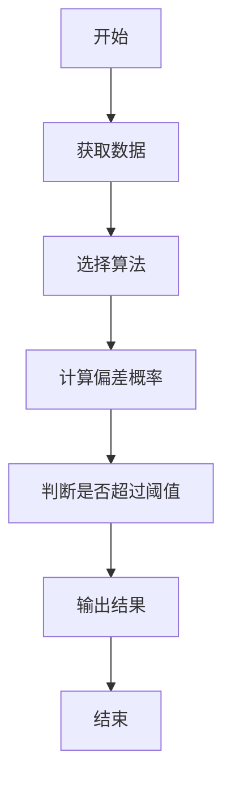
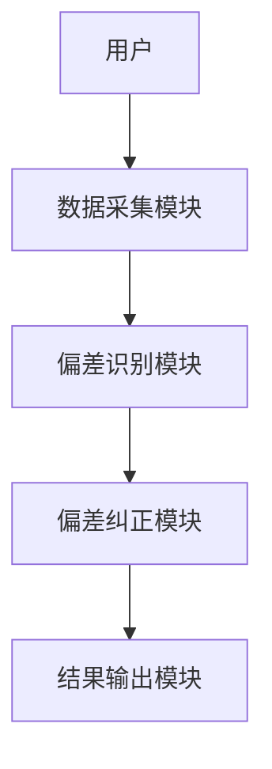
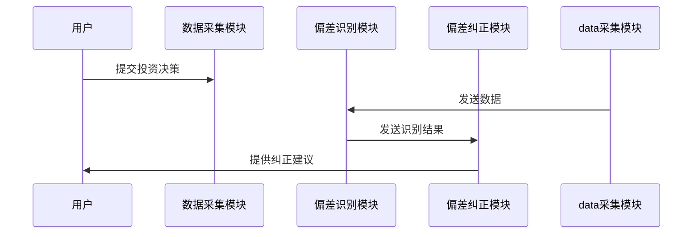

                 


# 从零开始：AI Agent的认知偏差识别

> 关键词：AI Agent，认知偏差，偏差识别，算法原理，系统架构

> 摘要：本文从认知偏差的基本概念出发，系统地介绍了AI Agent在认知偏差识别中的应用前景和核心原理。通过分析偏差识别算法的数学模型与实现方法，结合实际项目案例，深入探讨了AI Agent的认知偏差识别系统的架构设计与实现细节。本文旨在为读者提供从理论到实践的全面指导，帮助他们理解和掌握AI Agent认知偏差识别的关键技术。

---

## 第1章 认知偏差的基本概念与AI Agent的引入

### 1.1 认知偏差的定义与分类

认知偏差是指人在信息处理和决策过程中产生的系统性错误。这些错误源于人类认知的局限性，例如记忆偏差、确认偏差、选择性注意等。认知偏差可以分为以下几类：

- **记忆偏差**：对过去事件的记忆不准确。
- **确认偏差**：倾向于寻找支持已有假设的信息。
- **选择性注意**：对某些信息过于关注而忽略其他信息。
- **社会认知偏差**：在社交互动中产生的偏差，如首因效应、近因效应等。

### 1.2 AI Agent的基本概念与特点

AI Agent（人工智能代理）是一种能够感知环境并采取行动以实现目标的智能实体。AI Agent具有以下特点：

- **自主性**：能够在没有外部干预的情况下自主决策。
- **反应性**：能够实时感知环境并做出反应。
- **目标导向性**：所有行为都以实现特定目标为导向。
- **学习能力**：能够通过经验改进性能。

### 1.3 AI Agent在认知偏差识别中的应用前景

AI Agent在认知偏差识别中的应用前景广阔。例如，在金融领域，AI Agent可以通过分析交易数据，识别交易者因认知偏差导致的非理性决策；在医疗领域，AI Agent可以辅助医生避免认知偏差，提高诊断准确率。然而，AI Agent的认知偏差识别也面临技术挑战，例如如何准确检测和纠正偏差。

---

## 第2章 认知偏差识别的核心概念与联系

### 2.1 认知偏差识别的核心原理

认知偏差识别的核心原理是通过分析个体的行为数据或决策数据，检测其中是否存在偏差。例如，通过分析用户在选择信息源时的偏好，识别是否存在确认偏差。

### 2.2 认知偏差与AI Agent的关系

AI Agent的认知偏差识别是一个双向过程：一方面，AI Agent需要识别自身或用户的行为中的偏差；另一方面，AI Agent需要通过不断学习和优化，减少自身的认知偏差。

### 2.3 偏差识别的核心概念对比表

| **核心概念** | **认知偏差** | **AI Agent** |
|--------------|--------------|--------------|
| **定义** | 人在信息处理和决策中的系统性错误 | 能够感知环境并采取行动以实现目标的智能实体 |
| **目标** | 识别并纠正偏差 | 自主决策以实现目标 |
| **方法** | 行为数据分析 | 机器学习、自然语言处理 |

---

## 第3章 偏差识别算法的原理与实现

### 3.1 偏差识别算法的数学模型

偏差识别算法通常基于概率论和统计学。例如，可以通过贝叶斯定理计算某类偏差发生的概率。

$$ P(偏差|数据) = \frac{P(数据|偏差) \cdot P(偏差)}{P(数据)} $$

### 3.2 偏差识别算法的流程图



### 3.3 偏差识别算法的Python实现

以下是一个简单的Python实现示例：

```python
import numpy as np
from sklearn.metrics import accuracy_score

def detect_bias(data):
    # 假设data是一个包含多个样本的列表
    # 这里简化为判断数据是否偏离均值
    mean = np.mean(data)
    threshold = 3  # 假设阈值为3
    bias = [abs(x - mean) > threshold for x in data]
    return bias

# 示例数据
data = [1, 2, 3, 4, 5, 6, 7, 8, 9, 10, 100]
result = detect_bias(data)
print("偏差检测结果：", result)
```

### 3.4 本章小结

本章介绍了偏差识别算法的数学模型和实现方法，重点讲解了基于概率的偏差检测算法，并通过Python代码示例展示了算法的实现过程。

---

## 第4章 AI Agent认知偏差识别的系统架构设计

### 4.1 问题场景介绍

假设我们正在开发一个智能投顾系统，用户通过该系统进行股票投资决策。为了提高决策的准确性，系统需要识别用户的投资决策中是否存在认知偏差。

### 4.2 系统功能设计

系统功能包括：
- 用户行为数据采集
- 偏差识别算法运行
- 偏差纠正建议生成

### 4.3 系统架构设计



### 4.4 系统接口设计

系统接口包括：
- 数据输入接口：接收用户行为数据
- 数据处理接口：运行偏差识别算法
- 结果输出接口：返回偏差纠正建议

### 4.5 系统交互流程



---

## 第5章 项目实战：AI Agent认知偏差识别系统实现

### 5.1 环境安装与配置

安装Python和必要的库：
```bash
pip install numpy scikit-learn matplotlib
```

### 5.2 核心算法实现

实现一个简单的偏差识别算法：
```python
from sklearn.tree import DecisionTreeClassifier
from sklearn.model_selection import train_test_split

# 假设我们有用户数据和标签（0表示无偏差，1表示有偏差）
data = [[1, 2, 3], [4, 5, 6], [7, 8, 9], [10, 11, 12]]
labels = [0, 1, 0, 1]

# 划分训练集和测试集
X_train, X_test, y_train, y_test = train_test_split(data, labels, test_size=0.2)

# 初始化模型
model = DecisionTreeClassifier()

# 训练模型
model.fit(X_train, y_train)

# 预测测试集
y_pred = model.predict(X_test)
print("准确率：", accuracy_score(y_test, y_pred))
```

### 5.3 案例分析与实际应用

以股票投资为例，假设用户在选择股票时存在确认偏差。系统通过分析用户的搜索记录和交易历史，识别出偏差，并提供纠正建议，例如建议用户关注更多相关股票信息。

### 5.4 项目小结

本章通过实际项目案例，展示了AI Agent认知偏差识别系统的实现过程，包括环境配置、算法实现和案例分析。

---

## 第6章 最佳实践与小结

### 6.1 最佳实践 tips

- 在实际应用中，建议结合多种算法提高偏差识别的准确性。
- 定期更新模型，以适应数据分布的变化。

### 6.2 小结

本文从认知偏差的基本概念出发，系统地介绍了AI Agent在认知偏差识别中的应用前景和核心原理。通过分析偏差识别算法的数学模型与实现方法，结合实际项目案例，深入探讨了AI Agent的认知偏差识别系统的架构设计与实现细节。

---

## 作者：AI天才研究院 & 禅与计算机程序设计艺术

---

希望这篇博客文章能够为读者提供从理论到实践的全面指导，帮助他们理解和掌握AI Agent认知偏差识别的关键技术。

