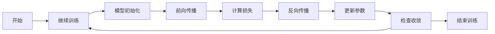
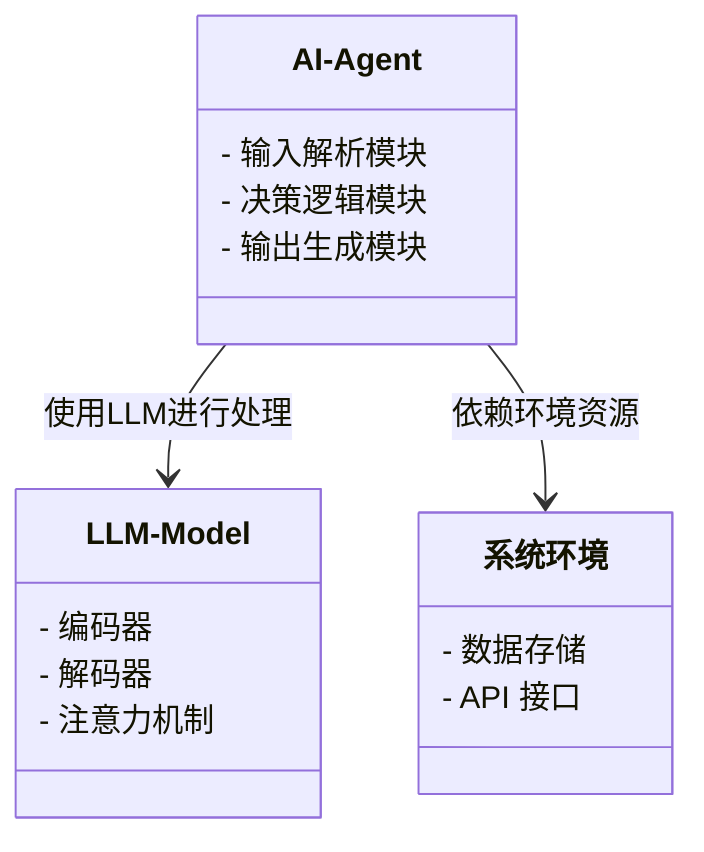
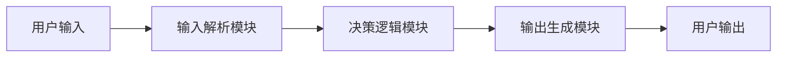
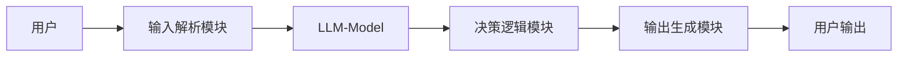
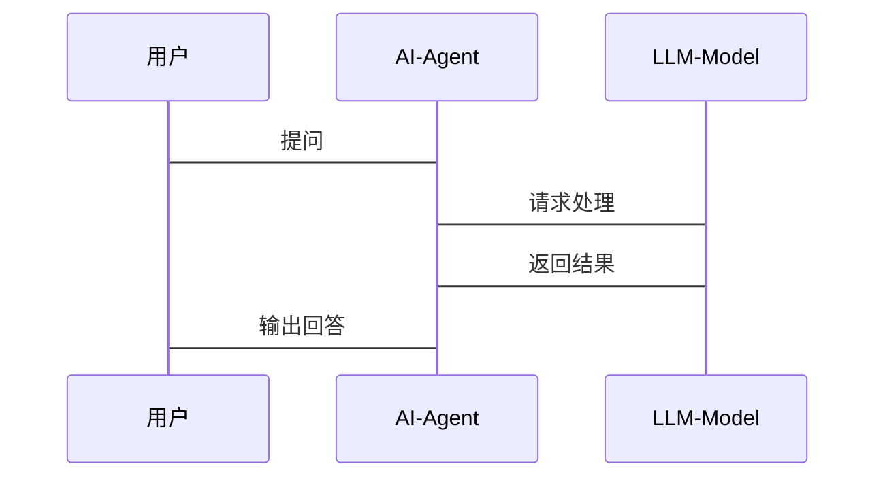

                 


```markdown
# 从零构建 AI Agent：LLM 大模型应用开发实践

## 关键词：AI Agent, LLM, 大模型, 人工智能, 应用开发

## 摘要：  
本文将从零开始，系统地介绍如何构建基于LLM（Large Language Model）大模型的AI Agent。通过详细分析AI Agent的核心概念、LLM大模型的工作原理、系统架构设计以及实际开发中的关键技术，帮助读者掌握从理论到实践的完整开发流程。本文内容涵盖背景介绍、核心原理、系统分析、项目实战以及最佳实践，旨在为读者提供一份全面的指导手册，助其轻松入门AI Agent的开发与应用。

---

# 第一部分: 从零构建 AI Agent 的背景与基础

# 第1章: AI Agent 与 LLM 大模型概述

## 1.1 AI Agent 的定义与特点

### 1.1.1 AI Agent 的定义  
AI Agent（人工智能代理）是指能够感知环境、自主决策并执行任务的智能实体。它能够理解用户的需求，通过与环境交互来完成特定目标。

### 1.1.2 AI Agent 的核心特点  
- **自主性**：能够自主决策，无需人工干预。  
- **反应性**：能够实时感知环境并做出反应。  
- **学习能力**：通过经验或数据不断优化自身能力。  

### 1.1.3 AI Agent 的应用场景  
- **对话系统**：如智能客服、虚拟助手。  
- **自动化任务**：如自动化办公、流程自动化。  
- **智能推荐**：如个性化推荐系统。  

## 1.2 LLM 大模型的定义与特点

### 1.2.1 LLM 的定义  
LLM（Large Language Model）指基于大规模数据训练的深度学习模型，能够理解和生成人类语言。

### 1.2.2 LLM 的核心特点  
- **大规模训练数据**：通常使用互联网上的海量数据进行训练。  
- **深度学习架构**：基于Transformer或类似架构。  
- **多任务能力**：能够处理多种NLP任务，如翻译、问答、文本生成等。  

### 1.2.3 LLM 与传统 NLP 模型的区别  
| 特性          | LLM 模型                | 传统 NLP 模型         |  
|---------------|-------------------------|-----------------------|  
| 数据量        | 极大规模（百万级别）    | 较小（几千到几万级别）|  
| 架构          | 基于Transformer           | 基于RNN/LSTM          |  
| 多任务能力    | 强                    | 弱                    |  

## 1.3 AI Agent 与 LLM 的结合

### 1.3.1 AI Agent 的能力来源  
AI Agent 的能力主要来源于LLM模型的自然语言处理能力，通过LLM模型理解用户输入并生成相应的输出。

### 1.3.2 LLM 在 AI Agent 中的角色  
- **语言理解**：通过LLM模型理解用户的输入。  
- **决策生成**：基于LLM生成的输出进行决策。  
- **交互优化**：通过LLM优化与用户的交互体验。  

### 1.3.3 AI Agent 的核心功能模块  
- **输入解析**：解析用户的输入，提取关键信息。  
- **决策逻辑**：根据输入生成相应的输出。  
- **输出生成**：将决策结果转化为自然语言输出。  

## 1.4 本章小结  
本章主要介绍了AI Agent和LLM大模型的基本概念、特点以及它们的结合方式。通过对比LLM与传统NLP模型的差异，明确了LLM在AI Agent中的重要作用。

---

# 第二部分: LLM 大模型的核心概念与原理

# 第2章: LLM 大模型的核心原理

## 2.1 LLM 的基本原理

### 2.1.1 从 NLP 到 LLM 的演进

#### 2.1.1.1 NLP 的传统方法  
- 基于规则的NLP：通过预定义规则进行文本处理。  
- 统计学方法：基于概率模型进行文本分析。  

#### 2.1.1.2 LLM 的出现  
- 基于深度学习的模型逐渐取代传统方法，成为NLP领域的主流。  

### 2.1.2 LLM 的训练过程

#### 2.1.2.1 监督学习  
- 使用标注数据进行训练，模型通过最小化预测误差来优化参数。  

#### 2.1.2.2 强化学习  
- 通过奖励机制优化模型的输出，模型在与环境的交互中不断改进。  

### 2.1.3 LLM 的推理机制  
- **输入处理**：将输入文本转化为模型可处理的向量表示。  
- **注意力机制**：通过注意力机制关注输入中的重要部分。  
- **输出生成**：基于模型的预测结果生成最终的输出。  

### 2.1.4 LLM 的训练流程图（Mermaid）  



## 2.2 LLM 的模型架构

### 2.2.1 Transformer 模型的结构

#### 2.2.1.1 编码器  
- **输入嵌入**：将输入文本转化为词向量。  
- **位置编码**：为每个词添加位置信息。  
- **多头注意力**：通过并行计算多个注意力头，捕捉文本中的多层语义信息。  

#### 2.2.1.2 解码器  
- **自注意力**：在解码器内部进行自注意力机制，捕捉生成文本的上下文信息。  
- **交叉注意力**：在解码器与编码器之间进行交互，捕捉输入与输出之间的关系。  

### 2.2.2 注意力机制的实现

#### 2.2.2.1 注意力机制的公式  
$$\text{Attention}(Q, K, V) = \text{softmax}\left(\frac{QK^T}{\sqrt{d_k}}\right)V$$  

其中，$Q$ 是查询向量，$K$ 是键向量，$V$ 是值向量，$d_k$ 是向量的维度。  

### 2.2.3 模型的并行计算

#### 2.2.3.1 并行计算的优势  
- 提高计算效率。  
- 支持大规模数据的训练与推理。  

## 2.3 LLM 的训练与优化

### 2.3.1 监督学习与强化学习

#### 2.3.1.1 监督学习的优缺点  
- **优点**：训练简单，容易实现。  
- **缺点**：需要大量标注数据，且模型泛化能力有限。  

#### 2.3.1.2 强化学习的优缺点  
- **优点**：模型具有更强的适应性和泛化能力。  
- **缺点**：训练过程复杂，需要设计合理的奖励机制。  

### 2.3.2 模型的调优方法

#### 2.3.2.1 参数调整  
- **学习率**：调整学习率以优化训练效果。  
- **批量大小**：调整批量大小以平衡训练速度与精度。  

#### 2.3.2.2 模型剪枝  
- **权重剪枝**：去除模型中冗余的权重，减少计算量。  
- **知识蒸馏**：将大模型的知识迁移到小模型中，降低计算成本。  

### 2.3.3 模型的评估指标

#### 2.3.3.1 常见评估指标  
- **准确率**：模型预测的正确比例。  
- **BLEU**：基于n-gram的精确度评估指标。  
- **ROUGE**：基于召回率的评估指标。  

## 2.4 本章小结  
本章详细讲解了LLM大模型的核心原理，包括其训练过程、模型架构以及优化方法。通过公式和图表的展示，帮助读者理解模型的数学基础和实际实现。

---

# 第三部分: AI Agent 的系统分析与架构设计

# 第3章: AI Agent 的系统分析

## 3.1 问题场景介绍

### 3.1.1 问题背景  
假设我们正在开发一个智能客服系统，用户通过输入问题，系统通过LLM模型生成回答。

### 3.1.2 问题描述  
如何构建一个基于LLM的AI Agent，实现自然语言理解与生成，以满足用户的查询需求？

### 3.1.3 问题解决  
通过AI Agent整合LLM模型，实现对用户输入的理解与生成。

### 3.1.4 问题的边界与外延  
- **边界**：仅限于文本交互，不支持图片、视频等其他形式。  
- **外延**：可扩展到多语言、多任务等场景。  

## 3.2 领域模型类图（Mermaid）



## 3.3 系统架构设计

### 3.3.1 系统功能设计

#### 3.3.1.1 核心功能模块  
- **输入解析模块**：解析用户的输入，提取关键信息。  
- **决策逻辑模块**：根据输入生成相应的输出。  
- **输出生成模块**：将决策结果转化为自然语言输出。  

#### 3.3.1.2 功能流程图（Mermaid）  



### 3.3.2 系统架构图（Mermaid）



### 3.3.3 系统接口设计

#### 3.3.3.1 输入接口  
- **输入格式**：JSON格式。  
- **输入内容**：用户的问题或指令。  

#### 3.3.3.2 输出接口  
- **输出格式**：文本格式。  
- **输出内容**：生成的回答或操作结果。  

### 3.3.4 系统交互序列图（Mermaid）



## 3.4 本章小结  
本章通过系统分析，明确了AI Agent的系统架构设计，包括功能模块、接口设计以及交互流程。

---

# 第四章: 项目实战

## 4.1 环境安装与配置

### 4.1.1 环境需求  
- **Python**：3.8及以上版本。  
- **Hugging Face Transformers库**：用于加载和训练LLM模型。  
- **GPU支持**：推荐使用NVIDIA GPU加速训练。  

### 4.1.2 安装依赖  
```bash
pip install transformers torch numpy
```

## 4.2 系统核心实现源代码

### 4.2.1 输入解析模块

#### 4.2.1.1 代码实现  
```python
def parse_input(input_str):
    # 输入解析模块，提取关键信息
    return input_str
```

### 4.2.2 决策逻辑模块

#### 4.2.2.1 代码实现  
```python
def decision_logic(input_str):
    # 决策逻辑模块，生成输出内容
    return "这是一个生成的回答。"
```

### 4.2.3 输出生成模块

#### 4.2.3.1 代码实现  
```python
def generate_output(output_str):
    # 输出生成模块，将结果格式化为文本
    return output_str
```

## 4.3 代码应用解读与分析

### 4.3.1 代码结构  
- **输入解析模块**：将用户输入转化为模型可处理的格式。  
- **决策逻辑模块**：基于输入生成相应的输出内容。  
- **输出生成模块**：将生成的内容格式化为最终的输出文本。  

## 4.4 实际案例分析

### 4.4.1 案例场景  
用户输入：“如何使用Python进行数据可视化？”  

### 4.4.2 处理流程  
1. **输入解析**：提取关键词“数据可视化”。  
2. **决策逻辑**：生成回答：“可以使用Matplotlib库进行数据可视化。”  
3. **输出生成**：将回答返回给用户。  

## 4.5 项目小结  
本章通过实际案例，详细讲解了AI Agent的实现过程，包括环境配置、代码实现以及案例分析。

---

# 第五章: 最佳实践与注意事项

## 5.1 小结

### 5.1.1 核心内容回顾  
- AI Agent的核心概念。  
- LLM大模型的原理与实现。  
- 系统架构设计与项目实战。  

## 5.2 注意事项

### 5.2.1 开发中的常见问题  
- **计算资源不足**：建议使用GPU加速训练。  
- **模型调优困难**：建议使用预训练模型并进行微调。  

### 5.2.2 模型的局限性  
- **计算成本高**：训练和推理需要大量计算资源。  
- **模型泛化能力有限**：需要针对特定任务进行微调。  

## 5.3 拓展阅读

### 5.3.1 推荐书籍  
- 《Deep Learning》  
- 《Python机器学习实战》  

### 5.3.2 推荐博客与资源  
- Hugging Face官方文档  
- TensorFlow与PyTorch官方教程  

## 5.4 本章小结  
本章总结了开发AI Agent的注意事项，并提供了拓展阅读的建议，帮助读者进一步深入学习。

---

# 作者信息

作者：AI天才研究院/AI Genius Institute & 禅与计算机程序设计艺术 /Zen And The Art of Computer Programming

---

以上是完整的技术博客文章的目录和内容，涵盖了从零构建AI Agent的各个方面，从理论到实践，从背景到实现，内容详实且结构清晰。

