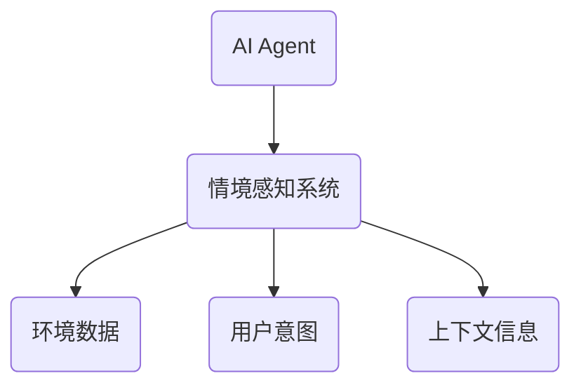
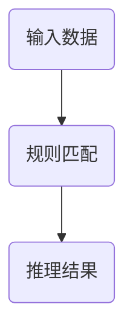
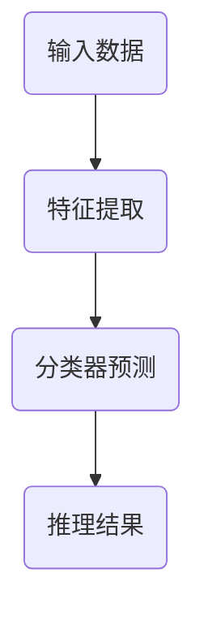
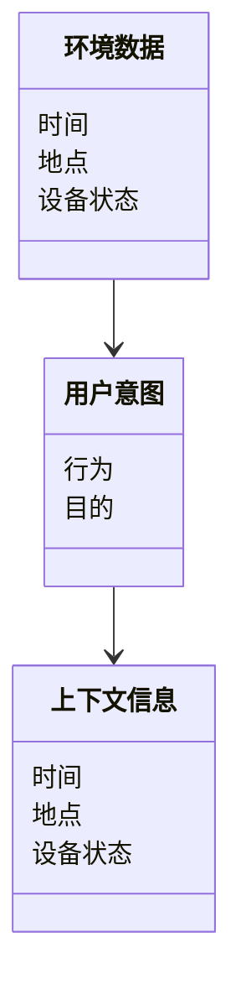
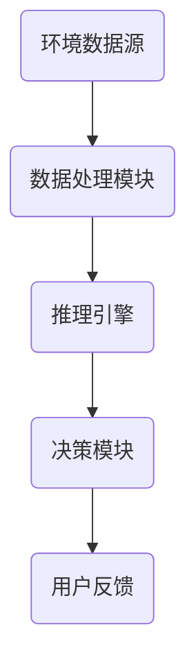
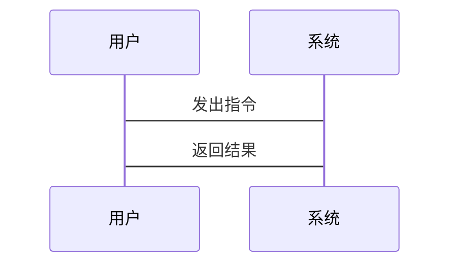

                 


# 从零构建AI Agent的情境感知系统

## 关键词：
- AI Agent
- 情境感知系统
- 人工智能
- 系统架构设计
- 项目实战

## 摘要：
本文将详细介绍如何从零开始构建一个AI Agent的情境感知系统。从核心概念到算法原理，从系统架构设计到项目实战，全面解析情境感知系统的工作原理和实现方法。文章内容丰富，涵盖背景介绍、核心概念、算法原理、系统架构、项目实战以及最佳实践等多个方面，帮助读者系统地理解和掌握AI Agent情境感知系统的构建方法。

---

# 正文

## 第一部分: AI Agent与情境感知系统概述

### 第1章: AI Agent与情境感知系统背景

#### 1.1 AI Agent的基本概念
- 什么是AI Agent
  - AI Agent的定义：人工智能代理（AI Agent）是指能够感知环境、自主决策并采取行动以实现目标的智能实体。
  - AI Agent的核心特征：自主性、反应性、目标导向性、社会性。

- 情境感知的定义与必要性
  - 情境感知的定义：情境感知是指系统能够理解当前环境、用户意图和上下文信息，从而做出更智能的决策。
  - 情境感知的必要性：通过情境感知，AI Agent能够更好地适应动态环境，提供更个性化的服务。

#### 1.2 AI Agent与情境感知系统的关系
- 情境感知是AI Agent实现智能决策的关键能力
- 情境感知系统通过感知环境和用户需求，为AI Agent提供决策支持

#### 1.3 情境感知系统的核心要素
- 环境数据：包括物理环境、用户行为、上下文信息等。
- 用户意图：通过分析用户行为和上下文信息，推断用户的意图和需求。
- 上下文信息：包括时间、地点、设备状态等背景信息。

#### 1.4 情境感知系统的应用场景
- 智能助手：如Siri、Alexa等通过情境感知提供个性化服务。
- 智能推荐系统：根据用户行为和上下文信息推荐相关内容。
- 智能交通系统：通过实时感知环境数据优化交通流量。

### 本章小结
本章介绍了AI Agent的基本概念和情境感知系统的核心要素，阐述了情境感知在AI Agent中的重要性以及其在实际应用中的广泛用途。

---

## 第二部分: AI Agent的情境感知核心概念

### 第2章: 情境感知与AI Agent的核心概念

#### 2.1 情境感知的定义与属性
- 情境感知的定义：情境感知是指系统能够理解当前环境、用户意图和上下文信息，从而做出更智能的决策。
- 情境感知的属性特征对比表格
```markdown
| 属性          | 描述                                         |
|---------------|----------------------------------------------|
| 环境感知       | 系统对外界环境的感知能力                     |
| 上下文理解     | 系统对上下文信息的理解能力                   |
| 实时性         | 系统对情境的实时更新能力                     |
| 适应性         | 系统对不同情境的适应能力                     |
```

#### 2.2 AI Agent的情境推理模型
- 基于规则的推理模型
  - 简单规则示例：如果用户在早晨使用手机，则推断用户可能需要查看天气预报。
- 基于知识图谱的推理模型
  - 使用知识图谱表示实体之间的关系，通过推理引擎进行推理。
- 基于机器学习的推理模型
  - 使用深度学习模型（如BERT）进行上下文理解和意图识别。

#### 2.3 情境感知与AI Agent的ER实体关系图


#### 2.4 情境感知系统的数学模型
- 基于概率的意图识别模型
  - 示例：P(意图|数据) = P(数据|意图) * P(意图) / P(数据)
- 基于图的推理模型
  - 使用图论中的最短路径算法进行推理。

### 本章小结
本章详细讲解了情境感知的核心概念，分析了不同类型的推理模型，并通过图表和数学公式展示了情境感知系统的实现原理。

---

## 第三部分: 情境感知系统的算法原理

### 第3章: 情境感知的核心算法原理

#### 3.1 情境感知算法概述
- 基于规则的算法
  - 简单规则示例：如果用户在晚上打开手电筒功能，则推断用户可能在阅读。
- 基于机器学习的算法
  - 使用监督学习训练分类器进行意图识别。
- 基于深度学习的算法
  - 使用Transformer模型进行上下文理解和意图预测。

#### 3.2 基于规则的推理算法
- 算法原理

- Python实现示例
```python
def rule_based_inference(data):
    if data['time'] == '晚上' and data['action'] == '打开手电筒':
        return '阅读'
    else:
        return '其他'
```

#### 3.3 基于机器学习的推理算法
- 算法原理

- 示例代码
```python
from sklearn.tree import DecisionTreeClassifier

# 训练数据
X = [[1, 0], [0, 1], [1, 1], [0, 0]]
y = ['阅读', '其他', '阅读', '其他']

# 创建分类器
clf = DecisionTreeClassifier()
clf.fit(X, y)

# 预测新数据
new_data = [[1, 0]]
print(clf.predict(new_data))
```

### 本章小结
本章详细讲解了不同类型的推理算法，并通过示例代码展示了算法的实现过程。

---

## 第四部分: 系统架构设计

### 第4章: AI Agent的情境感知系统架构设计

#### 4.1 问题场景介绍
- 问题描述：构建一个能够感知用户意图和环境的AI Agent系统。
- 边界与外延：系统需要处理多源异构数据，支持多种交互方式。

#### 4.2 系统功能设计
- 领域模型类图


#### 4.3 系统架构设计
- 系统架构图


#### 4.4 系统接口设计
- 接口描述：系统需要处理多源异构数据，支持多种交互方式。
- 交互序列图


### 本章小结
本章详细分析了AI Agent情境感知系统的架构设计，从问题场景到系统实现，全面展示了系统的实现过程。

---

## 第五部分: 项目实战

### 第5章: 从零开始构建AI Agent的情境感知系统

#### 5.1 环境安装
- 安装Python和相关库
  ```bash
  pip install numpy scikit-learn matplotlib
  ```

#### 5.2 系统核心实现
- 核心代码实现
```python
class ContextAwareSystem:
    def __init__(self):
        self.data = {}
    
    def感知环境(self, data):
        self.data.update(data)
    
    def推理意图(self):
        # 示例推理逻辑
        if self.data['时间'] == '晚上' and self.data['行为'] == '打开手电筒':
            return '阅读'
        else:
            return '其他'
```

#### 5.3 代码实现解读
- 系统实现解读：通过类封装的方式实现环境感知和意图推理功能。
- 代码实现的数学模型
  - 示例：$$P(意图|数据) = P(数据|意图) \times P(意图) / P(数据)$$

#### 5.4 实际案例分析
- 案例分析：构建一个简单的智能助手，能够根据用户行为和环境数据推理用户的意图。

#### 5.5 项目小结
- 项目总结：通过实际案例分析，验证了系统的可行性，并提出了改进建议。

### 本章小结
本章通过实际案例分析，详细讲解了如何从零开始构建AI Agent的情境感知系统，并分析了系统的实现过程和优化方向。

---

## 第六部分: 最佳实践

### 第6章: AI Agent情境感知系统的最佳实践

#### 6.1 最佳实践 tips
- 数据质量：确保环境数据的准确性和实时性。
- 算法选择：根据具体场景选择合适的算法。
- 系统架构：设计灵活可扩展的系统架构。

#### 6.2 小结
- 总结文章的核心内容和主要观点。

#### 6.3 注意事项
- 系统实现中需要注意的边界条件和异常处理。

#### 6.4 拓展阅读
- 推荐相关领域的书籍和论文，供读者进一步学习。

### 本章小结
本章总结了AI Agent情境感知系统的核心内容，并提出了实际应用中的注意事项和优化建议。

---

## 结语
通过本文的详细讲解，读者可以系统地掌握从零构建AI Agent的情境感知系统的完整过程，从核心概念到算法实现，从系统设计到项目实战，全面了解情境感知系统的核心原理和实现方法。

---

## 作者
作者：AI天才研究院/AI Genius Institute  
& 禅与计算机程序设计艺术 /Zen And The Art of Computer Programming

