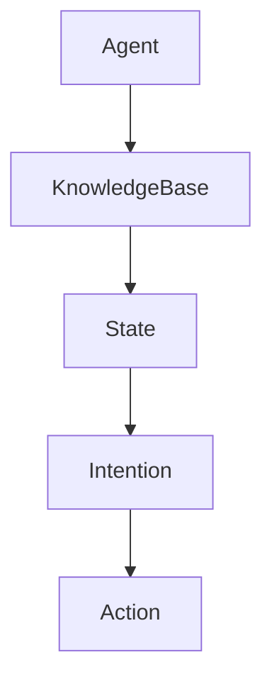
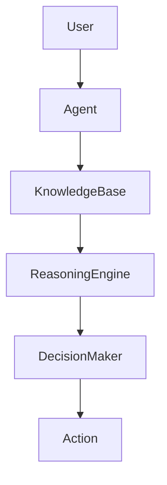

                 


# 从零构建AI Agent的情境推理能力

> 关键词：AI Agent, 情境推理, 知识表示, 状态推理, 意图推理, 图神经网络

> 摘要：本文将详细介绍如何从零开始构建具备情境推理能力的AI Agent。通过系统地分析情境推理的核心概念、算法原理、系统架构设计及项目实战，为读者提供从理论到实践的全面指导。文章内容涵盖知识表示、逻辑推理、机器学习算法、系统设计等多方面内容，并结合实际案例进行深入分析，帮助读者掌握构建AI Agent情境推理能力的关键技术。

---

## 第1章：AI Agent与情境推理概述

### 1.1 AI Agent的基本概念
- 1.1.1 什么是AI Agent
  - AI Agent的定义
  - AI Agent的类型与特点
  - AI Agent的核心功能：感知、推理、决策、行动

- 1.1.2 情境推理的定义与重要性
  - 情境推理的定义
  - 情境推理在AI Agent中的作用
  - 情境推理与任务规划、自然语言处理的关系

- 1.1.3 构建AI Agent的情境推理能力的意义
  - 提升AI Agent的智能水平
  - 满足复杂场景下的任务需求
  - 为实际应用提供理论与技术支撑

---

## 第2章：情境推理的核心概念与联系

### 2.1 情境推理的核心概念
- 2.1.1 知识表示
  - 知识表示的定义
  - 常见的知识表示方法：符号逻辑、语义网络、本体论
  - 知识表示的作用

- 2.1.2 状态推理
  - 状态推理的定义
  - 状态推理的关键步骤：观察、假设、验证
  - 状态推理的挑战

- 2.1.3 意图推理
  - 意图推理的定义
  - 意图推理的实现方法：基于规则、基于学习
  - 意图推理的应用场景

- 2.1.4 推理引擎
  - 推理引擎的定义
  - 常见的推理引擎类型：逻辑推理引擎、概率推理引擎
  - 推理引擎的选择与优化

### 2.2 情境推理的核心概念对比
| 概念       | 定义与特点                       | 示例场景                             |
|------------|--------------------------------|------------------------------------|
| 知识表示    | 表示AI Agent对世界的理解         | 使用符号逻辑表示“如果下雨，则带伞” |
| 状态推理    | 推断当前环境状态                 | 根据天气数据推断“今天会下雨”       |
| 意图推理    | 理解主体的意图                   | 通过对话历史推断用户的购买意图     |
| 推理引擎    | 执行推理操作的工具               | 基于规则的推理引擎、概率推理引擎   |

### 2.3 情境推理的ER实体关系图


---

## 第3章：情境推理的算法原理

### 3.1 基于符号逻辑的推理算法
- 3.1.1 知识表示与逻辑推理
  - 符号逻辑的基本概念
  - 合取范式与析取范式的定义
  - 逻辑推理的规则

- 3.1.2 基于符号逻辑的推理算法实现
  - 假设检验算法：假设-检验推理
  - 穷举搜索算法：全子句搜索

- 3.1.3 示例代码实现
  ```python
  def logical_research(knowledge_base, query):
      for clause in knowledge_base:
          if satisfies(clause, query):
              return True
      return False
  ```

### 3.2 基于机器学习的推理算法
- 3.2.1 概率推理与贝叶斯网络
  - 贝叶斯网络的定义
  - 贝叶斯推理的公式：$P(A|B) = \frac{P(B|A)P(A)}{P(B)}$
  - 贝叶斯网络的构建与推理

- 3.2.2 基于图神经网络的推理算法
  - 图神经网络的定义
  - 图神经网络的推理流程
  - 示例代码实现：使用GAT（Graph Attention Network）进行推理

- 3.2.3 算法对比与选择
  | 方法       | 优点                           | 缺点                             |
  |------------|--------------------------------|----------------------------------|
  | 符号逻辑    | 精确性高，可解释性强            | 难以处理复杂和模糊的问题         |
  | 机器学习    | 能够处理复杂和模糊的问题        | 可解释性较差，推理过程不透明     |

---

## 第4章：系统分析与架构设计方案

### 4.1 系统功能设计
- 4.1.1 领域模型设计
  - 领域模型的定义
  - 领域模型的构建步骤
  - 示例领域模型：智能客服场景的领域模型



- 4.1.2 功能模块划分
  - 知识库模块：存储和管理知识
  - 推理引擎模块：执行推理操作
  - 决策模块：基于推理结果做出决策
  - 行动模块：执行具体的行动

### 4.2 系统架构设计
- 4.2.1 系统架构图
  ```mermaid
  graph TD
      Agent --> KnowledgeBase
      KnowledgeBase --> ReasoningEngine
      ReasoningEngine --> DecisionMaker
      DecisionMaker --> Action
  ```

- 4.2.2 接口设计
  - 输入接口：接收用户输入
  - 输出接口：输出推理结果
  - 调用接口：与其他系统模块进行交互

### 4.3 系统交互设计
- 4.3.1 交互流程
  - 用户输入查询
  - Agent接收输入并进行推理
  - 推理结果返回给用户

- 4.3.2 交互示例
  ```mermaid
  sequenceDiagram
      User -> Agent: 查询天气
      Agent -> KnowledgeBase: 获取天气数据
      KnowledgeBase -> ReasoningEngine: 进行推理
      ReasoningEngine -> DecisionMaker: 做出决策
      DecisionMaker -> User: 返回天气信息
  ```

---

## 第5章：项目实战

### 5.1 环境安装与配置
- 5.1.1 系统环境要求
  - 操作系统：Windows/Mac/Linux
  - Python版本：Python 3.8+

- 5.1.2 开发工具安装
  - 安装Python库：numpy, pandas, scikit-learn, networkx
  - 安装图形工具：Mermaid CLI

### 5.2 系统核心实现
- 5.2.1 知识库实现
  ```python
  class KnowledgeBase:
      def __init__(self):
          self.knowledge = {}

      def add(self, key, value):
          self.knowledge[key] = value
  ```

- 5.2.2 推理引擎实现
  ```python
  class ReasoningEngine:
      def __init__(self, knowledge_base):
          self.knowledge_base = knowledge_base

      def infer(self, query):
          return self.knowledge_base.get(query, None)
  ```

### 5.3 案例分析与实现
- 5.3.1 案例背景
  - 智能客服场景：用户咨询天气问题

- 5.3.2 实现步骤
  - 收集用户输入
  - 调用推理引擎进行推理
  - 返回推理结果

### 5.4 代码实现与解读
- 5.4.1 知识库代码
  ```python
  knowledge_base = {
      "下雨": True,
      "带伞": True
  }
  ```

- 5.4.2 推理引擎代码
  ```python
  def infer(query):
      return knowledge_base.get(query, False)
  ```

### 5.5 项目小结
- 项目实现的关键点
- 项目实现的经验总结
- 项目实现的注意事项

---

## 第6章：最佳实践与注意事项

### 6.1 最佳实践
- 知识库的设计与维护
- 推理算法的选择与优化
- 系统架构的扩展性设计

### 6.2 小结
- 本文总结了构建AI Agent情境推理能力的关键技术
- 提供了从理论到实践的全面指导
- 强调了系统设计与实现中的注意事项

### 6.3 注意事项
- 数据质量的重要性
- 推理算法的可解释性
- 系统的健壮性与容错性

### 6.4 拓展阅读
- 推荐相关书籍和论文
- 提供在线资源和工具链接
- 建议进一步研究的方向

---

## 附录：术语表与参考文献

- 附录A：术语表
- 附录B：参考文献
- 附录C：扩展资源

---

## 作者

作者：AI天才研究院/AI Genius Institute & 禅与计算机程序设计艺术 /Zen And The Art of Computer Programming

---

通过以上详细的目录结构和内容规划，您可以逐步撰写出一篇逻辑清晰、内容丰富的技术博客文章，帮助读者从零开始构建AI Agent的情境推理能力。

