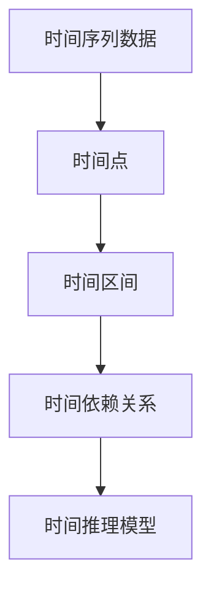
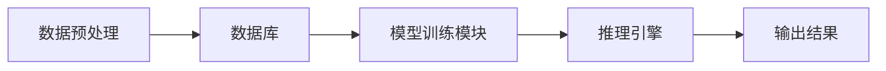
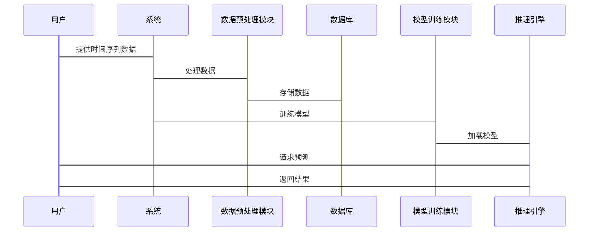

                 


# 从零构建AI Agent的时间推理能力

> 关键词：AI Agent，时间推理，时间序列，机器学习，深度学习

> 摘要：本文从AI Agent的时间推理能力出发，逐步构建从基础概念到实际应用的完整体系。通过详细阐述时间序列预测算法、模型构建方法和系统架构设计，帮助读者系统地理解和实现AI Agent的时间推理能力。

---

# 第一部分: AI Agent时间推理能力的背景与核心概念

## 第1章: 问题背景与问题描述

### 1.1 问题背景
时间推理能力是AI Agent理解和处理时间相关信息的关键能力。它不仅帮助AI Agent预测未来事件，还能理解过去事件的影响，从而做出更智能的决策。在自然语言处理、机器人控制、金融预测等领域，时间推理能力都发挥着重要作用。

### 1.2 问题描述
AI Agent的时间推理能力需要解决以下问题：
1. 如何识别时间序列中的模式？
2. 如何预测未来的时间序列值？
3. 如何处理时间依赖关系？

---

## 第2章: 核心概念与联系

### 2.1 时间推理能力的核心要素
1. **时间序列分析**：研究时间序列数据的模式和趋势。
2. **时间依赖关系**：分析事件之间的时序依赖关系。
3. **时间推理模型**：用于预测和推理时间序列数据的模型。

### 2.2 核心概念对比表
| 概念                | 时间序列分析       | 时间依赖关系       | 时间推理模型       |
|---------------------|--------------------|--------------------|--------------------|
| 定义                | 分析时间序列数据的模式和趋势 | 分析事件之间的时序依赖关系 | 预测和推理时间序列数据的模型 |
| 应用领域            | 金融、经济、天气预测 | 自然语言处理、机器人控制 | 时间序列预测、事件推理 |
| 实现方法            | ARIMA、LSTM、Transformer | 图模型、马尔可夫链 | RNN、Transformer |

### 2.3 实体关系图


---

# 第二部分: 时间推理能力的算法原理

## 第3章: 时间序列预测算法

### 3.1 时间序列预测的基本原理
时间序列预测通过分析过去的数据，预测未来的数据点。基本步骤包括数据预处理、模型选择、模型训练和预测。

### 3.2 常用时间序列预测算法
1. **ARIMA算法**：
   - **原理**：基于差分和移动平均模型。
   - **流程**：
     1. 确定数据的平稳性。
     2. 确定ARIMA的参数。
     3. 模型训练和预测。

2. **LSTM网络**：
   - **原理**：长短期记忆网络，适合处理长序列数据。
   - **流程**：
     1. 构建LSTM模型。
     2. 模型训练。
     3. 时间序列预测。

3. **Transformer模型**：
   - **原理**：基于自注意力机制，适合捕捉长距离依赖关系。
   - **流程**：
     1. 数据预处理。
     2. 模型训练。
     3. 预测和推理。

### 3.3 时间序列预测的数学模型
LSTM模型的数学公式：
$$
f_t = \sigma(W_f x_t + U_f h_{t-1} + b_f)
$$
$$
i_t = \sigma(W_i x_t + U_i h_{t-1} + b_i)
$$
$$
o_t = \sigma(W_o x_t + U_o h_{t-1} + b_o)
$$
$$
h_t = f_t \cdot c_{t-1} + i_t \cdot tanh(W_c x_t + U_c h_{t-1} + b_c)
$$

---

## 第4章: 时间推理模型的构建

### 4.1 时间推理模型的数学模型
时间序列预测的数学公式：
$$
y_t = f(y_{t-1}, y_{t-2}, ..., y_{t-n})
$$

### 4.2 时间推理模型的实现
1. **LSTM网络的结构**：
   ```mermaid
   graph LR
       input --> LSTM层
       LSTM层 --> 输出
   ```

2. **模型训练**：
   - **损失函数**：均方误差。
   $$ L = \frac{1}{n}\sum_{i=1}^{n}(y_i - \hat{y_i})^2 $$

---

# 第三部分: 时间推理能力的系统架构设计

## 第5章: 系统分析与架构设计方案

### 5.1 项目介绍
本项目旨在构建一个具备时间推理能力的AI Agent，能够处理时间序列数据并进行预测。

### 5.2 系统功能设计
1. **数据预处理模块**：
   - 数据清洗。
   - 数据转换。
2. **模型训练模块**：
   - 模型选择。
   - 模型训练。
3. **推理引擎**：
   - 时间序列预测。
   - 结果分析。

### 5.3 系统架构设计


### 5.4 系统交互设计


---

## 第6章: 项目实战

### 6.1 环境配置
1. **安装Python和相关库**：
   ```bash
   pip install numpy pandas scikit-learn keras tensorflow
   ```

### 6.2 核心实现
1. **数据预处理**：
   ```python
   import pandas as pd
   data = pd.read_csv('time_series.csv')
   ```

2. **模型实现**：
   ```python
   from keras.models import Sequential
   from keras.layers import LSTM, Dense

   model = Sequential()
   model.add(LSTM(128, input_shape=(timesteps, features)))
   model.add(Dense(1))
   model.compile(optimizer='adam', loss='mean_squared_error')
   ```

3. **训练与预测**：
   ```python
   model.fit(X_train, y_train, epochs=100, batch_size=32)
   predictions = model.predict(X_test)
   ```

### 6.3 案例分析
以股票价格预测为例，展示如何应用上述算法进行实际预测。

---

# 第四部分: 总结与展望

## 第7章: 总结与最佳实践

### 7.1 小结
时间推理能力是AI Agent的重要组成部分，通过时间序列预测算法和模型构建，可以实现对时间相关数据的预测和推理。

### 7.2 注意事项
1. 数据预处理是关键。
2. 模型选择要根据具体任务。
3. 超参数调整影响性能。

### 7.3 拓展阅读
1. 《Deep Learning》
2. 《Time Series Analysis and Its Applications》

---

作者：AI天才研究院 & 禅与计算机程序设计艺术

