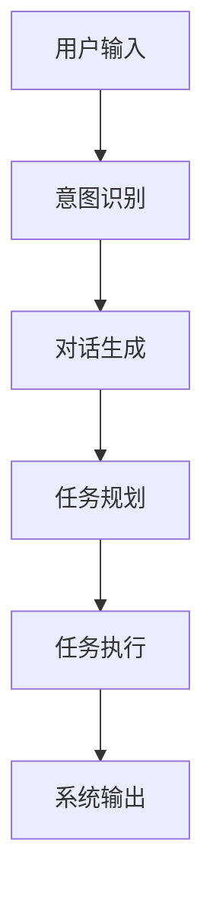
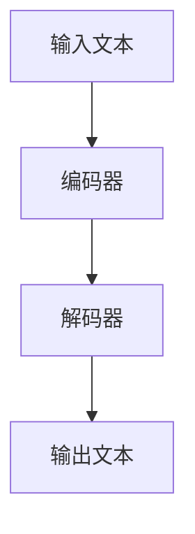
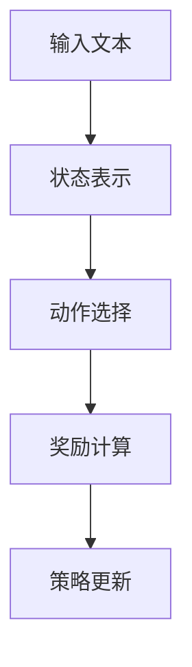
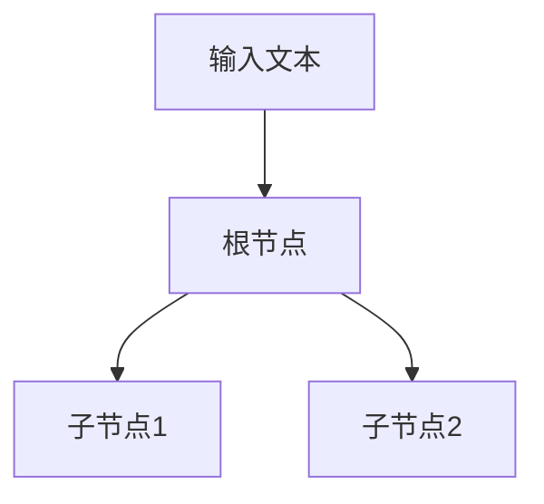
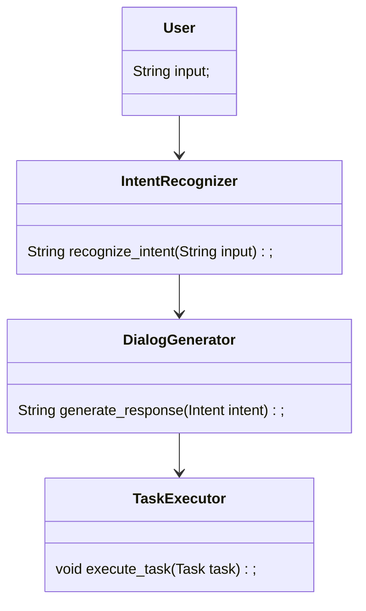
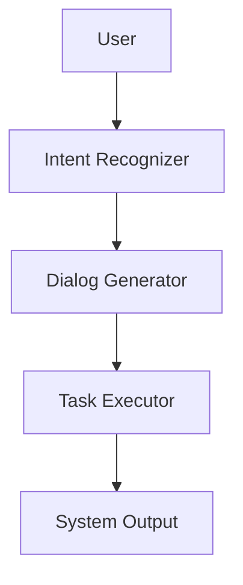
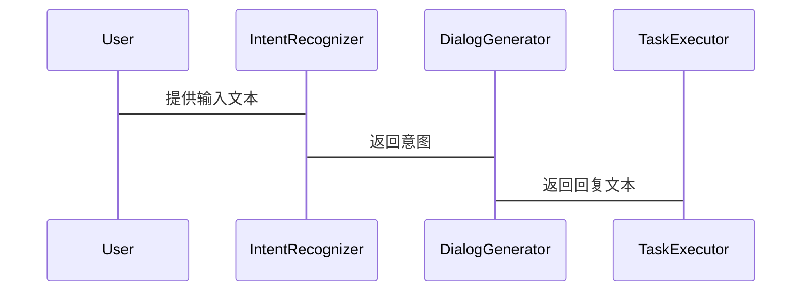

                 


# 从零构建AI Agent的目标导向对话系统

> 关键词：AI Agent，目标导向对话系统，自然语言处理，对话管理，强化学习，系统架构设计

> 摘要：本文从零开始详细讲解如何构建一个目标导向的对话系统，涵盖核心概念、算法原理、系统架构设计、项目实战等多个方面，帮助读者系统地理解并掌握从零到一的构建过程。

---

## 第一部分: 从零构建AI Agent的目标导向对话系统

### 第1章: 目标导向对话系统背景介绍

#### 1.1 问题背景与描述

##### 1.1.1 对话系统的定义与分类
对话系统是一种能够理解和生成人类语言的智能系统，广泛应用于客服、智能助手、教育等领域。目标导向对话系统专注于帮助用户完成特定任务，如预订机票、购物推荐等。

##### 1.1.2 目标导向对话的核心问题
目标导向对话系统的核心问题在于理解用户意图并生成符合任务的回复。这需要结合自然语言处理（NLP）和任务规划技术。

##### 1.1.3 当前对话系统的主要挑战
当前对话系统面临以下挑战：
- **意图识别**：准确识别用户意图。
- **对话上下文**：处理多轮对话中的上下文信息。
- **任务规划**：根据用户需求生成合理的执行步骤。

#### 1.2 问题解决与边界

##### 1.2.1 目标导向对话的目标设定
目标导向对话系统的最终目标是通过对话帮助用户完成特定任务，同时提供良好的用户体验。

##### 1.2.2 系统边界与功能范围
系统边界包括：
- 用户输入：文本或语音。
- 系统输出：文本回复或任务执行结果。
- 功能范围：意图识别、对话生成、任务规划。

##### 1.2.3 对话系统的外延与限制
目标导向对话系统的外延包括：
- 支持多轮对话。
- 能够处理复杂任务。
- 具备上下文记忆能力。

#### 1.3 核心概念与结构

##### 1.3.1 对话系统的组成要素
对话系统主要由以下部分组成：
- **自然语言处理（NLP）模块**：负责理解和生成语言。
- **对话管理模块**：负责对话的流程控制。
- **任务规划模块**：负责根据用户需求生成任务执行步骤。

##### 1.3.2 核心概念的结构化分析
目标导向对话系统的核心概念包括：
- 意图识别：识别用户的意图。
- 对话生成：根据意图生成回复。
- 任务规划：根据意图生成任务执行步骤。

##### 1.3.3 系统的核心要素与关系图


### 第2章: 目标导向对话系统的核心概念与联系

#### 2.1 核心概念原理

##### 2.1.1 自然语言处理（NLP）的基础原理
NLP是对话系统的核心技术之一，包括文本预处理、特征提取、模型训练等步骤。

##### 2.1.2 对话管理的机制与流程
对话管理模块负责控制对话流程，包括状态管理、回复生成等。

##### 2.1.3 任务规划的核心算法
任务规划模块使用基于规则或强化学习的方法生成任务执行步骤。

#### 2.2 核心概念对比表

##### 2.2.1 对话系统与传统任务处理的对比
| 特性                | 对话系统         | 传统任务处理     |
|---------------------|------------------|------------------|
| 输入方式            | 文本或语音       | 结构化数据       |
| 输出方式            | 自然语言文本     | 结构化数据       |
| 处理方式            | 实时交互        | 批处理           |
| 挑战                | 处理上下文       | 数据结构化       |

##### 2.2.2 不同对话管理策略的优缺点分析
| 策略                | 优点             | 缺点             |
|---------------------|------------------|------------------|
| 基于规则的策略      | 实现简单         | 需手动编写规则   |
| 基于机器学习的策略  | 自适应能力强     | 需大量训练数据   |

##### 2.2.3 任务规划与对话生成的关系
任务规划与对话生成是相辅相成的关系，任务规划提供执行步骤，对话生成提供自然语言回复。

#### 2.3 ER实体关系图

##### 2.3.1 对话系统的实体关系图
```mermaid
erd
    User
    has
    Intent
    Intent
    has
    Dialog
    Dialog
    has
    Task
    Task
    has
    Action
```

### 第3章: 对话系统算法原理讲解

#### 3.1 算法原理概述

##### 3.1.1 基于Seq2Seq的对话生成
Seq2Seq模型通过编码器和解码器结构生成对话回复。

##### 3.1.2 基于强化学习的对话生成
强化学习模型通过最大化奖励函数生成最优回复。

##### 3.1.3 基于树状结构的对话生成
树状结构模型通过生成树状结构来优化对话流程。

#### 3.2 算法流程图

##### 3.2.1 Seq2Seq算法流程图


##### 3.2.2 强化学习对话生成流程图


##### 3.2.3 树状对话生成流程图


#### 3.3 算法实现代码

##### 3.3.1 基于PyTorch的Seq2Seq实现
```python
import torch
class Seq2SeqModel(torch.nn.Module):
    def __init__(self, vocab_size):
        super(Seq2SeqModel, self).__init__()
        self.encoder = torch.nn.Embedding(vocab_size, 512)
        self.decoder = torch.nn.Linear(512, vocab_size)
    def forward(self, input_seq):
        enc_output = self.encoder(input_seq)
        dec_output = self.decoder(enc_output)
        return dec_output
```

##### 3.3.2 基于强化学习的对话生成代码
```python
import torch
class ReinforceAgent:
    def __init__(self, vocab_size):
        self.vocab_size = vocab_size
        self.model = torch.nn.Sequential(
            torch.nn.Linear(vocab_size, 256),
            torch.nn.ReLU(),
            torch.nn.Linear(256, vocab_size)
        )
    def act(self, state):
        logits = self.model(state)
        return logits.argmax(dim=1).item()
```

##### 3.3.3 树状对话生成的Python代码示例
```python
def generate_response(input_text):
    # 输入文本处理
    # 生成树状结构
    # 返回回复文本
    return "请问有什么可以帮助您的？"
```

### 第4章: 对话系统架构设计

#### 4.1 系统功能设计

##### 4.1.1 对话系统的功能模块划分
系统功能模块包括：
- 输入处理模块
- 意图识别模块
- 对话生成模块
- 任务执行模块

##### 4.1.2 功能模块的详细说明
- 输入处理模块：接收用户输入并进行预处理。
- 意图识别模块：识别用户的意图。
- 对话生成模块：生成对话回复。
- 任务执行模块：执行用户任务。

##### 4.1.3 功能模块

#### 4.2 系统架构设计

##### 4.2.1 领域模型


##### 4.2.2 系统架构图


##### 4.2.3 系统接口设计
- IntentRecognizer接口：
  - 输入：用户输入文本。
  - 输出：用户意图。

- DialogGenerator接口：
  - 输入：用户意图。
  - 输出：对话回复。

##### 4.2.4 系统交互


---

## 第5章: 项目实战

### 5.1 环境安装与配置

#### 5.1.1 安装依赖
```bash
pip install torch transformers
```

#### 5.1.2 环境配置
```bash
export PYTHONPATH=$PYTHONPATH:.
```

### 5.2 系统核心实现

#### 5.2.1 意图识别模块实现
```python
import torch
class IntentRecognizer:
    def __init__(self, vocab_size):
        self.model = torch.nn.Linear(vocab_size, 1)
    def recognize(self, input_seq):
        return torch.sigmoid(self.model(input_seq)).argmax(dim=1).item()
```

#### 5.2.2 对话生成模块实现
```python
class DialogGenerator:
    def __init__(self, vocab_size):
        self.model = torch.nn.Linear(vocab_size, vocab_size)
    def generate(self, input_seq):
        return self.model(input_seq).argmax(dim=1).item()
```

#### 5.2.3 任务执行模块实现
```python
class TaskExecutor:
    def __init__(self):
        pass
    def execute(self, task):
        print(f"执行任务：{task}")
```

### 5.3 代码实现与解读

#### 5.3.1 整体代码架构
```python
class AIAssistant:
    def __init__(self):
        self.recognizer = IntentRecognizer(100)
        self.generator = DialogGenerator(100)
        self.executor = TaskExecutor()
    def process_input(self, input_text):
        intent = self.recognizer.recognize(input_text)
        response = self.generator.generate(input_text)
        self.executor.execute(response)
```

#### 5.3.2 代码功能解读
- **AIAssistant类**：负责协调各个模块。
- **process_input方法**：处理用户输入，识别意图，生成回复，执行任务。

### 5.4 案例分析与解读

#### 5.4.1 案例一：用户预订机票
```plaintext
用户：我需要预订一张从北京到上海的机票。
系统：请提供日期和时间。
用户：明天上午十点。
系统：预订成功，祝您旅途愉快。
```

#### 5.4.2 案例二：用户查询天气
```plaintext
用户：北京今天天气怎么样？
系统：今天北京天气晴朗，气温在20℃到25℃之间。
```

### 5.5 项目小结

#### 5.5.1 项目总结
通过本项目，我们实现了从零开始构建一个目标导向对话系统，涵盖了意图识别、对话生成和任务执行的核心模块。

#### 5.5.2 经验与教训
- **经验**：模块化设计有助于系统维护。
- **教训**：需要更多的训练数据来提高模型性能。

---

## 第6章: 最佳实践与总结

### 6.1 最佳实践

#### 6.1.1 开发注意事项
- 保持代码简洁，便于维护。
- 定期进行性能优化。

#### 6.1.2 模型调优
- 使用高质量的数据进行训练。
- 采用合适的评价指标。

### 6.2 小结与展望

#### 6.2.1 小结
本文详细讲解了目标导向对话系统的构建过程，包括核心概念、算法原理和系统架构设计。

#### 6.2.2 注意事项
- 确保系统安全性和隐私性。
- 定期更新模型以适应新的需求。

#### 6.2.3 未来展望
未来的目标导向对话系统将更加智能化，具备更强的上下文理解和任务执行能力。

### 6.3 拓展阅读

#### 6.3.1 推荐书籍
- 《深度学习》
- 《自然语言处理实战》

#### 6.3.2 推荐博客
- [自然语言处理博客](#)
- [强化学习博客](#)

---

## 附录

### 附录A: 参考文献

### 附录B: 工具与API

#### B.1 常用工具
- **Python**：编程语言
- **PyTorch**：深度学习框架

#### B.2 常用API
- **OpenAI API**：用于对话生成
- **Google Dialogflow**：对话系统

---

## 作者

作者：AI天才研究院/AI Genius Institute & 禅与计算机程序设计艺术 /Zen And The Art of Computer Programming

