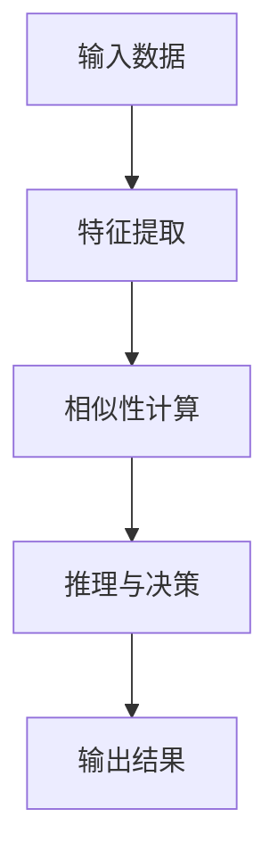
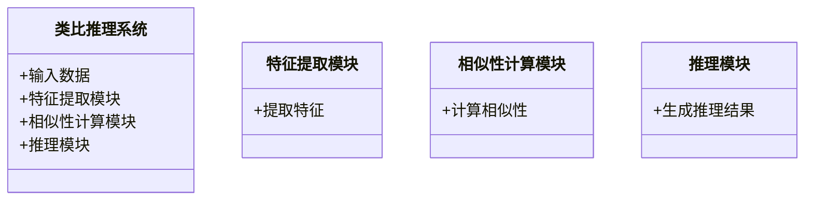
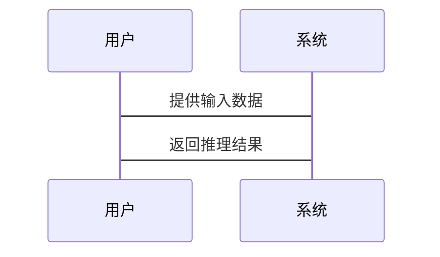

                 


# 从零构建AI Agent的类比推理系统

> 关键词：AI Agent，类比推理，系统构建，算法原理，系统设计

> 摘要：本文将详细讲解从零开始构建一个基于类比推理的AI Agent系统的全过程。通过背景介绍、核心概念、算法原理、系统设计和项目实战等多方面的内容，为读者提供一个全面且系统化的构建指南。文章从基础概念出发，逐步深入，结合实际案例和代码实现，帮助读者掌握类比推理的核心原理和AI Agent的设计与实现方法。

---

# 第1章: 背景介绍

## 1.1 问题背景

### 1.1.1 类比推理的定义与重要性
类比推理是一种基于相似性进行推断的思维方式。在AI领域，类比推理广泛应用于模式识别、自然语言处理和智能问答系统中。它通过比较不同对象的属性和关系，推导出新的结论或解决方案。

### 1.1.2 AI Agent的核心概念
AI Agent是一种能够感知环境、执行任务并做出决策的智能实体。它能够通过类比推理理解问题，生成合理的解决方案，并与外部环境进行交互。

### 1.1.3 问题背景与实际应用场景
类比推理在许多领域有广泛应用，例如医疗诊断、法律推理和自然语言处理。本文将重点探讨如何通过AI Agent实现类比推理，解决实际问题。

## 1.2 问题描述

### 1.2.1 类比推理的基本问题
类比推理的核心问题是寻找两个事物之间的相似性，并利用这种相似性进行推理和推断。

### 1.2.2 AI Agent在类比推理中的角色
AI Agent通过分析问题、提取特征、建立映射关系，并利用这些关系进行推理，从而解决问题。

### 1.2.3 问题解决的边界与外延
本文将重点探讨类比推理的实现方法，以及如何在AI Agent中构建这一系统。

## 1.3 问题解决方法

### 1.3.1 类比推理的实现路径
类比推理的实现通常包括特征提取、相似性计算和推理过程三个步骤。

### 1.3.2 AI Agent的构建步骤
构建AI Agent的类比推理系统需要从数据采集、特征提取、算法设计到系统集成等多个步骤。

### 1.3.3 系统设计的核心要素
系统设计的核心要素包括数据结构、算法选择、系统架构和性能优化。

---

# 第2章: 核心概念与联系

## 2.1 类比推理的原理

### 2.1.1 类比推理的基本原理
类比推理通过比较不同对象的属性和关系，寻找相似性，并利用这种相似性进行推理。

### 2.1.2 AI Agent的推理机制
AI Agent通过分析输入数据，提取特征，建立映射关系，并利用这些关系进行推理和决策。

### 2.1.3 类比推理与逻辑推理的对比
类比推理和逻辑推理在思维方式上有显著差异。类比推理注重相似性，而逻辑推理注重逻辑关系。

## 2.2 核心概念的属性特征对比

### 2.2.1 类比推理的特征分析
类比推理的关键特征包括相似性、相关性和可比性。

### 2.2.2 AI Agent的核心属性
AI Agent的核心属性包括感知能力、决策能力和执行能力。

### 2.2.3 系统核心概念的对比表格

| 概念 | 特性1 | 特性2 | 特性3 |
|------|-------|-------|-------|
| 类比推理 | 相似性 | 可比性 | 可推理性 |
| AI Agent | 感知能力 | 决策能力 | 执行能力 |

## 2.3 ER实体关系图

```mermaid
erd
  entity 类比推理系统 {
    <有向边> 类比推理规则 --> 类比推理数据
    <有向边> AI Agent --> 类比推理系统
    <有向边> 数据源 --> 类比推理数据
  }
```

---

# 第3章: 算法原理讲解

## 3.1 算法流程图



## 3.2 Python源代码实现

### 3.2.1 算法实现的代码框架

```python
def compare_features(feature1, feature2):
    # 特征比较逻辑
    pass

def calculate_similarity(features):
    # 相似性计算逻辑
    pass

def infer_result(similarity):
    # 推理逻辑
    pass
```

### 3.2.2 核心算法的详细代码

```python
def compare_features(feature1, feature2):
    # 示例：计算两个特征的相似性分数
    similarity_score = 0.8
    return similarity_score

def calculate_similarity(features):
    # 示例：计算多个特征的相似性
    total_score = 0.0
    for feature in features:
        total_score += compare_features(feature, features[0])
    return total_score / len(features)

def infer_result(similarity):
    # 示例：基于相似性进行推理
    if similarity > 0.7:
        return "推理结果1"
    else:
        return "推理结果2"
```

### 3.2.3 代码的功能解读与举例

- `compare_features` 函数用于比较两个特征的相似性，返回相似性分数。
- `calculate_similarity` 函数计算多个特征的平均相似性。
- `infer_result` 函数基于相似性分数，返回推理结果。

## 3.3 数学模型与公式

### 3.3.1 相似度计算公式

$$ \text{相似度} = \frac{\sum_{i=1}^{n} w_i \cdot s_i}{\sum_{i=1}^{n} w_i} $$

其中，$w_i$ 是特征 $i$ 的权重，$s_i$ 是特征 $i$ 的相似性得分。

### 3.3.2 推理过程的数学模型

$$ \text{推理结果} = \argmax_{j} \sum_{i=1}^{n} w_i \cdot s_i(j) $$

### 3.3.3 公式的详细解读与举例

- 相似度公式：通过加权平均计算多个特征的相似性。
- 推理公式：通过最大化相似性得分，选择最可能的推理结果。

---

# 第4章: 系统分析与架构设计

## 4.1 项目背景与目标

### 4.1.1 项目背景介绍
本文旨在构建一个基于类比推理的AI Agent系统，解决实际问题。

### 4.1.2 系统设计目标
系统目标包括实现类比推理功能、提高推理效率和增强系统的可扩展性。

## 4.2 系统功能设计

### 4.2.1 领域模型类图



## 4.3 系统架构设计

### 4.3.1 系统架构图


## 4.4 系统接口设计

### 4.4.1 接口设计
系统接口包括输入接口、特征提取接口、相似性计算接口和推理接口。

### 4.4.2 交互序列图



---

# 第5章: 项目实战

## 5.1 环境安装

### 5.1.1 系统需求
需要安装Python、Mermaid和相关开发工具。

## 5.2 核心代码实现

### 5.2.1 实现类比推理系统

```python
class 类比推理系统:
    def __init__(self):
        self.features = []
        self.similarity_scores = []
        self推理结果 = ""

    def 提取特征(self, 数据):
        # 示例：提取特征
        pass

    def 计算相似性(self):
        # 示例：计算相似性
        pass

    def 进行推理(self):
        # 示例：进行推理
        pass

    def 输出结果(self):
        return self推理结果
```

### 5.2.2 代码解读与分析
详细解读上述代码的实现逻辑和功能。

## 5.3 实际案例分析

### 5.3.1 案例分析
通过具体案例，展示系统的实际应用。

## 5.4 项目小结

---

# 第6章: 最佳实践

## 6.1 小结

### 6.1.1 核心内容总结
总结本文的核心内容和主要观点。

## 6.2 注意事项

### 6.2.1 实际应用中的注意事项
在实际应用中需要注意的问题。

## 6.3 拓展阅读

### 6.3.1 推荐阅读的书籍和资源
推荐相关书籍和资源，供读者进一步学习。

---

# 作者

作者：AI天才研究院/AI Genius Institute & 禅与计算机程序设计艺术 /Zen And The Art of Computer Programming

