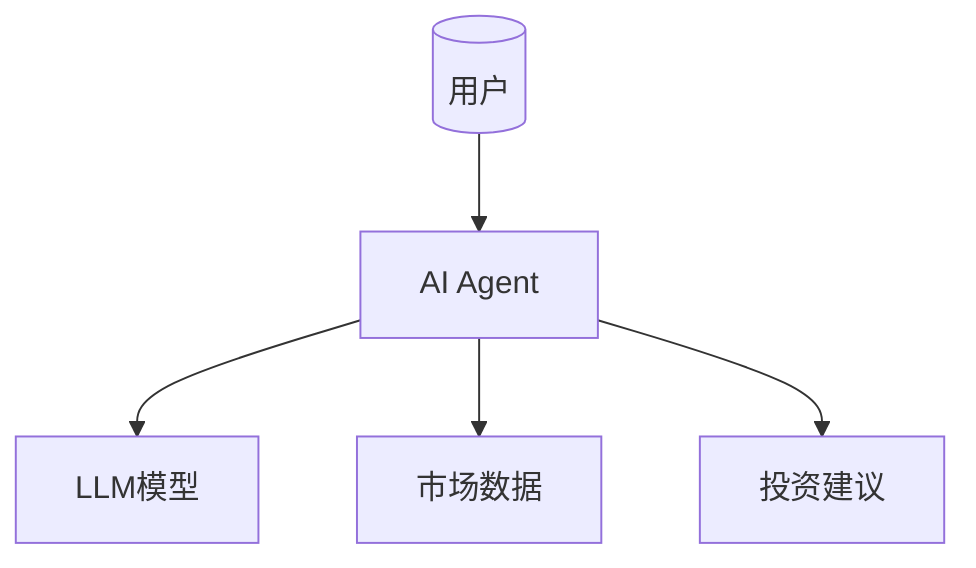

                 


# 从零构建投资理财智能助手AI Agent：基于LLM大模型投资理财AI应用开发实践

## 关键词：
AI Agent, LLM大模型, 投资理财, 自然语言处理, 系统架构设计, 项目实战

## 摘要：
本文将详细探讨如何从零开始构建一个基于大语言模型（LLM）的投资理财智能助手AI Agent。文章首先介绍AI Agent的基本概念及其在投资理财中的应用价值，接着深入分析大模型的数学基础、自然语言处理技术以及其在投资理财中的具体应用。然后，通过系统架构设计和项目实战，展示如何将这些技术整合到实际应用中。文章内容涵盖环境搭建、核心功能实现、系统架构设计、案例分析和优化建议，为读者提供全面的技术指导。

---

# 第一部分: 背景介绍与核心概念

## 第1章: 投资理财智能助手AI Agent概述

### 1.1 问题背景与描述
#### 1.1.1 投资理财领域的痛点分析
在当今快速变化的金融环境中，投资者面临诸多挑战：
- 信息过载：每天产生的财经数据和市场动态浩如烟海，投资者难以快速筛选和分析。
- 决策延迟：传统的人工分析耗时较长，导致投资机会的错失。
- 风险评估复杂：投资者需要综合分析市场、行业和公司等多方面的信息，以做出明智的决策。

#### 1.1.2 AI Agent在投资理财中的作用
AI Agent（智能代理）通过自动化处理和分析数据，为投资者提供实时、个性化的投资建议，帮助他们优化决策。具体作用包括：
- **实时监控**：自动跟踪市场动态，及时发现投资机会或潜在风险。
- **智能推荐**：根据用户的投资目标和风险偏好，推荐适合的投资组合。
- **风险预警**：基于历史数据和市场趋势，预测潜在风险并发出预警。

#### 1.1.3 投资理财智能助手的边界与外延
- **边界**：AI Agent主要辅助投资决策，不直接操作投资账户。
- **外延**：AI Agent可以与其他工具（如交易系统、数据源）集成，提供更全面的服务。

### 1.2 核心概念与联系
#### 1.2.1 AI Agent与LLM大模型的关系
AI Agent可以基于LLM（大语言模型）构建，利用其强大的自然语言处理能力来理解和生成文本。LLM作为AI Agent的核心，负责处理文本输入并生成输出。

#### 1.2.2 投资理财智能助手的功能模块
- **用户需求分析模块**：解析用户的投资目标和风险偏好。
- **数据获取与处理模块**：从多个数据源获取实时数据并进行清洗。
- **模型调用与结果处理模块**：调用LLM模型生成投资建议，并将结果呈现给用户。

#### 1.2.3 核心概念的ER实体关系图
```mermaid
er
actor: 投资者
agent: AI投资助手
model: LLM大模型
market_data: 市场数据
goal: 投资目标
risk_preference: 风险偏好
investment_recommendation: 投资建议
```

---

# 第二部分: LLM大模型基础

## 第2章: 大模型的数学基础

### 2.1 概率论基础
#### 2.1.1 概率的基本概念
- 概率：衡量某件事发生的可能性，取值范围在0到1之间。
- 事件独立性：两个事件A和B独立，当且仅当P(A ∩ B) = P(A) * P(B)。

#### 2.1.2 贝叶斯定理
贝叶斯定理用于计算条件概率：
$$ P(B|A) = \frac{P(A|B) \cdot P(B)}{P(A)} $$

#### 2.1.3 马尔可夫链
马尔可夫链描述了系统在各个状态之间转移的概率，适用于时间序列分析。

### 2.2 线性代数基础
#### 2.2.1 向量与矩阵
- 向量：表示数据点，如股票价格向量。
- 矩阵：用于表示数据集，如特征矩阵。

#### 2.2.2 矩阵乘法与逆矩阵
矩阵乘法是线性变换的核心，逆矩阵用于求解线性方程组。

### 2.3 深度学习基础
#### 2.3.1 神经网络的基本结构
- 输入层、隐藏层和输出层构成神经网络。
- 激活函数（如ReLU）用于引入非线性。

#### 2.3.2 激活函数
常用激活函数包括：
- ReLU：$$ f(x) = \max(0, x) $$
- Sigmoid：$$ f(x) = \frac{1}{1 + e^{-x}} $$

#### 2.3.3 损失函数与优化算法
- 均方误差：$$ \text{MSE} = \frac{1}{n}\sum_{i=1}^{n}(y_i - \hat{y_i})^2 $$
- 优化算法：如随机梯度下降（SGD）。

## 第3章: 自然语言处理基础

### 3.1 分词与词性标注
#### 3.1.1 中文分词算法
- 基于统计的分词方法，如分词工具jieba。

#### 3.1.2 词性标注的实现
- 使用词性标注工具如HanLP。

### 3.2 句法分析与语义理解
#### 3.2.1 依存句法分析
- 通过语法树分析句子结构。

#### 3.2.2 语义角色标注
- 确定句子中每个词的语义角色。

#### 3.2.3 情感分析
- 使用情感分析模型判断文本情感倾向。

## 第4章: 大模型在投资理财中的应用

### 4.1 投资策略生成
#### 4.1.1 基于LLM的投资组合优化
- 通过LLM生成投资组合建议，优化资产配置。

#### 4.1.2 风险评估与预测
- 分析市场数据，预测投资风险。

#### 4.1.3 市场情绪分析
- 通过社交媒体和新闻数据，判断市场情绪。

### 4.2 信息抽取与知识图谱构建
#### 4.2.1 从财经新闻中提取关键信息
- 使用NLP技术提取公司财报中的关键指标。

#### 4.2.2 知识图谱的构建与应用
- 构建投资领域的知识图谱，支持智能问答。

#### 4.2.3 投资决策支持
- 提供基于知识图谱的决策支持。

## 第5章: 系统架构设计

### 5.1 系统功能设计
#### 5.1.1 用户需求分析模块
- 解析用户的投资目标和风险偏好。

#### 5.1.2 数据获取与处理模块
- 从多个数据源获取实时数据并清洗。

#### 5.1.3 模型调用与结果处理模块
- 调用LLM模型生成投资建议。

### 5.2 系统架构图


## 第6章: 项目实战

### 6.1 环境安装与配置
#### 6.1.1 开发环境搭建
- 使用Python和虚拟环境。

#### 6.1.2 依赖库安装
- 使用pip安装必要的库，如transformers和jieba。

#### 6.1.3 API接口配置
- 配置财经数据API接口。

### 6.2 核心代码实现
#### 6.2.1 用户需求解析模块
```python
def parse_user_request(request):
    # 使用NLP模型解析用户需求
    return parsed_request
```

#### 6.2.2 数据处理模块
```python
def process_market_data(data):
    # 数据清洗和特征提取
    return processed_data
```

#### 6.2.3 模型调用模块
```python
def call_llm_model(data):
    # 调用LLM模型生成投资建议
    return recommendation
```

### 6.3 实际案例分析
#### 6.3.1 案例分析
- 分析用户的投资需求，调用LLM生成投资建议。

#### 6.3.2 代码解读与优化
- 优化代码性能，提高处理效率。

### 6.4 项目总结
- 总结项目实现的关键点和经验教训。

---

# 第三部分: 总结与展望

## 第7章: 总结与优化建议

### 7.1 系统总结
- 总结AI Agent在投资理财中的应用价值。

### 7.2 优化建议
- 提高模型的准确性和实时性。

## 第8章: 未来展望

### 8.1 技术趋势
- 探讨大语言模型的未来发展方向。

### 8.2 挑战与机遇
- 分析投资理财领域的技术挑战和机遇。

---

# 作者：AI天才研究院/AI Genius Institute & 禅与计算机程序设计艺术 /Zen And The Art of Computer Programming

