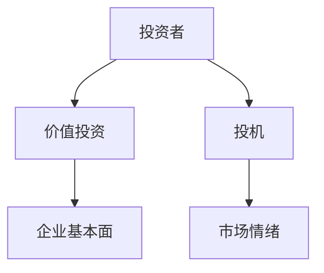
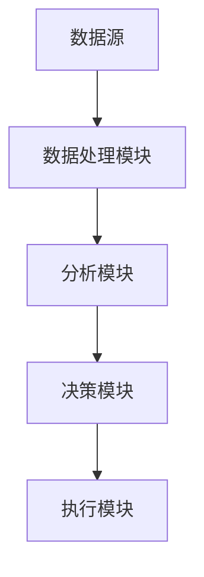

                 


# 价值投资vs投机：理解长期投资的重要性

## 关键词：
价值投资, 投机, 长期投资, 投资策略, 风险管理

## 摘要：
本文深入探讨了价值投资与投机之间的区别，强调了长期投资的重要性。通过分析两者的定义、核心概念、风险特征和实际案例，帮助读者理解长期投资的优势和风险管理的必要性。文章结合技术语言，详细解释了投资决策的系统架构设计和数学模型，提供了实际的项目实战和代码示例，帮助读者掌握长期投资的策略和方法。

---

## 第一部分：价值投资与投机的概述

### 第1章：价值投资与投机的基本概念

#### 1.1 价值投资的定义与核心理念

##### 背景介绍
价值投资是一种以企业内在价值为基础的投资策略，强调通过分析企业的基本面（如财务状况、行业地位、竞争优势等）来确定其合理的市场价格。这种策略要求投资者以低于内在价值的价格买入股票，并长期持有。

##### 核心概念与联系
- **内在价值**：企业的内在价值是其未来现金流的现值，可以通过DCF（Discounted Cash Flow）模型计算。
- **安全边际**：购买价格低于内在价值的部分，提供了保护投资者免受短期市场波动影响的缓冲区。

##### 算法原理讲解
**DCF模型**：
$$ V = \frac{CF}{(1+r)^n} $$
其中，$V$ 是内在价值，$CF$ 是未来现金流，$r$ 是折现率，$n$ 是时间跨度。

##### 系统架构设计
1. 数据收集：收集企业的财务报表、行业数据等。
2. 模型计算：应用DCF模型计算内在价值。
3. 决策系统：判断当前价格是否低于内在价值，决定是否买入。

#### 1.2 投机的定义与特点

##### 背景介绍
投机是一种基于市场情绪和短期价格波动的投资策略，投资者主要关注市场的供需变化、市场趋势和短期因素。

##### 核心概念与联系
- **市场情绪**：投资者的心理和行为对市场价格的影响。
- **技术分析**：通过价格图表和成交量分析预测短期价格走势。

##### 算法原理讲解
**移动平均线策略**：
- 短期移动平均线：SMA（Simple Moving Average）
- 长期移动平均线：LMA（Long-term Moving Average）

##### 系统架构设计
1. 数据收集：收集历史价格数据。
2. 技术分析：应用SMA和LMA进行价格预测。
3. 决策系统：根据价格走势决定买卖时机。

#### 1.3 价值投资与投机的主要区别

##### 对比分析
| 核心要素 | 价值投资 | 投机 |
|----------|----------|------|
| 投资目标 | 内在价值 | 市场波动 |
| 投资期限 | 长期 | 短期 |
| 风险承受 | 低风险 | 高风险 |

##### 实体关系图


---

## 第二部分：价值投资与投机的核心概念对比

### 第2章：价值投资与投机的核心概念分析

#### 2.1 价值投资的核心要素

##### 背景介绍
价值投资的核心在于对企业进行深入分析，寻找具有强大竞争优势和良好管理的企业。

##### 核心概念与联系
- **财务分析**：关注企业的盈利能力、成长性、财务健康状况。
- **竞争优势**：分析企业的市场地位、护城河和核心竞争力。

##### 算法原理讲解
**ROE（净资产收益率）计算**：
$$ ROE = \frac{\text{净利润}}{\text{股东权益}} $$

##### 系统架构设计
1. 数据收集：收集企业的财务报表。
2. 指标计算：计算ROE等关键指标。
3. 决策系统：判断企业是否具有投资价值。

#### 2.2 投机的核心要素

##### 背景介绍
投机者关注市场的短期波动，利用价格波动赚取利润。

##### 核心概念与联系
- **技术指标**：如RSI（相对强度指数）、MACD（移动平均收敛散度）等。
- **市场流动性**：市场流动性对价格波动的影响。

##### 算法原理讲解
**RSI指标计算**：
$$ RSI = \frac{100 - \frac{\text{平均上涨幅度}}{\text{平均下跌幅度}} }{} $$

##### 系统架构设计
1. 数据收集：收集历史价格数据。
2. 指标计算：计算RSI等技术指标。
3. 决策系统：根据指标结果决定买卖时机。

#### 2.3 对比与联系

##### 对比分析
| 核心要素 | 价值投资 | 投机 |
|----------|----------|------|
| 关注点 | 企业基本面 | 市场波动 |
| 投资策略 | 长期持有 | 短期交易 |
| 风险管理 | 低风险 | 高风险 |

##### 实体关系图


---

## 第三部分：长期投资的重要性

### 第3章：长期投资的重要性

#### 3.1 长期投资的优势

##### 背景介绍
长期投资通过复利效应实现财富增长，减少短期波动的影响。

##### 核心概念与联系
- **复利效应**：投资收益的再投资产生更多收益。
- **时间价值**：长期投资利用时间创造更多价值。

##### 算法原理讲解
**复利计算公式**：
$$ A = P(1 + \frac{r}{n})^{nt} $$
其中，$A$ 是终值，$P$ 是本金，$r$ 是年利率，$n$ 是每年的复利次数，$t$ 是投资时间。

##### 系统架构设计
1. 数据收集：收集历史投资数据。
2. 模型计算：应用复利模型计算长期收益。
3. 决策系统：制定长期投资计划。

#### 3.2 风险管理策略

##### 背景介绍
风险管理是长期投资成功的关键，通过分散投资、设定止损等方法降低风险。

##### 核心概念与联系
- **分散投资**：通过投资不同类型资产降低风险。
- **止损策略**：设定最大亏损比例，避免重大损失。

##### 算法原理讲解
**止损策略**：
$$ \text{止损点} = \text{买入价} \times (1 - \text{止损比例}) $$

##### 系统架构设计
1. 数据收集：收集市场数据。
2. 风险评估：计算潜在风险。
3. 决策系统：执行止损策略。

#### 3.3 长期投资的策略

##### 背景介绍
制定长期投资策略需要考虑市场周期、经济环境和个人财务状况。

##### 核心概念与联系
- **资产配置**：根据风险承受能力分配资产。
- **定期再平衡**：定期调整投资组合以保持配置。

##### 算法原理讲解
**资产配置模型**：
$$ \text{资产比例} = \text{根据风险承受能力分配} $$

##### 系统架构设计
1. 数据收集：收集市场和经济数据。
2. 模型计算：应用资产配置模型。
3. 决策系统：执行投资策略。

---

## 第四部分：风险管理与投资决策

### 第4章：风险管理与投资决策

#### 4.1 风险管理的重要性

##### 背景介绍
风险管理是确保投资组合安全的关键，通过识别和控制风险降低损失。

##### 核心概念与联系
- **风险来源**：市场风险、流动性风险、信用风险等。
- **风险管理策略**：分散投资、对冲、保险等。

##### 算法原理讲解
**VaR（Value at Risk）模型**：
$$ VaR = \text{最大潜在损失} $$

##### 系统架构设计
1. 数据收集：收集市场和资产数据。
2. 风险评估：应用VaR模型计算风险。
3. 决策系统：制定风险管理策略。

#### 4.2 投资决策的系统架构

##### 背景介绍
投资决策系统需要整合市场数据、分析模型和决策逻辑。

##### 核心概念与联系
- **数据流**：从数据源获取市场数据。
- **分析模块**：应用分析模型进行评估。
- **决策模块**：根据分析结果制定决策。

##### 系统架构设计


---

## 第五部分：价值投资与投机的系统架构设计

### 第5章：价值投资与投机的系统架构设计

#### 5.1 价值投资的系统架构

##### 背景介绍
价值投资系统需要整合企业基本面分析和市场数据，提供投资决策支持。

##### 核心概念与联系
- **数据源**：企业财务报表、行业数据。
- **分析模型**：DCF模型、ROE计算。
- **决策逻辑**：判断企业价值，制定投资策略。

##### 系统架构设计


#### 5.2 投机的系统架构

##### 背景介绍
投机系统需要实时市场数据和快速的技术分析，提供交易决策支持。

##### 核心概念与联系
- **数据源**：历史价格数据、市场情绪指标。
- **分析模型**：技术指标计算、趋势分析。
- **决策逻辑**：根据技术分析结果制定交易策略。

##### 系统架构设计


---

## 第六部分：价值投资与投机的项目实战

### 第6章：价值投资与投机的项目实战

#### 6.1 价值投资的环境配置与代码实现

##### 背景介绍
价值投资项目需要配置相应的数据源和分析工具，使用Python进行数据处理和建模。

##### 核心概念与联系
- **工具安装**：安装Pandas、NumPy、Matplotlib等库。
- **代码实现**：读取财务数据，计算DCF模型，生成投资建议。

##### 代码示例
```python
import pandas as pd
import numpy as np

def calculate_intrinsic_value(revenue, cost, discount_rate):
    cash_flow = revenue - cost
    return cash_flow / (1 + discount_rate)
```

#### 6.2 投机的环境配置与代码实现

##### 背景介绍
投机项目需要配置实时数据源和分析工具，使用Python进行技术分析和交易信号生成。

##### 核心概念与联系
- **工具安装**：安装Pandas、Plotly、TA-Lib等库。
- **代码实现**：读取价格数据，计算RSI指标，生成交易信号。

##### 代码示例
```python
import pandas as pd
import talib

def calculate_rsi(data, period):
    return talib.RSI(data, timeperiod=period)
```

#### 6.3 实际案例分析

##### 背景介绍
通过具体案例分析，展示价值投资和投机的实际应用和效果。

##### 核心概念与联系
- **案例分析**：分析某公司的基本面，计算内在价值，制定投资策略。
- **案例对比**：比较价值投资和投机在实际操作中的表现。

#### 6.4 项目小结与经验总结

##### 背景介绍
总结项目经验，分析价值投资和投机在实际操作中的优缺点。

##### 核心概念与联系
- **经验总结**：长期投资的优势和风险管理的重要性。
- **教训反思**：短期波动对投资决策的影响。

---

## 第七部分：价值投资与投机的系统架构设计与最佳实践

### 第7章：系统架构设计与最佳实践

#### 7.1 系统架构设计

##### 背景介绍
设计一个综合的系统架构，整合价值投资和投机策略，提供全面的投资决策支持。

##### 核心概念与联系
- **系统功能**：数据收集、分析、决策、执行。
- **系统架构**：模块化设计，便于扩展和维护。

##### 系统架构图


#### 7.2 最佳实践

##### 背景介绍
总结最佳实践，指导读者在实际投资中应用价值投资和投机策略。

##### 核心概念与联系
- **风险管理**：分散投资，设定止损点。
- **长期投资**：选择优质企业，长期持有。
- **技术分析**：结合技术指标，辅助短期决策。

#### 7.3 小结与注意事项

##### 背景介绍
总结全文，强调长期投资的重要性，提醒读者注意风险管理。

##### 核心概念与联系
- **长期投资**：通过复利效应实现财富增长。
- **风险管理**：分散投资，避免重大损失。
- **持续学习**：保持学习，适应市场变化。

---

## 结论

长期投资是实现财富增长的重要策略，而价值投资是实现长期投资的核心方法。通过深入理解价值投资和投机的区别，读者可以更好地制定投资策略，避免短期波动的影响，实现稳健的长期收益。

---

## 作者信息

作者：AI天才研究院/AI Genius Institute & 禅与计算机程序设计艺术 /Zen And The Art of Computer Programming

