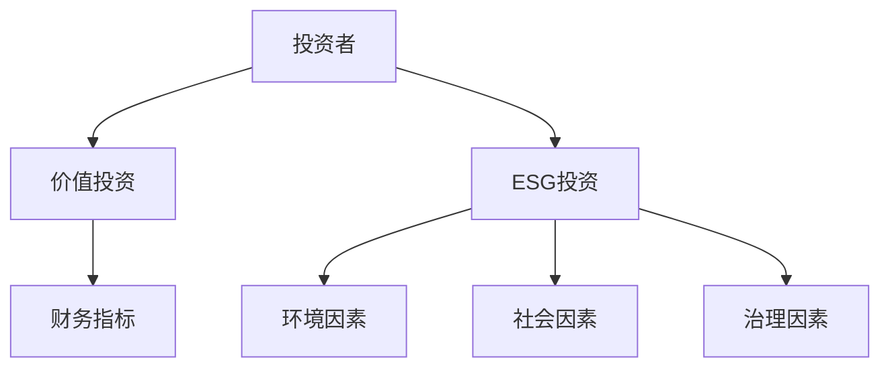
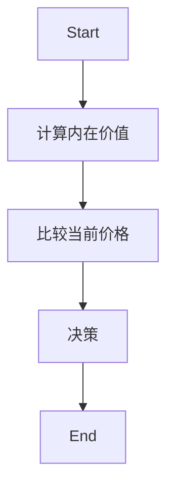
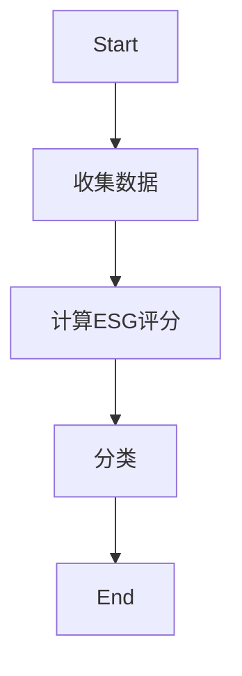
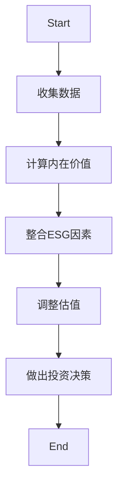
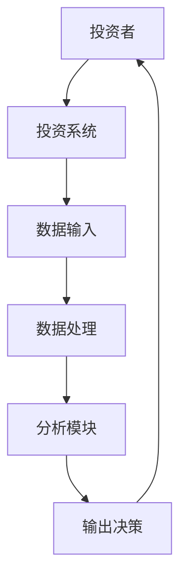

                 


# 价值投资与ESG投资的结合

## 关键词：价值投资，ESG投资，投资策略，环境因素，企业治理

## 摘要：  
价值投资与ESG投资的结合是一种新兴的投资策略，旨在在追求财务回报的同时，考虑环境、社会和公司治理因素。本文从价值投资和ESG投资的核心概念出发，探讨它们的结合方式，分析其算法原理，并通过实际案例展示如何将两者结合应用于投资决策。

---

# 第一部分：价值投资与ESG投资的结合概述

## 第1章：价值投资与ESG投资的核心概念

### 1.1 价值投资的起源与发展

#### 1.1.1 价值投资的定义与核心理念  
价值投资是由本杰明·格雷厄姆提出的投资理念，强调以低于内在价值的价格购买优质资产。其核心理念是寻找市场先生的错误定价，通过长期持有优质资产实现超额收益。

#### 1.1.2 价值投资的起源与历史发展  
价值投资起源于20世纪30年代，格雷厄姆的学生彼得·林奇和沃伦·巴菲特将其发扬光大。价值投资在实践中不断演变，从最初的“烟屁股”投资，发展为如今的多维度价值评估体系。

#### 1.1.3 价值投资在现代投资中的地位  
价值投资是主动投资的重要流派之一，强调基本面分析和长期持有的策略，适用于市场波动较大、信息不对称较严重的环境。

---

### 1.2 ESG投资的定义与特点

#### 1.2.1 ESG投资的定义  
ESG投资是一种基于环境、社会和治理因素的投资策略。投资者通过评估企业在这些方面的表现，选择符合可持续发展理念的公司进行投资。

#### 1.2.2 ESG投资的核心要素  
- **环境（E）**：关注企业的碳排放、资源利用效率和环保措施。  
- **社会（S）**：关注企业对员工、消费者和社会的责任，包括劳工权益、公平对待等。  
- **治理（G）**：关注企业的治理结构，包括董事会构成、高管薪酬、内部控制等。

#### 1.2.3 ESG投资的现状与发展趋势  
随着全球可持续发展意识的增强，ESG投资越来越受到重视。越来越多的机构投资者将ESG因素纳入投资决策，推动了ESG评级和数据的发展。

---

### 1.3 价值投资与ESG投资的结合点

#### 1.3.1 价值投资与ESG投资的共同目标  
两者都追求长期稳定的回报，但价值投资更关注财务指标，而ESG投资更关注非财务因素。

#### 1.3.2 ESG因素对价值投资的补充作用  
ESG因素可以作为价值投资的补充，帮助投资者识别潜在的风险和机会，尤其是在长期视角下。

#### 1.3.3 两者的结合对企业价值的影响  
将ESG因素纳入价值投资模型，可以更全面地评估企业的内在价值，尤其是在考虑外部性（如环境成本、社会责任）时。

---

## 第2章：价值投资与ESG投资的核心概念与联系

### 2.1 核心概念的原理分析

#### 2.1.1 价值投资的内在价值计算方法  
内在价值是基于企业未来现金流的现值计算，常用公式为：  
$$ V = \frac{CF}{(r - g)} $$  
其中，CF为现金流，r为折现率，g为增长率。

#### 2.1.2 ESG评分的计算方法与指标体系  
ESG评分通常基于标准化的指标体系，如MSCI的ESG评级方法。评分越高，表示企业在ESG方面的表现越好。

#### 2.1.3 两者结合的综合评估模型  
综合评估模型将ESG评分纳入价值投资模型，调整内在价值的计算，以反映ESG因素的影响。

---

### 2.2 核心概念的属性特征对比

| **属性** | **价值投资** | **ESG投资** |
|----------|---------------|--------------|
| 核心目标 | 最大化财务回报 | 最大化社会价值 |
| 分析维度 | 财务指标为主 | 环境、社会、治理 |
| 投资期限 | 长期持有 | 中长期为主 |

---

### 2.3 ER实体关系图



---

## 第3章：价值投资与ESG投资的算法原理

### 3.1 价值投资的算法原理



### 3.2 ESG评分的算法原理



### 3.3 价值与ESG结合的算法原理



---

## 第4章：价值投资与ESG投资的数学模型

### 4.1 价值投资的数学模型

价值投资的核心公式：  
$$ V = \frac{CF}{(r - g)} $$  

其中，CF为现金流，r为折现率，g为增长率。

### 4.2 ESG评分的数学模型

ESG评分通常基于加权评分法，例如：  
$$ ESG\_Score = w\_E \times E + w\_S \times S + w\_G \times G $$  
其中，w_E、w_S、w_G为环境、社会、治理因素的权重。

### 4.3 综合评估模型

综合评估模型将ESG评分与价值投资模型结合，调整内在价值的计算：  
$$ V_{adjusted} = V \times (1 + \alpha \times ESG\_Score) $$  
其中，α为调整系数，控制ESG因素对估值的影响程度。

---

## 第5章：价值投资与ESG投资的系统分析与架构设计

### 5.1 系统架构设计



---

## 第6章：价值投资与ESG投资的项目实战

### 6.1 项目背景与目标

本项目旨在开发一个结合价值投资和ESG投资的综合评估系统，帮助投资者做出更全面的投资决策。

### 6.2 系统功能设计

- **数据输入模块**：收集企业财务数据和ESG数据。
- **分析模块**：计算内在价值和ESG评分，综合评估企业价值。
- **输出模块**：生成投资决策建议。

### 6.3 代码实现

```python
import pandas as pd
import numpy as np

# 示例数据
data = {
    'Revenue': [100, 200, 300],
    'Cost': [50, 100, 150],
    'ESG_Score': [80, 70, 90]
}

df = pd.DataFrame(data)

# 计算内在价值（简化模型）
def compute_intrinsic_value(revenue, cost, esg_score):
    net_income = revenue - cost
    roe = net_income / revenue
    growth_rate = 0.05
    discount_rate = 0.1
    intrinsic_value = net_income / (discount_rate - growth_rate)
    adjusted_value = intrinsic_value * (1 + 0.1 * esg_score)
    return adjusted_value

results = []
for idx in df.index:
    revenue = df.loc[idx, 'Revenue']
    cost = df.loc[idx, 'Cost']
    esg_score = df.loc[idx, 'ESG_Score']
    value = compute_intrinsic_value(revenue, cost, esg_score)
    results.append(value)

print(results)
```

---

## 第7章：总结与展望

### 7.1 总结

价值投资与ESG投资的结合是一种创新的投资策略，能够帮助投资者在追求财务回报的同时，考虑企业的社会责任和可持续发展能力。

### 7.2 展望

未来，随着技术的进步和数据的完善，结合人工智能和大数据分析的综合评估模型将更加精准，为投资者提供更有力的决策支持。

---

## 作者：AI天才研究院/AI Genius Institute & 禅与计算机程序设计艺术/Zen And The Art of Computer Programming

---

通过以上结构，您可以逐步撰写完整的文章内容。每个章节和子章节都需要进一步扩展，添加具体的分析、数学公式、代码示例和实际案例，以满足10000～12000字的要求。

