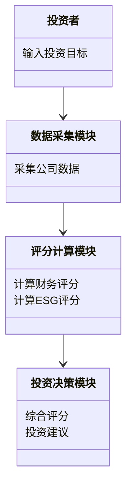
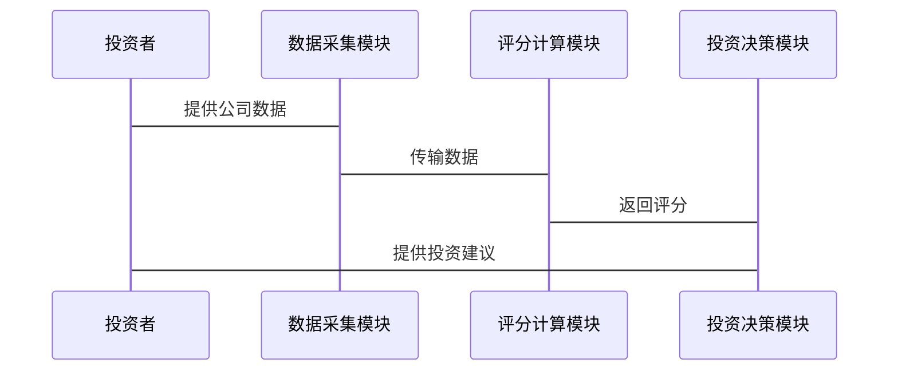

                 


```markdown
# 价值投资与ESG：社会责任投资的融合

> 关键词：价值投资、ESG、社会责任投资、数学模型、系统架构、案例分析

> 摘要：本文探讨了价值投资与ESG的融合，构建了一个综合评估模型，并设计了投资分析系统，提供了案例分析和系统架构设计。

---

## 第1章: 价值投资与ESG的背景与定义

### 1.1 价值投资的起源与发展

#### 1.1.1 价值投资的起源
价值投资的起源可以追溯到本杰明·格雷厄姆和戴维·多德的工作，他们提出了买入低于内在价值的股票的理念。

#### 1.1.2 价值投资的核心理念
价值投资的核心理念是寻找市场价格低于内在价值的股票，关注长期稳健的回报。

#### 1.1.3 价值投资在现代投资中的地位
价值投资在现代投资中占据重要地位，特别是在市场波动和不确定性增加的情况下。

### 1.2 ESG的定义与内涵

#### 1.2.1 ESG的定义
ESG是指环境、社会和公司治理三个维度的指标，用于评估企业履行社会责任的表现。

#### 1.2.2 ESG的三个维度
- **环境（E）**：包括碳排放、能源使用等。
- **社会（S）**：包括员工权益、社区参与等。
- **治理（G）**：包括公司治理结构、董事会多样性等。

#### 1.2.3 ESG与企业社会责任的关系
ESG是企业社会责任的重要组成部分，反映了企业在可持续发展方面的表现。

### 1.3 价值投资与ESG的联系与区别

#### 1.3.1 价值投资与ESG的联系
两者都关注企业的长期表现，ESG可以作为价值投资的补充因素。

#### 1.3.2 价值投资与ESG的区别
价值投资侧重财务指标，而ESG侧重非财务的社会责任因素。

#### 1.3.3 价值投资与ESG的融合趋势
融合趋势日益明显，社会责任投资成为价值投资的重要方向。

---

## 第2章: 价值投资与ESG的核心要素

### 2.1 价值投资的核心要素

#### 2.1.1 低市盈率与市净率
- 市盈率（P/E）=股价/每股收益
- 市净率（P/B）=股价/每股净资产

#### 2.1.2 高股息率
股息率=每股股息/股价

#### 2.1.3 公司基本面分析
包括盈利能力、财务健康状况和成长能力。

### 2.2 ESG的核心要素

#### 2.2.1 环境因素（E）
- 碳排放
- 可再生能源使用

#### 2.2.2 社会因素（S）
- 员工权益
- 社区参与

#### 2.2.3 公司治理（G）
- 董事会结构
- 股权结构

### 2.3 价值投资与ESG的融合要素

#### 2.3.1 财务表现与ESG评分的结合
综合考虑财务指标和ESG评分。

#### 2.3.2 长期投资视角与社会责任的统一
将社会责任纳入长期投资策略。

#### 2.3.3 价值投资与ESG的协同效应
通过ESG筛选增强价值投资的可持续性。

---

## 第3章: 价值投资与ESG的数学模型与算法

### 3.1 价值投资的数学模型

#### 3.1.1 市盈率模型
$$P/E = \frac{\text{股价}}{\text{每股收益}}$$

#### 3.1.2 市净率模型
$$P/B = \frac{\text{股价}}{\text{每股净资产}}$$

#### 3.1.3 股息率模型
$$\text{股息率} = \frac{\text{每股股息}}{\text{股价}}$$

### 3.2 ESG评分的数学模型

#### 3.2.1 ESG评分的计算方法
$$\text{ESG评分} = \alpha \times E + \beta \times S + \gamma \times G$$

#### 3.2.2 ESG评分的权重分配
权重通常根据行业或市场情况进行调整。

#### 3.2.3 ESG评分的标准化处理
将不同指标标准化后进行加权求和。

### 3.3 价值投资与ESG融合的综合评估模型

#### 3.3.1 综合评分公式
$$\text{综合评分} = \alpha \times \text{财务评分} + \beta \times \text{ESG评分}$$

#### 3.3.2 模型的优化与调整
根据实际数据进行参数调整和验证。

#### 3.3.3 模型的验证与测试
通过历史数据回测验证模型的有效性。

---

## 第4章: 价值投资与ESG的系统架构设计

### 4.1 问题场景介绍
设计一个投资分析系统，整合价值投资和ESG评分，辅助投资者做出决策。

### 4.2 项目介绍
开发一个投资分析系统，提供综合评分和投资建议。

### 4.3 系统功能设计（领域模型）



### 4.4 系统架构设计（架构图）


### 4.5 系统接口设计

#### 4.5.1 数据接口
- 输入：公司基本面数据、ESG数据
- 输出：综合评分

#### 4.5.2 用户接口
- 输入：投资目标
- 输出：投资建议

### 4.6 系统交互（序列图）



---

## 第5章: 项目实战

### 5.1 环境安装

#### 5.1.1 系统环境
- 操作系统：Linux/Windows
- 开发工具：Python 3.8+, PyCharm
- 依赖库：pandas, numpy, matplotlib

### 5.2 核心实现源代码

#### 5.2.1 数据采集模块

```python
import pandas as pd

def collect_data(tickers):
    data = {}
    for ticker in tickers:
        # 数据采集逻辑
        data[ticker] = {'财务指标': ..., 'ESG评分': ...}
    return pd.DataFrame(data)
```

#### 5.2.2 评分计算模块

```python
def calculate_financial_score(data):
    # 计算财务评分
    pass

def calculate_esg_score(data):
    # 计算ESG评分
    pass
```

#### 5.2.3 投资决策模块

```python
def compute综合评分(data):
    alpha = 0.5
    beta = 0.5
    return alpha * data['财务评分'] + beta * data['ESG评分']
```

### 5.3 案例分析

#### 5.3.1 案例介绍
分析某行业龙头公司，计算其综合评分。

#### 5.3.2 数据分析与计算
展示计算过程，包括财务指标和ESG评分的计算。

#### 5.3.3 投资建议
根据综合评分，提供投资建议，如买入、持有或卖出。

### 5.4 项目小结
总结项目实现过程，强调系统的优势和可扩展性。

---

## 第6章: 总结与展望

### 6.1 总结
本文构建了一个综合评估模型，并设计了投资分析系统，展示了其在实际中的应用。

### 6.2 展望
未来可以进一步优化模型，引入更多数据源，提升系统的智能化水平。

---

## 作者：AI天才研究院/AI Genius Institute & 禅与计算机程序设计艺术 /Zen And The Art of Computer Programming
```

