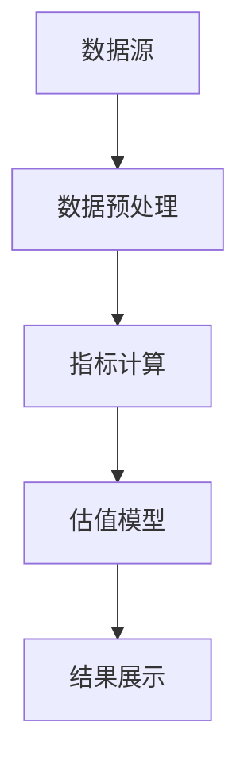

                 


# 价值投资与公司并购策略

> 关键词：价值投资、公司并购、投资策略、财务分析、并购估值、风险管理

> 摘要：本文系统地探讨了价值投资与公司并购的策略，结合财务分析和估值模型，评估并购风险，结合实际案例，提供系统的策略建议。

---

# 第一部分: 价值投资与公司并购的背景与概念

## 第1章: 价值投资的定义与核心理念

### 1.1 价值投资的起源与发展

- 1.1.1 价值投资的起源：本杰明·格雷厄姆与戴维·多德的理论基础。
- 1.1.2 价值投资的发展：从基本面分析到量化投资的演变。
- 1.1.3 价值投资的核心理念：寻找市场定价错误的企业。

### 1.2 公司并购的基本概念

- 1.2.1 公司并购的定义：企业之间的合并与收购行为。
- 1.2.2 并购的类型：横向并购、纵向并购、混合并购。
- 1.2.3 并购的动机：战略协同、市场扩展、资源获取。

### 1.3 价值投资与公司并购的关联性

- 1.3.1 价值投资在并购中的作用：识别低估企业，创造并购机会。
- 1.3.2 并购对投资价值的影响：协同效应提升企业价值。
- 1.3.3 两者的协同效应：并购作为价值实现的手段。

## 第2章: 价值投资的分析框架

### 2.1 财务分析的核心指标

- 2.1.1 资产负债表分析：评估企业的财务健康状况。
- 2.1.2 利润表分析：衡量企业的盈利能力。
- 2.1.3 现金流量表分析：分析企业的现金流健康。

### 2.2 估值方法的分类与选择

- 2.2.1 相对估值法：市盈率、市净率、EV/EBITDA等指标。
- 2.2.2 绝对估值法：DCF模型、股利折现模型。
- 2.2.3 市场情绪与估值偏差：如何识别市场过度反应。

### 2.3 价值投资的选股策略

- 2.3.1 低市盈率策略：寻找被低估的企业。
- 2.3.2 低市净率策略：关注资产净值与股价的差异。
- 2.3.3 高股息率策略：稳定收益与价值发现。

## 第3章: 公司并购的策略与风险

### 3.1 公司并购的动因分析

- 3.1.1 战略协同效应：提升整体竞争力。
- 3.1.2 市场扩展需求：拓展市场份额。
- 3.1.3 资源整合动机：获取技术、品牌或渠道。

### 3.2 公司并购的估值与定价

- 3.2.1 并购定价方法：账面价值、市场价值、协同价值。
- 3.2.2 协同效应评估：成本节约、收入增长。
- 3.2.3 并购溢价：合理溢价与市场反应。

### 3.3 并购风险的识别与管理

- 3.3.1 行业风险：市场波动与政策变化。
- 3.3.2 财务风险：债务负担与盈利稳定性。
- 3.3.3 经营整合风险：文化冲突与管理挑战。

---

# 第四部分: 价值投资与公司并购的策略结合

## 第4章: 价值投资与公司并购的协同效应

### 4.1 并购中的价值投资策略

- 4.1.1 寻找低估企业：识别并购标的的潜在价值。
- 4.1.2 协同效应预测：评估并购后的价值提升空间。

### 4.2 并购后的整合策略

- 4.2.1 组织架构整合：优化管理结构。
- 4.2.2 资源共享：提升运营效率。
- 4.2.3 文化融合：确保整合顺利进行。

### 4.3 并购中的风险管理

- 4.3.1 并购前的尽职调查：识别潜在问题。
- 4.3.2 并购后的监控机制：及时调整策略。

---

# 第五部分: 算法与数学模型

## 第5章: 价值投资中的算法与数学模型

### 5.1 DCF模型的算法原理

- 5.1.1 DCF模型概述：现金流折现的基本原理。
- 5.1.2 现金流预测：如何估计未来现金流。
- 5.1.3 折现率计算：使用CAPM模型确定折现率。

### 5.2 并购估值的数学公式

- 5.2.1 企业价值公式：EV = EBITDA × 倍数。
- 5.2.2 股权价值公式：Equity Value = EV - Debt。
- 5.2.3 协同效应公式：协同价值 = A + B - C。

---

# 第六部分: 系统架构与项目实战

## 第6章: 系统架构设计

### 6.1 系统功能设计

- 6.1.1 数据收集模块：获取企业财务数据。
- 6.1.2 指标计算模块：计算市盈率、市净率等指标。
- 6.1.3 估值模型模块：实现DCF模型等算法。

### 6.2 系统架构图



### 6.3 接口设计与交互

- 6.3.1 数据接口：API获取企业数据。
- 6.3.2 用户界面：可视化展示估值结果。

---

# 第七部分: 项目实战

## 第7章: 项目实战与案例分析

### 7.1 环境安装

- 7.1.1 安装Python：`pip install numpy pandas matplotlib`

### 7.2 核心代码实现

```python
import numpy as np
import pandas as pd

def discounted_cash_flow(cash_flows, discount_rate):
    return sum(cash_flows / (1 + discount_rate) ** i for i, cash_flows in enumerate(cash_flows))

# 示例数据
cash_flows = [100, 150, 200]
discount_rate = 0.08

value = discounted_cash_flow(cash_flows, discount_rate)
print(f"DCF Value: {value}")
```

### 7.3 案例分析

- 7.3.1 某公司并购案例：分析其估值与整合过程。
- 7.3.2 案例总结：成功与失败的教训。

---

# 第八部分: 总结与展望

## 第8章: 总结与未来研究方向

### 8.1 本章小结

- 总结价值投资与公司并购的核心策略。
- 强调财务分析与估值模型的重要性。

### 8.2 未来研究方向

- 结合人工智能优化估值模型。
- 研究并购中的文化整合问题。

---

# 作者

作者：AI天才研究院 & 禅与计算机程序设计艺术

