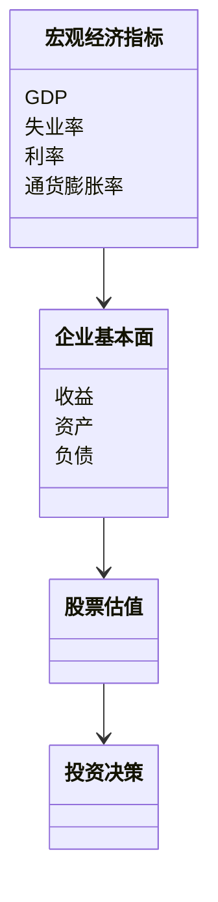

                 


# 价值投资与宏观经济的关系

> 关键词：价值投资，宏观经济，经济周期，现金流贴现模型，投资策略

> 摘要：本文探讨了价值投资与宏观经济之间的关系，分析了宏观经济指标对价值投资策略的影响，以及如何通过宏观经济分析优化投资决策。文章从理论基础、算法原理、系统架构设计到实战案例，详细阐述了价值投资与宏观经济的关系。

---

## 第1章: 价值投资与宏观经济的关系概述

### 1.1 价值投资的基本概念

#### 1.1.1 价值投资的定义
价值投资是一种投资策略，强调以低于内在价值的价格购买优质资产。其核心在于识别市场低估的股票，并长期持有，等待其价值回归。

#### 1.1.2 价值投资的核心理念
- 市场先生理论：市场情绪波动会影响股票价格，但长期来看，价格会回归其内在价值。
- 安全边际：购买价格与内在价值的差距，作为投资的安全垫。
- 长期持有：价值投资者倾向于长期持有优质资产，而非频繁交易。

#### 1.1.3 价值投资与宏观经济的关联
价值投资的内在价值计算依赖于宏观经济环境。GDP增长、利率水平、通货膨胀等因素都会影响企业的盈利能力，从而影响其内在价值。

---

### 1.2 宏观经济的基本概念

#### 1.2.1 宏观经济的定义
宏观经济研究整体经济系统，包括GDP、失业率、通货膨胀率等指标，分析经济运行的规律和趋势。

#### 1.2.2 宏观经济的主要指标
- **GDP**：国内生产总值，衡量一个国家或地区的经济规模。
- **失业率**：反映劳动力市场的健康状况。
- **通货膨胀率**：物价水平的上涨速度。
- **利率**：影响企业和个人的借贷成本。

#### 1.2.3 宏观经济与价值投资的关系
宏观经济指标影响企业的盈利能力、股票估值和市场情绪。例如，低利率环境可能推高股票估值，而高通货膨胀可能侵蚀企业利润。

---

## 第2章: 价值投资的理论基础

### 2.1 投资学基础理论

#### 2.1.1 现金流贴现模型
现金流贴现模型（DCF模型）是价值投资的核心工具，用于估算股票的内在价值。

- **公式**：$$ \text{内在价值} = \sum_{t=1}^{\infty} \frac{\text{现金流}_t}{(1 + r)^t} $$
- 其中，\( r \) 是折现率，通常基于宏观经济环境和市场利率确定。

#### 2.1.2 股票定价理论
股票价格反映市场对该公司未来现金流的预期。宏观经济环境会影响市场对这些现金流的贴现率。

#### 2.1.3 投资组合理论
通过分散投资降低风险，宏观经济环境影响资产之间的相关性。

---

### 2.2 价值投资的核心理论

#### 2.2.1 格雷厄姆的价值投资理论
本杰明·格雷厄姆强调安全边际和内在价值，认为市场先生是不可预测的。

#### 2.2.2 巴菲特的投资哲学
沃伦·巴菲特强调企业护城河和长期竞争优势，认为投资是部分所有权的转移。

#### 2.2.3 股票的内在价值评估
内在价值是企业未来现金流的现值，宏观经济环境影响贴现率和未来现金流。

---

### 2.3 宏观经济与价值投资的结合

#### 2.3.1 宏观经济环境对股票估值的影响
- **经济增长**：GDP增长可能提高企业盈利，推高股票估值。
- **利率变化**：低利率环境可能降低贴现率，提高股票估值。
- **通货膨胀**：高通胀可能侵蚀企业利润，降低股票估值。

#### 2.3.2 经济周期与价值投资策略
在不同的经济周期阶段，价值投资策略应相应调整：
- **衰退期**：寻找估值低的股票。
- **复苏期**：关注基本面改善的股票。
- **过热期**：谨慎投资，避免高估股票。
- **滞胀期**：注重防御性股票。

---

## 第3章: 宏观经济指标与价值投资

### 3.1 宏观经济指标的分类

#### 3.1.1 GDP与GDP平减指数
GDP衡量经济规模，GDP平减指数衡量价格水平。两者结合可以分析实际经济增长。

#### 3.1.2 失业率与劳动力市场
低失业率可能推高消费，进而影响企业盈利和股票估值。

#### 3.1.3 利率与货币政策
中央银行的利率政策直接影响市场利率和股票估值。

#### 3.1.4 通货膨胀率与物价水平
高通胀可能导致企业利润下降，影响股票内在价值。

---

### 3.2 宏观经济指标对价值投资的指导意义

#### 3.2.1 GDP增长与股市表现
经济增长通常带来企业盈利增长，推动股市上涨。

#### 3.2.2 利率变化对股市的影响
低利率环境可能降低贴现率，推高股票估值；高利率环境可能抑制股市表现。

#### 3.2.3 通货膨胀与股票估值
高通胀可能导致企业利润下降，影响股票估值。

---

## 第4章: 经济周期与价值投资策略

### 4.1 经济周期的定义与阶段划分

#### 4.1.1 经济周期的四个阶段
- **衰退期**：经济活动下降，企业盈利减少。
- **复苏期**：经济开始复苏，企业盈利逐步恢复。
- **过热期**：经济过热，企业盈利增长快。
- **滞胀期**：经济增长停滞，通胀高企。

### 4.2 经济周期对价值投资策略的影响

#### 4.2.1 衰退期的价值投资策略
- 寻找估值低的股票，注重安全边际。
- 关注具有强大竞争优势的企业。

#### 4.2.2 复苏期的价值投资策略
- 逐步增加投资，关注基本面改善的企业。
- 选择具有增长潜力的行业。

#### 4.2.3 过热期的价值投资策略
- 谨慎投资，避免高估股票。
- 关注防御性行业，如公用事业。

#### 4.2.4 滞胀期的价值投资策略
- 选择具有抗通胀能力的企业。
- 关注现金流稳定的企业。

---

## 第5章: 宏观经济与价值投资的系统架构设计

### 5.1 问题场景介绍
在宏观经济波动的环境下，如何利用价值投资策略优化投资组合，降低风险，提高收益。

### 5.2 领域模型类图


### 5.3 系统架构设计


### 5.4 系统接口设计
- 数据接口：从宏观经济数据库获取指标数据。
- 投资决策接口：根据分析结果生成投资建议。
- 风险评估接口：评估宏观经济风险对投资组合的影响。

---

## 第6章: 项目实战

### 6.1 环境安装
- 安装Python和相关库（Pandas、NumPy、Scikit-learn）。
- 安装宏观经济数据接口（如Yahoo Finance API）。

### 6.2 核心代码实现

#### 6.2.1 现金流贴现模型
```python
def discounted_cash_flow(cash_flows, discount_rate):
    return sum(c / (1 + discount_rate) ** t for t, c in enumerate(cash_flows))
```

#### 6.2.2 经济周期分析
```python
import pandas as pd

def get_macro_data(ticker):
    # 获取宏观经济数据
    pass

def analyze_economic_cycle(macro_data):
    # 分析经济周期阶段
    pass
```

### 6.3 实际案例分析

#### 6.3.1 案例背景
分析某企业在不同经济周期下的价值投资策略。

#### 6.3.2 数据分析
使用现金流贴现模型计算股票的内在价值，并结合宏观经济指标制定投资策略。

---

## 第7章: 总结与展望

### 7.1 小结
价值投资与宏观经济密切相关，宏观经济环境影响股票估值和投资策略。投资者应根据经济周期调整投资策略，注重安全边际和长期价值。

### 7.2 注意事项
- 宏观经济指标可能滞后，影响投资决策的及时性。
- 宏观经济预测具有不确定性，投资决策需谨慎。

### 7.3 拓展阅读
- 格雷厄姆的《证券分析》
- 巴菲特的股东信
- 凯恩斯的《就业、利息与货币通论》

---

## 作者
作者：AI天才研究院 & 禅与计算机程序设计艺术

---

通过以上结构，我们可以系统地分析价值投资与宏观经济的关系，从理论到实践，全面指导投资者如何在宏观经济波动中优化投资策略。

