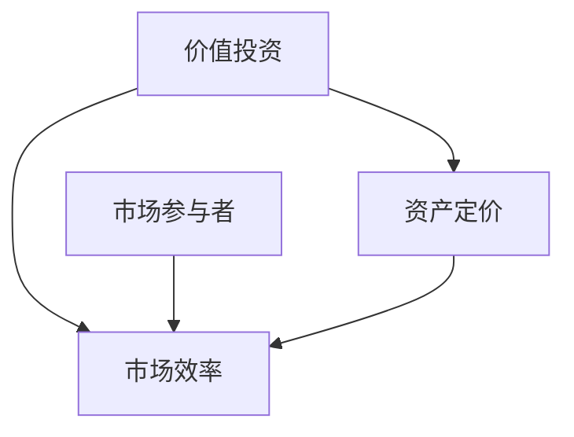
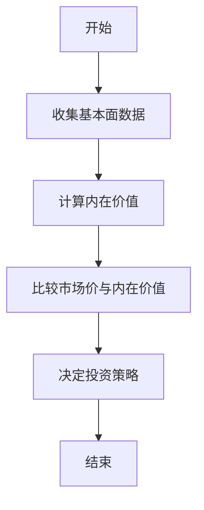
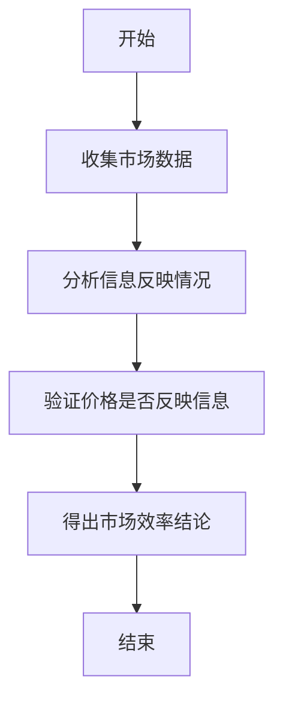

                 


# 价值投资与市场效率假说的关系

## 关键词：价值投资、市场效率假说、投资策略、资产定价、市场均衡

## 摘要：本文探讨了价值投资与市场效率假说之间的关系，分析了价值投资的数学模型与算法原理，以及市场效率假说对价值投资策略的影响。通过案例分析和系统设计，展示了如何在实际投资中应用这些理论。

---

## 第一部分：价值投资与市场效率假说的背景介绍

### 第1章：价值投资的核心概念

#### 1.1 价值投资的定义与背景
价值投资是一种长期投资策略，强调购买被市场低估的资产。其核心在于分析企业的基本面，如盈利能力、财务状况和行业地位。价值投资的背景可以追溯到本杰明·格雷厄姆和戴维·多德的理论，他们提出了“安全边际”概念，即购买价格低于内在价值的资产，以降低风险。

#### 1.2 市场效率假说的基本概念
市场效率假说认为，资产价格反映了所有可获得的信息。市场分为三种类型：弱效率（仅反映历史价格）、半强效率（反映公开信息）和强效率（反映所有信息）。市场效率假说的核心是，价格已经反映了所有相关信息，因此投资者无法通过分析获得超额收益。

### 第2章：价值投资与市场效率假说的联系与区别

#### 2.1 核心概念的属性对比
| 属性           | 价值投资                | 市场效率假说          |
|----------------|-------------------------|-----------------------|
| 核心目标       | 寻找被低估的资产         | 确保价格反映信息       |
| 分析方法       | 基于基本面分析           | 基于信息反映效率       |
| 投资策略       | 长期持有优质资产         | 短期交易或套利         |
| 市场假设       | 市场可能存在无效定价      | 市场定价有效           |

#### 2.2 ER实体关系图


---

## 第二部分：价值投资与市场效率假说的理论分析

### 第3章：价值投资的数学模型与公式

#### 3.1 价值投资的数学模型
股票的内在价值可以通过现金流折现法计算：
$$ V = \frac{CF}{(r - g) } $$
其中，CF是未来现金流，r是折现率，g是增长率。

#### 3.2 市场效率假说的数学模型
市场均衡模型：
$$ P = \frac{CF}{(r - g) } $$
其中，P是市场价格，CF是未来现金流，r是折现率，g是增长率。

---

### 第4章：价值投资与市场效率假说的算法原理

#### 4.1 价值投资算法流程图


#### 4.2 市场效率假说的验证算法


---

## 第三部分：价值投资与市场效率假说的系统架构

### 第5章：系统架构设计

#### 5.1 问题场景介绍
在金融市场中，投资者需要判断市场是否有效，以决定是否采用价值投资策略。市场效率影响价值投资的可行性，因为如果市场有效，价值投资可能难以获得超额收益。

#### 5.2 系统功能设计
- 数据收集模块：收集资产的历史价格和基本面数据。
- 模型计算模块：计算内在价值和市场价格。
- 比较分析模块：比较内在价值与市场价格，判断是否存在低估资产。
- 投资决策模块：根据分析结果制定投资策略。

#### 5.3 系统架构图


---

## 第四部分：价值投资与市场效率假说的项目实战

### 第6章：项目实战分析

#### 6.1 环境安装
需要安装Python和相关库（如Pandas、NumPy、Matplotlib）。

#### 6.2 核心实现代码
```python
import pandas as pd
import numpy as np

# 计算内在价值
def calculate_intrinsic_value(CF, r, g):
    return CF / (r - g)

# 计算市场价格
def calculate_market_price(prices):
    return prices.mean()

# 比较分析
def value_investing_analysis(CF, r, g, prices):
    IV = calculate_intrinsic_value(CF, r, g)
    MP = calculate_market_price(prices)
    if IV > MP:
        return "买入信号"
    else:
        return "无信号"

# 示例数据
CF = 100
r = 0.1
g = 0.05
prices = pd.Series([50, 55, 60, 65, 70])

# 分析结果
result = value_investing_analysis(CF, r, g, prices)
print("分析结果:", result)
```

#### 6.3 案例分析
假设某股票的历史价格为[50, 55, 60, 65, 70]，计算其市场价格和内在价值。如果内在价值高于市场价格，则发出买入信号。

---

## 第五部分：价值投资与市场效率假说的总结与展望

### 第7章：总结与展望

#### 7.1 核心结论
- 价值投资在市场效率较低的情况下更有效。
- 市场效率假说为价值投资提供了理论基础，但实际应用中需考虑市场环境。

#### 7.2 最佳实践 tips
- 在市场效率较低时，价值投资更有可能成功。
- 结合技术分析和基本面分析，提高投资决策的准确性。

#### 7.3 项目小结
通过数学模型和系统设计，我们展示了如何在实际投资中应用价值投资与市场效率假说。案例分析和代码实现进一步验证了理论的可行性。

---

## 附录

### 附录A：参考文献
1. 格雷厄姆, B. (1974). 《价值投资入门》。
2. Fama, E. (1970). The Efficient Market Hypothesis and Its Critics.

### 附录B：工具与库
- Python
- Pandas
- NumPy
- Matplotlib

---

## 作者：AI天才研究院 & 禅与计算机程序设计艺术

---

这篇文章通过理论分析、系统设计和实际案例，详细探讨了价值投资与市场效率假说的关系。希望对读者在投资决策和市场分析中提供有价值的参考。

