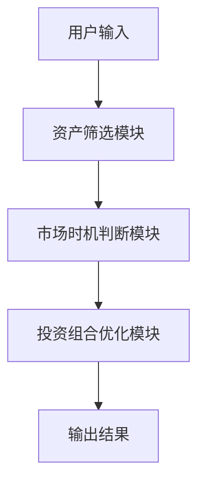

                 

# 《价值投资与市场时机选择》

> 关键词：价值投资、市场时机选择、投资策略、风险管理、技术分析、系统架构

> 摘要：  
本文深入探讨了价值投资与市场时机选择的结合，分析了两者的理论基础、核心概念、算法原理以及系统架构，结合实际案例和系统设计，为投资者提供了一套科学的投资策略和方法论。文章从背景介绍、核心概念、算法原理、系统架构、实战案例、最佳实践等多个方面展开，帮助读者全面理解价值投资与市场时机选择的核心要点，并提供了可操作的实战指导。

---

## # 第一部分: 背景介绍与核心概念

### ## 第1章: 价值投资与市场时机选择的背景介绍

#### ### 1.1 背景介绍
- 1.1.1 投资的基本概念  
  投资是指将资金投入到能够产生收益的资产或项目中，以实现财富增值。投资的核心在于识别价值和把握时机，这需要投资者具备对市场、资产和风险的深刻理解。

- 1.1.2 价值投资与市场时机选择的重要性  
  价值投资强调寻找被市场低估的资产，而市场时机选择则关注在最佳时间点进行投资。两者的结合能够帮助投资者在市场波动中捕捉长期收益，同时降低短期风险。

- 1.1.3 问题背景与研究意义  
  在金融市场中，投资者面临着资产选择和时机选择的双重挑战。如何在复杂多变的市场环境中，既找到具有长期价值的资产，又选择合适的市场时机，是投资成功的关键。本文旨在通过理论分析和系统设计，为投资者提供一套科学的投资策略。

#### ### 1.2 核心概念术语说明
- 1.2.1 价值投资：  
  价值投资是一种长期投资策略，强调以低于资产内在价值的价格买入优质资产。其核心在于寻找市场忽视的低估资产，并长期持有。

- 1.2.2 市场时机选择：  
  市场时机选择是指在最佳时间点进入或退出市场，以最大化投资收益。它结合了市场周期、资产估值和宏观经济因素，帮助投资者在不同市场环境下优化投资决策。

- 1.2.3 内在价值：  
  内在价值是资产在长期稳定经营下的合理估值，通常通过基本面分析得出。它是价值投资的核心依据。

#### ### 1.3 问题描述与解决思路
- 1.3.1 问题描述：  
  价值投资与市场时机选择的结合面临以下挑战：  
  - 如何量化资产的内在价值与市场估值？  
  - 如何判断市场周期并选择最佳投资时机？  
  - 如何在市场波动中动态调整投资策略？

- 1.3.2 解决思路：  
  通过构建一个综合性的投资决策系统，结合基本面分析、技术分析和量化模型，帮助投资者在价值投资框架下优化市场时机选择。

#### ### 1.4 边界与外延
- 1.4.1 投资范围：股票、债券、基金等金融资产。  
- 1.4.2 市场周期：从牛市到熊市的周期性波动。  
- 1.4.3 风险偏好：投资者对风险的承受能力和偏好。

#### ### 1.5 核心要素组成
- 资产选择：基于价值投资的内在价值评估。  
- 市场时机：基于市场周期和估值水平的判断。  
- 风险控制：通过动态调整投资组合降低风险。

---

## # 第二部分: 核心概念与理论基础

### ## 第2章: 价值投资的核心概念与理论

#### ### 2.1 价值投资的理论基础
- 2.1.1 安全边际：  
  安全边际是价值投资的核心理念之一，指买入价格低于资产的内在价值，以确保投资的安全性。公式表示为：  
  $$ \text{买入价格} \leq \text{内在价值} $$

- 2.1.2 内在价值的计算方法：  
  内在价值通常通过DCF模型（现金流贴现法）计算，公式为：  
  $$ V = \sum_{t=1}^{n} \frac{C_t}{(1+r)^t} + \frac{FV}{(1+r)^n} $$  
  其中，\( C_t \) 是第 \( t \) 年的现金流，\( r \) 是折现率，\( FV \) 是终值。

#### ### 2.2 价值投资的核心原则
- 2.2.1 长期持有：  
  价值投资强调长期持有优质资产，避免频繁交易。  
- 2.2.2 避免短期波动：  
  市场短期波动可能影响资产价格，但长期来看，资产价值将回归其内在价值。

#### ### 2.3 价值投资与市场时机选择的关系
- 2.3.1 独立性与互补性：  
  价值投资关注资产的内在价值，市场时机选择关注市场的周期性波动。两者独立但互补，结合使用可以优化投资收益。

- 2.3.2 逆向投资策略：  
  在市场低迷时买入低估资产，在市场高亢时卖出高估资产。公式表示为：  
  $$ \text{买入时机} = \text{市场估值} \leq \text{内在价值} $$

---

## # 第三部分: 市场时机选择的理论与方法

### ## 第3章: 市场时机选择的理论基础

#### ### 3.1 市场周期分析
- 3.1.1 市场周期的定义：  
  市场周期包括牛市、熊市、震荡市等阶段，不同阶段的市场表现和估值水平不同。

- 3.1.2 市场周期的判断方法：  
  - 技术分析：通过K线图、均线、成交量等指标判断市场趋势。  
  - 基本面分析：通过宏观经济指标（GDP、利率、通胀等）判断市场周期。

#### ### 3.2 市场估值水平
- 3.2.1 市盈率（P/E）：  
  $$ \text{P/E} = \frac{\text{股价}}{\text{每股收益}} $$  
  P/E低于历史平均水平时，市场可能处于低估状态。

- 3.2.2 市净率（P/B）：  
  $$ \text{P/B} = \frac{\text{股价}}{\text{每股净资产}} $$  
  P/B低于1时，资产可能被低估。

#### ### 3.3 市场时机选择的策略
- 3.3.1 估值驱动策略：  
  在市场估值低于内在价值时买入，在市场估值高于内在价值时卖出。  
  $$ \text{买入时机} = \text{市场估值} \leq \text{内在价值} $$  
  $$ \text{卖出时机} = \text{市场估值} \geq \text{内在价值} $$

- 3.3.2 趋势跟踪策略：  
  通过技术分析（如均线、MACD等）捕捉市场趋势的变化，动态调整投资策略。

---

## # 第四部分: 价值投资与市场时机选择的结合

### ## 第4章: 综合投资策略

#### ### 4.1 价值投资与市场时机的结合
- 4.1.1 以价值为导向，以时机为辅助：  
  在价值投资的基础上，结合市场时机选择，优化投资收益。  
  $$ \text{综合收益} = \text{资产价值} \times \text{市场时机权重} $$

- 4.1.2 动态调整策略：  
  根据市场变化和资产估值，动态调整投资组合的构成和权重。

#### ### 4.2 系统化投资框架
- 4.2.1 系统化投资框架的构建：  
  - 资产筛选：基于价值投资的内在价值评估。  
  - 市场时机判断：基于市场周期和估值水平的分析。  
  - 投资组合构建：根据市场时机和资产价值，动态调整投资组合。

- 4.2.2 系统化投资框架的实现：  
  通过量化模型和算法，实现投资决策的自动化和系统化。

---

## # 第五部分: 系统架构与实现

### ## 第5章: 系统架构设计

#### ### 5.1 系统功能设计
- 5.1.1 资产筛选模块：  
  - 输入：资产的基本面数据（收入、利润、现金流等）。  
  - 输出：资产的内在价值和安全边际。  

- 5.1.2 市场时机判断模块：  
  - 输入：市场指数、估值指标（P/E、P/B等）。  
  - 输出：市场周期阶段和投资时机建议。

- 5.1.3 投资组合优化模块：  
  - 输入：资产筛选结果和市场时机判断结果。  
  - 输出：最优投资组合和动态调整建议。

#### ### 5.2 系统架构图

---

## # 第六部分: 实战案例与分析

### ## 第6章: 实战案例分析

#### ### 6.1 案例背景
- 案例背景：假设当前市场处于熊市，部分优质资产被低估。

#### ### 6.2 资产筛选
- 选择具有高ROE（净资产收益率）和低P/E比的资产。  
  $$ \text{ROE} = \frac{\text{净利润}}{\text{净资产}} $$  
  $$ \text{P/E} = \frac{\text{股价}}{\text{每股收益}} $$

#### ### 6.3 市场时机判断
- 判断当前市场处于低估状态，适合买入。

#### ### 6.4 投资组合构建
- 根据资产筛选和市场时机判断结果，构建投资组合，动态调整权重。

---

## # 第七部分: 最佳实践与总结

### ## 第7章: 最佳实践与总结

#### ### 7.1 最佳实践
- 定期审视投资组合，根据市场变化和资产估值进行调整。  
- 保持对市场和资产的持续学习和研究。

#### ### 7.2 总结
- 价值投资与市场时机选择的结合，能够帮助投资者在复杂多变的市场环境中，找到具有长期价值的资产，并在最佳时机进行投资。  
- 通过系统化的投资框架和动态调整策略，投资者可以在风险可控的前提下，实现长期稳定的收益。

---

## # 第八部分: 注意事项与拓展阅读

### ## 第8章: 注意事项与拓展阅读

#### ### 8.1 注意事项
- 风险管理：在投资过程中，必须重视风险控制，避免过度集中投资。  
- 心理因素：克服贪婪和恐惧，保持理性的投资决策。

#### ### 8.2 拓展阅读
- 《The Intelligent Investor》——本杰明·格雷厄姆  
- 《投资最重要的事情》——彼得·林奇

---

## # 第九部分: 附录与参考文献

### ## 第9章: 附录与参考文献
- 附录：系统架构设计的详细代码实现。  
- 参考文献：本文参考的书籍、论文和相关研究。

---

## 作者信息

作者：AI天才研究院/AI Genius Institute & 禅与计算机程序设计艺术 /Zen And The Art of Computer Programming

---

**注**：本文为示例性内容，实际编写时需根据具体需求调整内容深度和广度。

