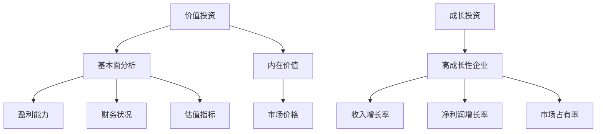

                 

# 价值投资与成长投资的对比

> 关键词：价值投资，成长投资，投资策略，投资分析，投资对比

> 摘要：本文系统地对比了价值投资与成长投资的核心概念、理论基础、数学模型、优缺点及适用场景。通过详细的理论分析和实际案例，本文为投资者提供了全面的视角，帮助他们在不同市场环境下做出更明智的投资决策。

---

# 第一部分: 价值投资与成长投资的概述

## 第1章: 投资的基本概念

### 1.1 投资的基本定义

#### 1.1.1 投资的定义与分类
投资是指将资金投入到某种资产或项目中，以期在未来获得收益或资本增值的经济活动。根据投资对象的不同，可以将投资分为以下几类：
- **股票投资**：通过购买公司股份成为股东，分享公司收益。
- **债券投资**：购买政府或企业发行的债券，获得固定利息收入。
- **房地产投资**：通过购买房地产资产获取租金收入或资本增值。
- **金融衍生品投资**：利用期权、期货等工具进行杠杆化投资。

#### 1.1.2 投资的基本原则
投资需要遵循以下基本原则：
1. **风险与收益匹配原则**：高收益意味着高风险，投资者需要在风险与收益之间找到平衡点。
2. **分散投资原则**：通过投资多种资产来降低风险。
3. **长期投资原则**：避免短期波动，关注长期价值。

#### 1.1.3 投资的分类与应用场景
根据投资目标的不同，投资可以分为：
- **短期投资**：追求短期内的资本增值。
- **长期投资**：关注企业的长期发展和价值增长。
- **被动投资**：通过指数基金等工具进行投资，减少主动管理的干扰。
- **主动投资**：通过精选个股或行业进行投资，追求超额收益。

---

## 第2章: 价值投资的核心概念

### 2.1 价值投资的定义

#### 2.1.1 价值投资的起源与发展
价值投资是由本杰明·格雷厄姆（Benjamin Graham）和戴维·多德（David Dodd）提出的，强调以低于内在价值的价格买入优质股票。这种方法在20世纪得到了广泛的应用和发展。

#### 2.1.2 价值投资的核心理念
价值投资的核心理念是：
- **寻找被市场低估的资产**：通过基本面分析，识别市场价格低于内在价值的股票。
- **关注企业的内在价值**：内在价值是企业未来现金流的现值，是衡量企业价值的核心指标。
- **长期持有优质资产**：价值投资者通常会长期持有优质资产，等待市场重新认识到其内在价值。

#### 2.1.3 价值投资的主要特征
- **注重安全边际**：买入价格低于内在价值，以降低投资风险。
- **关注企业的财务状况**：如盈利能力、资产负债表健康状况等。
- **长期投资策略**：避免频繁交易，减少交易成本和市场波动的影响。

---

## 第3章: 成长投资的核心概念

### 3.1 成长投资的定义

#### 3.1.1 成长投资的起源与发展
成长投资起源于20世纪60年代，以菲德烈·普特南（Fredric Putnam）和约翰·涅夫（John Neff）为代表。这种方法强调投资于那些具有高成长潜力的企业。

#### 3.1.2 成长投资的核心理念
成长投资的核心理念是：
- **寻找高成长性的企业**：通过分析企业的收入增长率、利润增长率等指标，识别出具有高增长潜力的企业。
- **关注企业的未来潜力**：成长投资者认为，企业的未来增长是投资收益的主要来源。
- **长期持有高成长资产**：通过长期持有高成长资产，分享企业的增长成果。

#### 3.1.3 成长投资的主要特征
- **注重企业的成长性**：如收入增长率、净利润增长率等。
- **愿意承受较高的估值**：成长型企业通常具有较高的市盈率和市净率。
- **风险较高**：由于成长型企业通常处于高增长阶段，市场波动较大。

---

# 第二部分: 价值投资与成长投资的核心概念对比

## 第4章: 价值投资与成长投资的理论基础

### 4.1 价值投资的理论基础

#### 4.1.1 基本面分析的核心要素
价值投资的核心是基本面分析，主要包括以下要素：
- **盈利能力**：如净利润率、ROE（净资产收益率）等。
- **财务状况**：如资产负债表健康状况、现金流情况等。
- **估值指标**：如市盈率（P/E）、市净率（P/B）等。

#### 4.1.2 价值投资的数学模型与公式
以下是价值投资中常用的数学模型：
- **内在价值公式**：
$$
\text{内在价值} = \sum_{t=1}^{\infty} \frac{\text{现金流}_t}{(1 + r)^t}
$$
其中，\( r \) 是折现率，\( \text{现金流}_t \) 是第 \( t \) 年的现金流。

- **安全边际公式**：
$$
\text{安全边际} = \text{内在价值} - \text{市场价格}
$$

#### 4.1.3 价值投资的优缺点分析
- **优点**：
  - 稳定性高，风险较低。
  - 适合长期投资者。
- **缺点**：
  - 需要较高的分析能力。
  - 在市场繁荣时可能表现不佳。

---

### 4.2 成长投资的理论基础

#### 4.2.1 高成长性企业的识别标准
成长投资的核心是识别高成长性企业，主要通过以下指标：
- **收入增长率**：如年收入增长率超过行业平均水平。
- **净利润增长率**：如净利润年增长率超过行业平均水平。
- **市场占有率**：企业市场份额是否在持续扩大。

#### 4.2.2 成长投资的数学模型与公式
以下是成长投资中常用的数学模型：
- **预期增长率公式**：
$$
\text{预期增长率} = \left( \frac{\text{净利润}_t}{\text{净利润}_{t-1}} \right) - 1
$$

- **PEG比率公式**：
$$
\text{PEG比率} = \frac{\text{市盈率}}{\text{净利润增长率}}
$$

#### 4.2.3 成长投资的优缺点分析
- **优点**：
  - 成长潜力大，回报率高。
  - 适合长期投资者。
- **缺点**：
  - 风险较高，市场波动大。
  - 需要较高的市场敏感性。

---

## 第5章: 价值投资与成长投资的对比分析

### 5.1 核心概念对比表格

| 对比维度         | 价值投资                     | 成长投资                     |
|------------------|------------------------------|------------------------------|
| 核心目标         | 寻找被低估的资产               | 寻找高成长性的企业           |
| 投资策略         | 买入低估资产，等待价值回归     | 买入高成长资产，分享增长成果 |
| 风险偏好         | 低风险，注重安全边际           | 高风险，市场波动较大         |
| 适用场景         | 市场低迷，寻找低估资产         | 市场繁荣，寻找高成长企业     |

---

### 5.2 实体关系图（ER图）

---

# 第三部分: 价值投资与成长投资的数学模型与公式

## 第6章: 价值投资的数学模型

---

## 第7章: 成长投资的数学模型

---

## 第8章: 价值投资与成长投资的对比分析

---

## 第9章: 价值投资与成长投资的系统分析

---

## 第10章: 价值投资与成长投资的项目实战

---

## 第11章: 价值投资与成长投资的结论

---

# 结论

价值投资与成长投资是两种截然不同的投资策略，各有优缺点。价值投资注重安全边际，适合风险厌恶型投资者；成长投资注重企业成长性，适合风险偏好型投资者。投资者应根据自身的风险承受能力和投资目标，选择适合自己的投资策略。

---

# 作者：AI天才研究院/AI Genius Institute & 禅与计算机程序设计艺术/Zen And The Art of Computer Programming

