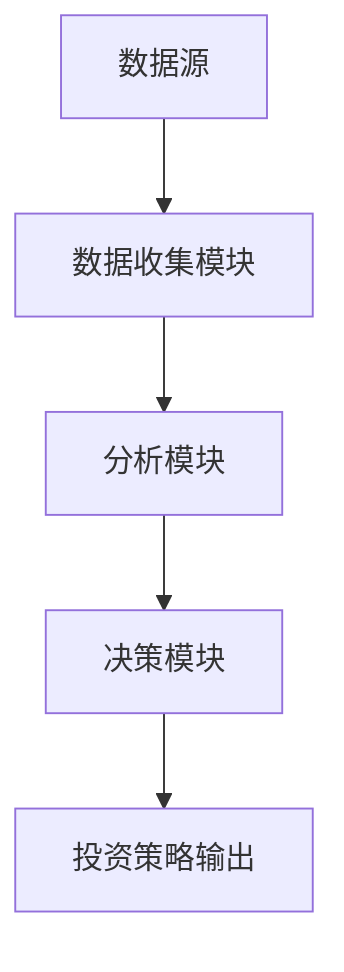

                 


# 价值投资与行为金融学：心理偏差的识别与克服

## 关键词：价值投资，行为金融学，心理偏差，决策框架，投资策略，风险管理

## 摘要：  
本文探讨了价值投资与行为金融学的结合，重点分析了心理偏差对投资决策的影响，并提出了识别和克服这些偏差的策略。通过结合心理学、金融学和系统设计的原理，文章旨在帮助投资者做出更理性、更科学的投资决策。

---

# 第一部分：背景介绍

## 第1章：价值投资与行为金融学概述

### 1.1 价值投资的核心理念
#### 1.1.1 价值投资的定义与起源  
价值投资是一种以基本面分析为基础的投资策略，由本杰明·格雷厄姆和戴维·多德在20世纪初提出。其核心理念是寻找市场价值低于内在价值的股票，长期持有以实现收益。

#### 1.1.2 价值投资的主要原则  
- 以合理价格买入优质资产。  
- 长期投资，避免短期波动。  
- 避免情绪化决策，注重基本面分析。  

#### 1.1.3 价值投资与成长投资的区别  
- 价值投资关注低估值资产，而成长投资关注高增长潜力的资产。  
- 价值投资者更注重安全边际，成长投资者更注重未来增长。  

### 1.2 行为金融学的基本概念  
#### 1.2.1 行为金融学的定义  
行为金融学是研究投资者心理和行为对金融市场影响的学科，强调人类认知偏差和情绪对决策的影响。  

#### 1.2.2 行为金融学的主要理论  
- ** prospect theory**：由丹尼尔·卡尼曼提出，解释了人们对风险和收益的非线性感知。  
- ** 有限理性理论**：由赫伯特·西蒙提出，认为人类在决策时受到认知限制的影响。  

#### 1.2.3 行为金融学与传统金融学的区别  
- 传统金融学假设投资者是理性的，而行为金融学承认投资者的非理性。  
- 传统金融学基于有效市场假说，而行为金融学关注市场失灵和非理性行为。  

### 1.3 心理偏差对投资决策的影响  
#### 1.3.1 心理偏差的定义  
心理偏差是指人们在决策过程中由于认知错误或情绪影响，导致偏离理性决策的现象。  

#### 1.3.2 常见心理偏差对投资决策的影响  
- ** 过度自信偏差**：投资者高估自己的判断能力，可能导致过度交易。  
- ** 情绪偏差**：贪婪和恐惧情绪导致非理性决策。  
- ** 沉没成本偏差**：继续投资已亏损的项目，以避免承认错误。  

---

## 第2章：心理偏差的识别与分类

### 2.1 心理偏差的分类  
#### 2.1.1 认知偏差  
- ** 锚定效应**：过度依赖某个信息点做决策。  
- ** 选择性确认**：只关注支持自己观点的信息。  

#### 2.1.2 情感偏差  
- ** 贪婪与恐惧**：市场高点时贪婪，低点时恐惧。  
- ** 羊群效应**：跟随大众决策，导致市场泡沫或崩盘。  

#### 2.1.3 行为偏差  
- ** 过度交易**：频繁交易增加成本，降低收益。  
- ** 拒绝损失**：避免卖出亏损资产，导致更大损失。  

### 2.2 心理偏差的具体表现  
#### 2.2.1 过度自信偏差  
投资者往往高估自己的分析能力，导致决策失误。  

#### 2.2.2 拉姆齐偏差  
对未来的预测过于乐观，导致过度投资。  

#### 2.2.3 沉没成本偏差  
继续投资亏损项目，以避免承认错误。  

### 2.3 心理偏差对投资决策的具体影响  
#### 2.3.1 过度交易  
频繁买卖导致交易成本增加，收益减少。  

#### 2.3.2 选择性信息处理  
只关注支持自己观点的信息，忽略反面证据。  

#### 2.3.3 羊群效应  
跟风投资，导致市场波动加剧。  

---

## 第3章：心理偏差克服策略

### 3.1 认知层面的调整  
#### 3.1.1 提高自我认知  
通过反思和学习，认识到自己的心理偏差。  

#### 3.1.2 建立决策框架  
使用系统化的方法，避免情绪化决策。  

### 3.2 行为层面的策略  
#### 3.2.1 设定投资目标  
明确投资目标，避免偏离轨道。  

#### 3.2.2 分散投资  
通过分散投资降低风险，避免过度依赖单一资产。  

### 3.3 系统层面的解决方案  
#### 3.3.1 使用投资管理系统  
借助技术手段监控和管理投资行为，减少人为干预。  

#### 3.3.2 定期复盘与反思  
通过复盘分析投资决策的正确性，总结经验教训。  

---

## 第4章：投资决策系统的系统架构设计

### 4.1 系统功能设计  
#### 4.1.1 数据收集模块  
收集市场数据、公司基本面信息和投资者情绪数据。  

#### 4.1.2 分析模块  
使用算法分析数据，识别潜在投资机会。  

#### 4.1.3 决策模块  
基于分析结果生成投资策略。  

### 4.2 系统架构图  


### 4.3 系统接口设计  
- 数据接口：与数据源对接，获取实时市场数据。  
- 用户接口：供投资者输入指令和查看结果。  

---

## 第5章：项目实战

### 5.1 环境安装  
- 安装Python和相关库（如Pandas、NumPy）。  

### 5.2 核心代码实现  
```python
import pandas as pd
import numpy as np

def calculate_value(ticker):
    # 假设ticker是股票代码
    # 这里进行基本面分析，计算内在价值
    pass

def investment_decision(value, price):
    if value > price:
        return "买入"
    else:
        return "卖出"

# 示例调用
print(investment_decision(100, 90))
```

### 5.3 实际案例分析  
分析某公司股票，计算其内在价值，制定投资策略。  

---

## 第6章：总结与展望

### 6.1 总结  
本文通过分析心理偏差对投资决策的影响，提出了克服偏差的策略，并设计了投资决策系统。  

### 6.2 展望  
未来可以进一步研究技术与行为金融学的结合，开发更智能的投资决策工具。  

---

# 作者  
**作者：AI天才研究院 & 禅与计算机程序设计艺术**

---

希望这篇文章能为投资者提供有价值的见解，帮助他们克服心理偏差，做出更理性的投资决策。

