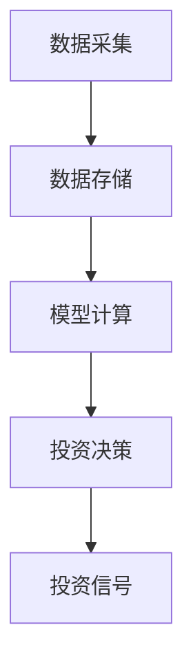
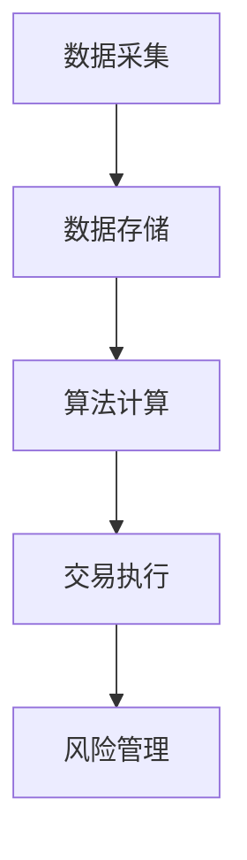

                 

# 价值投资与量化投资的对比

> 关键词：价值投资、量化投资、对比分析、投资策略、风险管理

> 摘要：本文从背景、核心概念、策略对比、系统分析、项目实战等多方面详细对比分析价值投资与量化投资的异同，帮助投资者理解两者的优缺点及应用场景，最终找到适合自己的投资策略。

---

## # 第一部分：背景介绍

### ## 第1章：核心概念术语说明

#### ### 1.1 价值投资
- **定义**：价值投资是一种以基本面分析为基础的投资策略，旨在通过寻找市场价格低于其内在价值的证券进行投资。
- **核心要素**：
  - 企业基本面分析：包括财务报表、行业地位、竞争优势等。
  - 安全边际：买入价格低于内在价值的部分，以降低风险。
  - 长期持有：以时间复利效应实现财富增长。

#### ### 1.2 量化投资
- **定义**：量化投资是基于数学模型和算法进行的投资策略，利用大数据、统计套利、算法交易等技术实现自动化投资。
- **核心要素**：
  - 数据驱动：依赖大量历史数据进行模式识别。
  - 算法交易：通过程序化交易执行指令。
  - 风险控制：量化模型内置风险管理机制。

---

### ## 第2章：问题背景与问题描述

#### ### 2.1 问题背景
- 投资者在选择投资策略时，常面临价值投资与量化投资的困惑。
- 价值投资强调长期持有和安全边际，量化投资强调数据驱动和算法交易。
- 两者各有优缺点，适用于不同市场环境和投资者风格。

#### ### 2.2 问题解决
- 对比分析两种投资策略的核心概念、策略特点、适用场景。
- 帮助投资者根据自身需求选择合适的投资策略。

#### ### 2.3 边界与外延
- 价值投资与量化投资的边界：从传统与现代、主观与客观的维度划分。
- 外延：探讨两者在不同市场环境下的结合与互补。

---

### ## 第3章：核心概念与联系

#### ### 3.1 核心概念对比

| 对比维度         | 价值投资                         | 量化投资                         |
|------------------|----------------------------------|----------------------------------|
| 投资依据         | 基本面分析，寻找低估资产           | 数据驱动，寻找统计套利机会       |
| 投资期限         | 长期持有，注重复利效应             | 短期交易，注重高频机会           |
| 风险管理         | 侧重安全边际，降低下行风险         | 量化模型内置风险管理，分散风险   |
| 适用场景         | 牛市或震荡市，寻找价值低估标的     | 多种市场环境，尤其是高波动市场   |

---

## # 第二部分：核心概念与联系

### ## 第4章：价值投资与量化投资的核心概念对比

#### ### 4.1 核心原理
- **价值投资**：基于对企业内在价值的评估，寻找市场价格低于内在价值的证券。
- **量化投资**：基于统计套利和算法交易，寻找市场定价偏差带来的短期机会。

#### ### 4.2 概念属性特征对比

| 属性维度         | 价值投资                         | 量化投资                         |
|------------------|----------------------------------|----------------------------------|
| 数据依赖         | 低，依赖基本面分析                 | 高，依赖历史数据和统计分析       |
| 操作复杂度       | 低，策略简单，易于理解             | 高，依赖复杂算法和编程能力       |
| 交易频率         | 低，长期持有                     | 高，高频交易                     |
| 风险承受能力     | 高，注重安全边际                 | 中，量化模型分散风险             |

---

## # 第三部分：算法原理讲解

### ## 第5章：价值投资的算法原理

#### ### 5.1 价值投资的核心算法
- **DCF模型（ discounted cash flow model）**：计算企业内在价值的数学模型。
  - 公式：$$ V = \frac{CF}{(1 + r)^t} $$
  - 其中，CF为未来现金流，r为折现率，t为时间。

#### ### 5.2 实现步骤
1. 收集目标企业的财务数据。
2. 计算自由现金流。
3. 确定合理的折现率。
4. 计算企业内在价值。
5. 比较市场价格与内在价值，寻找低估资产。

---

### ## 第6章：量化投资的算法原理

#### ### 6.1 量化投资的核心算法
- **CAPM模型（Capital Asset Pricing Model）**：计算资产的预期收益。
  - 公式：$$ E(r_i) = r_f + \beta_i (E(r_m) - r_f) $$
  - 其中，$r_f$为无风险利率，$\beta_i$为股票的beta值，$E(r_m)$为市场预期收益率。

#### ### 6.2 实现步骤
1. 收集历史数据，包括股票价格、成交量等。
2. 计算股票的beta值。
3. 确定市场预期收益率。
4. 计算股票的预期收益。
5. 基于预期收益构建投资组合。

---

## # 第四部分：系统分析与架构设计

### ## 第7章：系统架构设计方案

#### ### 7.1 价值投资系统架构
- **功能模块**：
  - 数据采集：收集企业财务数据。
  - 模型计算：计算企业内在价值。
  - 投资决策：基于价值评估生成投资信号。

#### ### 7.2 系统架构图（Mermaid）

---

### ## 第8章：量化投资系统架构

#### ### 8.1 系统架构图（Mermaid）

---

## # 第五部分：项目实战

### ## 第9章：价值投资与量化投资的实战案例

#### ### 9.1 价值投资实战
- **案例**：寻找低估股票。
  - 数据来源：获取某行业上市公司的财务数据。
  - 实现步骤：
    1. 计算每股收益（EPS）。
    2. 计算市盈率（P/E）。
    3. 比较P/E与行业平均水平，寻找低估股票。

#### ### 9.2 量化投资实战
- **案例**：基于动量策略的算法交易。
  - 数据来源：获取历史收盘价。
  - 实现步骤：
    1. 计算动量指标（如10日动量）。
    2. 确定买卖信号。
    3. 执行交易指令。

---

## # 第六部分：总结与展望

### ## 第10章：总结与投资策略建议

#### ### 10.1 总结
- 价值投资与量化投资各有优缺点。
- 价值投资适合长期投资者，量化投资适合技术型投资者。
- 两者可以在特定市场环境下结合使用。

#### ### 10.2 投资策略建议
- 根据市场环境选择策略。
- 结合两者优势，制定混合投资策略。
- 定期评估和调整投资组合。

---

## # 结语

价值投资与量化投资作为投资领域的重要策略，各有其独特的适用场景和优势。投资者应根据自身需求和市场环境选择合适的投资策略，并在实践中不断优化和调整。未来，随着技术的进步和市场的变化，投资策略也将不断创新，投资者需持续学习和适应。

---

## 作者：AI天才研究院/AI Genius Institute & 禅与计算机程序设计艺术 /Zen And The Art of Computer Programming

