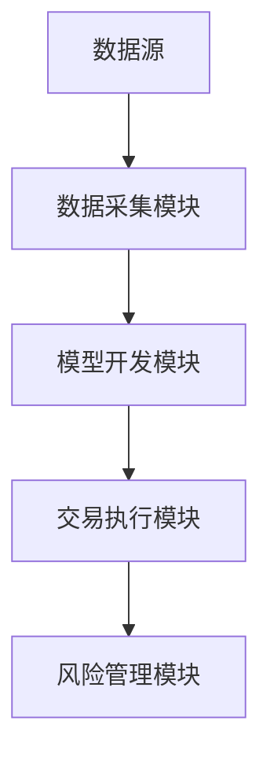

                 


# 价值投资与量化投资的融合

> 关键词：价值投资、量化投资、融合、算法驱动、风险管理

> 摘要：价值投资与量化投资的融合是金融投资领域的重要趋势，通过结合基本面分析与数据驱动的量化方法，投资者可以在复杂多变的市场中实现更高效、更稳定的收益。本文深入探讨了价值投资与量化投资的核心概念、融合原理、算法驱动的分析方法、系统架构设计以及实际应用案例，展示了如何将传统投资理念与现代技术手段相结合，构建出一种更加科学和稳健的投资策略。

---

## 第一章: 引言

### 1.1 背景介绍
现代金融市场的发展日新月异，投资者面临着日益复杂的投资环境。价值投资与量化投资作为两种重要的投资方法，各有其独特的优势与局限性。价值投资注重基本面分析，强调长期持有优质资产；量化投资则依赖数据与模型，通过算法快速捕捉市场机会。然而，单一的投资方法往往难以应对市场的不确定性，因此，将两者有机结合的融合投资逐渐成为新的研究热点。

### 1.2 核心概念与问题描述
- **价值投资**：以基本面分析为基础，寻找被市场低估的优质资产进行长期投资。
- **量化投资**：利用数学模型和算法，通过大数据分析和统计套利寻找投资机会。
- **融合投资**：将价值投资的长期视角与量化投资的科学方法相结合，构建更加稳健的投资策略。

### 1.3 融合投资的必要性
- 单一投资方法的局限性：价值投资可能错过短期机会，量化投资可能忽视资产的内在价值。
- 市场环境的复杂性：融合投资能够同时考虑市场趋势与资产质量，适应多变的市场环境。
- 技术进步的推动：大数据与人工智能技术的发展为融合投资提供了新的工具和方法。

---

## 第二章: 价值投资的核心原理

### 2.1 价值投资的理论基础
- **格雷厄姆的价值投资理论**：强调安全边际和内在价值，认为市场波动是投资机会。
- **巴菲特的实践**：将企业基本面分析与长期投资理念相结合，注重企业的竞争优势和管理层质量。

### 2.2 价值投资的关键指标与分析方法
- **市盈率（P/E）**：衡量股票价格相对于每股收益的倍数，低P/E可能意味着被低估。
- **市净率（P/B）**：股票价格与每股净资产的比率，低P/B可能表明资产被低估。
- **股息率**：衡量股票分红能力，高股息率可能意味着稳定的收益。

### 2.3 价值投资的行业与个股选择策略
- **行业分析**：选择具有长期增长潜力的行业，如科技、消费等。
- **个股分析**：通过财务报表分析企业的盈利能力、成长性和抗风险能力。
- **价值陷阱识别**：避免选择表面上看似低估但实际存在问题的企业。

---

## 第三章: 量化投资的核心原理

### 3.1 量化投资的理论基础
- **现代投资组合理论（MPT）**：通过分散投资降低风险，优化投资组合的收益与风险比。
- **资本资产定价模型（CAPM）**：用于评估资产的预期收益，考虑市场风险和无风险利率。
- **因子模型**：如Fama-French三因子模型，将股票收益分解为市值、价值和动量等因素。

### 3.2 量化投资的关键指标与分析方法
- **技术指标**：如移动平均线（MA）、相对强弱指数（RSI）等，用于判断市场趋势。
- **因子模型**：通过因子分析寻找具有超额收益的投资机会。
- **大数据分析**：利用非传统数据（如卫星图像、社交媒体数据）进行预测。

### 3.3 量化投资的交易策略与系统构建
- **短线交易策略**：基于算法快速捕捉市场波动，追求短期收益。
- **长期投资策略**：通过量化模型筛选出具有长期增长潜力的资产。
- **组合优化与风险控制**：利用数学模型优化投资组合，降低整体风险。

---

## 第四章: 价值投资与量化投资的融合原理

### 4.1 融合投资的核心概念
- **融合投资**：结合价值投资的长期视角与量化投资的科学方法，构建更加稳健的投资策略。
- **融合模型**：将基本面分析与量化模型相结合，寻找具有长期增长潜力且估值合理的资产。

### 4.2 融合投资的策略开发
- **策略开发流程**：从数据采集、模型构建到回测优化，逐步开发出融合投资策略。
- **因子模型与基本面分析的结合**：通过因子模型筛选出具有长期增长潜力的资产，再结合基本面分析进一步确认其价值。
- **大数据分析与预测模型**：利用大数据分析技术，预测市场的未来走势，辅助投资决策。

### 4.3 融合投资的系统架构
- **系统功能设计**：包括数据采集模块、模型开发模块、交易执行模块和风险管理模块。
- **系统架构图**：展示各模块之间的关系和数据流。

### 4.4 融合投资的风险管理
- **风险管理策略**：通过VaR（Value at Risk）等方法量化投资组合的风险，设置止损点。
- **压力测试**：模拟极端市场环境，评估投资组合的抗风险能力。

---

## 第五章: 融合投资的算法驱动与数学模型

### 5.1 融合投资的算法流程
- **算法流程图**：展示从数据采集到策略执行的完整流程。
- **因子模型构建**：通过主成分分析（PCA）等方法，提取影响资产收益的关键因子。
- **模型回测与优化**：通过历史数据验证模型的有效性，进一步优化参数。

### 5.2 数学模型与公式
- **CAPM模型**：$$ E(R_i) = R_f + \beta_i (R_m - R_f) $$
- **因子模型**：$$ R_i = \alpha_i + \beta_i R_m + \gamma_i F + \epsilon_i $$
- **VaR计算**：$$ VaR = \mu + z \cdot \sigma $$

### 5.3 算法实现与代码示例
```python
import pandas as pd
import numpy as np
from sklearn.decomposition import PCA

# 数据预处理
data = pd.read_csv('stock_data.csv')
data = data.dropna()

# 构建因子模型
pca = PCA(n_components=3)
principal_components = pca.fit_transform(data[['PE', 'PB', 'PS']])

# 训练模型
# 回测与优化
```

---

## 第六章: 融合投资的系统架构设计

### 6.1 系统功能设计
- **数据采集模块**：从多个数据源获取实时市场数据。
- **模型开发模块**：构建并优化融合投资模型。
- **交易执行模块**：根据模型信号执行交易指令。
- **风险管理模块**：实时监控并管理投资组合风险。

### 6.2 系统架构图


### 6.3 系统接口设计
- **API接口**：用于与其他系统（如数据源、交易平台）进行交互。
- **用户界面**：提供直观的操作界面，方便用户查看策略表现和调整参数。

---

## 第七章: 融合投资的实际应用与案例分析

### 7.1 项目实战
- **项目背景**：构建一个融合投资系统，实现价值与量化策略的结合。
- **核心实现**：基于因子模型和基本面分析，筛选出具有长期增长潜力且估值合理的资产。
- **代码实现**：
  ```python
  import pandas as pd
  from sklearn.ensemble import RandomForestRegressor

  # 数据预处理
  data = pd.read_csv('stock_data.csv')
  data = data.dropna()

  # 构建特征矩阵和目标变量
  features = data[['PE', 'PB', 'PS', 'ROE']]
  target = data['Return']

  # 训练随机森林模型
  model = RandomForestRegressor(n_estimators=100)
  model.fit(features, target)

  # 预测未来收益
  future_features = pd.read_csv('future_data.csv')
  future_return = model.predict(future_features)
  ```

### 7.2 案例分析
- **案例背景**：假设市场处于震荡状态，投资者希望通过融合投资策略实现稳健收益。
- **策略选择**：结合因子模型筛选出具有长期增长潜力的科技股，同时考虑其估值是否合理。
- **结果分析**：通过回测发现，该策略在震荡市场中表现优于单一的价值或量化策略。

---

## 第八章: 融合投资的总结与展望

### 8.1 总结
- **融合投资的优势**：结合了价值投资的长期视角与量化投资的科学方法，能够更好地应对复杂多变的市场环境。
- **主要挑战**：数据质量、模型优化、风险管理等方面的挑战。

### 8.2 未来展望
- **技术进步**：人工智能和大数据技术的进一步发展将为融合投资提供更多可能性。
- **市场发展**：随着市场的成熟，融合投资将逐渐成为主流的投资方式。

---

## 作者：AI天才研究院/AI Genius Institute & 禅与计算机程序设计艺术 /Zen And The Art of Computer Programming

---

### 注意事项：
- 融合投资需要结合具体市场环境和投资者自身情况，不能盲目照搬。
- 在实际操作中，建议投资者根据自身风险承受能力选择合适的投资策略。
- 本文仅作为理论探讨，不构成具体的投资建议。

