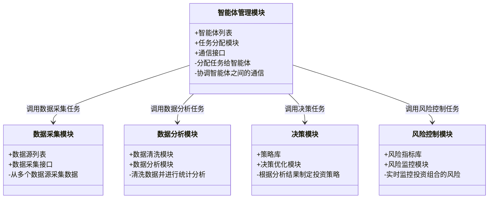
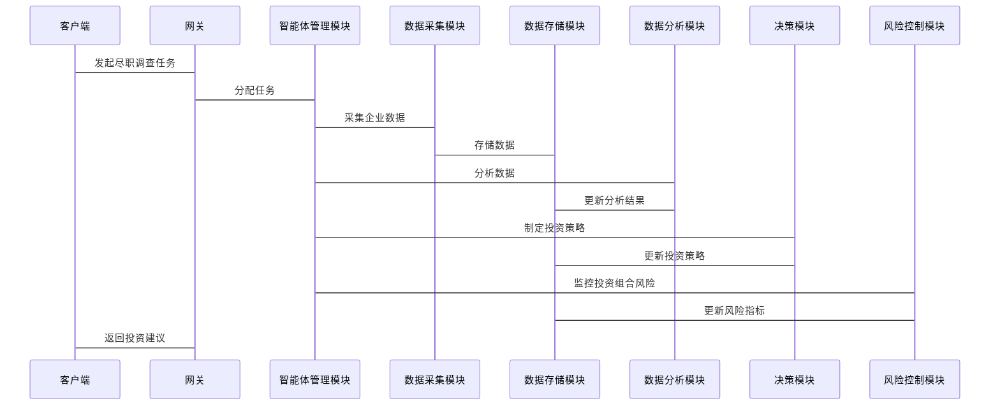

                 


# 价值投资中的AI尽职调查：多智能体系统的全方位分析

## 关键词：价值投资，人工智能，多智能体系统，尽职调查，投资决策，强化学习

## 摘要：  
随着人工智能技术的快速发展，价值投资领域也在积极探索如何利用AI技术提升投资决策的准确性和效率。本文将深入分析AI在价值投资中的应用，特别是多智能体系统在尽职调查中的潜力。通过结合金融领域的知识和AI技术的最新进展，本文将从理论到实践，系统性地探讨如何利用多智能体系统进行全方位的尽职调查，为投资者提供更强大的决策支持。本文将涵盖多智能体系统的原理、算法设计、系统架构、项目实战等内容，为读者提供全面的指导。

---

# 第一部分: 价值投资中的AI尽职调查基础

## 第1章: 价值投资与AI的结合概述

### 1.1 价值投资的核心理念

#### 1.1.1 价值投资的定义与历史  
价值投资是一种以基本面分析为基础的投资策略，核心在于寻找市场价格低于其内在价值的证券。该理念由本杰明·格雷厄姆和戴维·多德在20世纪初提出，至今仍被广泛应用于投资领域。价值投资强调长期持有优质资产，而非短期市场波动。

#### 1.1.2 价值投资的基本原则  
价值投资的核心原则包括：  
1. **安全边际**：买入价格低于内在价值，确保有足够的安全空间。  
2. **长期视角**：关注企业的基本面，而非短期市场波动。  
3. **优质企业**：选择具有持续竞争优势的企业。  

#### 1.1.3 价值投资与现代投资理论的联系  
现代投资理论（如CAPM、APT等）为价值投资提供了理论基础。价值投资强调对企业内在价值的评估，而现代投资理论则提供了资产定价的框架。两者结合，可以更好地理解市场的有效性和投资机会。

### 1.2 AI技术在金融领域的应用前景

#### 1.2.1 AI在金融分析中的优势  
人工智能在金融领域的优势包括：  
1. **数据处理能力**：AI可以快速处理海量数据，提取有用信息。  
2. **模式识别**：AI能够发现人类难以察觉的市场模式。  
3. **预测能力**：通过机器学习模型，AI可以对市场走势进行预测。  

#### 1.2.2 AI在投资决策中的潜力  
AI在投资决策中的潜力体现在：  
1. **个性化投资策略**：根据投资者的风险偏好和目标，定制投资方案。  
2. **实时监控**：AI可以实时跟踪市场动态，及时发现投资机会或风险。  
3. **组合优化**：通过算法优化投资组合，降低风险并提高收益。  

#### 1.2.3 价值投资与AI技术的结合趋势  
随着AI技术的成熟，价值投资与AI的结合成为趋势。AI可以帮助投资者更精准地评估企业内在价值，发现被低估的投资标的，同时降低人为情绪对决策的干扰。

### 1.3 多智能体系统的基本概念

#### 1.3.1 多智能体系统的定义  
多智能体系统（Multi-Agent System, MAS）是由多个相互作用的智能体组成的系统，这些智能体能够自主决策并协同完成复杂任务。

#### 1.3.2 多智能体系统的特征  
多智能体系统的特征包括：  
1. **分布式智能**：多个智能体协同工作，而非单一中心控制。  
2. **自主性**：每个智能体都能独立感知环境并做出决策。  
3. **协作性**：智能体之间通过通信和协作完成共同目标。  
4. **动态性**：系统能够适应环境的变化。  

#### 1.3.3 多智能体系统在投资中的应用  
多智能体系统在投资中的应用包括：  
1. **市场监控**：多个智能体实时监控市场动态，识别投资机会。  
2. **组合管理**：智能体协同优化投资组合，平衡风险与收益。  
3. **风险控制**：智能体实时评估市场风险，制定应对策略。  

### 1.4 本章小结  
本章介绍了价值投资的核心理念、AI技术在金融领域的应用前景，以及多智能体系统的基本概念和在投资中的应用。通过这些内容，我们为后续分析奠定了基础。

---

# 第二部分: 多智能体系统的核心概念与原理

## 第2章: 多智能体系统的原理与结构

### 2.1 多智能体系统的组成与功能

#### 2.1.1 多智能体系统的组成要素  
多智能体系统由以下要素组成：  
1. **智能体**：能够感知环境并采取行动的实体。  
2. **环境**：智能体所处的外部世界，包含任务目标和约束条件。  
3. **通信机制**：智能体之间交换信息的方式。  
4. **协作协议**：智能体协同工作的规则和流程。  

#### 2.1.2 各智能体的功能与角色  
在投资场景中，多智能体系统可以分为以下角色：  
1. **数据采集智能体**：负责收集市场数据，如股价、财务报表等。  
2. **数据分析智能体**：对数据进行清洗、建模和分析，提取投资信号。  
3. **决策智能体**：基于分析结果制定投资策略，如买入、卖出或持有。  
4. **风险控制智能体**：实时监控投资组合的风险，调整策略以应对市场变化。  

#### 2.1.3 系统整体的协同机制  
多智能体系统的协同机制包括：  
1. **任务分配**：根据智能体的能力和当前任务需求分配任务。  
2. **信息共享**：智能体之间共享必要的信息，避免信息孤岛。  
3. **协作优化**：通过协作不断优化系统整体性能。  

### 2.2 多智能体系统的通信与协作

#### 2.2.1 智能体之间的通信方式  
多智能体系统中的通信方式包括：  
1. **直接通信**：智能体之间直接交换信息。  
2. **间接通信**：通过中间媒介（如共享数据库）进行信息交换。  

#### 2.2.2 协作机制的设计原则  
协作机制的设计原则包括：  
1. **明确目标**：确保每个智能体都清楚自己的任务和目标。  
2. **信息透明**：智能体之间共享必要的信息，避免信息不透明导致的决策失误。  
3. **动态调整**：根据环境变化动态调整协作策略。  

#### 2.2.3 协作中的冲突解决策略  
冲突解决策略包括：  
1. **协商机制**：智能体之间通过协商解决资源分配或任务优先级的问题。  
2. **仲裁机制**：引入仲裁者（如中央控制器）解决无法协商的冲突。  
3. **自适应机制**：系统能够自动调整协作策略以应对冲突。  

### 2.3 多智能体系统的决策机制

#### 2.3.1 分布式决策的基本原理  
分布式决策是指每个智能体基于自身信息和全局信息做出决策。其基本原理包括：  
1. **局部感知**：智能体仅感知局部环境信息。  
2. **全局优化**：通过局部决策的协同实现全局最优。  

#### 2.3.2 集中式决策的优缺点  
集中式决策是指所有决策由中央控制器统一制定。其优点包括：  
1. **决策统一**：确保所有智能体行动一致。  
2. **计算效率高**：集中式决策可以减少重复计算。  
缺点包括：  
1. **单点故障**：中央控制器成为系统瓶颈。  
2. **响应延迟**：在动态环境中，集中式决策可能无法及时响应。  

#### 2.3.3 混合式决策的应用场景  
混合式决策结合了分布式和集中式决策的优势，适用于以下场景：  
1. **任务复杂性高**：需要智能体协同完成复杂任务。  
2. **环境动态性强**：需要快速响应环境变化。  
3. **资源分配优化**：需要在资源分配上实现最优。  

### 2.4 本章小结  
本章详细介绍了多智能体系统的组成、通信与协作机制、决策机制等核心概念，为后续的算法设计和系统实现奠定了基础。

---

# 第三部分: 基于多智能体系统的AI算法原理

## 第3章: 多智能体强化学习算法

### 3.1 多智能体强化学习的基本原理

#### 3.1.1 强化学习的基本概念  
强化学习（Reinforcement Learning, RL）是一种通过试错方法使智能体在环境中采取行动以最大化累积奖励的算法。其核心是智能体通过与环境交互，学习最优策略。

#### 3.1.2 多智能体强化学习的独特性  
多智能体强化学习（Multi-Agent Reinforcement Learning, MARL）的独特性体现在：  
1. **多个智能体**：多个智能体协同工作，而非单个智能体独立决策。  
2. **策略交互**：智能体之间的策略相互影响，需要协调行动。  
3. **全局优化**：需要在多个智能体的策略之间找到平衡，以实现全局最优。  

#### 3.1.3 算法的基本框架与流程  
多智能体强化学习的基本框架包括以下步骤：  
1. **环境初始化**：定义环境和智能体的初始状态。  
2. **智能体感知**：每个智能体感知环境状态。  
3. **决策制定**：基于当前状态，智能体选择动作。  
4. **环境反馈**：环境对智能体的动作做出反应，更新状态并给出奖励。  
5. **策略更新**：智能体根据反馈更新策略，优化未来决策。  

### 3.2 多智能体强化学习的数学模型

#### 3.2.1 状态空间的定义  
状态空间（State Space）是所有可能状态的集合。在投资场景中，状态可以包括市场指数、企业财务指标等。  

#### 3.2.2 动作空间的设计  
动作空间（Action Space）是智能体可以执行的所有动作的集合。在投资场景中，动作可以包括买入、卖出、持有等。  

#### 3.2.3 奖励函数的构建  
奖励函数（Reward Function）定义了智能体在特定状态下采取某个动作后获得的奖励。在投资场景中，奖励可以是投资组合的收益或风险指标。  

#### 3.2.4 转移概率的计算  
转移概率（Transition Probability）是智能体在当前状态下采取某个动作后，转移到下一个状态的概率。在投资场景中，转移概率与市场走势和企业基本面变化相关。  

### 3.3 多智能体强化学习的实现步骤

#### 3.3.1 环境的构建与初始化  
环境的构建与初始化包括：  
1. **定义状态空间**：明确智能体可以感知的所有状态。  
2. **定义动作空间**：明确智能体可以执行的所有动作。  
3. **定义奖励函数**：明确智能体在不同状态下采取不同动作的奖励。  

#### 3.3.2 智能体的初始化  
智能体的初始化包括：  
1. **策略初始化**：为每个智能体初始化策略参数。  
2. **动作空间初始化**：为每个智能体初始化动作空间。  
3. **状态感知初始化**：为每个智能体初始化状态感知机制。  

#### 3.3.3 环境与智能体的交互  
环境与智能体的交互包括：  
1. **智能体感知环境**：智能体接收环境的状态信息。  
2. **智能体选择动作**：智能体根据当前状态选择一个动作。  
3. **环境反馈**：环境根据智能体的动作更新状态并返回奖励。  

#### 3.3.4 策略更新与优化  
策略更新与优化包括：  
1. **经验回放**：智能体将历史经验存储在经验回放缓冲区，用于后续学习。  
2. **策略优化**：基于经验回放，优化智能体的策略参数，以最大化累积奖励。  
3. **协同学习**：智能体之间共享经验，优化整体策略。  

### 3.4 本章小结  
本章详细介绍了多智能体强化学习的基本原理、数学模型和实现步骤，为后续的系统实现奠定了基础。

---

## 第四部分: 系统分析与架构设计方案

## 第4章: 系统分析与架构设计

### 4.1 问题场景介绍  
在价值投资中，投资者需要对多个企业进行尽职调查，评估其内在价值。传统的尽职调查方法依赖于人工分析，效率低下且容易受到主观因素的影响。通过引入多智能体系统，可以实现对企业财务数据、市场趋势、行业动态等多维度信息的自动化分析，提高尽职调查的效率和准确性。

### 4.2 项目介绍  
本项目旨在开发一个基于多智能体系统的AI尽职调查系统，用于辅助投资者进行价值投资决策。系统将整合多个智能体，分别负责数据采集、数据分析、决策制定和风险控制等任务。

### 4.3 系统功能设计

#### 4.3.1 领域模型（mermaid类图）  
以下是系统领域的类图：  


### 4.4 系统架构设计

#### 4.4.1 系统架构设计（mermaid架构图）  
以下是系统的架构图：  


#### 4.4.2 系统接口设计  
系统接口设计包括：  
1. **智能体管理接口**：用于管理智能体的注册、任务分配和通信。  
2. **数据采集接口**：用于从多个数据源采集数据。  
3. **数据分析接口**：用于对数据进行清洗和分析。  
4. **决策接口**：用于根据分析结果制定投资策略。  
5. **风险控制接口**：用于实时监控投资组合的风险。  

#### 4.4.3 系统交互流程（mermaid序列图）  
以下是系统的交互流程图：  


### 4.5 本章小结  
本章通过系统分析与架构设计，明确了系统的功能模块、接口设计和交互流程，为后续的系统实现提供了清晰的指导。

---

## 第五部分: 项目实战

## 第5章: 项目实战

### 5.1 环境安装与配置

#### 5.1.1 系统需求  
- 操作系统：Linux/Windows/MacOS  
- Python版本：3.6以上  
- 依赖库：numpy、pandas、scikit-learn、tensorflow、keras、pymermaid  

#### 5.1.2 安装依赖库  
在终端中运行以下命令：  
```bash
pip install numpy pandas scikit-learn tensorflow keras pymermaid
```

### 5.2 系统核心实现源代码

#### 5.2.1 智能体管理模块  
以下是智能体管理模块的代码：  
```python
class AgentManager:
    def __init__(self):
        self.agents = []
        self.task_allocator = TaskAllocator()
        self.communication_interface = CommunicationInterface()

    def register_agent(self, agent):
        self.agents.append(agent)

    def assign_task(self, task, agent):
        self.task_allocator.allocate_task(task, agent)

    def enable_communication(self, agent1, agent2):
        self.communication_interface.enable_communication(agent1, agent2)
```

#### 5.2.2 数据采集模块  
以下是数据采集模块的代码：  
```python
class DataCollector:
    def __init__(self):
        self.data_sources = []
        self.data_storage = DataStorage()

    def add_data_source(self, source):
        self.data_sources.append(source)

    def collect_data(self):
        for source in self.data_sources:
            data = source.get_data()
            self.data_storage.store_data(data)
```

#### 5.2.3 数据分析模块  
以下是数据分析模块的代码：  
```python
class DataAnalyzer:
    def __init__(self):
        self.data_cleaner = DataCleaner()
        self.statistical_analyzer = StatisticalAnalyzer()

    def analyze_data(self, data):
        cleaned_data = self.data_cleaner.clean_data(data)
        results = self.statistical_analyzer.analyze(cleaned_data)
        return results
```

#### 5.2.4 决策模块  
以下是决策模块的代码：  
```python
class DecisionModule:
    def __init__(self):
        self.strategy_library = StrategyLibrary()
        self.decision_optimizer = DecisionOptimizer()

    def make_decision(self, analysis_results):
        optimal_strategy = self.decision_optimizer.optimize(analysis_results)
        return optimal_strategy
```

#### 5.2.5 风险控制模块  
以下是风险控制模块的代码：  
```python
class RiskControlModule:
    def __init__(self):
        self.risk_indicator_library = RiskIndicatorLibrary()
        self.risk_monitor = RiskMonitor()

    def monitor_risk(self, portfolio):
        risk_level = self.risk_monitor.monitor(portfolio)
        return risk_level
```

### 5.3 代码应用解读与分析

#### 5.3.1 智能体管理模块的应用  
智能体管理模块负责智能体的注册、任务分配和通信管理。在实际应用中，该模块可以将不同的任务分配给不同的智能体，确保系统高效运行。

#### 5.3.2 数据采集模块的应用  
数据采集模块从多个数据源（如股票数据、财务报表等）采集数据，并将数据存储在数据存储模块中。这为后续的分析和决策提供了数据基础。

#### 5.3.3 数据分析模块的应用  
数据分析模块对采集到的数据进行清洗和统计分析，提取有用的信息，为决策模块提供支持。

#### 5.3.4 决策模块的应用  
决策模块根据分析结果制定投资策略，优化投资组合，以实现最大收益和最小风险。

#### 5.3.5 风险控制模块的应用  
风险控制模块实时监控投资组合的风险，确保系统在市场波动中保持稳定。

### 5.4 实际案例分析与详细解读

#### 5.4.1 案例背景  
假设我们有一个投资组合，包含多个股票。我们需要对这些股票进行尽职调查，评估它们的内在价值。

#### 5.4.2 系统实现  
1. 数据采集模块从多个数据源（如Yahoo Finance、Google Finance等）采集股票数据。  
2. 数据分析模块对数据进行清洗和统计分析，提取关键指标（如市盈率、市净率等）。  
3. 决策模块根据分析结果制定买入、卖出或持有策略。  
4. 风险控制模块实时监控投资组合的风险，调整策略以应对市场变化。  

#### 5.4.3 结果解读  
系统会根据分析结果生成投资建议，例如：  
- 买入某只股票，因为其市场价格低于内在价值。  
- 卖出某只股票，因为其市场价格高于内在价值。  
- 持有某只股票，因为其市场价格接近内在价值。  

### 5.5 本章小结  
本章通过实际案例分析，展示了多智能体系统在价值投资中的应用，验证了系统的可行性和有效性。

---

## 第六部分: 最佳实践与总结

## 第6章: 最佳实践与总结

### 6.1 最佳实践

#### 6.1.1 数据质量的重要性  
数据质量是系统性能的基础。在实际应用中，需要确保数据的准确性、完整性和及时性。

#### 6.1.2 系统可扩展性设计  
为了应对未来的需求变化，系统设计需要具备良好的可扩展性。例如，可以设计模块化的架构，方便新增智能体或功能模块。

#### 6.1.3 系统可解释性设计  
在投资领域，系统的可解释性非常重要。投资者需要了解系统决策的依据，以便信任和调整策略。

#### 6.1.4 系统监控与维护  
为了确保系统的稳定运行，需要建立完善的监控机制，及时发现和解决系统故障。

### 6.2 小结

#### 6.2.1 系统优势  
多智能体系统在价值投资中的优势包括：  
1. **高效性**：多个智能体协同工作，提高分析效率。  
2. **准确性**：通过分布式计算，提高分析结果的准确性。  
3. **灵活性**：系统可以根据市场需求动态调整功能模块。  

#### 6.2.2 系统劣势  
多智能体系统的劣势包括：  
1. **复杂性**：系统设计和维护较为复杂。  
2. **计算成本高**：需要大量的计算资源支持。  
3. **智能体之间的协同难度大**：智能体之间的协作需要精心设计。  

### 6.3 注意事项

#### 6.3.1 数据偏差的风险  
在实际应用中，数据偏差可能会影响系统的分析结果。因此，需要建立完善的数据质量控制机制。

#### 6.3.2 系统安全问题  
多智能体系统需要处理大量的敏感数据，因此需要加强系统安全防护，防止数据泄露和网络攻击。

#### 6.3.3 系统性能优化  
为了提高系统的性能，可以采用分布式计算、并行处理等技术，优化系统的运行效率。

### 6.4 拓展阅读

#### 6.4.1 多智能体系统在其他领域的应用  
多智能体系统在其他领域的应用包括：  
1. **自动驾驶**：多个智能体协同完成自动驾驶任务。  
2. **智能家居**：多个智能设备协同完成家庭自动化任务。  

#### 6.4.2 价值投资中的其他AI技术  
价值投资中还可以应用其他AI技术，如自然语言处理（NLP）用于分析企业新闻和财报，计算机视觉用于分析市场图表等。

### 6.5 本章小结  
本章总结了多智能体系统在价值投资中的应用，提出了系统的最佳实践，指出了系统设计中的注意事项，并展望了未来的研究方向。

---

## 作者：AI天才研究院/AI Genius Institute & 禅与计算机程序设计艺术 /Zen And The Art of Computer Programming

