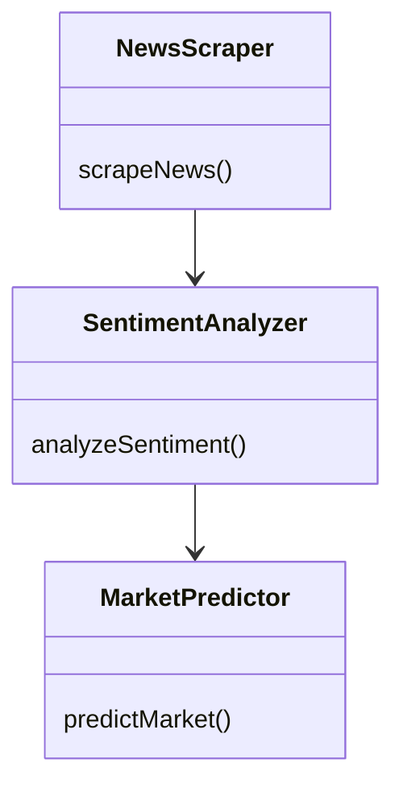
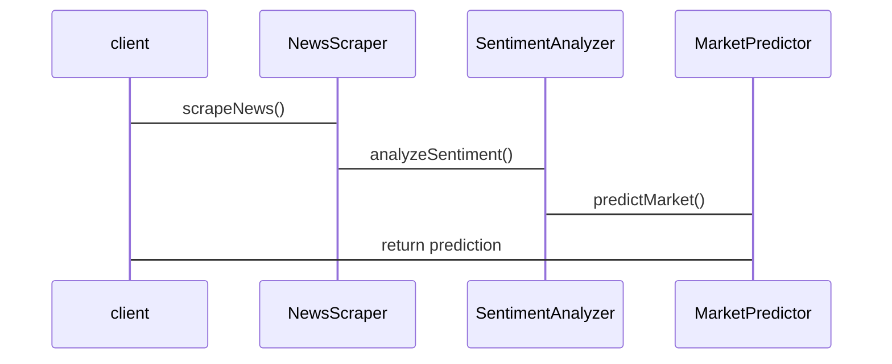

                 


# 价值投资中的AI情感分析：多智能体系统解读市场心理

> 关键词：价值投资、AI情感分析、多智能体系统、市场心理、金融数据、NLP、机器学习

> 摘要：本文深入探讨了AI情感分析在价值投资中的应用，特别是多智能体系统如何通过解读市场心理来辅助投资决策。文章从情感分析的基本原理、多智能体系统的构建、算法实现、项目实战到系统架构设计等方面进行了全面分析，结合实际案例和代码实现，为读者提供了一套完整的解决方案。

---

## 第一部分: 价值投资中的AI情感分析基础

### 第1章: 价值投资与AI情感分析概述

#### 1.1 价值投资的基本概念
- **1.1.1 价值投资的定义与核心理念**
  - 价值投资是一种长期投资策略，强调以低于内在价值的价格买入优质资产。
  - 核心理念：市场短期波动不可预测，但长期趋势由基本面决定。
- **1.1.2 价值投资与市场心理的关系**
  - 市场心理影响短期波动，但长期价值由基本面决定。
  - 情感分析可以帮助识别市场情绪偏差，辅助价值判断。
- **1.1.3 AI技术在价值投资中的应用潜力**
  - 利用AI技术分析市场情绪，识别短期波动中的投资机会。
  - 结合多智能体系统，实现更高效的市场信息处理。

#### 1.2 情感分析的基本概念
- **1.2.1 情感分析的定义与分类**
  - 情感分析：通过自然语言处理（NLP）技术，分析文本中的情感倾向。
  - 分类：正面、负面、中性。
- **1.2.2 情感分析在金融领域的应用**
  - 股票新闻、社交媒体评论、分析师报告的情感分析。
  - 通过情感分析预测市场情绪变化。
- **1.2.3 多智能体系统在市场心理解读中的作用**
  - 多智能体系统：多个AI实体协同工作，模拟市场参与者的决策过程。
  - 通过多智能体系统，实现更全面的市场心理分析。

#### 1.3 多智能体系统的定义与特点
- **1.3.1 多智能体系统的定义**
  - 多智能体系统（Multi-Agent System, MAS）：由多个自主智能体组成的系统，每个智能体能够独立决策并与其他智能体协作。
- **1.3.2 多智能体系统的核心特点**
  - 分布式：智能体独立决策。
  - 协作性：智能体之间通过通信协作完成复杂任务。
  - 反应性：智能体能够实时感知环境变化并做出反应。
- **1.3.3 多智能体系统与传统AI的区别**
  - 传统AI：单点决策，缺乏灵活性。
  - 多智能体系统：分布式决策，适应复杂环境。

---

## 第2章: AI情感分析的核心概念与联系

### 2.1 情感分析的核心概念
#### 2.1.1 情感分析的原理
- **NLP基础**：
  - 词袋模型（Bag-of-Words）。
  - 词嵌入（Word Embedding）。
- **文本特征提取**：
  - TF-IDF特征提取。
  - Word2Vec、GloVe等嵌入方法。
- **情感分类方法**：
  - 朴素贝叶斯（Naive Bayes）。
  - 支持向量机（SVM）。
  - 深度学习模型（如LSTM、Transformer）。

#### 2.1.2 情感分析的特征提取方法
- **文本预处理**：
  - 分词：将文本分割成单词或短语。
  - 去停用词：去除常见词汇（如“的”、“是”）。
  - 词干提取：将词还原为词干（如“running” → “run”）。
- **特征选择**：
  - 使用TF-IDF提取关键词。
  - 使用Word2Vec生成词向量。

#### 2.1.3 情感分析的分类算法
- **传统机器学习**：
  - 朴素贝叶斯：适用于小规模数据。
  - SVM：适用于高维数据。
- **深度学习**：
  - RNN：适合处理序列数据。
  - Transformer：适合处理长文本。

### 2.2 多智能体系统的核心概念
#### 2.2.1 多智能体系统的组成
- **智能体**：具有感知、决策和行动能力的实体。
- **环境**：智能体所处的外部环境。
- **通信机制**：智能体之间交换信息的方式。
- **协作任务**：多个智能体共同完成的任务。

#### 2.2.2 多智能体系统的协同机制
- **分布式计算**：
  - 每个智能体独立计算，通过通信共享信息。
- **协作策略**：
  - 基于强化学习的协作策略。
  - 基于博弈论的协作策略。

#### 2.2.3 多智能体系统与传统AI的区别
- **灵活性**：多智能体系统更具灵活性，能够适应复杂环境。
- **协作性**：多智能体系统通过协作完成任务，传统AI单点决策。

### 2.3 情感分析与多智能体系统的联系
#### 2.3.1 情感分析在多智能体系统中的应用
- **市场情绪预测**：
  - 多个智能体分别分析不同来源的文本数据。
  - 通过协作机制整合信息，预测市场情绪。
- **实时监控**：
  - 多智能体系统实时分析社交媒体、新闻等信息。
  - 及时捕捉市场情绪变化。

#### 2.3.2 多智能体系统如何增强情感分析的效果
- **分布式计算**：
  - 多个智能体同时处理不同数据源。
  - 提高计算效率。
- **协作学习**：
  - 智能体之间共享学习成果。
  - 提高模型的泛化能力。

---

## 第3章: 情感分析的算法原理与数学模型

### 3.1 情感分析的算法原理
#### 3.1.1 朴素贝叶斯分类器
- **原理**：
  - 基于概率论，计算每个类别的后验概率。
  - 使用贝叶斯定理进行分类。
- **数学公式**：
  $$ P(y|x) = \frac{P(x|y)P(y)}{P(x)} $$
  其中，$y$ 是类别标签，$x$ 是输入文本。

#### 3.1.2 支持向量机（SVM）
- **原理**：
  - 将数据映射到高维空间，寻找最优超平面。
  - 分离正负类样本。
- **数学公式**：
  $$ \text{目标函数} = \min \frac{1}{2}||w||^2 $$
  $$ \text{约束条件}：y_i(w \cdot x_i + b) \geq 1, i=1,2,...,n $$

#### 3.1.3 变换器（Transformer）
- **原理**：
  - 使用自注意力机制处理序列数据。
  - 通过多头注意力捕捉不同位置的信息。
- **数学公式**：
  $$ \text{注意力机制} = \text{softmax}(\frac{QK^T}{\sqrt{d_k}}) $$
  其中，$Q$ 是查询向量，$K$ 是键向量，$d_k$ 是向量维度。

### 3.2 多智能体系统中的算法原理
#### 3.2.1 强化学习
- **原理**：
  - 通过试错学习，智能体在环境中学习策略。
  - 使用Q-learning或Deep Q-Network（DQN）算法。
- **数学公式**：
  $$ Q(s, a) = r + \gamma \max_{a'} Q(s', a') $$
  其中，$s$ 是状态，$a$ 是动作，$r$ 是奖励，$\gamma$ 是折扣因子。

#### 3.2.2 分布式计算
- **原理**：
  - 多个智能体并行处理数据。
  - 通过通信机制共享信息。
- **数学公式**：
  - 使用分布式计算框架（如MapReduce、Spark）进行数据处理。

---

## 第4章: 多智能体系统的算法原理与数学模型

### 4.1 多智能体系统的算法原理
#### 4.1.1 分布式计算
- **原理**：
  - 多个智能体分别处理不同数据源。
  - 通过通信机制整合信息。
- **数学公式**：
  - 使用分布式计算框架（如MapReduce）进行数据处理。

#### 4.1.2 协作学习
- **原理**：
  - 多个智能体通过协作学习提高模型性能。
  - 使用联邦学习（Federated Learning）技术。
- **数学公式**：
  $$ \text{损失函数} = \sum_{i=1}^n \text{loss}_i(x_i, y_i) $$
  其中，$n$ 是智能体数量，$x_i$ 是智能体$i$的输入，$y_i$ 是目标输出。

### 4.2 多智能体系统的数学模型
#### 4.2.1 通信机制
- **公式**：
  $$ c_{ij} = \text{通信内容}_i \text{发送给智能体}_j $$
  其中，$c_{ij}$ 是智能体$i$发送给智能体$j$的通信内容。

#### 4.2.2 协作策略
- **公式**：
  $$ s_{ij} = \text{智能体}_i \text{与智能体}_j \text{的协作策略} $$
  其中，$s_{ij}$ 是智能体$i$和智能体$j$之间的协作策略。

---

## 第5章: 项目实战

### 5.1 环境搭建
#### 5.1.1 安装依赖
```bash
pip install numpy pandas scikit-learn transformers
```

### 5.2 数据处理
#### 5.2.1 数据清洗
```python
import pandas as pd
import numpy as np

# 加载数据
data = pd.read_csv('financial_news.csv')

# 清洗数据
data.dropna(inplace=True)
data = data[data['sentiment'] != 'neutral']
```

### 5.3 模型训练
#### 5.3.1 情感分类模型
```python
from sklearn.model_selection import train_test_split
from sklearn.feature_extraction.text import TfidfVectorizer
from sklearn.svm import SVC

# 特征提取
vectorizer = TfidfVectorizer()
X = vectorizer.fit_transform(data['text'])
y = data['sentiment']

# 分割数据
X_train, X_test, y_train, y_test = train_test_split(X, y, test_size=0.2)

# 训练模型
model = SVC()
model.fit(X_train, y_train)
```

### 5.4 案例分析
#### 5.4.1 市场情绪预测
```python
from transformers import pipeline

# 加载预训练模型
sentiment_pipeline = pipeline("sentiment-analysis")

# 分析市场情绪
text = "Recent news about tech companies is positive."
result = sentiment_pipeline(text)
print(result)  # Output: [{'label': 'POSITIVE', 'score': 0.85}]
```

---

## 第6章: 系统分析与架构设计

### 6.1 系统功能设计
#### 6.1.1 领域模型（Mermaid 类图）


### 6.2 系统架构设计（Mermaid 架构图）


### 6.3 系统接口设计
- **API 接口**：
  - `/api/v1/scrape`：触发新闻爬取。
  - `/api/v1/sentiment`：触发情感分析。
  - `/api/v1/predict`：触发市场预测。

### 6.4 系统交互流程（Mermaid 序列图）


---

## 第7章: 总结与展望

### 7.1 项目小结
- **核心内容**：
  - 情感分析在价值投资中的应用。
  - 多智能体系统在市场心理解读中的作用。
  - 项目实战中的具体实现。

### 7.2 最佳实践 tips
- **数据质量**：确保数据来源可靠，避免噪声干扰。
- **模型选择**：根据任务需求选择合适的模型。
- **系统架构**：设计高效的通信机制，确保多智能体协作顺畅。

### 7.3 注意事项
- **数据隐私**：注意数据隐私保护，遵守相关法律法规。
- **模型调优**：根据实际效果不断优化模型参数。

### 7.4 拓展阅读
- 《Deep Learning for NLP》
- 《Multi-Agent Systems》
- 《Quantitative Investment with AI》

---

## 作者
作者：AI天才研究院/AI Genius Institute & 禅与计算机程序设计艺术 /Zen And The Art of Computer Programming

---

以上是《价值投资中的AI情感分析：多智能体系统解读市场心理》的技术博客文章目录大纲和内容概要。如果需要更详细的内容扩展或具体章节的深入讲解，请随时告诉我！

