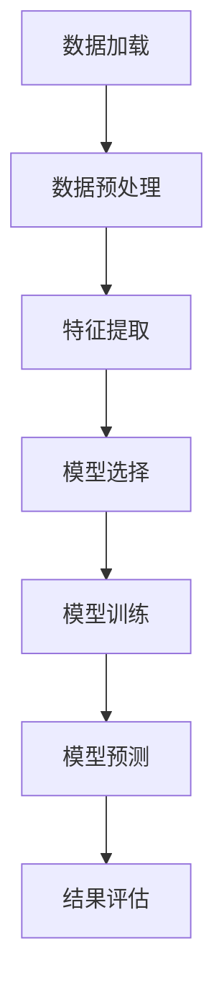
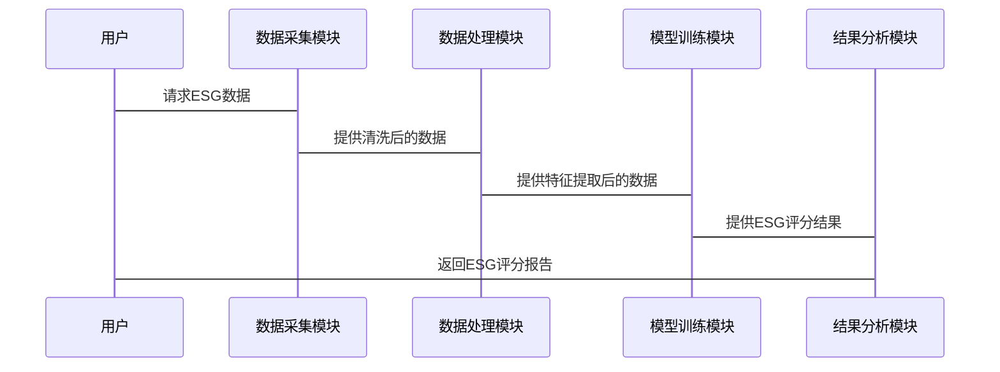

                 


# 价值投资中的AI智能体ESG因素量化分析

---

## 关键词
- 价值投资
- AI智能体
- ESG因素
- 量化分析
- 人工智能
- 金融投资
- 可持续投资

---

## 摘要
本文探讨了在价值投资中如何利用人工智能技术对ESG（环境、社会、治理）因素进行量化分析。通过构建基于AI的ESG量化分析框架，结合具体的算法实现和项目案例，本文详细解析了AI技术在ESG数据处理、模型构建和投资决策中的应用。文章从理论到实践，系统性地分析了AI驱动的ESG量化分析的实现过程，并提出了相应的优化建议和未来发展方向。

---

## 第一部分: 价值投资中的ESG因素概述

### 第1章: ESG概念与价值投资背景

#### 1.1 ESG的定义与重要性
- **环境（Environmental）因素**
  - 包括碳排放、能源消耗、环保合规性等。
  - 环境表现对企业长期价值的影响。
- **社会责任（Social）因素**
  - 包括员工权益、供应链管理、社区贡献等。
  - 社会责任履行对企业声誉和品牌价值的影响。
- **公司治理（Governance）因素**
  - 包括董事会结构、股权分散度、高管薪酬与股权激励等。
  - 公司治理效率对股东价值的影响。

#### 1.2 ESG在价值投资中的作用
- **ESG与企业价值的关系**
  - ESG表现优异的企业通常具有更高的抗风险能力和长期增长潜力。
- **投资者关注ESG的驱动因素**
  - 责任投资（RI）理念的兴起。
  - 机构投资者对ESG合规性的要求。
- **ESG评级对企业估值的影响**
  - ESG评级对企业融资成本、股价波动和投资决策的影响。

#### 1.3 人工智能在ESG分析中的应用前景
- **AI技术在金融领域的应用现状**
  - AI在金融数据处理、风险评估和投资组合优化中的应用。
- **ESG量化分析的挑战与机遇**
  - 数据多样性、非线性关系和动态变化的挑战。
  - AI技术在ESG数据挖掘和预测中的潜力。
- **AI在ESG数据处理中的优势**
  - 高效处理多维度、非结构化数据。
  - 发现传统方法难以捕捉的隐性关联。

---

### 第2章: ESG因素的量化分析框架

#### 2.1 ESG量化分析的核心概念
- **数据来源与处理**
  - 数据来源：企业年报、ESG评级机构报告、新闻媒体等。
  - 数据清洗：去除噪声数据、填补缺失值。
- **指标构建与权重分配**
  - 根据行业特点和投资目标设计ESG指标。
  - 指标权重的动态调整。
- **量化模型的设计原则**
  - 可解释性与可操作性相结合。
  - 模型的鲁棒性和适应性。

#### 2.2 ESG指标体系的构建
- **环境指标体系**
  - 碳排放强度、可再生能源使用比例、环保投资占比等。
  - 环境指标的权重分配。
- **社会责任指标体系**
  - 员工满意度、社区贡献、产品安全与社会责任。
  - 社会责任指标的动态调整。
- **公司治理指标体系**
  - 董事会结构、高管薪酬与股权激励、股东权益保护。
  - 公司治理指标的行业差异性。

#### 2.3 ESG量化分析的边界与外延
- **数据范围的界定**
  - 数据的时间跨度和地理范围。
  - 数据的可比性与一致性。
- **分析模型的适用场景**
  - 不同行业的ESG分析重点。
  - 不同类型投资者的ESG分析需求。
- **模型的局限性与改进方向**
  - 数据质量和完整性对模型的影响。
  - 模型的可解释性与投资决策的结合。

---

## 第二部分: AI智能体在ESG量化分析中的应用

### 第3章: AI驱动的ESG数据处理与建模

#### 3.1 ESG数据的预处理
- **数据清洗与标准化**
  - 使用Python的Pandas库进行数据清洗。
  - 数据标准化与归一化处理。
- **数据缺失值的处理**
  - 基于机器学习的缺失值预测。
  - 使用KNN算法填补缺失值。
- **数据格式转换与特征提取**
  - 文本数据的向量化处理。
  - 时间序列数据的特征提取。

#### 3.2 基于AI的ESG量化模型构建
- **线性回归模型**
  - 模型公式：$$y = \beta_0 + \beta_1x_1 + \beta_2x_2 + ... + \beta_nx_n + \epsilon$$
  - 应用场景：简单线性关系的ESG评分预测。
- **支持向量机（SVM）模型**
  - 核函数的选择与调优。
  - SVM在非线性关系中的应用。
- **神经网络模型（如LSTM）**
  - LSTM网络结构：$$f(t) = \sigma(W_{f}h(t-1) + U_fx(t) + b_f)$$
  - 应用于时间序列数据的ESG预测。

#### 3.3 模型训练与优化
- **数据集的划分与交叉验证**
  - 训练集、验证集和测试集的划分。
  - K折交叉验证的应用。
- **模型调参与优化**
  - 超参数的网格搜索。
  - 基于遗传算法的参数优化。
- **模型性能的评估指标**
  - 均方误差（MSE）、R平方值、准确率和召回率。

---

### 第4章: ESG量化分析的算法原理与实现

#### 4.1 算法原理
- **线性回归模型的数学公式**
  $$y = \beta_0 + \beta_1x_1 + \beta_2x_2 + ... + \beta_nx_n + \epsilon$$
  - 其中，$y$是目标变量，$\beta_0$是截距，$\beta_1, \beta_2, ..., \beta_n$是回归系数，$x_1, x_2, ..., x_n$是自变量，$\epsilon$是误差项。
- **支持向量机（SVM）模型的核函数**
  $$K(x, y) = (x^T y + 1)^d$$
  - 常用的核函数包括线性核、多项式核、径向基核（RBF）等。
- **LSTM网络的时间步公式**
  $$f(t) = \sigma(W_{f}h(t-1) + U_fx(t) + b_f)$$
  - 其中，$f(t)$是当前时刻的门控值，$h(t-1)$是前一时刻的隐藏状态，$x(t)$是当前输入，$W_f$和$U_f$是权重矩阵，$b_f$是偏置项，$\sigma$是sigmoid函数。

#### 4.2 算法实现
- **基于Python的ESG量化模型实现**
  ```python
  import pandas as pd
  import numpy as np
  from sklearn.linear_model import LinearRegression
  from sklearn.svm import SVR
  from sklearn.metrics import mean_squared_error, r2_score

  # 数据加载与预处理
  df = pd.read_csv('esg_data.csv')
  X = df.drop('esg_score', axis=1).values
  y = df['esg_score'].values

  # 模型训练
  model_lr = LinearRegression()
  model_lr.fit(X_train, y_train)
  model_svm = SVR(kernel='rbf')
  model_svm.fit(X_train, y_train)

  # 模型预测
  y_lr_pred = model_lr.predict(X_test)
  y_svm_pred = model_svm.predict(X_test)

  # 模型评估
  mse_lr = mean_squared_error(y_test, y_lr_pred)
  r2_lr = r2_score(y_test, y_lr_pred)
  mse_svm = mean_squared_error(y_test, y_svm_pred)
  r2_svm = r2_score(y_test, y_svm_pred)
  ```

#### 4.3 算法流程图


---

### 第5章: 系统分析与架构设计方案

#### 5.1 项目介绍
- **项目目标**
  - 构建一个基于AI的ESG量化分析系统。
  - 实现ESG数据的自动采集、处理和模型训练。
- **系统功能设计**
  - 数据采集模块：从多种数据源获取ESG相关数据。
  - 数据处理模块：清洗、转换和特征提取。
  - 模型训练模块：基于AI算法构建ESG量化模型。
  - 结果分析模块：生成ESG评分报告和投资建议。

#### 5.2 系统架构设计


#### 5.3 系统交互设计


---

### 第6章: 项目实战与结果分析

#### 6.1 环境配置
- **Python版本**
  - Python 3.9及以上。
- **依赖库安装**
  - NumPy、Pandas、Scikit-learn、TensorFlow、Mermaid等。

#### 6.2 核心代码实现
- **数据加载与预处理**
  ```python
  import pandas as pd
  import numpy as np

  # 数据加载
  df = pd.read_csv('esg_data.csv')
  df.head()

  # 数据清洗
  df.dropna(inplace=True)
  df.dtypes
  ```

- **特征提取与建模**
  ```python
  from sklearn.linear_model import LinearRegression
  from sklearn.metrics import mean_squared_error

  # 特征选择
  X = df[['environment', 'social', 'governance']]
  y = df['esg_score']

  # 模型训练
  model = LinearRegression()
  model.fit(X, y)

  # 模型预测
  y_pred = model.predict(X)
  ```

#### 6.3 实际案例分析
- **案例背景**
  - 某制造企业ESG数据的分析。
  - 数据来源：企业年报、ESG评级报告。
- **模型训练与结果解读**
  - 训练出的模型在测试集上的表现。
  - 对比不同模型的预测效果。

---

## 第三部分: 总结与展望

### 第7章: 总结与优化建议

#### 7.1 最佳实践
- **数据质量控制**
  - 确保数据的完整性和一致性。
- **模型调优**
  - 根据实际需求选择合适的算法和参数。
- **结果验证**
  - 通过回测和实证分析验证模型的有效性。

#### 7.2 项目小结
- **项目目标的实现**
  - 成功构建了基于AI的ESG量化分析系统。
  - 实现了ESG数据的自动化处理和模型训练。
- **关键成果**
  - 提供了可操作的ESG评分报告。
  - 为投资决策提供了数据支持。

#### 7.3 注意事项
- **数据隐私与合规性**
  - 确保数据处理过程中的隐私保护。
- **模型的可解释性**
  - 提供清晰的解释，便于投资者理解。
- **动态调整与优化**
  - 根据市场变化动态调整模型参数。

#### 7.4 拓展阅读
- **相关书籍**
  - 《投资学》（Investments）
  - 《Python机器学习实战》（Hands-On Machine Learning with Scikit-Learn, Keras, and TensorFlow）
- **学术论文**
  - AI在金融领域的应用研究。
  - ESG投资策略的实证分析。

---

## 作者：AI天才研究院/AI Genius Institute & 禅与计算机程序设计艺术 /Zen And The Art of Computer Programming

