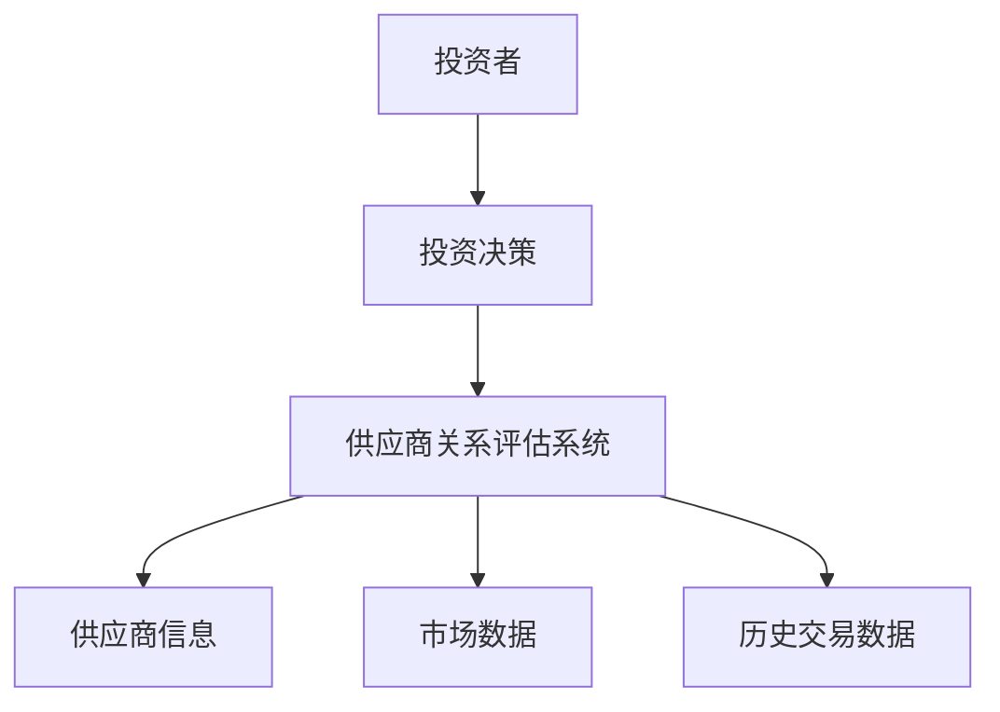
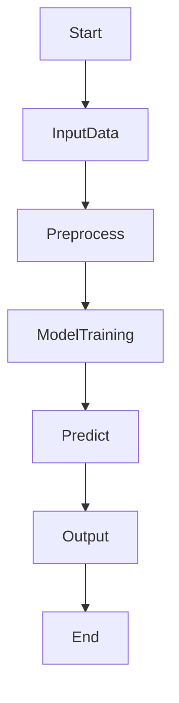
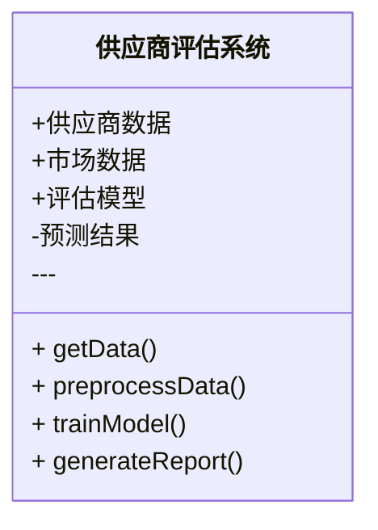
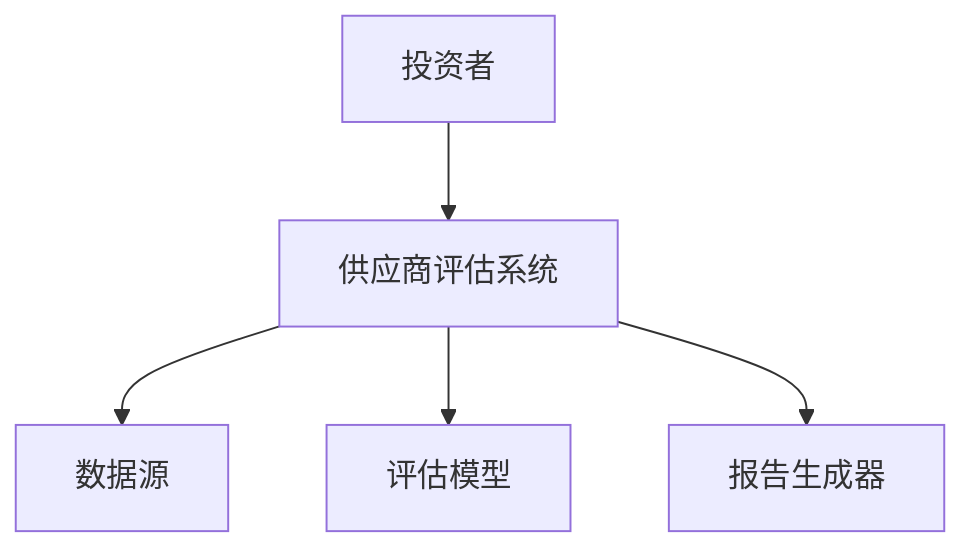
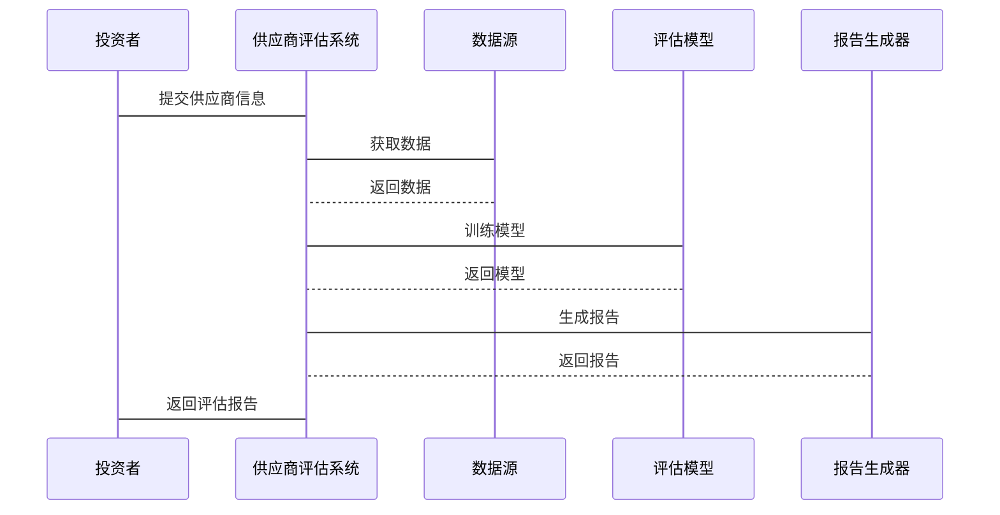

                 


# 价值投资中的AI智能体供应商关系评估系统

> 关键词：价值投资，AI智能体，供应商关系评估，算法原理，系统架构

## 摘要

在价值投资领域，供应商关系的评估对企业的长期成功至关重要。传统的供应商评估方法依赖于人工分析和有限的数据处理能力，这在面对海量数据和复杂市场环境时显得力不从心。本文提出了一种基于AI智能体的供应商关系评估系统，通过结合机器学习和自然语言处理技术，实现对供应商的多维度智能评估。本文详细阐述了该系统的背景、核心概念、算法原理、系统架构、项目实现和实际应用案例，为投资者和企业提供了一种高效、智能的供应商关系管理工具。

---

## 第一部分: 价值投资中的AI智能体供应商关系评估系统概述

### 第1章: 问题背景与价值投资中的供应商关系评估

#### 1.1 问题背景

##### 1.1.1 价值投资的核心概念
价值投资是一种以低于市场价值的价格购买优质资产的投资策略，其核心在于识别被市场低估的企业。在这一过程中，供应商关系的稳定性、可靠性和成本效益是决定企业长期价值的重要因素。

##### 1.1.2 供应商关系评估的重要性
供应商是企业供应链的核心环节，其表现直接影响企业的成本、交付能力和市场竞争力。传统供应商评估方法通常依赖于财务数据和主观判断，难以全面捕捉供应商的潜在风险和机会。

##### 1.1.3 AI技术在价值投资中的应用潜力
人工智能技术，特别是机器学习和自然语言处理，能够从海量数据中提取有价值的信息，帮助投资者更准确地评估供应商的价值。

#### 1.2 问题描述

##### 1.2.1 传统供应商关系评估的局限性
传统方法通常仅关注财务指标，忽视了供应商的市场表现、供应链稳定性等动态因素，且评估过程耗时且主观。

##### 1.2.2 价值投资中的信息不对称问题
市场中的信息分布不均，投资者难以全面了解供应商的真实情况，导致决策的不确定性和风险。

##### 1.2.3 AI技术如何解决这些问题
AI技术可以通过整合多源异构数据，构建供应商的综合画像，帮助投资者识别潜在风险和机会，降低信息不对称。

#### 1.3 问题解决与边界

##### 1.3.1 AI智能体在供应商关系评估中的作用
AI智能体能够实时监控市场动态，分析供应商的历史表现、行业地位和潜在风险，为投资者提供动态评估和决策支持。

##### 1.3.2 系统的边界与外延
该系统主要针对供应商关系评估，不涉及企业的内部管理或下游客户关系，但可以通过与其他系统的集成实现更广泛的应用。

##### 1.3.3 核心要素与组成结构
系统的核心要素包括数据采集模块、数据处理模块、AI模型、评估报告生成模块和用户界面。

### 第2章: 核心概念与联系

#### 2.1 核心概念原理

##### 2.1.1 价值投资中的关键指标
- 财务指标：如利润率、债务率、ROE等。
- 市场指标：如股价波动、行业排名、市场占有率。
- 供应链指标：如交付及时率、质量稳定性、成本控制能力。

##### 2.1.2 供应商关系评估的维度
- 供应商的历史表现：如交货准时率、产品质量。
- 供应商的财务状况：如盈利能力、现金流。
- 供应商的市场地位：如市场份额、行业排名。

##### 2.1.3 AI智能体的工作原理
AI智能体通过整合多源数据，利用机器学习算法构建供应商评估模型，生成动态评估报告。

#### 2.2 概念属性对比表

| 评估维度       | 传统方法评估 | AI智能体评估 |
|----------------|--------------|--------------|
| 数据来源       | 有限的财务数据 | 多源异构数据 |
| 评估频率       | 定期评估     | 实时动态评估 |
| 评估准确性       | 依赖人工经验   | 数据驱动，高准确性 |

#### 2.3 ER实体关系图



---

## 第二部分: 算法原理与实现

### 第3章: 算法原理与实现

#### 3.1 算法原理

##### 3.1.1 基于AI的供应商评分模型
模型基于供应商的历史交易数据、财务数据和市场表现，利用机器学习算法进行评分。

##### 3.1.2 多维度数据融合算法
通过特征工程将多源数据进行融合，构建供应商的综合评估指标。

##### 3.1.3 模型训练与优化
利用历史数据对模型进行训练，通过交叉验证优化模型参数。

#### 3.2 算法流程图



#### 3.3 Python代码实现

```python
import pandas as pd
from sklearn.model_selection import train_test_split
from sklearn.ensemble import RandomForestRegressor

def preprocess(data):
    data = data.dropna()
    data = pd.get_dummies(data)
    return data

def model_train(data, target):
    X = data.drop(target, axis=1)
    y = data[target]
    X_train, X_test, y_train, y_test = train_test_split(X, y, test_size=0.2)
    model = RandomForestRegressor(n_estimators=100, random_state=42)
    model.fit(X_train, y_train)
    return model, X_test, y_test

def predict(model, X_test):
    predictions = model.predict(X_test)
    return predictions
```

#### 3.4 数学模型与公式

##### 3.4.1 供应商评分模型

$$ \text{评分} = \alpha \times \text{财务指标} + \beta \times \text{市场表现} + \gamma \times \text{供应链稳定性} $$

##### 3.4.2 模型权重计算

$$ \alpha + \beta + \gamma = 1 $$

---

## 第三部分: 系统分析与架构设计

### 第4章: 系统分析与架构设计

#### 4.1 系统功能设计

##### 4.1.1 数据采集模块
负责从多个数据源（如财务报表、市场报告、供应链数据）采集供应商信息。

##### 4.1.2 数据处理模块
对采集的数据进行清洗、转换和特征提取，为模型训练提供高质量数据。

##### 4.1.3 AI评估模块
利用机器学习模型对供应商进行评分，并生成评估报告。

##### 4.1.4 用户界面模块
提供友好的用户界面，方便投资者查看评估结果和进行决策。

#### 4.2 系统架构设计

##### 4.2.1 领域模型类图



##### 4.2.2 系统架构图



#### 4.3 系统接口设计

##### 4.3.1 数据接口
- 输入：供应商的历史交易数据、财务数据、市场数据。
- 输出：预处理后的数据集。

##### 4.3.2 模型接口
- 输入：预处理后的数据集。
- 输出：训练好的评估模型。

##### 4.3.3 用户接口
- 输入：用户查询。
- 输出：评估报告。

#### 4.4 系统交互设计



---

## 第四部分: 项目实战

### 第5章: 项目实战

#### 5.1 环境安装

##### 5.1.1 安装Python
```bash
python --version
```

##### 5.1.2 安装依赖库
```bash
pip install pandas scikit-learn matplotlib
```

#### 5.2 核心代码实现

##### 5.2.1 数据采集与预处理

```python
import pandas as pd
import requests
from bs4 import BeautifulSoup

def fetch_data(url):
    response = requests.get(url)
    soup = BeautifulSoup(response.text, 'html.parser')
    data = []  # 数据采集逻辑
    return pd.DataFrame(data)

def preprocess_data(df):
    df = df.dropna()
    df = pd.get_dummies(df)
    return df
```

##### 5.2.2 模型训练与评估

```python
from sklearn.ensemble import RandomForestClassifier
from sklearn.metrics import accuracy_score

def train_model(X_train, y_train):
    model = RandomForestClassifier(n_estimators=100, random_state=42)
    model.fit(X_train, y_train)
    return model

def evaluate_model(model, X_test, y_test):
    y_pred = model.predict(X_test)
    print(f'Accuracy: {accuracy_score(y_test, y_pred)}')
```

##### 5.2.3 案例分析

```python
# 假设我们已经获取了供应商数据
df = fetch_data('https://example.com/supplier_data')
df_processed = preprocess_data(df)
X_train, X_test, y_train, y_test = train_test_split(df_processed, df_processed['target'], test_size=0.2)
model = train_model(X_train, y_train)
evaluate_model(model, X_test, y_test)
```

---

## 第五部分: 应用与优化

### 第6章: 应用与优化

#### 6.1 应用场景

##### 6.1.1 企业供应商管理
帮助企业优化供应商选择，降低采购成本，提高供应链效率。

##### 6.1.2 投资者决策支持
为投资者提供基于AI的供应商评估报告，辅助投资决策。

#### 6.2 优化建议

##### 6.2.1 数据优化
引入实时市场数据和更多的特征变量，提高模型的准确性。

##### 6.2.2 模型优化
尝试不同的机器学习算法，如XGBoost或神经网络，进一步提升模型性能。

##### 6.2.3 系统优化
优化系统架构，提高数据处理效率，实现实时评估。

---

## 第六部分: 最佳实践与总结

### 第7章: 最佳实践与总结

#### 7.1 最佳实践

##### 7.1.1 数据质量管理
确保数据的准确性和完整性，是模型性能的基础。

##### 7.1.2 模型解释性
选择具有高解释性的模型，便于投资者理解和决策。

##### 7.1.3 系统可扩展性
设计模块化架构，方便未来功能扩展和数据源增加。

#### 7.2 小结

本文详细介绍了基于AI智能体的供应商关系评估系统，从问题背景到系统实现，再到实际应用，为投资者和企业提供了一套高效、智能的解决方案。

#### 7.3 注意事项

- 数据隐私和安全问题需严格把控。
- 模型需定期更新，以适应市场变化。
- 系统需具备容错和容灾能力，确保稳定运行。

#### 7.4 拓展阅读

- 《机器学习实战》
- 《Python数据处理与分析》
- 《供应链管理的艺术》

---

## 作者

作者：AI天才研究院/AI Genius Institute & 禅与计算机程序设计艺术 /Zen And The Art of Computer Programming

---

# 结语

通过本文的详细介绍，读者可以深入了解基于AI的供应商关系评估系统的核心原理和实现方法。未来，随着AI技术的不断发展，此类系统将更加智能化和精准化，为价值投资和企业供应链管理带来更大的价值。

