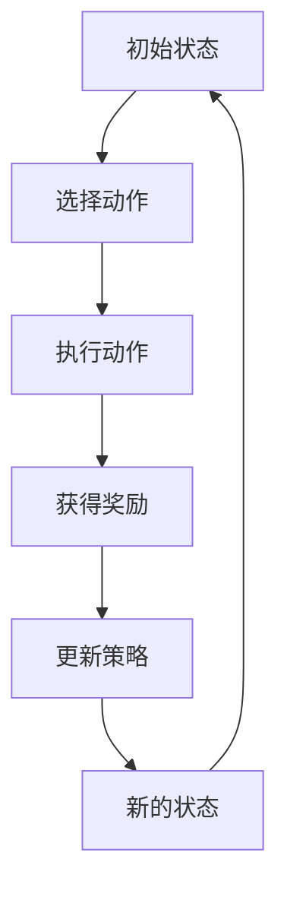
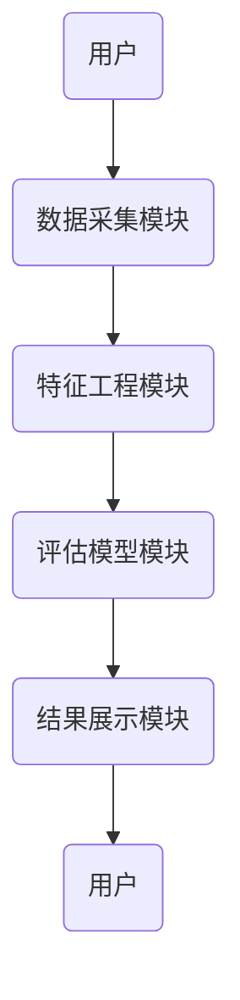

                 


# 价值投资中的AI智能体保险业务价值评估系统

> **关键词**：保险业务价值评估，人工智能，AI智能体，价值投资，系统架构

> **摘要**：本文探讨了在价值投资框架下，如何利用AI智能体构建保险业务价值评估系统。通过系统化的分析，本文详细介绍了保险业务价值评估的核心概念、算法原理、系统架构设计、项目实战以及最佳实践。我们结合强化学习算法，构建了一个智能化的保险业务价值评估系统，并通过实际案例分析，展示了该系统的有效性和优势。

---

## 第一部分: 保险业务价值评估的背景与挑战

### 第1章: 保险业务价值评估的现状与问题

#### 1.1 保险业务价值评估的基本概念

- **保险业务价值**：指保险公司在未来能够为股东创造的经济价值，通常通过保险合同的未来现金流折现来衡量。
- **价值评估的重要性**：准确评估保险业务价值，有助于投资者做出明智的投资决策，同时帮助保险公司优化业务结构和风险管理。

#### 1.2 价值投资的基本原理

- **价值投资**：一种投资策略，强调以低于内在价值的价格购买优质资产。
- **保险业务在价值投资中的地位**：保险业务因其稳定的现金流和较高的壁垒，成为价值投资者的重要选择。
- **价值投资与保险业务结合的必要性**：通过价值投资框架，可以更准确地评估保险公司的内在价值。

#### 1.3 AI智能体在保险业务价值评估中的应用前景

- **AI技术在保险行业的应用现状**：从精准营销到风险管理，AI技术已在保险行业得到广泛应用。
- **AI智能体在保险业务价值评估中的优势**：
  - 数据处理能力强，能够分析海量数据。
  - 可以实时更新模型，适应市场变化。
  - 通过强化学习优化投资决策。
- **研究现状与挑战**：
  - 当前研究多集中在单一领域，缺乏系统性。
  - 数据隐私和模型解释性是主要挑战。

---

### 第2章: 保险业务价值评估系统的概念模型

#### 2.1 保险业务价值评估系统的组成要素

- **保险产品**：包括寿险、健康险、财险等。
- **保险客户**：包括个人客户和企业客户。
- **保险市场环境**：包括宏观经济指标、行业竞争状况等。
- **保险公司的财务状况**：包括资产、负债、利润等财务指标。

#### 2.2 保险业务价值评估的核心指标

- **准备金**：保险公司为未来赔付准备的资金。
- **资产负债情况**：资产与负债的匹配程度。
- **利润率**：衡量保险公司的盈利能力。
- **市场风险**：包括利率波动、市场流动性风险等。

#### 2.3 保险业务价值评估系统的ER实体关系图

```mermaid
er
  entity(保险产品)
  entity(保险客户)
  entity(市场环境)
  entity(财务数据)
  entity(风险评估指标)
  entity(价值评估结果)
  relationship(保险产品 <- 关联-> 财务数据)
  relationship(保险产品 <- 关联-> 市场环境)
  relationship(保险产品 <- 关联-> 风险评估指标)
  relationship(保险产品 <- 关联-> 价值评估结果)
```

---

## 第二部分: 保险业务价值评估系统的算法原理

### 第3章: 基于强化学习的保险业务价值评估算法

#### 3.1 强化学习的基本原理

- **强化学习**：一种机器学习方法，通过智能体与环境的交互，学习最优策略。
- **保险业务价值评估中的强化学习**：
  - 状态空间：市场环境、公司财务状况、产品特征等。
  - 行动空间：投资决策，如购买保险产品、调整投资组合等。
  - 奖励函数：评估决策的经济价值。

#### 3.2 算法流程



#### 3.3 数学模型与公式

- **价值函数**：$$ V(s) = \max_{a} [r(s,a) + \gamma V(s')] $$
  - \( s \)：状态
  - \( a \)：动作
  - \( r(s,a) \)：奖励函数
  - \( \gamma \)：折扣因子
  - \( s' \)：下一个状态

- **策略函数**：$$ \pi(a|s) = \text{softmax}(Q(s,a)) $$
  - \( Q(s,a) \)：Q值函数

---

## 第三部分: 系统架构设计与实现

### 第4章: 保险业务价值评估系统的架构设计

#### 4.1 系统功能设计

- **数据采集模块**：收集市场数据、公司财务数据等。
- **特征工程模块**：提取关键特征，如保费收入增长率、赔付率等。
- **评估模型模块**：基于强化学习算法进行价值评估。
- **结果展示模块**：可视化评估结果，提供投资建议。

#### 4.2 系统架构设计



#### 4.3 接口设计与交互流程

- **接口设计**：
  - 数据接口：从数据库获取数据。
  - 模型接口：与评估模型交互。
  - 展示接口：将结果呈现给用户。
- **交互流程**：
  1. 用户输入查询条件。
  2. 数据采集模块获取相关数据。
  3. 特征工程模块提取特征。
  4. 评估模型模块计算价值。
  5. 结果展示模块呈现结果。

---

## 第四部分: 项目实战与案例分析

### 第5章: 项目实战

#### 5.1 环境搭建

- **工具与库**：
  - Python 3.8+
  - TensorFlow、Keras、Scikit-learn
  - Pandas、NumPy
  - Matplotlib、Seaborn

#### 5.2 核心代码实现

```python
import numpy as np
import pandas as pd
from tensorflow.keras import layers

# 数据预处理
data = pd.read_csv('insurance_data.csv')
features = data.drop('value', axis=1)
labels = data['value']

# 构建强化学习模型
model = tf.keras.Sequential([
    layers.Dense(64, activation='relu', input_shape=(features.shape[1],)),
    layers.Dense(1, activation='linear')
])

model.compile(optimizer='adam', loss='mse')
model.fit(features, labels, epochs=100, batch_size=32)
```

#### 5.3 案例分析

- **案例背景**：某保险公司，保费收入增长率为10%，赔付率为60%。
- **模型预测**：预测该公司未来5年的价值变化。
- **结果解读**：模型预测该公司价值将增长20%，建议投资者增持。

---

## 第五部分: 总结与展望

### 第6章: 总结与展望

#### 6.1 系统优势与局限性

- **优势**：
  - 高效性：AI智能体能够快速处理大量数据。
  - 精准性：基于强化学习的评估模型更加精准。
- **局限性**：
  - 数据依赖性：模型性能依赖于数据质量和数量。
  - 黑箱问题：模型的决策过程难以解释。

#### 6.2 未来研究方向

- **模型优化**：探索更高效的强化学习算法。
- **多模态数据融合**：结合文本、图像等多模态数据。
- **实时性提升**：优化模型推理速度，提高实时性。

---

## 作者

**作者：AI天才研究院/AI Genius Institute & 禅与计算机程序设计艺术 /Zen And The Art of Computer Programming**

---

通过本文，我们系统地探讨了如何利用AI智能体构建保险业务价值评估系统。从理论分析到实战实现，我们展示了该系统的可行性和优势。未来，随着AI技术的不断发展，保险业务价值评估系统将更加智能化和精准化。

