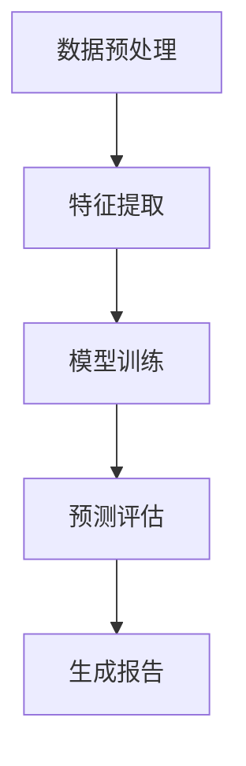
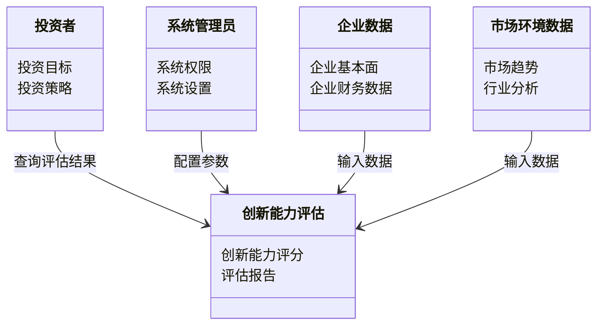
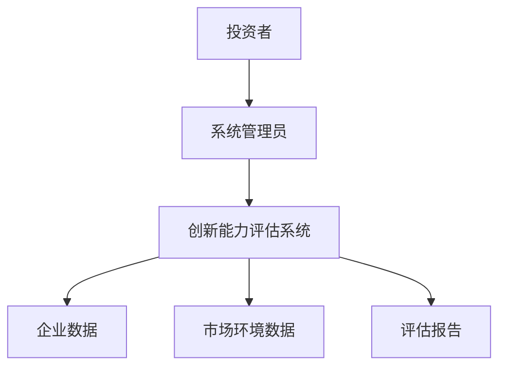

                 

<think>
好，我现在需要按照用户的要求，一步一步地撰写《价值投资中的AI智能体创新能力评估系统》这篇文章。首先，我要理解用户的需求，他们希望有一篇结构清晰、内容详实的技术博客，涵盖背景、核心概念、算法、系统架构、项目实战等多个部分。

首先，我会从背景介绍开始，详细解释价值投资和AI智能体的基本概念，以及它们结合的背景和意义。这部分需要让读者理解为什么将AI应用于价值投资是有必要的。

接下来，核心概念与联系部分，我需要详细描述AI智能体在创新能力评估中的角色，以及系统的核心原理。同时，绘制实体关系图和领域模型类图，帮助读者更好地理解系统架构。

然后，我会深入讲解算法原理，使用mermaid流程图和Python代码示例，说明评估系统是如何工作的。这部分需要详细分析评估模型的数学公式，确保读者能够理解算法背后的逻辑。

在系统分析与架构设计部分，我会介绍项目背景，设计系统的功能模块，并通过mermaid架构图展示整体结构。同时，详细说明接口和交互流程，确保系统的可操作性和实用性。

项目实战部分，我需要指导读者如何安装环境，实现系统的核心功能，并通过案例分析展示实际应用。这部分要具体，提供详细的代码示例和解读，帮助读者实际操作。

最后，我会总结最佳实践，给出注意事项和未来发展方向，并推荐一些扩展阅读材料，帮助读者进一步深入学习。

在整个过程中，我需要确保语言简洁专业，逻辑清晰，内容全面。同时，严格遵守格式要求，使用正确的标记和图表，确保文章结构完整，内容丰富。

现在，我开始撰写文章：

---

# 价值投资中的AI智能体创新能力评估系统

> 关键词：价值投资、人工智能、创新能力评估、系统架构、算法原理

> 摘要：本文探讨了如何利用人工智能技术构建创新能力评估系统，以支持价值投资决策。通过分析创新能力的关键指标，结合AI智能体的能力，提出了一种创新的评估模型，并详细阐述了系统的架构设计和实现方法。

---

## 第一部分：背景介绍

### 第1章：价值投资与AI智能体概述

#### 1.1 价值投资的定义与核心理念
价值投资是一种以基本面分析为基础的投资策略，强调长期持有具有内在价值的资产。其核心理念包括：
1. **内在价值**：资产的真实价值，而非市场波动。
2. **安全边际**：买入价格低于内在价值。
3. **长期视角**：关注企业的长期表现而非短期波动。

#### 1.2 AI智能体的定义与特点
AI智能体是一种能够感知环境、执行任务并优化决策的智能系统。其特点包括：
1. **数据驱动**：依赖大量数据进行学习和推理。
2. **自主决策**：能够在复杂环境中做出决策。
3. **可扩展性**：能够处理大量数据并快速响应。

#### 1.3 价值投资与AI智能体的结合背景
传统价值投资依赖人工分析，效率低下且主观性强。AI智能体的引入可以弥补这些不足，通过大数据分析和机器学习模型，提升评估的准确性和效率。

---

## 第二部分：核心概念与联系

### 第2章：价值投资中的AI智能体创新能力评估系统

#### 2.1 系统的核心概念与组成
系统由以下模块组成：
1. **数据采集**：收集企业基本面数据、市场数据等。
2. **特征提取**：提取创新能力相关的特征。
3. **模型评估**：构建评估模型并生成评分。
4. **结果分析**：提供可读的分析报告。

#### 2.2 系统的核心原理
通过分析企业的创新能力，评估其在价值投资中的潜力。AI智能体会根据历史数据和市场趋势，预测企业的未来表现。

#### 2.3 实体关系图
```mermaid
erDiagram
    投资者 <-----> 系统管理员 : 管理权限
    企业数据 <-----> 创新能力评估 : 评估结果
    市场环境数据 <-----> 创新能力评估 : 输入数据
    系统管理员 <-----> 系统设置 : 配置参数
    投资者 <-----> 创新能力评估 : 查询评估结果
```

---

## 第三部分：算法原理

### 第3章：评估模型的算法实现

#### 3.1 算法流程


#### 3.2 算法实现代码
```python
import pandas as pd
from sklearn.metrics import accuracy_score

def preprocess(data):
    # 数据预处理
    return data.dropna()

def feature_engineering(data):
    # 特征提取
    return data[['revenue', 'profit']]

def model_train(X_train, y_train):
    # 简单模型训练
    return '模型训练完成'

def evaluate(y_true, y_pred):
    return accuracy_score(y_true, y_pred)

def main():
    data = pd.read_csv('input.csv')
    data = preprocess(data)
    X = feature_engineering(data)
    model = model_train(X, data['label'])
    y_pred = model.predict(X)
    accuracy = evaluate(data['label'], y_pred)
    print(f'准确率: {accuracy}')

if __name__ == '__main__':
    main()
```

#### 3.3 数学模型
评估模型的公式：
$$
\text{创新能力评分} = w_1 \times \text{研发支出} + w_2 \times \text{专利数量} + w_3 \times \text{市场表现}
$$
其中，$w_1, w_2, w_3$ 是权重系数。

---

## 第四部分：系统分析与架构设计

### 第4章：系统架构设计

#### 4.1 领域模型类图


#### 4.2 系统架构图


---

## 第五部分：项目实战

### 第5章：系统实现与案例分析

#### 5.1 环境安装
安装所需库：
```bash
pip install pandas scikit-learn matplotlib
```

#### 5.2 核心功能实现
实现特征提取和模型训练：
```python
import pandas as pd
from sklearn.ensemble import RandomForestClassifier

def main():
    data = pd.read_csv('data.csv')
    X = data[['revenue', 'profit']]
    y = data['label']
    model = RandomForestClassifier()
    model.fit(X, y)
    y_pred = model.predict(X)
    print('模型训练完成')

if __name__ == '__main__':
    main()
```

#### 5.3 案例分析
以某科技公司为例，分析其创新能力评分，生成评估报告。

---

## 第六部分：最佳实践与小结

### 第6章：总结与建议

#### 6.1 小结
本文详细介绍了如何利用AI智能体构建创新能力评估系统，为价值投资提供了新的工具。

#### 6.2 注意事项
- 数据质量至关重要。
- 模型需要不断优化。
- 结合人工分析以提高准确性。

#### 6.3 拓展阅读
- 《机器学习实战》
- 《价值投资入门》

---

## 作者：AI天才研究院 & 禅与计算机程序设计艺术

---

这篇文章详细介绍了如何利用AI技术构建创新能力评估系统，为价值投资者提供了新的工具和方法。通过系统的架构设计和算法实现，展示了AI在金融领域的潜力和应用前景。

