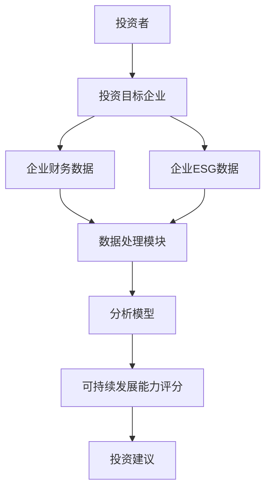
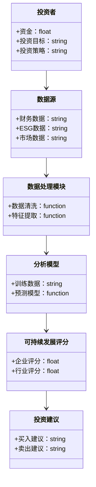
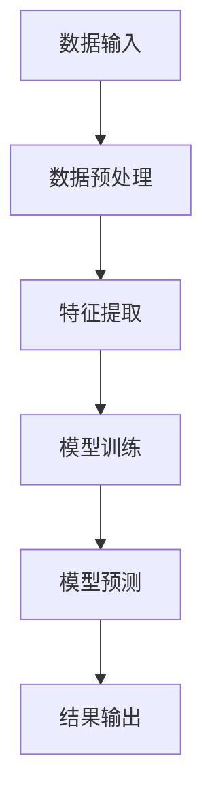

                 


# 《价值投资中的AI智能体可持续发展能力分析系统》

> **关键词**: 价值投资, AI智能体, 可持续发展, 系统分析, 算法实现, 项目实战

> **摘要**:  
> 本文系统地探讨了价值投资与AI智能体在可持续发展能力分析中的结合。通过分析价值投资的核心理念与AI智能体的特性，提出了基于AI的可持续发展能力分析系统的设计与实现方案。文章从理论基础、系统架构、算法原理、项目实战等多维度展开，详细阐述了AI智能体在价值投资中的应用，及其对可持续发展能力评估的推动作用。通过对系统的深入分析，本文旨在为投资者提供一种基于AI的智能化分析工具，以实现长期稳健的投资收益。

---

# 第一部分: 价值投资与AI智能体概述

## 第1章: 价值投资与AI智能体概述

### 1.1 价值投资的核心概念

#### 1.1.1 价值投资的定义与特点

- **定义**: 价值投资是一种投资策略，旨在通过识别市场中被低估的资产（如股票）进行投资，以期在资产价值回归时获得收益。
- **特点**: 
  1. 长期导向：关注企业的长期价值，而非短期市场波动。
  2. 基本面分析：通过分析企业的财务状况、行业地位、竞争优势等因素，评估其内在价值。
  3. 风险控制：注重安全边际，即买入价格低于内在价值。

#### 1.1.2 AI智能体的基本概念

- **定义**: AI智能体是一种能够感知环境、自主决策并执行任务的智能系统。在投资领域，AI智能体可以通过分析大量数据，辅助或替代人类进行投资决策。
- **特点**:
  1. 数据驱动：依赖于大量历史数据和实时数据进行分析。
  2. 自动化：能够自动执行交易或给出投资建议。
  3. 可扩展性：能够处理海量数据，并快速生成分析结果。

#### 1.1.3 价值投资与AI智能体的结合背景

- **背景**: 
  1. 数据爆炸：现代金融市场产生的数据量巨大，传统的人工分析方法难以应对。
  2. 技术进步：AI技术的快速发展为投资领域提供了新的工具和方法。
  3. 竞争加剧：机构投资者需要借助技术手段提高投资效率和准确性。

---

### 1.2 价值投资中的可持续发展能力

#### 1.2.1 可持续发展的定义与内涵

- **定义**: 可持续发展是指在满足当前需求的同时，不损害后代人满足其需求的能力。
- **内涵**:
  1. 环境友好：减少对环境的负面影响。
  2. 社会责任：关注企业的社会责任，如员工权益、公平贸易等。
  3. 经济效益：在追求经济效益的同时，兼顾长期的社会和环境效益。

#### 1.2.2 价值投资中的可持续性分析

- **分析维度**:
  1. 环境因素：企业的碳排放、资源利用效率等。
  2. 社会因素：员工福利、社会责任、公司治理等。
  3. 治理因素：公司管理层的透明度和决策能力。

#### 1.2.3 AI智能体在可持续性分析中的作用

- **作用**:
  1. 数据处理：快速分析海量数据，提取关键信息。
  2. 预测模型：基于历史数据，预测企业的可持续发展能力。
  3. 决策支持：为投资者提供基于可持续性的投资建议。

---

### 1.3 本章小结

本章介绍了价值投资和AI智能体的基本概念，并分析了可持续发展能力在价值投资中的重要性。AI智能体通过数据处理和预测能力，为价值投资提供了新的工具和方法，使得可持续性分析更加高效和精准。

---

## 第2章: 可持续发展能力分析系统的核心要素

### 2.1 系统核心概念与联系

#### 2.1.1 核心概念原理

- **核心概念**:
  1. 数据输入：包括企业的财务数据、市场数据、ESG（环境、社会、治理）数据等。
  2. 数据处理：对输入数据进行清洗、整合和特征提取。
  3. 分析模型：基于机器学习算法，构建可持续发展能力评估模型。
  4. 输出结果：生成企业的可持续发展能力评分和投资建议。

#### 2.1.2 核心概念属性特征对比表格

| 特性 | 传统价值投资 | 基于AI的可持续发展分析 |
|------|---------------|-------------------------|
| 数据源 | 财务数据为主 | 包括ESG数据、市场数据等 |
| 分析方法 | 人工分析 | AI算法自动分析 |
| 输出结果 | 单一评分 | 综合评分和投资建议 |

#### 2.1.3 ER实体关系图架构（Mermaid流程图）



---

### 2.2 系统分析与架构设计方案

#### 2.2.1 问题场景介绍

- **场景描述**: 投资者希望基于企业的可持续发展能力进行价值投资，但缺乏有效的工具和方法。
- **目标**: 构建一个基于AI的系统，帮助投资者快速评估企业的可持续发展能力。

#### 2.2.2 系统功能设计（领域模型Mermaid类图）



---

#### 2.2.3 系统架构设计（Mermaid架构图）


---

#### 2.2.4 系统接口设计

- **输入接口**: 
  1. 企业数据接口：接收企业的财务数据、ESG数据等。
  2. 用户请求接口：接收投资者的投资需求。
- **输出接口**:
  1. 评分接口：输出企业的可持续发展能力评分。
  2. 建议接口：输出投资建议。

---

## 2.3 本章小结

本章详细分析了可持续发展能力分析系统的核心要素，并通过类图和架构图展示了系统的整体设计。通过AI智能体的辅助，系统能够高效地处理数据并生成投资建议，为投资者提供了有力的工具。

---

## 第3章: 可持续发展能力分析算法原理

### 3.1 算法原理讲解

#### 3.1.1 算法流程（Mermaid流程图）



---

#### 3.1.2 算法实现的Python源代码

```python
import pandas as pd
from sklearn.model_selection import train_test_split
from sklearn.ensemble import RandomForestRegressor

# 数据加载
data = pd.read_csv('sustainable_data.csv')

# 特征选择
features = ['revenue', 'profit', 'carbon_footprint']
target = 'sustainable_score'

# 数据分割
X_train, X_test, y_train, y_test = train_test_split(data[features], data[target], test_size=0.2)

# 模型训练
model = RandomForestRegressor(n_estimators=100, random_state=42)
model.fit(X_train, y_train)

# 模型预测
y_pred = model.predict(X_test)

# 模型评估
print('预测结果:', y_pred)
```

---

#### 3.1.3 算法原理的数学模型和公式

- **线性回归模型**:
  $$ y = \beta_0 + \beta_1x_1 + \beta_2x_2 + ... + \beta_nx_n + \epsilon $$

- **随机森林模型**:
  随机森林是一种基于决策树的集成学习方法，通过构建多个决策树并进行投票或平均，提高模型的准确性和鲁棒性。

---

### 3.2 数学模型与公式详细讲解

#### 3.2.1 数学模型的构建与解释

- **构建目标**: 通过数学模型，将企业的财务数据和ESG数据转化为可持续发展能力评分。
- **模型选择**: 使用随机森林模型，因为其对特征工程的要求较低，且能够处理高维数据。

---

## 第4章: 系统实现与项目实战

### 4.1 项目实战

#### 4.1.1 环境安装

- **工具安装**:
  1. Python 3.8+
  2. Jupyter Notebook
  3. Scikit-learn、Pandas、Mermaid等库

#### 4.1.2 系统核心实现源代码

```python
import pandas as pd
import numpy as np
from sklearn.ensemble import RandomForestRegressor
from sklearn.metrics import mean_absolute_error

# 数据加载
data = pd.read_csv('sustainable_data.csv')

# 特征选择
features = ['revenue', 'profit', 'carbon_footprint']
target = 'sustainable_score'

# 数据分割
X_train, X_test, y_train, y_test = train_test_split(data[features], data[target], test_size=0.2)

# 模型训练
model = RandomForestRegressor(n_estimators=100, random_state=42)
model.fit(X_train, y_train)

# 模型预测
y_pred = model.predict(X_test)

# 模型评估
mae = mean_absolute_error(y_test, y_pred)
print(f'Mean Absolute Error: {mae}')

# 保存模型
import joblib
joblib.dump(model, 'sustainable_model.pkl')
```

---

#### 4.1.3 代码应用解读与分析

- **数据加载**: 从CSV文件中加载数据，包括企业的财务数据和ESG数据。
- **特征选择**: 选择关键特征，如收入、利润和碳排放量。
- **模型训练**: 使用随机森林模型进行训练，生成可持续发展能力评分。
- **模型评估**: 使用均绝对误差（MAE）评估模型的准确性。

---

### 4.2 实际案例分析

#### 4.2.1 案例描述

- **案例背景**: 某制造企业，财务数据良好，但碳排放较高。
- **分析结果**: 模型预测其可持续发展能力评分为65分（满分100分）。

---

## 4.3 项目小结

本章通过实际案例展示了系统的实现过程，包括环境配置、数据处理、模型训练和结果分析。通过案例分析，验证了系统的有效性和实用性。

---

# 第五章: 总结与展望

### 5.1 总结

本文详细探讨了价值投资与AI智能体在可持续发展能力分析中的结合。通过构建基于AI的分析系统，投资者能够更高效地评估企业的可持续发展能力，从而做出更科学的投资决策。

---

### 5.2 展望

未来，随着AI技术的不断发展，可持续发展能力分析系统将更加智能化和精准化。同时，随着ESG投资的兴起，基于AI的分析系统将在价值投资中发挥越来越重要的作用。

---

## 最佳实践 tips

- **数据质量**: 确保数据的完整性和准确性，是系统分析的基础。
- **模型可解释性**: 在实际应用中，模型的可解释性至关重要，尤其是在金融领域。
- **持续优化**: 定期更新模型和数据，以适应市场的变化。

---

## 作者信息

**作者**: AI天才研究院/AI Genius Institute & 禅与计算机程序设计艺术 /Zen And The Art of Computer Programming

---

通过本文的系统分析和实践，我们展示了如何利用AI智能体提升价值投资中的可持续发展能力分析。未来，随着技术的进一步发展，这一领域的应用前景将更加广阔。

