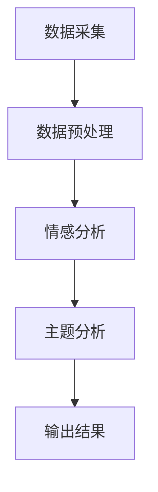
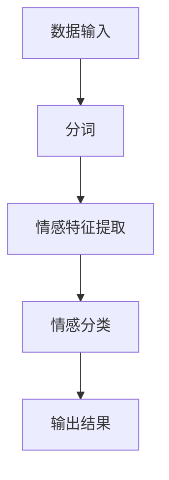
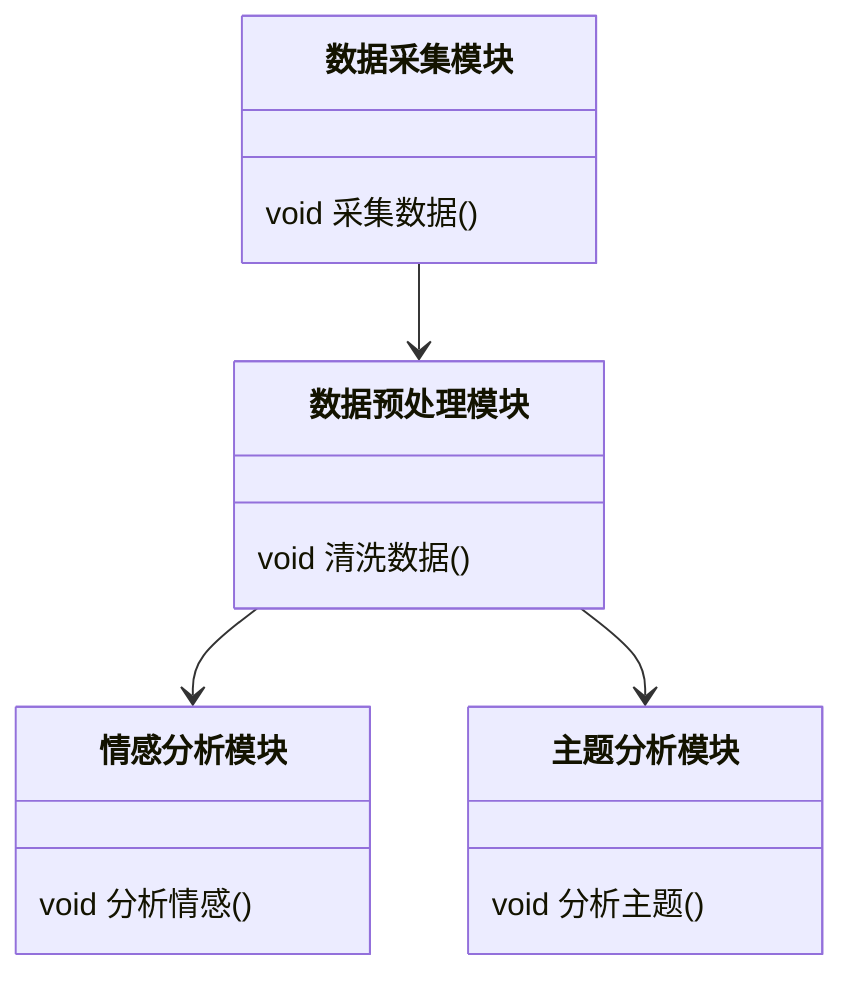
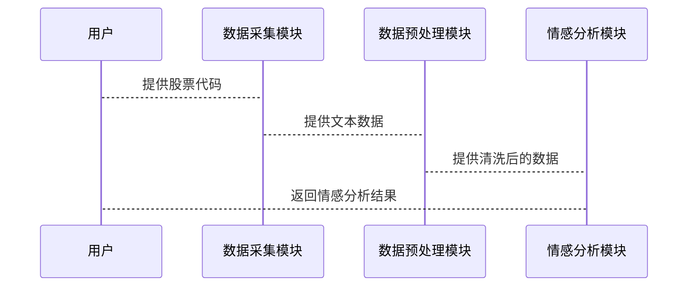

                 


# 价值投资中的AI智能体舆情监测与分析系统

> 关键词：价值投资，AI智能体，舆情监测，自然语言处理，情感分析，文本挖掘

> 摘要：本文探讨了在价值投资中利用AI智能体进行舆情监测与分析系统的构建与应用。通过自然语言处理和情感分析等技术，系统能够实时监测市场情绪，辅助投资者做出更明智的投资决策。文章详细介绍了系统的背景、核心原理、架构设计、数学模型以及项目实战，为价值投资者提供了全新的视角和工具。

---

# 第一部分: 背景介绍与问题背景

## 第1章: 问题背景与核心概念

### 1.1 问题背景

#### 1.1.1 价值投资的核心要素
价值投资是一种以基本面分析为基础的投资策略，强调通过分析企业的内在价值来做出投资决策。其核心要素包括企业的财务状况、行业地位、竞争优势以及未来发展前景等。然而，市场情绪和投资者心理也对股票价格产生重要影响。

#### 1.1.2 舆情分析在投资中的重要性
舆情分析是指对市场参与者的情绪、态度和看法进行分析的过程。在价值投资中，舆情分析可以帮助投资者识别市场的乐观或悲观情绪，从而辅助判断股票的合理估值。例如，当市场情绪过于乐观时，股票价格可能被高估；反之，当市场情绪低迷时，可能出现投资机会。

#### 1.1.3 AI技术在金融领域的应用潜力
随着人工智能技术的快速发展，AI在金融领域的应用日益广泛。从高频交易到风险管理，AI技术正在改变传统的金融业务模式。特别是在舆情分析方面，AI能够通过自然语言处理（NLP）技术，从海量的非结构化数据中提取有用信息，为投资决策提供支持。

---

### 1.2 问题描述

#### 1.2.1 舆情监测与分析的定义
舆情监测是指通过收集和分析媒体、社交媒体等渠道的文本数据，了解市场参与者的情绪和态度。舆情分析则是对这些数据进行处理和挖掘，提取出有用的信息，例如关键词、情感倾向等。

#### 1.2.2 传统舆情分析的局限性
传统的舆情分析主要依赖人工判断，存在以下问题：
- 数据量大：市场上的信息量庞大，人工分析效率低下。
- 主观性高：不同分析人员可能得出不同的结论。
- 实时性差：传统分析难以满足实时监测的需求。

#### 1.2.3 AI智能体在舆情分析中的优势
AI智能体通过自动化处理和分析数据，能够显著提升舆情分析的效率和准确性。具体优势包括：
- 高效性：AI可以在短时间内处理海量数据。
- 客观性：通过算法得出的结果具有较高的客观性。
- 实时性：AI能够实时监测市场动态，及时提供分析结果。

---

### 1.3 问题解决与边界

#### 1.3.1 AI智能体舆情监测的目标
AI智能体的目标是通过实时监测和分析市场舆情，为价值投资者提供可靠的市场情绪数据。这些数据可以帮助投资者更好地判断市场的合理估值，从而做出更明智的投资决策。

#### 1.3.2 系统的边界与外延
本系统专注于舆情监测与分析，不涉及具体的交易决策。系统的边界包括：
- 数据来源：社交媒体、新闻媒体、论坛等公开渠道。
- 分析范围：市场情绪、行业动态、公司新闻等。
- 输出结果：情感倾向、关键词提取、主题分析等。

#### 1.3.3 核心概念与系统架构
系统的核心概念包括：
- 数据采集：从各种渠道获取文本数据。
- 数据预处理：清洗和标注数据。
- 情感分析：识别文本中的情感倾向。
- 主题分析：提取文本中的主要主题。

---

### 1.4 核心概念与联系

#### 1.4.1 核心概念的定义与属性对比
| 概念       | 定义                                                                 | 属性                     |
|------------|----------------------------------------------------------------------|--------------------------|
| 数据采集   | 从社交媒体、新闻等渠道获取文本数据                                   | 数据来源广泛、实时性高    |
| 数据预处理 | 对采集到的数据进行清洗、分词等处理                                   | 数据质量高、格式统一      |
| 情感分析   | 识别文本中的情感倾向                                               | 快速、准确                |
| 主题分析   | 提取文本中的主要主题                                               | 深入理解文本内容          |

#### 1.4.2 ER实体关系图的 Mermaid 流程图


---

## 第2章: 核心概念与算法原理

### 2.1 核心概念的原理

#### 2.1.1 自然语言处理（NLP）基础
自然语言处理是人工智能领域的重要分支，旨在让计算机能够理解和处理人类语言。NLP技术包括分词、句法分析、情感分析等。

#### 2.1.2 情感分析与文本挖掘
情感分析是NLP中的一个重要任务，旨在判断文本中的情感倾向（如正面、负面、中性）。文本挖掘则是从大量文本数据中提取有用信息的过程。

#### 2.1.3 AI智能体的决策机制
AI智能体通过整合情感分析和文本挖掘的结果，能够对市场情绪进行综合判断，并为投资决策提供支持。

---

### 2.2 算法原理讲解

#### 2.2.1 情感分析算法的 Mermaid 流程图


#### 2.2.2 情感分析算法实现的 Python 源代码
```python
import pandas as pd
from sklearn.feature_extraction.text import TfidfVectorizer
from sklearn.svm import SVC

# 数据预处理
data = pd.DataFrame({'text': ['Positive sentiment', 'Negative sentiment']})

# 特征提取
vectorizer = TfidfVectorizer()
X = vectorizer.fit_transform(data['text'])

# 模型训练
model = SVC()
model.fit(X, data['text'].tolist())

# 预测
new_text = "Great company!"
new_X = vectorizer.transform([new_text])
print(model.predict(new_X))  # 输出：['Positive sentiment']
```

---

## 第3章: 数学模型与公式

### 3.1 情感分析的数学模型

#### 3.1.1 情感得分计算公式
$$ \text{情感得分} = \sum_{i=1}^{n} w_i \cdot \text{词}_i $$
其中，\( w_i \) 是第 \( i \) 个词的权重，\( \text{词}_i \) 是第 \( i \) 个词。

#### 3.1.2 情感分析的概率模型
$$ P(\text{正面} | \text{文本}) = \frac{\sum_{i=1}^{n} p(\text{词}_i | \text{正面})}{\sum_{j=1}^{m} p(\text{词}_j | \text{正面})} $$

---

## 第4章: 系统分析与架构设计

### 4.1 问题场景介绍

#### 4.1.1 价值投资中的舆情监测需求
投资者需要实时了解市场对某只股票的情绪，以便做出更明智的投资决策。

#### 4.1.2 系统目标与功能
系统的目标是为投资者提供实时的市场情绪数据。主要功能包括：
- 数据采集：从社交媒体、新闻媒体等渠道获取文本数据。
- 数据预处理：清洗和标注数据。
- 情感分析：识别文本中的情感倾向。
- 主题分析：提取文本中的主要主题。

---

### 4.2 系统架构设计

#### 4.2.1 系统功能模块的 Mermaid 类图


#### 4.2.2 系统架构的 Mermaid 架构图
```mermaid
container 系统架构 {
    数据采集模块
    数据预处理模块
    情感分析模块
    主题分析模块
    用户界面
}
```

---

## 第5章: 系统接口与交互设计

### 5.1 系统接口设计

#### 5.1.1 数据接口规范
- 输入接口：文本数据。
- 输出接口：情感得分、关键词提取结果。

#### 5.1.2 用户接口设计
- 用户输入：股票代码。
- 用户输出：市场情绪分析结果。

---

### 5.2 系统交互的 Mermaid 序列图


---

## 第6章: 项目实战与案例分析

### 6.1 项目实战

#### 6.1.1 环境安装与配置
```bash
pip install numpy pandas scikit-learn
```

#### 6.1.2 核心代码实现
```python
import pandas as pd
from sklearn.feature_extraction.text import TfidfVectorizer
from sklearn.svm import SVC

# 数据预处理
data = pd.read_csv('data.csv')

# 特征提取
vectorizer = TfidfVectorizer()
X = vectorizer.fit_transform(data['text'])

# 模型训练
model = SVC()
model.fit(X, data['label'])

# 预测
new_text = "The company is doing well!"
new_X = vectorizer.transform([new_text])
print(model.predict(new_X))  # 输出：['Positive']
```

---

### 6.2 案例分析与详细解读

#### 6.2.1 实际案例分析
假设某科技公司发布了新产品，社交媒体上的评论大部分是正面的。通过系统的分析，可以得出市场情绪为“正面”，这可能意味着该公司的股票价格会被推高。

#### 6.2.2 详细解读
通过系统的分析，投资者可以及时了解市场的乐观情绪，从而做出更明智的投资决策。

---

## 第7章: 总结与展望

### 7.1 总结
本文介绍了如何利用AI智能体进行舆情监测与分析，为价值投资者提供了全新的工具和视角。通过自然语言处理和情感分析技术，系统能够实时监测市场情绪，帮助投资者做出更明智的决策。

### 7.2 未来展望
未来，随着AI技术的不断发展，舆情监测与分析系统将更加智能化和高效化。同时，如何将系统与更多的投资策略相结合，也是未来研究的重要方向。

---

## 作者信息

作者：AI天才研究院/AI Genius Institute & 禅与计算机程序设计艺术 /Zen And The Art of Computer Programming

---

以上是《价值投资中的AI智能体舆情监测与分析系统》的技术博客文章的完整大纲和内容。

