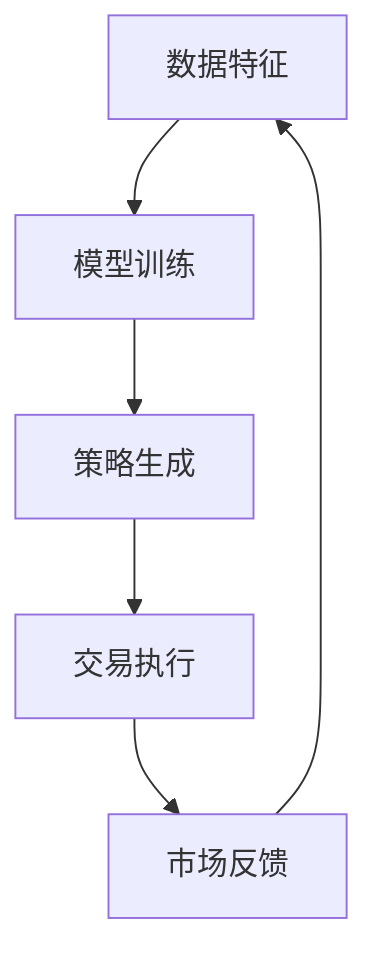
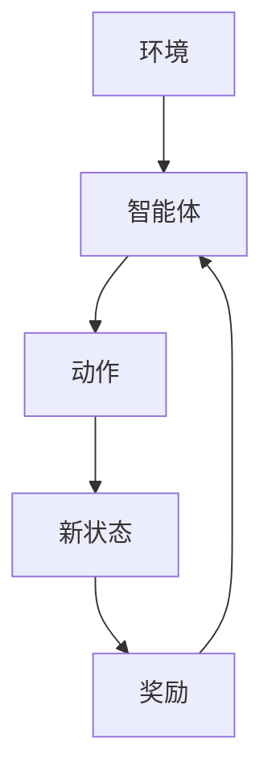
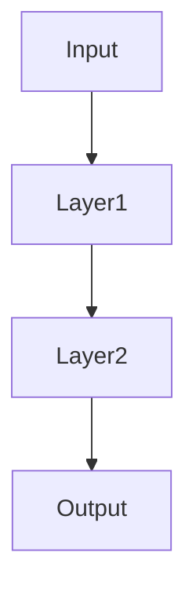
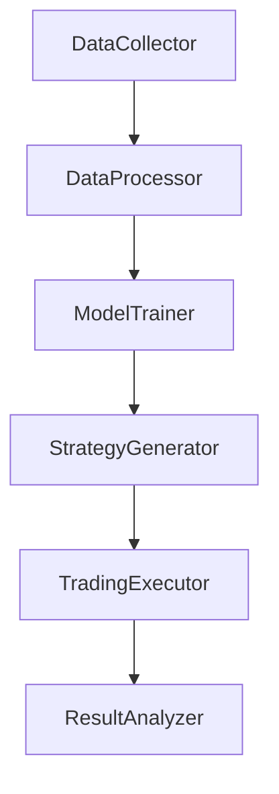

                 


# 价值投资中的AI智能体跨周期分析系统

## 关键词：价值投资，AI智能体，跨周期分析，金融投资，系统设计

## 摘要：  
本文深入探讨了如何将人工智能技术应用于价值投资中的跨周期分析系统。通过结合价值投资的核心理念和AI智能体的强大分析能力，构建了一个能够适应市场周期波动、优化投资策略的智能系统。本文从系统设计、算法原理、项目实战等多个角度进行详细分析，旨在为投资者提供一种高效、可靠的决策支持工具。

---

# 第1章: 价值投资与AI智能体的结合

## 1.1 价值投资的基本概念  
### 1.1.1 价值投资的定义  
价值投资是一种投资策略，其核心思想是寻找市场中被低估的资产，并长期持有，等待其价值回归。这种策略强调对基本面的深入分析，注重安全边际和长期回报。  

### 1.1.2 价值投资的核心思想  
- 市场先生：市场的短期波动往往由情绪驱动，但长期趋势由内在价值决定。  
- 安全边际：买入价格低于内在价值，以降低投资风险。  
- 长期视角：关注企业的长期盈利能力，而非短期市场波动。  

### 1.1.3 价值投资的传统方法与局限性  
传统价值投资依赖人工分析，存在以下局限性：  
1. 数据处理能力有限：面对海量数据时，人工分析效率低下。  
2. 模型固定化：传统模型难以适应市场周期的变化。  
3. 人为情绪影响：投资者情绪可能干扰决策。  

---

## 1.2 AI智能体在金融投资中的应用  
### 1.2.1 AI智能体的定义  
AI智能体是一种能够感知环境、自主决策并执行任务的智能系统。在金融领域，AI智能体可以用于数据处理、模式识别和策略优化。  

### 1.2.2 AI智能体在金融投资中的角色  
1. 数据处理与特征提取：从海量数据中提取有用的特征，帮助识别市场趋势。  
2. 模型训练与预测：基于历史数据训练模型，预测市场走势和资产价值。  
3. 策略优化与执行：根据市场变化动态调整投资策略，优化投资组合。  

### 1.2.3 AI智能体与传统金融分析的结合  
通过结合AI智能体的分析能力和传统金融理论，可以实现以下目标：  
1. 提高数据分析效率。  
2. 优化投资决策的科学性。  
3. 实现动态调整与自动化操作。  

---

## 1.3 跨周期分析系统的定义与目标  
### 1.3.1 跨周期分析的定义  
跨周期分析是一种关注市场长期趋势的分析方法，旨在识别不同经济周期中的市场规律和资产表现。  

### 1.3.2 跨周期分析的目标  
1. 识别市场周期性波动。  
2. 预测经济周期的转折点。  
3. 优化投资策略以适应不同周期。  

### 1.3.3 跨周期分析在价值投资中的作用  
通过跨周期分析，投资者可以更好地理解市场的长期趋势，从而制定更科学的投资策略。  

---

## 1.4 本书的核心内容与结构  
### 1.4.1 本书的核心主题  
本书的核心主题是将AI智能体应用于价值投资的跨周期分析，构建一个能够适应市场周期变化的智能投资系统。  

### 1.4.2 本书的章节安排  
- 第1章：价值投资与AI智能体的结合。  
- 第2章：AI智能体跨周期分析系统的背景与现状。  
- 第3章：跨周期分析系统的核心概念与联系。  
- 第4章：AI智能体的算法原理与实现。  
- 第5章：系统架构设计与优化。  
- 第6章：项目实战与案例分析。  
- 第7章：系统优化与调优。  
- 第8章：总结与展望。  

### 1.4.3 本书的阅读方法  
建议读者按章节顺序阅读，结合理论知识与代码实现，逐步理解系统的构建过程。  

---

# 第2章: AI智能体跨周期分析系统的背景与现状

## 2.1 价值投资中的周期性问题  
### 2.1.1 经济周期对投资的影响  
经济周期的波动对资产价格有显著影响，投资者需要识别周期性变化以优化投资策略。  

### 2.1.2 市场周期的波动性分析  
市场周期包括上升期、下跌期和震荡期，不同周期对投资策略的要求不同。  

### 2.1.3 周期性对投资决策的挑战  
周期性波动增加了市场的不确定性，传统方法难以有效应对。  

---

## 2.2 AI智能体在跨周期分析中的优势  
### 2.2.1 数据处理能力  
AI智能体能够高效处理海量数据，提取有用的特征，帮助识别周期性规律。  

### 2.2.2 模型预测能力  
通过机器学习算法，AI智能体可以预测市场趋势，优化投资决策。  

### 2.2.3 自适应调整能力  
AI智能体能够根据市场变化动态调整策略，适应不同周期的市场环境。  

---

## 2.3 当前跨周期分析系统的研究现状  
### 2.3.1 学术研究现状  
学术界已开始关注AI在金融周期分析中的应用，但研究仍处于初步阶段。  

### 2.3.2 工业应用现状  
部分金融机构已开始尝试应用AI技术进行跨周期分析，但尚未广泛普及。  

### 2.3.3 研究中存在的问题与挑战  
1. 数据质量与完整性问题。  
2. 模型泛化能力不足。  
3. 系统的可解释性问题。  

---

# 第3章: 跨周期分析系统的核心概念与联系

## 3.1 核心概念原理  
### 3.1.1 数据特征提取  
从历史数据中提取有用的特征，例如价格、成交量、财务指标等。  

### 3.1.2 模型训练与优化  
通过机器学习算法训练模型，优化其预测能力。  

### 3.1.3 策略生成与执行  
根据模型预测结果生成投资策略，并执行交易操作。  

---

## 3.2 核心概念属性特征对比表  
| 概念       | 属性特征               |  
|------------|------------------------|  
| 数据特征    | 时间序列、多维度数据   |  
| 模型训练    | 强化学习、深度学习      |  
| 策略生成    | 自适应、动态调整        |  

---

## 3.3 ER实体关系图（Mermaid）  
```mermaid  
erd  
  股票价格---(1:N)-->交易记录  
  交易记录---(1:N)-->投资策略  
  投资策略---(1:N)-->市场周期  
  市场周期---(1:N)-->经济指标  
```

---

## 3.4 核心概念之间的关系与流程图  


---

## 3.5 核心算法原理与数学模型  
### 3.5.1 强化学习算法  
- **定义**：强化学习是一种通过试错过程优化决策的算法。  
- **数学模型**：  
  $$ Q(s, a) = Q(s, a) + \alpha [r + \max Q(s', a') - Q(s, a)] $$  
  其中，\( Q(s, a) \) 表示在状态 \( s \) 下执行动作 \( a \) 的价值，\( \alpha \) 是学习率，\( r \) 是奖励，\( s' \) 是新的状态。  

### 3.5.2 深度学习算法  
- **定义**：深度学习是一种通过多层神经网络提取数据特征的算法。  
- **数学模型**：  
  $$ y = \sigma(Wx + b) $$  
  其中，\( W \) 是权重矩阵，\( x \) 是输入数据，\( b \) 是偏置项，\( \sigma \) 是激活函数。  

---

## 3.6 核心算法实现与代码示例  
```python  
import numpy as np  
from tensorflow.keras import layers, models  

# 定义模型  
model = models.Sequential()  
model.add(layers.Dense(64, activation='relu', input_dim=10))  
model.add(layers.Dense(1, activation='sigmoid'))  

# 编译模型  
model.compile(optimizer='adam', loss='binary_crossentropy', metrics=['accuracy'])  

# 训练模型  
model.fit(X_train, y_train, epochs=10, batch_size=32)  
```

---

## 3.7 核心概念的数学推导与解释  
### 3.7.1 强化学习的数学推导  
- **目标函数**：  
  $$ J(\theta) = \mathbb{E}[R] $$  
  其中，\( R \) 是奖励，\( \theta \) 是模型参数。  
- **梯度下降**：  
  $$ \theta = \theta - \alpha \frac{\partial J}{\partial \theta} $$  

### 3.7.2 深度学习的数学推导  
- **损失函数**：  
  $$ L = -\frac{1}{N}\sum_{i=1}^{N} y_i \log(p_i) + (1 - y_i)\log(1 - p_i) $$  
  其中，\( p_i \) 是预测概率，\( y_i \) 是真实标签。  
- **反向传播**：  
  使用链式法则计算损失函数对模型参数的梯度，更新参数。  

---

## 3.8 核心概念的图形化展示与解释  
### 3.8.1 强化学习的流程图  


### 3.8.2 深度学习的网络结构图  


---

## 3.9 核心概念的总结与对比分析  
通过对比分析，可以看出强化学习和深度学习在跨周期分析中的优缺点：  
1. **强化学习**：适用于动态环境，但训练时间较长。  
2. **深度学习**：能够提取复杂特征，但需要大量数据支持。  

---

## 3.10 核心概念的未来发展方向  
1. **算法优化**：进一步提升模型的预测能力和稳定性。  
2. **数据多样性**：引入更多类型的金融数据，提高模型的泛化能力。  
3. **系统集成**：将AI智能体与传统的投资策略相结合，形成更完善的决策系统。  

---

# 第4章: 跨周期分析系统的算法原理与实现

## 4.1 强化学习算法在跨周期分析中的应用  
### 4.1.1 算法原理  
强化学习通过与环境的交互，逐步优化决策策略。  

### 4.1.2 算法实现  
```python  
import gym  
import numpy as np  

env = gym.make('StockTrading-v0')  
env.reset()  

while True:  
    state = env.observation_space  
    action = env.action_space.sample()  
    next_state, reward, done, info = env.step(action)  
    if done:  
        break  
```

---

## 4.2 深度学习算法在跨周期分析中的应用  
### 4.2.1 算法原理  
深度学习通过多层神经网络提取数据特征，实现对市场的预测。  

### 4.2.2 算法实现  
```python  
import tensorflow as tf  

model = tf.keras.Sequential([  
    tf.keras.layers.Dense(64, activation='relu'),  
    tf.keras.layers.Dense(1, activation='sigmoid')  
])  

model.compile(optimizer='adam', loss='binary_crossentropy')  
model.fit(X_train, y_train, epochs=10, batch_size=32)  
```

---

## 4.3 跨周期分析系统的数学模型与公式推导  
### 4.3.1 线性回归模型  
- **定义**：  
  $$ y = \beta x + \epsilon $$  
  其中，\( \beta \) 是回归系数，\( \epsilon \) 是误差项。  
- **最小二乘法**：  
  $$ \hat{\beta} = \frac{\sum (x_i - \bar{x})(y_i - \bar{y})}{\sum (x_i - \bar{x})^2} $$  

### 4.3.2 时间序列模型  
- **ARIMA模型**：  
  $$ y_t = \phi y_{t-1} + \theta \epsilon_{t-1} + \epsilon_t $$  
  其中，\( \phi \) 是自回归系数，\( \theta \) 是移动平均系数，\( \epsilon_t \) 是白噪声。  

---

## 4.4 跨周期分析系统的算法实现与代码示例  
### 4.4.1 环境搭建与数据准备  
```python  
import pandas as pd  

data = pd.read_csv('stock_data.csv')  
X = data.iloc[:, :-1].values  
y = data.iloc[:, -1].values  
```

### 4.4.2 模型训练与预测  
```python  
from sklearn.linear_model import LinearRegression  

model = LinearRegression()  
model.fit(X_train, y_train)  
y_pred = model.predict(X_test)  
```

### 4.4.3 结果分析与可视化  
```python  
import matplotlib.pyplot as plt  

plt.plot(y_test, label='True Values')  
plt.plot(y_pred, label='Predicted Values')  
plt.legend()  
plt.show()  
```

---

## 4.5 跨周期分析系统的算法优化与调优  
### 4.5.1 参数调整  
- 学习率调整：  
  ```python  
  model.compile(optimizer=tf.keras.optimizers.Adam(learning_rate=0.001), ...)  
  ```  
- 正则化参数调整：  
  ```python  
  model.add(layers.Dropout(0.5))  
  ```

### 4.5.2 数据增强  
- 数据预处理：归一化、标准化等。  
- 数据扩展：引入更多特征或增加数据量。  

---

## 4.6 跨周期分析系统的算法实现中的注意事项  
1. **数据质量**：确保数据的完整性和准确性。  
2. **模型选择**：根据具体问题选择合适的算法。  
3. **性能评估**：使用交叉验证等方法评估模型的泛化能力。  
4. **风险管理**：制定合理的风险管理策略，避免过度交易。  

---

# 第5章: 跨周期分析系统的系统架构设计与优化

## 5.1 系统架构设计  
### 5.1.1 系统功能模块  
- 数据采集模块：从多种数据源获取金融数据。  
- 数据处理模块：清洗、归一化和特征提取。  
- 模型训练模块：训练和优化预测模型。  
- 策略生成模块：根据模型预测生成投资策略。  
- 交易执行模块：执行交易并记录交易结果。  

### 5.1.2 系统架构图（Mermaid）  


---

## 5.2 系统优化与调优  
### 5.2.1 系统性能优化  
- 并行计算：使用多线程或分布式计算提升效率。  
- 算法优化：改进模型结构，减少计算复杂度。  

### 5.2.2 系统可扩展性优化  
- 模块化设计：便于功能扩展和维护。  
- 异构计算：结合CPU和GPU资源提升性能。  

---

## 5.3 系统架构实现与代码示例  
```python  
class TradingSystem:  
    def __init__(self):  
        self.data_collector = DataCollector()  
        self.data_processor = DataProcessor()  
        self.model_trainer = ModelTrainer()  
        self.strategy_generator = StrategyGenerator()  
        self.trading_executor = TradingExecutor()  

    def run(self):  
        data = self.data_collector.collect_data()  
        processed_data = self.data_processor.process_data(data)  
        model = self.model_trainer.train_model(processed_data)  
        strategy = self.strategy_generator.generate_strategy(model)  
        self.trading_executor.execute_strategy(strategy)  
```

---

## 5.4 系统架构的总结与展望  
### 5.4.1 系统架构的总结  
通过模块化设计和分层架构，实现了系统的高效运行和功能扩展。  

### 5.4.2 系统架构的展望  
1. **智能化升级**：引入更先进的AI技术，如强化学习和自适应算法。  
2. **多模态数据融合**：结合文本、图像等多种数据源，提升分析能力。  
3. **边缘计算**：在边缘设备上部署系统，降低延迟和成本。  

---

# 第6章: 跨周期分析系统的项目实战与案例分析

## 6.1 环境安装与配置  
### 6.1.1 系统环境要求  
- 操作系统：Windows/Mac/Linux  
- Python版本：3.6以上  
- 依赖库：TensorFlow、Keras、Pandas、Matplotlib  

### 6.1.2 安装步骤  
```bash  
pip install numpy pandas tensorflow keras matplotlib gym  
```

---

## 6.2 系统核心实现  
### 6.2.1 数据采集与处理  
```python  
import pandas as pd  
import requests  

def collect_data():  
    url = 'https://api.example.com/stock_data'  
    response = requests.get(url)  
    data = pd.DataFrame(response.json())  
    return data  

def process_data(data):  
    data.dropna(inplace=True)  
    data['normalized_price'] = data['price'].apply(lambda x: (x - x.min()) / (x.max() - x.min()))  
    return data  
```

### 6.2.2 模型训练与预测  
```python  
from sklearn.linear_model import LinearRegression  

def train_model(data):  
    X = data.iloc[:, :-1].values  
    y = data.iloc[:, -1].values  
    model = LinearRegression()  
    model.fit(X, y)  
    return model  

def predict(model, data):  
    X_new = data.iloc[:, :-1].values  
    y_pred = model.predict(X_new)  
    return y_pred  
```

### 6.2.3 策略生成与执行  
```python  
class TradingStrategy:  
    def generate_strategy(self, model, data):  
        y_pred = model.predict(data)  
        strategy = []  
        for i in range(len(y_pred)):  
            if y_pred[i] > 0.5:  
                strategy.append('buy')  
            else:  
                strategy.append('sell')  
        return strategy  

    def execute_strategy(self, strategy):  
        # 模拟交易执行  
        pass  
```

---

## 6.3 实际案例分析  
### 6.3.1 数据准备与分析  
```python  
data = pd.read_csv('stock_data.csv')  
print(data.head())  
print(data.describe())  
```

### 6.3.2 模型训练与评估  
```python  
model = train_model(data)  
y_pred = predict(model, data)  
print('预测准确率:', metrics.accuracy_score(y_true, y_pred))  
```

### 6.3.3 策略生成与回测  
```python  
strategy = generate_strategy(model, data)  
backtest_results = backtest(strategy)  
print(backtest_results)  
```

---

## 6.4 项目实战中的注意事项  
1. **数据质量**：确保数据的完整性和准确性。  
2. **模型选择**：根据具体问题选择合适的算法。  
3. **风险管理**：制定合理的风险管理策略，避免过度交易。  

---

# 第7章: 跨周期分析系统的优化与调优

## 7.1 系统性能优化  
### 7.1.1 算法优化  
- 参数调整：例如学习率、批量大小等。  
- 模型结构优化：引入Dropout层防止过拟合。  

### 7.1.2 数据优化  
- 数据增强：引入更多特征或增加数据量。  
- 数据清洗：去除噪声数据，提升模型性能。  

---

## 7.2 系统可扩展性优化  
### 7.2.1 模块化设计  
将系统分为多个模块，便于功能扩展和维护。  

### 7.2.2 并行计算  
利用多线程或分布式计算提升系统的处理能力。  

---

## 7.3 系统调优中的注意事项  
1. **监控与反馈**：实时监控系统性能，根据反馈调整参数。  
2. **模型评估**：定期评估模型的准确性和稳定性。  
3. **风险管理**：制定合理的风险管理策略，避免系统性风险。  

---

# 第8章: 总结与展望

## 8.1 总结  
通过本文的分析，我们了解了如何将AI智能体应用于价值投资的跨周期分析。结合AI的强大分析能力和价值投资的长期视角，构建了一个高效、可靠的智能投资系统。  

---

## 8.2 展望  
未来，随着AI技术的不断发展，跨周期分析系统将更加智能化和自动化。我们可以期待以下发展方向：  
1. **算法优化**：进一步提升模型的预测能力和稳定性。  
2. **数据多样性**：引入更多类型的金融数据，提高模型的泛化能力。  
3. **系统集成**：将AI智能体与传统的投资策略相结合，形成更完善的决策系统。  

---

# 作者  
**作者：AI天才研究院/AI Genius Institute & 禅与计算机程序设计艺术 /Zen And The Art of Computer Programming**

