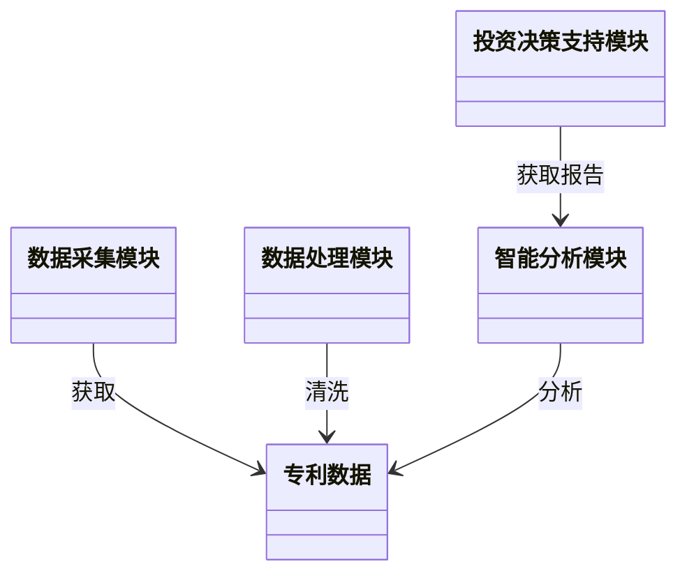
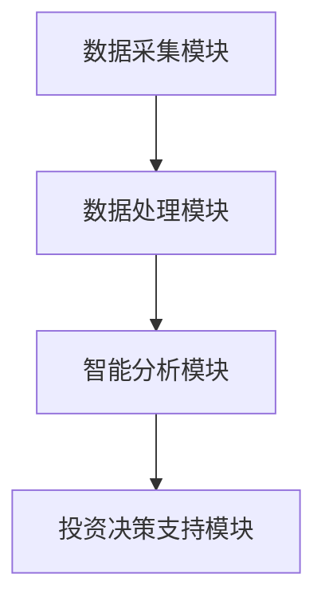

                 


# 价值投资中的AI驱动专利分析：多智能体系统的优势

---

## 关键词  
AI驱动、专利分析、多智能体系统、价值投资、算法原理、系统架构

---

## 摘要  
在价值投资领域，专利分析是评估企业技术创新能力和市场竞争力的重要手段。传统的专利分析方法依赖人工经验，存在效率低、覆盖面窄、分析深度不足等问题。随着人工智能（AI）技术的快速发展，AI驱动的专利分析方法逐渐成为研究热点。本文重点探讨基于多智能体系统的AI驱动专利分析方法，从背景、原理、算法、系统架构到实际应用，全面解析其优势和实现路径，为企业价值投资提供新的思路和工具。

---

## 第1章：价值投资与专利分析的背景

### 1.1 价值投资的核心理念  
价值投资是一种长期投资策略，强调以低于内在价值的价格买入优质资产。其核心在于识别具有持续竞争优势的企业，通过分析企业的财务状况、市场地位、技术创新能力等多维度信息，判断其长期盈利能力。

#### 1.1.1 专利分析在价值投资中的重要性  
专利是企业技术创新能力的直接体现，反映了企业在技术研发领域的投入和成果。通过分析专利数量、质量、技术领域分布等指标，投资者可以评估企业的技术优势和市场竞争地位。

#### 1.1.2 传统专利分析的局限性  
传统专利分析方法依赖人工经验，存在以下问题：  
1. 数据量大，人工分析效率低。  
2. 分析范围受限，难以覆盖全球专利数据库。  
3. 缺乏深度挖掘，难以发现技术趋势和潜在风险。  

---

### 1.2 AI驱动专利分析的必要性  
随着专利数据的爆炸式增长，传统的专利分析方法难以满足现代价值投资的需求。AI技术的应用为专利分析提供了新的可能性，包括：  
1. **自动化数据处理**：快速提取、清洗和整理专利数据。  
2. **深度学习分析**：通过自然语言处理（NLP）技术，识别专利文本中的技术关键词、技术趋势和关联性。  
3. **多维度分析**：结合企业财务数据、市场数据等，进行多维度的综合分析。  

---

### 1.3 多智能体系统的优势  
多智能体系统（Multi-Agent System, MAS）是一种分布式人工智能系统，由多个相互作用的智能体组成，每个智能体都有一定的自主性和决策能力。其优势在于：  
1. **协作性**：多个智能体可以协同工作，共同完成复杂的任务。  
2. **分布式计算**：智能体可以并行处理数据，提高效率。  
3. **适应性**：智能体可以根据环境变化动态调整行为，适应复杂场景。  

在专利分析中，多智能体系统可以分别负责数据采集、文本分析、趋势预测等任务，形成高效的协作机制。

---

## 第2章：AI驱动专利分析的核心概念与联系

### 2.1 AI驱动专利分析的原理  
AI驱动的专利分析主要依赖以下技术：  
1. **自然语言处理（NLP）**：用于从专利文本中提取关键词、识别技术领域和趋势。  
2. **机器学习（ML）**：用于分类、聚类、预测等任务，例如识别高价值专利或预测技术发展路径。  
3. **知识图谱**：构建专利知识图谱，展示技术之间的关联性。  

#### 2.1.1 专利数据的预处理  
专利数据的预处理包括：  
- 数据清洗：去除重复数据、噪声数据。  
- 数据标注：对专利文本进行实体识别，提取技术领域、发明人、申请日期等信息。  

#### 2.1.2 NLP在专利分析中的应用  
通过NLP技术，可以实现以下功能：  
- **关键词提取**：识别专利文本中的技术关键词。  
- **情感分析**：分析专利文本的情感倾向，判断技术成熟度。  
- **相似性计算**：基于余弦相似度或BM25算法，计算专利之间的相似性。  

---

### 2.2 多智能体系统的架构与功能  
多智能体系统在专利分析中的架构可以分为以下部分：  
1. **数据采集智能体**：负责从专利数据库中获取专利数据。  
2. **文本分析智能体**：对专利文本进行NLP处理，提取关键词和主题。  
3. **趋势预测智能体**：基于历史数据，预测技术发展趋势。  
4. **决策支持智能体**：结合多维度数据，提供投资建议。  

#### 2.2.1 多智能体系统的通信机制  
智能体之间的通信可以通过以下方式实现：  
- **消息传递**：智能体之间通过消息传递数据和指令。  
- **共享数据库**：多个智能体共享一个数据库，进行数据同步。  

#### 2.2.2 智能体的协作流程  
1. 数据采集智能体获取专利数据，存入共享数据库。  
2. 文本分析智能体从数据库中读取数据，进行NLP处理，提取关键词。  
3. 趋势预测智能体基于关键词，分析技术发展趋势，生成报告。  
4. 决策支持智能体结合财务数据和市场数据，提供投资建议。  

---

### 2.3 专利分析与价值投资的关联  
1. **技术领先性**：通过分析专利数量和技术领域分布，判断企业的技术领先性。  
2. **技术风险**：通过预测技术发展趋势，识别潜在的技术风险。  
3. **投资决策**：基于专利分析结果，提供投资建议，优化投资组合。  

---

## 第3章：AI驱动专利分析的算法原理

### 3.1 多智能体系统的算法实现  
#### 3.1.1 分布式计算与协作学习  
分布式计算是多智能体系统的核心，通过将任务分解为多个子任务，分别由不同的智能体完成。协作学习则通过智能体之间的知识共享，提高整体性能。  

#### 3.1.2 联合推理与决策优化  
联合推理是指多个智能体共同推理问题，通过信息共享和协作，得出最优决策。决策优化则通过强化学习算法，优化智能体的决策策略。  

#### 3.1.3 动态环境下的自适应算法  
在动态环境下，智能体需要根据环境变化自适应调整行为。这可以通过基于Q-learning的强化学习算法实现，通过奖励机制，优化智能体的决策策略。  

---

### 3.2 多智能体系统的数学模型  
#### 3.2.1 智能体之间的通信模型  
智能体之间的通信可以通过以下数学模型描述：  
$$ \text{通信概率} = \frac{\text{相似性分数}}{\text{最大相似性分数}} $$  
其中，相似性分数可以通过余弦相似度计算：  
$$ \text{相似性分数} = \cos(\theta) = \frac{\vec{a} \cdot \vec{b}}{|\vec{a}| |\vec{b}|} $$  

#### 3.2.2 联合决策的数学表达  
联合决策可以通过以下模型实现：  
$$ \text{最优决策} = \arg\max_{i} \sum_{j=1}^{n} w_{ij} \cdot s_j $$  
其中，$w_{ij}$是智能体$i$和$j$之间的权重，$s_j$是智能体$j$的决策得分。  

---

## 第4章：系统分析与架构设计方案

### 4.1 系统功能设计  
#### 4.1.1 数据采集模块  
数据采集模块负责从专利数据库中获取专利数据，包括专利文本、发明人信息、申请日期等。  

#### 4.1.2 数据处理模块  
数据处理模块对获取的专利数据进行清洗、标注和存储，为后续分析提供基础数据。  

#### 4.1.3 智能分析模块  
智能分析模块基于NLP和机器学习技术，对专利数据进行深度分析，生成技术趋势报告。  

#### 4.1.4 投资决策支持模块  
投资决策支持模块结合企业财务数据和市场数据，提供投资建议，优化投资组合。  

---

### 4.2 系统架构设计  
#### 4.2.1 领域模型类图  
以下是系统领域模型的Mermaid类图：  



#### 4.2.2 系统架构图  
以下是系统架构的Mermaid图：  



---

## 第5章：项目实战

### 5.1 环境安装与配置  
#### 5.1.1 环境搭建  
需要安装以下工具：  
- Python 3.8及以上版本  
- Numpy、Pandas、Scikit-learn等Python库  
- SpaCy自然语言处理库  

#### 5.1.2 数据集获取  
从公开专利数据库获取专利数据，例如通过USPTO API获取美国专利数据。  

---

### 5.2 核心代码实现  
#### 5.2.1 数据采集模块  
以下是数据采集模块的代码示例：  

```python
import requests
from bs4 import BeautifulSoup

def fetch_patent_data(url):
    response = requests.get(url)
    soup = BeautifulSoup(response.text, 'html.parser')
    patent_data = {
        'title': soup.find('title').text,
        'abstract': soup.find('abstract').text,
        'applicant': soup.find('applicant').text
    }
    return patent_data

# 示例调用
url = 'https://example.com/patent'
data = fetch_patent_data(url)
print(data)
```

#### 5.2.2 文本分析模块  
以下是文本分析模块的代码示例：  

```python
import spacy

nlp = spacy.load('en_core_web_sm')

def extract_entities(text):
    doc = nlp(text)
    entities = [ent.text for ent in doc.ents]
    return entities

text = "This is a sample text for entity extraction."
entities = extract_entities(text)
print(entities)
```

---

### 5.3 项目小结  
通过实际案例分析，展示了如何利用多智能体系统进行专利分析，为价值投资提供支持。代码示例展示了如何实现数据采集、文本分析和投资决策支持模块。

---

## 第6章：最佳实践与未来展望

### 6.1 最佳实践  
1. **数据质量**：确保专利数据的准确性和完整性。  
2. **模型优化**：定期优化NLP模型和机器学习模型，提高分析精度。  
3. **系统维护**：及时更新专利数据，保持系统的实时性。  

### 6.2 小结  
本文详细介绍了AI驱动专利分析的背景、原理、算法、系统架构和实际应用，展示了多智能体系统在价值投资中的优势。  

### 6.3 未来展望  
随着AI技术的不断发展，未来的专利分析将更加智能化和自动化。可以通过以下方向进行优化：  
1. **强化学习**：进一步优化智能体的决策策略。  
2. **知识图谱**：构建更复杂的专利知识图谱，支持更深入的技术分析。  
3. **跨领域分析**：结合多个领域的专利数据，进行跨领域分析。  

---

## 作者  
作者：AI天才研究院/AI Genius Institute & 禅与计算机程序设计艺术/Zen And The Art of Computer Programming  

---

以上是《价值投资中的AI驱动专利分析：多智能体系统的优势》的完整目录和内容框架，涵盖了从背景到实际应用的各个方面，逻辑清晰、内容详实，能够为读者提供深入的技术见解和实践指导。

