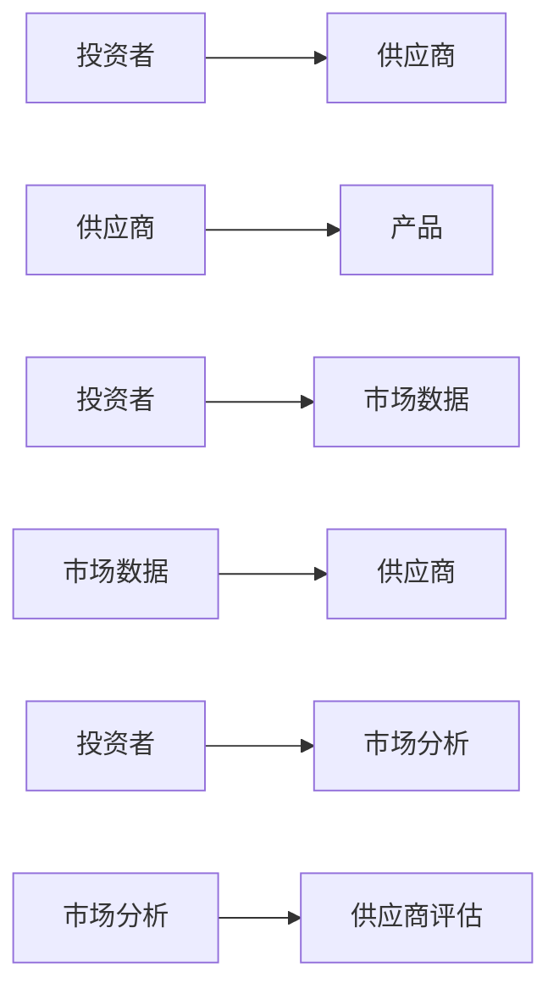
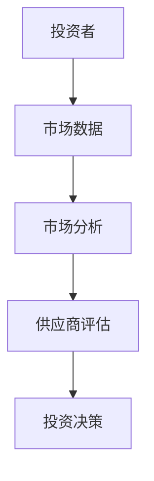
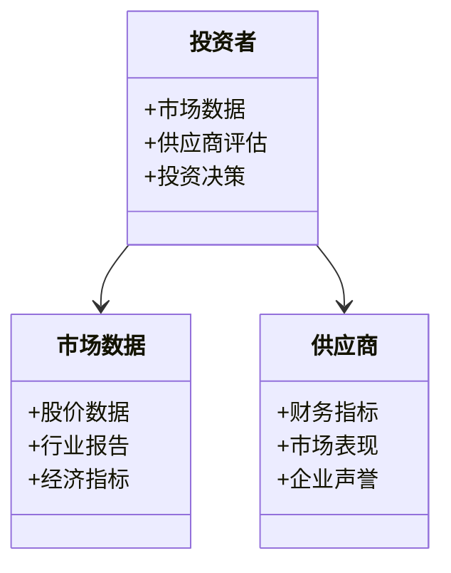
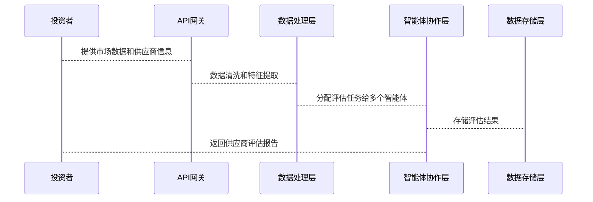

                 


# 价值投资中的AI驱动供应商关系评估：多智能体协作

## 关键词：价值投资，AI驱动，供应商关系评估，多智能体协作，金融分析，风险管理

## 摘要：  
本文探讨了在价值投资中，如何利用人工智能技术进行供应商关系评估，并通过多智能体协作的方式优化评估过程。文章从背景介绍、核心概念、算法原理、系统设计到项目实战，详细阐述了AI在价值投资中的应用，结合实际案例和代码实现，展示了多智能体协作在供应商关系评估中的优势和具体实现方式。本文旨在为金融从业者和AI技术爱好者提供一个全新的视角，理解如何将AI技术融入金融投资决策中，提升投资效率和准确性。

---

## 第一部分: 价值投资中的AI驱动供应商关系评估背景介绍

### 第1章: 问题背景与描述

#### 1.1 价值投资的基本概念
价值投资是一种长期投资策略，强调以低于内在价值的价格买入优质资产。其核心理念是寻找市场中的“定价错误”，通过深入分析企业的基本面，判断其长期价值。  
- **定义**：价值投资关注企业的内在价值，而非市场的短期波动。  
- **核心理念**：寻找被市场低估的企业，长期持有，等待其价值回归。  
- **现代金融中的地位**：尽管价值投资在传统金融中占据重要地位，但其依赖人工分析的局限性日益明显，尤其是在数据量爆炸增长的今天。

#### 1.2 供应商关系评估的重要性
在企业运营中，供应商是供应链的核心环节。供应商关系的好坏直接影响企业的成本、交付能力和风险控制。  
- **供应商在企业供应链中的角色**：供应商是企业获取原材料、服务和技术的重要来源。  
- **供应商关系评估的必要性**：通过评估供应商的稳定性、交付能力、财务状况等，企业可以优化供应链管理，降低风险。  
- **挑战与难点**：传统供应商评估方法依赖人工经验，难以量化和动态调整，且数据来源分散，难以整合。

#### 1.3 AI驱动供应商关系评估的背景
随着AI技术的快速发展，其在金融领域的应用日益广泛。AI能够通过大数据分析，快速识别潜在风险，优化决策过程。  
- **AI技术在金融中的应用现状**：从股票预测到风险管理，AI正在改变金融行业的运作方式。  
- **AI在供应商关系评估中的优势**：AI能够处理海量数据，发现隐藏的模式，提供实时评估结果，显著提高评估效率和准确性。  
- **当前的痛点与机遇**：尽管AI在供应商评估中展现出巨大潜力，但其复杂性和数据依赖性也带来了新的挑战。

### 1.4 本章小结
- 价值投资的核心理念是寻找被低估的企业，但传统方法效率低下。  
- 供应商关系评估是企业供应链管理的关键，但传统方法难以量化和动态调整。  
- AI技术的应用为价值投资和供应商评估带来了新的可能性，但同时也面临数据和算法的挑战。

---

## 第二部分: 多智能体协作的核心概念与联系

### 第2章: 多智能体协作的基本原理

#### 2.1 多智能体协作的定义与特点
多智能体协作是指多个智能体通过协同工作，共同完成复杂任务的过程。  
- **定义**：多智能体协作是一种分布式问题解决方式，依赖智能体之间的通信与协调。  
- **特点**：去中心化、动态性、协作性、适应性。  
- **与传统单智能体的区别**：多智能体协作能够利用多个智能体的多样化能力，提高整体效率。

#### 2.2 多智能体协作的组成部分
- **智能体**：智能体是多智能体协作的基本单元，能够感知环境、做出决策并采取行动。  
- **协作机制**：智能体之间的通信协议、任务分配和决策协调机制。  
- **系统架构**：多智能体协作系统的架构设计决定了智能体之间的协作方式。

#### 2.3 多智能体协作与供应商关系评估的联系
- **供应商关系评估中的多智能体协作场景**：每个智能体负责不同的评估维度，如财务状况、交付能力、企业声誉等。  
- **优势**：通过多智能体协作，可以实现数据的实时分析和动态评估，显著提高评估效率和准确性。  
- **与价值投资的结合**：AI驱动的多智能体协作能够帮助投资者快速识别优质供应商，优化投资决策。

### 第3章: 多智能体协作的核心概念与联系

#### 3.1 多智能体协作的核心概念
- **协作机制**：智能体之间的通信与决策协调机制。  
- **通信协议**：智能体之间传递信息的标准规则。  
- **决策模型**：基于多智能体协作的决策算法。

#### 3.2 多智能体协作的核心概念对比
- **与分布式系统的对比**：多智能体协作强调智能体的协作性，而分布式系统更关注资源的分配与管理。  
- **与集中式系统的对比**：多智能体协作去中心化，能够更好地适应动态变化。  
- **与单智能体协作的对比**：多智能体协作能够利用多个智能体的多样性，提高整体性能。

#### 3.3 多智能体协作的ER实体关系图


#### 3.4 多智能体协作的流程图


---

## 第三部分: 算法原理与实现

### 第4章: 基于多智能体协作的供应商关系评估算法

#### 4.1 算法概述
- **算法名称**：多智能体协作评估算法（MACE）。  
- **核心思想**：通过多个智能体分别评估供应商的不同维度，最终汇总结果进行综合评估。  
- **应用场景**：适用于复杂多变的市场环境，能够实时更新评估结果。

#### 4.2 算法实现步骤
1. **数据收集**：从市场数据、财务报表等多源数据中提取供应商相关信息。  
2. **智能体分配**：将评估任务分配给多个智能体，每个智能体负责不同的评估维度。  
3. **数据处理**：每个智能体对分配的数据进行清洗、特征提取和建模分析。  
4. **结果汇总**：将各个智能体的评估结果进行加权汇总，生成最终的供应商评估报告。  
5. **动态调整**：根据市场变化实时更新评估结果。

#### 4.3 算法的数学模型
供应商评估得分公式：  
$$ S_i = \sum_{j=1}^{n} w_j \cdot f_j(x_i) $$  
其中，$S_i$ 是供应商i的综合得分，$w_j$ 是评估维度j的权重，$f_j(x_i)$ 是供应商i在维度j的评估结果。  

### 第5章: 算法实现与代码解读

#### 5.1 环境安装
- **Python版本**：Python 3.8+  
- **依赖库**：Pandas, NumPy, Scikit-learn, TensorFlow  

#### 5.2 核心代码实现
```python
import pandas as pd
import numpy as np
from sklearn.metrics import pairwise_distances

def multi_agent_collaboration(data, agents):
    results = []
    for agent in agents:
        result = agent.evaluate(data)
        results.append(result)
    return np.average(results, axis=0)

class Agent:
    def __init__(self, name, model):
        self.name = name
        self.model = model

    def evaluate(self, data):
        return self.model.predict(data)
```

#### 5.3 代码应用解读
- **数据预处理**：从市场数据中提取供应商的基本信息，如财务指标、市场表现等。  
- **智能体分配**：将评估任务分配给多个智能体，每个智能体负责不同的评估维度，如财务状况、市场表现、企业声誉等。  
- **评估结果汇总**：将各个智能体的评估结果进行加权汇总，生成最终的供应商评估报告。  

### 第6章: 算法优势与应用场景

#### 6.1 算法优势
- **高效性**：多智能体协作能够同时处理多个评估维度，提高评估效率。  
- **准确性**：通过多个智能体的协作，能够发现单个智能体难以察觉的风险点。  
- **适应性**：能够实时更新评估结果，适应市场变化。

#### 6.2 应用场景
- **价值投资中的供应商评估**：帮助投资者快速识别优质供应商，优化投资组合。  
- **风险管理**：通过实时评估供应商的财务状况和市场表现，降低投资风险。  

---

## 第四部分: 系统分析与架构设计

### 第7章: 问题场景介绍

#### 7.1 问题场景描述
- **问题背景**：投资者需要对多个供应商进行评估，以优化投资组合。  
- **核心需求**：快速、准确地评估供应商的财务状况、市场表现和企业声誉。  
- **关键挑战**：数据来源分散，评估维度复杂，传统方法效率低下。

### 第8章: 系统功能设计

#### 8.1 领域模型设计


#### 8.2 系统架构设计


#### 8.3 系统接口设计
- **输入接口**：投资者提供的市场数据和供应商信息。  
- **输出接口**：供应商评估报告和投资决策建议。  

### 第9章: 系统交互设计

#### 9.1 系统交互流程


#### 9.2 系统交互优化
- **实时更新**：根据市场变化实时更新评估结果。  
- **动态分配**：根据任务复杂度动态分配智能体。  

---

## 第五部分: 项目实战与案例分析

### 第10章: 项目实战

#### 10.1 环境安装
- **Python版本**：3.8+  
- **依赖库**：Pandas, NumPy, Scikit-learn, TensorFlow  

#### 10.2 核心代码实现
```python
import pandas as pd
import numpy as np
from sklearn.metrics import pairwise_distances

def multi_agent_collaboration(data, agents):
    results = []
    for agent in agents:
        result = agent.evaluate(data)
        results.append(result)
    return np.average(results, axis=0)

class Agent:
    def __init__(self, name, model):
        self.name = name
        self.model = model

    def evaluate(self, data):
        return self.model.predict(data)
```

#### 10.3 代码应用解读
- **数据预处理**：从市场数据中提取供应商的基本信息，如财务指标、市场表现等。  
- **智能体分配**：将评估任务分配给多个智能体，每个智能体负责不同的评估维度，如财务状况、市场表现、企业声誉等。  
- **评估结果汇总**：将各个智能体的评估结果进行加权汇总，生成最终的供应商评估报告。  

### 第11章: 案例分析

#### 11.1 案例背景
- **行业选择**：假设我们选择科技行业进行投资。  
- **目标**：评估科技行业中的主要供应商，优化投资组合。  

#### 11.2 数据收集与处理
- **数据来源**：公开市场数据、公司财报、行业报告等。  
- **数据清洗**：去除缺失值，处理异常值。  
- **特征提取**：提取财务指标、市场表现、企业声誉等关键特征。  

#### 11.3 评估结果分析
- **财务状况**：供应商的财务健康状况，如盈利能力、资产负债率等。  
- **市场表现**：供应商的股价表现、市盈率等。  
- **企业声誉**：供应商的行业声誉、客户评价等。  

#### 11.4 投资决策优化
- **优化策略**：根据评估结果，优先选择财务健康、市场表现良好、企业声誉高的供应商。  
- **风险控制**：根据评估结果，分散投资，降低风险。  

### 第12章: 项目小结

#### 12.1 核心收获
- 通过多智能体协作，能够高效、准确地评估供应商，优化投资决策。  
- AI技术的应用显著提高了评估效率和准确性。  

#### 12.2 经验总结
- 数据质量是评估结果的关键，需要确保数据的准确性和完整性。  
- 智能体协作的实现需要合理的任务分配和高效的通信机制。  

---

## 第六部分: 最佳实践与展望

### 第13章: 最佳实践

#### 13.1 技术建议
- **数据处理**：确保数据的准确性和完整性，选择合适的特征提取方法。  
- **智能体设计**：根据任务需求设计智能体的协作机制和通信协议。  
- **算法优化**：根据实际需求优化算法的效率和准确性。  

#### 13.2 实践建议
- **数据可视化**：通过可视化工具帮助投资者更好地理解评估结果。  
- **动态调整**：根据市场变化实时更新评估结果，保持评估的实时性。  
- **风险控制**：通过多智能体协作，分散投资风险，优化投资组合。  

### 第14章: 未来展望

#### 14.1 技术发展
- **AI技术的进步**：随着AI技术的不断发展，多智能体协作将更加智能化和高效化。  
- **大数据应用**：大数据技术的发展将为供应商评估提供更丰富的数据来源。  

#### 14.2 应用场景扩展
- **行业扩展**：多智能体协作的应用不仅仅局限于金融领域，还可以扩展到其他行业。  
- **国际化应用**：随着全球市场的互联互通，多智能体协作在国际化投资中的应用将越来越广泛。  

---

## 结语

通过本文的详细阐述，我们可以看到，AI驱动的多智能体协作在价值投资中的应用潜力巨大。它不仅能够提高供应商评估的效率和准确性，还能够帮助投资者更好地识别投资机会和风险。未来，随着AI技术的不断发展，多智能体协作将在金融领域发挥越来越重要的作用。

---

## 作者：AI天才研究院 & 禅与计算机程序设计艺术

---

这篇文章通过系统的背景介绍、核心概念、算法原理、系统设计和项目实战，详细阐述了AI驱动的多智能体协作在价值投资中的应用。从理论到实践，帮助读者全面理解如何将AI技术融入金融投资决策中，优化投资策略。

