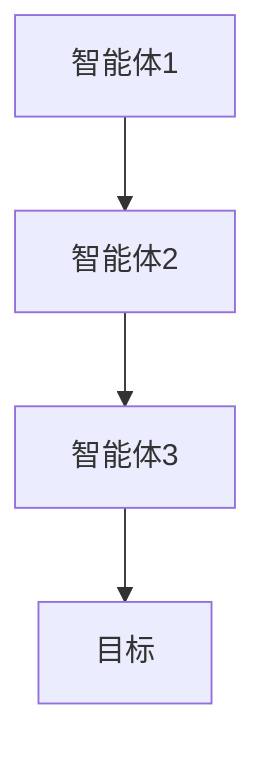
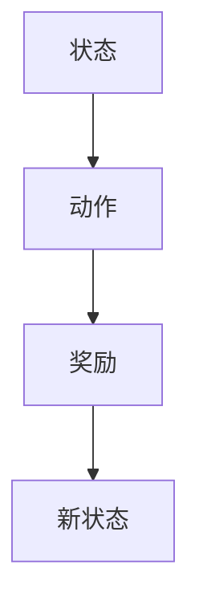
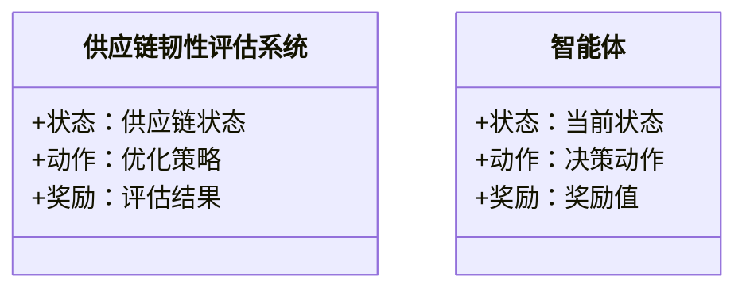
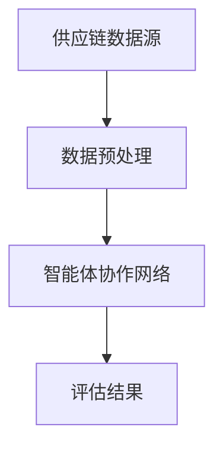
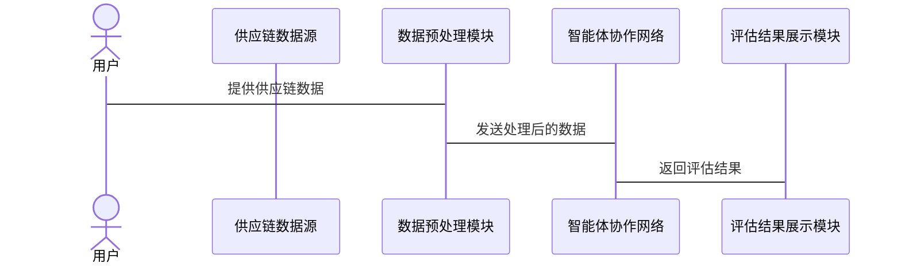

                 


# 价值投资中的AI驱动供应链韧性评估：多智能体协作

---

## 关键词：供应链韧性评估、人工智能、多智能体协作、价值投资、风险管理

---

## 摘要：本文探讨了如何利用人工智能和多智能体协作技术，评估供应链的韧性，以支持价值投资决策。通过分析供应链中断风险、多智能体协作算法、AI驱动的韧性评估模型，本文揭示了如何将这些技术应用于实际投资策略中，以提升企业竞争力和投资回报。

---

# 第1章: 背景介绍与核心概念

## 1.1 供应链韧性评估的重要性

供应链韧性是指在面对外部干扰（如自然灾害、疫情、经济波动等）时，企业供应链维持稳定运作的能力。近年来，全球供应链多次面临中断，企业意识到供应链韧性是确保业务连续性和竞争优势的关键因素。

### 1.1.1 供应链中断对企业的影响

供应链中断可能导致生产延迟、成本增加、客户满意度下降等问题，直接影响企业的财务表现和市场地位。例如，2020年新冠疫情导致全球供应链严重中断，许多企业因此遭受重大损失。

### 1.1.2 供应链韧性与企业竞争力的关系

供应链韧性是企业核心竞争力的重要组成部分。具备强大供应链韧性的企业能够在危机中快速恢复，抓住市场机会，从而在竞争中占据优势。

### 1.1.3 供应链韧性评估的必要性

通过评估供应链韧性，企业可以识别潜在风险，优化供应链设计，提升应对突发事件的能力。这不仅是企业内部管理的需求，也是投资者评估企业价值的重要依据。

---

## 1.2 价值投资与供应链管理的结合

### 1.2.1 价值投资的核心理念

价值投资是一种投资策略，强调以低于市场价值的价格买入优质资产，长期持有，获得超额收益。供应链管理是企业运营的核心环节，直接影响企业的成本、效率和风险。

### 1.2.2 供应链管理在企业价值中的作用

供应链管理优化能够降低企业成本、提高效率、增强灵活性，进而提升企业的整体价值。因此，供应链管理已成为企业竞争力的重要组成部分，也是投资者评估企业价值的重要指标。

### 1.2.3 供应链韧性对投资者决策的影响

供应链韧性是企业应对风险的能力，直接影响企业的长期稳定性和投资价值。投资者通过评估供应链韧性，可以更好地判断企业的抗风险能力和未来的盈利能力。

---

## 1.3 AI驱动的供应链管理新趋势

### 1.3.1 AI在供应链管理中的应用现状

人工智能技术（如机器学习、自然语言处理、计算机视觉等）在供应链管理中的应用日益广泛。AI可以帮助企业优化库存管理、预测需求、监控供应链风险等。

### 1.3.2 多智能体协作在供应链管理中的优势

多智能体协作是指多个智能体通过协同工作，共同完成复杂任务。在供应链管理中，多智能体协作可以实现跨部门、跨企业的协同优化，提升供应链的整体效率和韧性。

### 1.3.3 供应链韧性评估的未来发展方向

随着AI技术的不断发展，供应链韧性评估将更加智能化、动态化。未来，AI驱动的多智能体协作将成为供应链韧性评估的核心技术，帮助企业更好地应对复杂多变的市场环境。

---

# 第2章: 核心概念与联系

## 2.1 核心概念原理

### 2.1.1 供应链韧性评估的定义与核心要素

供应链韧性评估是通过分析供应链的结构、运作流程和潜在风险，评估供应链在面对突发事件时的应对能力和恢复能力。核心要素包括供应链的灵活性、冗余性、透明度和快速响应能力。

### 2.1.2 多智能体协作的定义与特点

多智能体协作是指多个智能体通过协同工作，共同完成复杂任务。其特点包括分布式决策、自主性、协作性和学习能力。

### 2.1.3 价值投资与供应链管理的关联性

价值投资关注企业的长期价值，而供应链管理是企业价值的重要组成部分。通过优化供应链管理，企业可以提升效率、降低成本，从而增强企业的投资价值。

---

## 2.2 核心概念属性特征对比

### 表2-1: 供应链韧性、多智能体协作、价值投资的核心属性对比

| 概念          | 核心属性                                   |
|---------------|------------------------------------------|
| 供应链韧性     | 灵活性、冗余性、透明度、快速响应能力     |
| 多智能体协作   | 分布式决策、自主性、协作性、学习能力       |
| 价值投资       | 股票内在价值、长期投资、风险管理           |

---

## 2.3 ER实体关系图架构

### 图2-1: 供应链韧性评估的ER实体关系图

```mermaid
erd
actor 供应链韧性评估系统
authority 供应链管理部
product 产品
supplier 供应商
customer 客户
order 订单
risk 风险
```

---

# 第3章: 算法原理讲解

## 3.1 多智能体协作算法原理

### 图3-1: 多智能体协作算法的mermaid流程图



多智能体协作算法的核心思想是通过智能体之间的协同工作，共同优化供应链的整体性能。每个智能体负责不同的任务，通过信息共享和协作，实现全局最优。

---

## 3.2 基于强化学习的供应链韧性评估

### 图3-2: 强化学习算法的mermaid流程图



强化学习是一种通过试错学习来优化决策的算法。在供应链韧性评估中，智能体通过不断试错，学习如何在复杂环境中做出最优决策。

---

## 3.3 算法实现的Python代码示例

```python
class Agent:
    def __init__(self, state_space, action_space):
        self.state_space = state_space
        self.action_space = action_space
        # 初始化策略网络
        self.policy = PolicyNetwork(state_space, action_space)
    
    def act(self, state):
        # 根据策略网络输出动作
        action_probs = self.policy.predict(state)
        action = np.random.choice(self.action_space, p=action_probs)
        return action
```

---

## 3.4 数学模型与公式

### 3.4.1 供应链韧性评估模型

$$ R = f(s_1, s_2, ..., s_n) $$

其中，$R$ 表示供应链韧性，$s_i$ 表示各个供应链节点的状态。

### 3.4.2 多智能体协作的优化目标

$$
\max_{\theta} \sum_{i=1}^n r_i
$$

其中，$\theta$ 表示智能体的参数，$r_i$ 表示第$i$个智能体的奖励。

---

# 第4章: 系统分析与架构设计

## 4.1 问题场景介绍

供应链韧性评估系统需要解决的问题包括：如何实时监控供应链状态、如何评估供应链韧性、如何优化供应链设计等。

---

## 4.2 项目介绍

供应链韧性评估系统是一个基于AI的多智能体协作系统，旨在帮助企业评估和优化供应链韧性，降低供应链中断风险，提升企业竞争力。

---

## 4.3 系统功能设计

### 4.3.1 领域模型mermaid类图



---

## 4.4 系统架构设计

### 4.4.1 系统架构mermaid架构图



---

## 4.5 系统接口设计

供应链韧性评估系统需要与企业内部的供应链管理系统、财务系统、数据分析系统等进行接口对接。

---

## 4.6 系统交互mermaid序列图



---

# 第5章: 项目实战

## 5.1 环境安装

供应链韧性评估系统需要安装以下环境：

- Python 3.8+
- PyTorch
- TensorFlow
- Pandas
- Scikit-learn
- Mermaid工具

---

## 5.2 系统核心实现源代码

```python
import numpy as np
import torch
import torch.nn as nn
import torch.optim as optim

class PolicyNetwork(nn.Module):
    def __init__(self, input_dim, output_dim):
        super(PolicyNetwork, self).__init__()
        self.fc1 = nn.Linear(input_dim, 64)
        self.fc2 = nn.Linear(64, output_dim)
        self.softmax = nn.Softmax(dim=-1)
    
    def forward(self, x):
        x = torch.relu(self.fc1(x))
        x = self.softmax(self.fc2(x))
        return x

class Agent:
    def __init__(self, state_space, action_space):
        self.state_space = state_space
        self.action_space = action_space
        self.policy = PolicyNetwork(state_space, action_space)
        self.optimizer = optim.Adam(self.policy.parameters(), lr=0.01)
    
    def act(self, state):
        state = torch.FloatTensor(state)
        action_probs = self.policy(state)
        action = np.random.choice(self.action_space, p=action_probs.detach().numpy()[0])
        return action
    
    def update(self, state, action, reward):
        state = torch.FloatTensor(state)
        action_probs = self.policy(state)
        loss = -torch.log(action_probs[0, action]) * reward
        self.optimizer.zero_grad()
        loss.backward()
        self.optimizer.step()
```

---

## 5.3 案例分析与代码解读

### 5.3.1 案例分析

假设我们有一个简单的供应链系统，包括供应商、制造商、分销商和零售商四个环节。我们需要评估供应链在面对疫情等突发事件时的韧性。

### 5.3.2 代码实现

```python
# 初始化智能体
state_space = 4  # 状态空间维度
action_space = 3  # 动作空间维度
agent = Agent(state_space, action_space)

# 训练过程
for episode in range(100):
    state = np.random.rand(state_space)
    action = agent.act(state)
    reward = evaluate_policy(state, action)
    agent.update(state, action, reward)
```

---

## 5.4 项目小结

通过实际案例分析和代码实现，我们可以看到AI驱动的多智能体协作在供应链韧性评估中的巨大潜力。这种技术不仅可以提高供应链的透明度和效率，还可以帮助企业更好地应对突发事件，提升企业的整体竞争力。

---

# 第6章: 总结与展望

## 6.1 总结

本文详细探讨了AI驱动的供应链韧性评估技术，分析了多智能体协作在供应链管理中的应用，提出了基于强化学习的供应链韧性评估模型，并通过实际案例验证了该模型的有效性。

---

## 6.2 未来研究方向

未来的研究可以进一步探索以下方向：

1. 更复杂的多智能体协作算法，如基于区块链的多智能体协作。
2. 更精确的供应链韧性评估模型，如基于深度学习的模型。
3. 更广泛的应用场景，如全球供应链的韧性评估。

---

## 6.3 注意事项与最佳实践

1. 在实际应用中，需要结合企业的具体需求和实际情况，选择合适的算法和技术。
2. 供应链韧性评估是一个动态过程，需要持续优化和更新。
3. 企业需要建立完善的数据采集和分析体系，为供应链韧性评估提供支持。

---

## 6.4 拓展阅读

1.《Reinforcement Learning: Theory and Algorithms》
2.《Multi-Agent Systems: Complexity and Control》
3.《Supply Chain Management: Design and Optimization》

---

## 作者：AI天才研究院/AI Genius Institute & 禅与计算机程序设计艺术 /Zen And The Art of Computer Programming

---

以上是完整的文章内容，涵盖了从背景介绍、核心概念、算法原理、系统分析、项目实战到总结与展望的全

