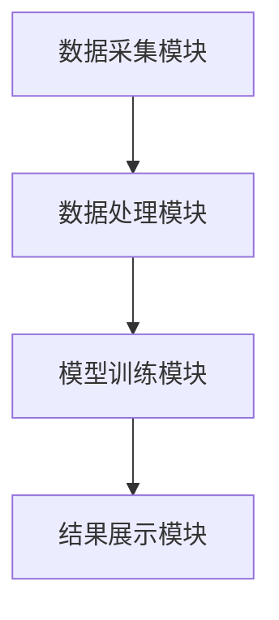

                 


# 价值投资中的AI驱动创新评估：多智能体系统的作用

> 关键词：价值投资，AI驱动，创新评估，多智能体系统，金融模型

> 摘要：本文探讨了在价值投资中，如何利用人工智能（AI）技术，特别是多智能体系统，来评估创新的价值。文章从背景与概念入手，详细介绍了多智能体系统的基本原理及其在金融领域的应用，接着分析了创新评估的AI模型构建过程，并通过实际案例展示了系统的架构设计与实现。最后，本文总结了多智能体系统在价值投资中的优势与未来发展方向。

---

## 第一部分: 背景与概念

### 第1章: 价值投资与AI驱动创新评估的背景

#### 1.1 价值投资的核心概念
##### 1.1.1 价值投资的定义与特点
价值投资是一种以基本面分析为基础的投资策略，其核心在于识别市场中被低估的投资标的。与短期市场波动不同，价值投资更关注企业的长期价值和内在质量。其特点包括：
- **长期视角**：关注企业的长期盈利能力。
- **基本面分析**：基于财务报表、行业地位等因素进行分析。
- **逆向思维**：在市场恐慌时寻找机会，在市场狂热时保持冷静。

##### 1.1.2 传统价值投资的局限性
尽管价值投资在历史上取得了显著成功，但其依赖人工分析和经验判断的方式存在以下局限性：
- **信息过载**：金融市场数据日益复杂，人工分析难以覆盖所有相关信息。
- **主观性**：分析师的主观判断可能影响投资决策的客观性。
- **效率低下**：传统方法难以快速响应市场变化。

##### 1.1.3 创新评估在价值投资中的重要性
创新是企业长期增长的核心驱动力。通过评估企业的创新能力，投资者可以更准确地判断其未来的盈利潜力。传统方法难以量化创新能力，而AI技术的引入为解决这一问题提供了新的可能。

#### 1.2 AI驱动创新评估的背景
##### 1.2.1 AI技术在金融领域的应用现状
AI技术正在迅速改变金融行业的运作方式，从高频交易到风险评估，AI的应用无处不在。创新评估是其中的重要领域，AI能够通过大数据分析和机器学习模型，发现传统方法难以捕捉的创新信号。

##### 1.2.2 创新评估在现代投资中的需求
随着市场竞争的加剧，企业创新能力成为区分优劣的重要指标。投资者需要更精准的工具来评估企业的创新能力，以做出更明智的投资决策。

##### 1.2.3 多智能体系统在创新评估中的潜力
多智能体系统（Multi-Agent System, MAS）通过多个协同工作的智能体，能够从多个角度全面分析企业的创新能力。这种分布式、协作式的分析方式，能够更准确地捕捉创新信号。

---

### 第2章: 多智能体系统的基本概念

#### 2.1 多智能体系统的定义与特点
##### 2.1.1 多智能体系统的定义
多智能体系统是由多个智能体组成的分布式系统，每个智能体都能独立感知环境、自主决策，并通过协同实现复杂任务。

##### 2.1.2 多智能体系统的组成部分
- **智能体**：能够感知环境、处理信息、做出决策的独立实体。
- **通信机制**：智能体之间进行信息交换的渠道。
- **协作协议**：智能体协同工作的规则和策略。

##### 2.1.3 多智能体系统与传统AI的区别
传统AI（如单智能体系统）依赖中心化的决策机制，而多智能体系统通过去中心化的方式实现任务，具有更强的适应性和灵活性。

#### 2.2 多智能体系统在金融中的应用
##### 2.2.1 多智能体系统的应用场景
- **风险评估**：通过多个智能体分析不同的风险因素。
- **市场预测**：利用多个智能体预测市场的多维度变化。
- **创新评估**：通过多个智能体从不同角度评估企业的创新能力。

##### 2.2.2 多智能体系统在创新评估中的优势
- **分布式分析**：从多个维度全面评估创新能力。
- **协作优化**：通过协同提高评估的准确性和全面性。
- **动态适应**：能够快速响应市场变化。

##### 2.2.3 多智能体系统的挑战与解决方案
- **信息过载**：通过高效的通信机制和协作协议减少信息冗余。
- **计算成本**：采用分布式计算和优化算法降低计算成本。

---

## 第二部分: 创新评估的AI模型

### 第3章: 创新评估的AI模型概述

#### 3.1 创新评估的核心要素
##### 3.1.1 创新能力的定义
创新能力是指企业在市场中通过创新活动创造新价值的能力，包括技术创新、商业模式创新等方面。

##### 3.1.2 创新能力的评估维度
- **技术能力**：企业的研发能力、专利数量等。
- **市场能力**：企业的市场地位、客户反馈等。
- **财务表现**：企业的盈利能力、成长性等。

##### 3.1.3 创新能力的评估指标
- **专利数量**：衡量企业的技术创新能力。
- **研发投入占比**：衡量企业对创新的投入程度。
- **市场增长速度**：衡量创新对企业市场表现的贡献。

#### 3.2 创新评估的AI模型框架
##### 3.2.1 数据采集与处理
- **数据来源**：企业公开数据、行业报告、市场反馈等。
- **数据清洗**：去除无效数据，处理缺失值。
- **数据预处理**：标准化、归一化等。

##### 3.2.2 特征提取与建模
- **特征提取**：从原始数据中提取有用的特征，如专利数量、研发投入占比等。
- **建模方法**：采用机器学习模型（如随机森林、神经网络）进行建模。

##### 3.2.3 模型训练与优化
- **训练过程**：通过历史数据训练模型，优化模型参数。
- **验证与测试**：通过交叉验证评估模型的准确性。

### 第4章: 多智能体系统在创新评估中的应用

#### 4.1 多智能体系统的创新评估模型
##### 4.1.1 模型的设计思路
多智能体系统通过多个智能体分别从技术、市场、财务等不同维度进行评估，最终通过协同得出综合评估结果。

##### 4.1.2 模型的输入与输出
- **输入**：企业的各项数据（如专利数量、财务数据等）。
- **输出**：企业的创新能力综合评估结果。

##### 4.1.3 模型的评估标准
- **准确率**：模型预测结果与实际结果的匹配程度。
- **召回率**：模型识别创新企业的能力。

#### 4.2 多智能体系统的协同机制
##### 4.2.1 协同学习的基本原理
多个智能体通过共享信息、协同决策的方式，共同完成创新评估任务。

##### 4.2.2 协同学习的实现方式
- **分布式计算**：智能体分别在不同的计算节点上完成任务。
- **通信机制**：智能体之间通过消息传递机制共享信息。

##### 4.2.3 协同学习的效果评估
- **效率提升**：通过协同学习提高评估效率。
- **结果优化**：通过多维度评估提高结果的准确性。

---

## 第三部分: 系统架构与实现

### 第5章: 创新评估系统的架构设计

#### 5.1 系统功能模块划分
##### 5.1.1 数据采集模块
- 负责从企业公开数据、行业报告等来源采集数据。
##### 5.1.2 数据处理模块
- 对采集到的数据进行清洗、预处理。
##### 5.1.3 模型训练模块
- 使用机器学习模型对数据进行建模、训练。
##### 5.1.4 结果展示模块
- 展示创新评估结果，提供可视化界面。

#### 5.2 系统架构设计
##### 5.2.1 系统整体架构图

##### 5.2.2 模块之间的交互关系
- 数据采集模块向数据处理模块传递数据。
- 数据处理模块向模型训练模块传递处理后的数据。
- 模型训练模块向结果展示模块传递评估结果。

##### 5.2.3 系统的可扩展性设计
- 模块化设计，便于功能扩展。
- 支持多种数据源接入。

### 第6章: 创新评估系统的实现

#### 6.1 环境配置与安装
##### 6.1.1 系统运行环境要求
- 操作系统：Linux/Windows/MacOS
- 开发工具：Python、Jupyter Notebook
- 依赖库：NumPy、Pandas、Scikit-learn、TensorFlow

##### 6.1.2 开发工具的安装与配置
```bash
pip install numpy pandas scikit-learn tensorflow
```

##### 6.1.3 数据集的获取与预处理
- 数据来源：企业公开数据、行业报告。
- 数据预处理：清洗、归一化。

#### 6.2 模型实现与优化
##### 6.2.1 模型的训练过程
```python
import numpy as np
from sklearn.ensemble import RandomForestClassifier

# 数据预处理
X = ...  # 特征矩阵
y = ...  # 标签

# 模型训练
model = RandomForestClassifier(n_estimators=100)
model.fit(X, y)

# 预测结果
y_pred = model.predict(X_test)
```

##### 6.2.2 模型的调优方法
- 调整模型参数（如n_estimators）。
- 使用交叉验证优化模型。

##### 6.2.3 模型的评估与验证
- 使用准确率、召回率等指标评估模型性能。

---

## 第四部分: 项目实战与案例分析

### 第7章: 创新评估项目的实战

#### 7.1 项目背景与目标
##### 7.1.1 项目背景介绍
本项目旨在通过多智能体系统评估企业的创新能力，帮助投资者做出更明智的投资决策。

##### 7.1.2 项目目标设定
- 构建创新评估模型。
- 实现多智能体系统的协同评估。

#### 7.2 项目实战
##### 7.2.1 环境配置与安装
按照前面的步骤完成环境配置。

##### 7.2.2 模型实现与优化
- 使用随机森林模型进行创新评估。
- 通过调参优化模型性能。

##### 7.2.3 项目小结
通过本项目，我们成功构建了一个基于多智能体系统的创新评估模型，验证了其在价值投资中的应用潜力。

---

## 总结与展望

### 总结
本文详细探讨了价值投资中的AI驱动创新评估，特别是多智能体系统的作用。通过背景介绍、模型构建、系统设计和项目实战，我们展示了如何利用AI技术提高创新评估的准确性和效率。

### 展望
未来，随着AI技术的不断发展，多智能体系统在金融领域的应用将更加广泛。创新评估的AI模型将更加精准，为价值投资提供更有力的工具。

---

作者：AI天才研究院/AI Genius Institute & 禅与计算机程序设计艺术 /Zen And The Art of Computer Programming

