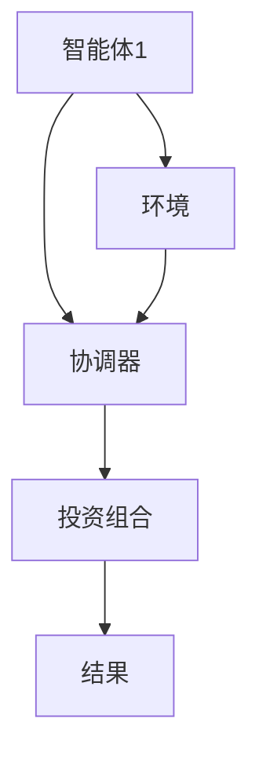

                 


# 价值投资中的AI驱动政策影响分析：多智能体系统的优势

> **关键词**: 价值投资, AI驱动, 政策影响分析, 多智能体系统, 投资策略, 金融市场, 风险管理

> **摘要**:  
本文探讨了AI驱动的政策影响分析在价值投资中的应用，重点分析了多智能体系统的优势。文章从价值投资的基本概念和政策影响的重要性入手，详细介绍了AI技术在金融领域的应用及其与多智能体系统的结合。通过数学模型和算法原理的分析，展示了多智能体系统在政策影响分析中的优势。最后，通过系统架构设计和项目实战，进一步验证了多智能体系统在价值投资中的实际应用价值。本文旨在为投资者和研究人员提供理论支持和实践指导。

---

## 第1章: 价值投资与政策影响分析概述

### 1.1 价值投资的基本概念

#### 1.1.1 价值投资的定义  
价值投资是一种以股票的内在价值为导向的投资策略，强调以低于内在价值的价格买入优质股票并长期持有。其核心理念是寻找市场先生的错误定价。

#### 1.1.2 价值投资的核心理念  
- **安全边际**: 投资价格低于内在价值的部分，即安全边际。
- **长期视角**: 强调长期持有的理念，而非短期波动。
- **价值发现**: 通过基本面分析发现被市场低估的股票。

#### 1.1.3 价值投资在现代金融中的地位  
价值投资是投资学的重要流派之一，尤其在应对市场波动和不确定性时表现出了较强的稳健性。

### 1.2 政策影响在价值投资中的重要性

#### 1.2.1 政策对金融市场的影响  
- **货币政策**: 利率、货币供应量等政策直接影响市场流动性。
- **财政政策**: 政府支出、税收政策影响市场信心和企业盈利能力。
- **监管政策**: 行业监管政策直接影响企业的经营环境和投资价值。

#### 1.2.2 政策分析在投资决策中的作用  
政策分析帮助投资者预判政策变化对市场和企业的影响，从而优化投资策略。

#### 1.2.3 政策风险的量化与管理  
通过量化政策风险，投资者可以更好地分散风险，避免因政策变化导致的重大损失。

---

## 第2章: AI驱动的政策影响分析基础

### 2.1 AI技术在金融领域的应用

#### 2.1.1 AI在金融数据分析中的应用  
- **自然语言处理(NLP)**: 分析新闻、财报等非结构化数据。
- **时间序列分析**: 预测市场走势。
- **异常检测**: 发现市场中的异常波动。

#### 2.1.2 AI在风险评估中的应用  
- **信用评分**: 利用机器学习模型评估借款人的信用风险。
- **市场风险**: 使用AI模型预测极端市场事件。

#### 2.1.3 AI在投资策略优化中的应用  
- **算法交易**: 利用AI算法进行高频交易。
- **因子分析**: 利用机器学习优化投资组合。

### 2.2 多智能体系统的基本原理

#### 2.2.1 多智能体系统的定义  
多智能体系统是由多个相互作用的智能体组成的系统，每个智能体都有自己的目标和决策机制。

#### 2.2.2 多智能体系统的组成与功能  
- **智能体**: 具有感知、决策和行动能力的个体。
- **通信机制**: 智能体之间的信息交换。
- **协作机制**: 智能体之间的协作与竞争。

#### 2.2.3 多智能体系统的优势与挑战  
- **优势**: 高效性、鲁棒性、适应性。
- **挑战**: 复杂性、协调性、计算资源需求。

---

## 第3章: 价值投资中的多智能体系统

### 3.1 多智能体系统在价值投资中的应用场景

#### 3.1.1 多智能体系统在政策分析中的应用  
- **政策解读**: 分析政策文本，提取关键信息。
- **政策影响评估**: 预测政策对市场和企业的具体影响。

#### 3.1.2 多智能体系统在市场预测中的应用  
- **市场情绪分析**: 通过多智能体模拟市场参与者的心理。
- **价格预测**: 基于多智能体的行为预测股票价格。

#### 3.1.3 多智能体系统在投资组合优化中的应用  
- **资产配置**: 根据市场变化动态调整投资组合。
- **风险分散**: 通过多智能体的协作降低投资风险。

### 3.2 价值投资中的多智能体系统优势

#### 3.2.1 提高决策效率  
多智能体系统可以并行处理大量信息，提高决策速度。

#### 3.2.2 增强风险控制能力  
通过多智能体系统的协作，可以更全面地识别和管理风险。

#### 3.2.3 提升投资策略的灵活性  
多智能体系统可以根据市场变化快速调整投资策略。

---

## 第4章: 多智能体系统的数学模型

### 4.1 多智能体系统的状态表示

#### 4.1.1 状态空间的定义  
状态空间是所有可能的状态的集合，每个状态代表一种市场情况。

#### 4.1.2 状态转移的概率模型  
$$ P(s_{t+1} | s_t, a_t) $$  
其中，$s_t$是当前状态，$a_t$是当前动作，$P$是状态转移的概率。

#### 4.1.3 状态空间的维度分析  
状态空间的维度决定了系统的复杂性，维度越高，计算越复杂。

### 4.2 多智能体系统的决策模型

#### 4.2.1 决策树的构建与分析  
决策树是一种树状结构，用于表示可能的决策路径。

#### 4.2.2 马尔可夫决策过程在多智能体系统中的应用  
马尔可夫决策过程（MDP）用于建模智能体在不确定环境中的决策过程。

#### 4.2.3 联合策略与个体策略的对比分析  
- **联合策略**: 所有智能体共享相同的策略。
- **个体策略**: 每个智能体独立制定策略。

---

## 第5章: 政策影响分析的数学模型

### 5.1 政策影响的量化模型

#### 5.1.1 政策影响的指标体系  
- 经济增长率、失业率、通胀率等。

#### 5.1.2 政策影响的权重分配  
使用主成分分析（PCA）确定各指标的权重。

#### 5.1.3 政策影响的综合评估模型  
$$ I = \sum_{i=1}^{n} w_i x_i $$  
其中，$I$是综合影响指数，$w_i$是第$i$个指标的权重，$x_i$是第$i$个指标的值。

### 5.2 政策影响与市场反应的数学关系

#### 5.2.1 政策影响的市场反应函数  
$$ R = f(P, S, T) $$  
其中，$R$是市场反应，$P$是政策变量，$S$是市场状态，$T$是时间。

#### 5.2.2 政策影响的滞后效应模型  
$$ R_t = \beta P_{t-k} + \epsilon $$  
其中，$\beta$是系数，$P_{t-k}$是滞后$k$期的政策变量，$\epsilon$是误差项。

#### 5.2.3 政策影响的非线性关系分析  
使用非线性回归模型分析政策与市场反应的关系。

---

## 第6章: 价值投资中的数学模型与算法

### 6.1 价值投资的数学模型

#### 6.1.1 股票内在价值的计算公式  
$$ V = \frac{E}{k} $$  
其中，$V$是内在价值，$E$是预期收益，$k$是折现率。

#### 6.1.2 股票估值的多因素模型  
$$ P = a + b_1 x_1 + b_2 x_2 + \dots + b_n x_n + \epsilon $$  
其中，$P$是股票价格，$x_i$是影响价格的因素，$b_i$是回归系数，$\epsilon$是误差项。

### 6.2 多智能体系统的算法实现

#### 6.2.1 多智能体系统的分布式算法  
- **分布式计算**: 每个智能体独立计算，然后汇总结果。

#### 6.2.2 多智能体系统的协调与通信机制  
- **通信协议**: 定义智能体之间的信息交换规则。
- **协调算法**: 使用共识算法（如RAFT）实现智能体的协调。

#### 6.2.3 多智能体系统的自适应算法  
- **自适应控制**: 根据环境变化动态调整策略。

---

## 第7章: 系统分析与架构设计

### 7.1 系统功能需求分析

#### 7.1.1 政策影响分析模块  
- 政策解读、影响评估、风险预警。

#### 7.1.2 多智能体系统模块  
- 状态感知、决策制定、行动执行。

#### 7.1.3 投资组合优化模块  
- 资产配置、风险分散、绩效评估。

### 7.2 系统架构设计方案

#### 7.2.1 领域模型类图  


#### 7.2.2 系统架构图  


### 7.3 系统接口设计

#### 7.3.1 智能体与环境的接口  
- 输入: 状态、动作。
- 输出: 奖励、新状态。

#### 7.3.2 协调器与智能体的接口  
- 输入: 各智能体的状态。
- 输出: 统一决策。

---

## 第8章: 项目实战

### 8.1 项目背景与目标

#### 8.1.1 项目背景  
分析某政策变化对股市的影响。

#### 8.1.2 项目目标  
优化投资组合，降低政策风险。

### 8.2 系统核心实现源代码

#### 8.2.1 政策影响分析代码  
```python
def policy_impact_analysis(policy, market_state):
    # 分析政策对市场的具体影响
    return impact_score
```

#### 8.2.2 多智能体系统代码  
```python
class Agent:
    def __init__(self, state_space, action_space):
        self.state_space = state_space
        self.action_space = action_space
    def decide(self, state):
        # 返回动作
        pass
```

### 8.3 实际案例分析

#### 8.3.1 案例背景  
某国宣布降息政策，分析其对股市的影响。

#### 8.3.2 数据收集与预处理  
收集历史数据、政策文本、市场反应。

#### 8.3.3 模型训练与评估  
训练多智能体系统，评估其预测能力。

### 8.4 项目小结  
通过案例分析，验证了多智能体系统在政策影响分析中的优势。

---

## 第9章: 总结与展望

### 9.1 总结  
本文探讨了AI驱动的政策影响分析在价值投资中的应用，展示了多智能体系统的优势。

### 9.2 未来展望  
- 更高级的AI技术（如强化学习、深度学习）的应用。
- 更复杂多智能体系统的构建与优化。

---

## 附录

### 附录A: 工具安装指南  
如何安装Python、机器学习库等工具。

### 附录B: 参考文献  
相关文献和资料的引用。

---

## 作者信息

作者：AI天才研究院/AI Genius Institute & 禅与计算机程序设计艺术/Zen And The Art of Computer Programming

---

通过以上结构化的内容，我们可以清晰地看到AI驱动的政策影响分析在价值投资中的应用，以及多智能体系统的优势。文章从理论到实践，从背景到案例，全面探讨了这一主题，为投资者和研究人员提供了有价值的参考。

