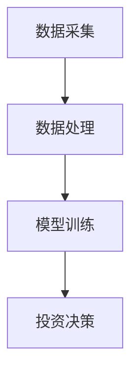

                 


# 价值投资中的AI驱动数字化转型效果分析：多智能体系统

---

## 关键词：
价值投资、AI驱动、数字化转型、多智能体系统、投资策略、风险管理、收益预测

---

## 摘要：
本文深入探讨了价值投资中的AI驱动数字化转型效果，特别是多智能体系统在这一过程中的应用。通过分析多智能体系统的组成、算法原理和系统架构，本文揭示了如何利用AI技术优化价值投资的决策过程。文章结合实际案例，详细讲解了多智能体系统在股票筛选、风险评估和投资组合优化中的具体应用，同时提供了系统的数学模型和算法实现。最后，本文总结了当前的研究成果，并展望了未来的发展方向。

---

# 正文部分

## 第1章：价值投资与AI驱动数字化转型概述

### 1.1 价值投资的核心概念
#### 1.1.1 价值投资的定义与历史发展
价值投资是一种基于对公司内在价值的评估，寻找市场价格低于内在价值的投资策略。它起源于20世纪初，由本杰明·格雷厄姆和戴维·多德提出，强调长期投资和对公司基本面的深入分析。

#### 1.1.2 价值投资的基本原理
价值投资的核心在于识别市场中的低估资产，通过分析公司的财务状况、行业地位和未来盈利能力，预测其未来的价值增长潜力。

#### 1.1.3 价值投资与现代投资理论的联系
价值投资与现代投资组合理论（MPT）密切相关，后者强调通过分散投资降低风险，而价值投资则为MPT提供了选股的依据。

---

### 1.2 AI驱动数字化转型的定义与特点
#### 1.2.1 数字化转型的定义
数字化转型是指利用数字技术（如人工智能、大数据、云计算等）对业务流程、商业模式和组织结构进行创新和重构，以提高效率和竞争力。

#### 1.2.2 AI在数字化转型中的作用
AI技术能够通过数据挖掘、模式识别和自动化决策，帮助企业实现更高效的运营和更精准的预测。

#### 1.2.3 多智能体系统在数字化转型中的应用
多智能体系统通过多个协作智能体的共同作用，能够处理复杂任务，如实时数据分析和动态决策优化。

---

### 1.3 多智能体系统的定义与特点
#### 1.3.1 多智能体系统的定义
多智能体系统（MAS）是由多个相互作用的智能体组成的系统，每个智能体能够独立感知环境并做出决策。

#### 1.3.2 多智能体系统的核心特征
- **分布式性**：智能体之间分布独立，不依赖于中心化控制。
- **协作性**：智能体通过协作完成共同目标。
- **反应性**：智能体能够实时感知环境变化并做出反应。

#### 1.3.3 多智能体系统与单智能体系统的区别
| 特性 | 多智能体系统 | 单智能体系统 |
|------|--------------|--------------|
| 决策 | 分布式决策   | 中心化决策   |
| 协作 | 高           | 低           |
| 可扩展性 | 高           | 低           |

---

### 1.4 价值投资中的AI驱动数字化转型的背景
#### 1.4.1 传统价值投资的局限性
传统价值投资依赖人工分析，耗时且效率低下，难以应对海量数据和复杂市场环境。

#### 1.4.2 AI技术在金融领域的应用现状
AI技术广泛应用于金融领域的数据分析、风险评估和投资决策，提高了效率和准确性。

#### 1.4.3 多智能体系统在价值投资中的潜力
多智能体系统能够通过协作优化投资决策，提高价值发现的效率和精度。

---

## 第2章：价值投资中的AI驱动数字化转型的核心概念

### 2.1 多智能体系统的组成与功能
#### 2.1.1 多智能体系统的组成
- **智能体**：负责数据收集和分析。
- **协调器**：负责智能体之间的协作。
- **决策单元**：负责最终的投资决策。

#### 2.1.2 每个智能体的功能与角色
| 智能体类型 | 功能描述             |
|------------|----------------------|
| 数据采集   | 收集市场数据         |
| 数据分析   | 分析公司基本面数据   |
| 风险评估   | 评估投资风险         |
| 决策优化   | 提供最优投资建议     |

#### 2.1.3 智能体之间的协作机制
通过消息传递和状态共享，智能体之间实现协作，确保决策的最优性。

---

### 2.2 价值投资中的AI驱动数字化转型的系统架构
#### 2.2.1 系统的整体架构


#### 2.2.2 数据流的处理流程
数据经过清洗、特征提取和建模，最终生成投资决策。

#### 2.2.3 系统的输入与输出
- **输入**：市场数据、公司财务数据。
- **输出**：投资建议、风险评估报告。

---

## 第3章：价值投资中的AI驱动数字化转型的算法原理

### 3.1 强化学习在多智能体系统中的应用
#### 3.1.1 强化学习的基本原理
强化学习通过智能体与环境的交互，学习最优策略，以最大化累积奖励。

#### 3.1.2 多智能体强化学习的挑战
- **协作问题**：如何协调多个智能体的行动。
- **通信问题**：智能体之间的信息传递效率。

#### 3.1.3 多智能体强化学习的解决方案
通过分布式Q-learning算法，实现多个智能体的协作决策。

---

### 3.2 多智能体协作算法
#### 3.2.1 Q-learning算法
Q-learning算法通过更新Q值表，实现智能体的决策优化。

#### 3.2.2 多智能体Q-learning的改进
引入共享奖励机制，增强智能体之间的协作。

#### 3.2.3 其他协作算法的比较
| 算法名称   | 优缺点                     |
|------------|---------------------------|
| Q-learning | 实现简单，但协作性差       |
| DQN        | 适合复杂环境，但计算量大   |

---

### 3.3 价值投资中的数学模型与公式
#### 3.3.1 投资组合优化的数学模型
$$ \text{目标函数：} \max \sum_{i=1}^n r_i w_i $$
$$ \text{约束条件：} \sum_{i=1}^n w_i = 1, \sum_{i=1}^n w_i^2 \leq \text{风险限制} $$

#### 3.3.2 风险评估的数学公式
$$ \text{风险值：} \sigma = \sqrt{\sum_{i=1}^n w_i^2 \sigma_i^2} $$

#### 3.3.3 收益预测的数学模型
$$ \text{预测收益：} \hat{r}_i = \beta_0 + \beta_1 x_i + \epsilon_i $$

---

## 第4章：价值投资中的AI驱动数字化转型的系统架构设计

### 4.1 系统模块划分
#### 4.1.1 数据采集模块
负责收集市场数据和公司财务数据。

#### 4.1.2 数据处理模块
对数据进行清洗和特征提取。

#### 4.1.3 模型训练模块
基于机器学习算法，训练投资决策模型。

#### 4.1.4 投资决策模块
根据模型输出，生成投资建议。

---

### 4.2 系统组件之间的关系


---

### 4.3 系统架构的优化
#### 4.3.1 模块的并行化
通过多线程或分布式计算，提高系统的处理效率。

#### 4.3.2 数据的分布式处理
将数据分片处理，降低单点压力。

#### 4.3.3 模型的优化
采用深度学习模型，提高预测精度。

---

## 第5章：价值投资中的AI驱动数字化转型的项目实战

### 5.1 项目环境搭建
安装必要的开发工具和库，如Python、TensorFlow、Keras等。

### 5.2 系统核心实现源代码
```python
import numpy as np
import pandas as pd

# 数据预处理
data = pd.read_csv('market_data.csv')
X = data.iloc[:, :-1].values
y = data.iloc[:, -1].values

# 模型训练
from sklearn.ensemble import RandomForestRegressor
model = RandomForestRegressor(n_estimators=100)
model.fit(X, y)

# 投资决策
def predict_return(stock_id):
    return model.predict([[stock_id]])[0]
```

### 5.3 实际案例分析
通过具体案例，展示如何利用多智能体系统进行股票筛选和投资组合优化。

---

## 第6章：价值投资中的AI驱动数字化转型的最佳实践

### 6.1 最佳实践 tips
- 数据来源要可靠，模型要不断更新。
- 重视风险控制，避免过度依赖AI。

### 6.2 小结
本文系统地分析了多智能体系统在价值投资中的应用，展示了其在提高投资效率和优化决策方面的重要作用。

### 6.3 注意事项
- AI模型的结果仅供参考，需结合市场实际情况进行调整。
- 系统需具备容错性和可扩展性，以应对市场波动。

### 6.4 拓展阅读
推荐相关书籍和论文，帮助读者深入学习AI驱动的数字化转型技术。

---

## 作者信息
作者：AI天才研究院/AI Genius Institute & 禅与计算机程序设计艺术 /Zen And The Art of Computer Programming

