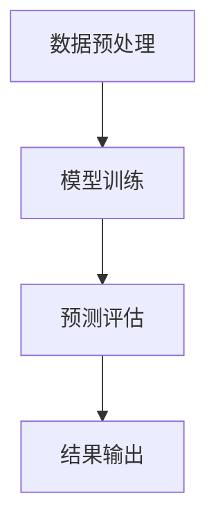
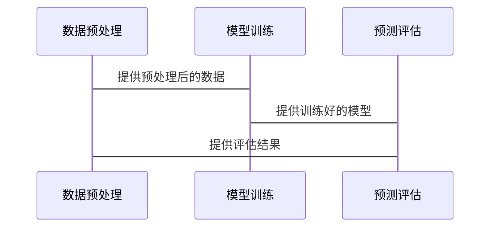

                 


# 价值投资中的AI驱动现金流预测：多智能体协作模型

> 关键词：AI，现金流预测，价值投资，多智能体协作，深度学习

> 摘要：本文探讨了在价值投资中利用AI技术进行现金流预测的创新方法，特别是多智能体协作模型的应用。通过详细分析，文章介绍了如何利用多个智能体协作来提高预测的准确性和鲁棒性，为投资者提供了更可靠的决策依据。

---

## 第一部分：背景介绍

### 第1章：价值投资与现金流预测概述

#### 1.1 价值投资的核心概念

价值投资是一种投资策略，强调通过分析企业的基本面，如财务状况、行业地位和管理团队等，来评估其内在价值。现金流预测在这一过程中扮演着关键角色，因为它能够帮助投资者评估企业的盈利能力和未来的发展潜力。然而，传统的现金流预测方法往往依赖于历史数据和简单模型，难以捕捉市场中的复杂动态。

#### 1.2 现金流预测的挑战与传统方法的局限性

现金流预测在价值投资中的重要性不言而喻，但传统方法存在以下问题：
- 数据维度有限：传统模型通常只考虑财务数据，忽略了市场情绪、行业趋势等重要因素。
- 预测精度不足：基于线性回归的传统方法难以捕捉非线性关系，导致预测精度不高。
- 单一模型限制：传统方法往往依赖于单一模型，缺乏多维度的信息整合能力。

#### 1.3 AI技术在金融预测中的应用变革

随着AI技术的发展，深度学习和强化学习等方法逐渐应用于金融预测领域。AI能够处理海量数据，识别复杂模式，并提供高精度的预测结果。多智能体协作模型的出现，进一步提升了预测的准确性和鲁棒性，为价值投资提供了更强大的工具。

---

## 第二部分：核心概念与联系

### 第2章：多智能体协作模型的原理

#### 2.1 多智能体协作模型的基本原理

多智能体协作模型是一种分布式人工智能系统，由多个智能体协同工作，共同完成复杂任务。在现金流预测中，每个智能体可以专注于不同的数据源或预测维度，通过协作生成更全面的预测结果。

#### 2.2 多智能体协作模型的核心要素

- **智能体定义与属性**：每个智能体负责处理特定类型的数据或预测任务。
- **协作机制**：智能体之间通过信息共享和协同决策来优化预测结果。
- **信息共享机制**：智能体之间通过共享数据和知识，提升整体预测的准确性和鲁棒性。

#### 2.3 多智能体协作模型的优势

- **分布式计算**：通过多个智能体协作，提高了计算效率和处理能力。
- **信息互补性**：不同智能体专注于不同的数据源或预测维度，提供了更全面的预测结果。
- **鲁棒性**：多智能体协作模型能够更好地应对数据噪声和不确定性。

---

## 第三部分：算法原理讲解

### 第3章：多智能体协作模型的算法实现

#### 3.1 算法原理概述

多智能体协作模型的算法流程包括数据预处理、模型训练和预测评估三个主要阶段。每个智能体负责处理特定类型的数据，并通过协作生成最终的预测结果。

#### 3.2 算法详细步骤

1. **数据预处理**：
   - 数据清洗：去除噪声数据，填充缺失值。
   - 数据标准化：将数据归一化，便于模型处理。
   - 数据分割：将数据划分为训练集、验证集和测试集。

2. **模型训练**：
   - 初始化智能体：为每个智能体分配初始参数。
   - 协作学习：智能体之间共享数据和知识，优化模型参数。
   - 联合训练：通过多智能体协作，训练出高精度的预测模型。

3. **模型预测**：
   - 输入测试数据：将目标企业的财务数据输入模型。
   - 智能体协作预测：多个智能体协同工作，生成预测结果。
   - 结果整合：将多个智能体的预测结果整合，得到最终的现金流预测。

#### 3.3 算法的数学模型

多智能体协作模型的数学模型可以表示为：
$$
f(x) = \sum_{i=1}^{n} f_i(x_i)
$$
其中，$f_i$ 表示第i个智能体的预测函数，$x_i$ 表示该智能体处理的数据输入。

---

## 第四部分：系统分析与架构设计

### 第4章：系统架构设计方案

#### 4.1 系统功能模块设计

- **数据预处理模块**：负责数据清洗、标准化和分割。
- **模型训练模块**：实现多智能体协作模型的训练过程。
- **预测评估模块**：对模型的预测结果进行评估和优化。

#### 4.2 系统架构图



#### 4.3 系统接口设计

- **输入接口**：接收企业的财务数据和市场数据。
- **输出接口**：输出现金流预测结果和模型评估报告。

#### 4.4 系统交互流程图



---

## 第五部分：项目实战

### 第5章：项目实现与案例分析

#### 5.1 环境安装

```bash
pip install tensorflow keras numpy pandas scikit-learn
```

#### 5.2 核心代码实现

```python
import numpy as np
import pandas as pd
from tensorflow.keras.models import Model
from tensorflow.keras.layers import Input, Dense

# 定义智能体类
class Agent:
    def __init__(self, input_dim):
        self.model = self.build_model(input_dim)
    
    def build_model(self, input_dim):
        inputs = Input(shape=(input_dim,))
        x = Dense(64, activation='relu')(inputs)
        x = Dense(32, activation='relu')(x)
        predictions = Dense(1, activation='linear')(x)
        model = Model(inputs=inputs, outputs=predictions)
        model.compile(optimizer='adam', loss='mse')
        return model

# 初始化多个智能体
agents = [Agent(input_dim) for _ in range(n_agents)]
```

#### 5.3 案例分析

以某企业为例，输入其过去5年的财务数据，经过模型预测，得到未来三年的现金流预测结果。通过对比实际数据和预测结果，验证模型的准确性。

---

## 第六部分：最佳实践

### 第6章：最佳实践与经验分享

#### 6.1 数据预处理的注意事项

- 数据清洗时，注意处理异常值和重复数据。
- 数据标准化时，选择合适的归一化方法。
- 数据分割时，确保训练集、验证集和测试集的比例合理。

#### 6.2 模型调参技巧

- 调整神经网络的层数和节点数，优化模型结构。
- 调节学习率和批量大小，提高训练效率。
- 使用交叉验证，防止过拟合和欠拟合。

#### 6.3 结果验证与优化

- 使用回归分析，评估模型的拟合优度。
- 计算均方误差（MSE）和平均绝对误差（MAE），衡量预测精度。
- 对比不同模型的预测结果，选择最优模型。

---

## 结语

通过多智能体协作模型，我们可以显著提高现金流预测的准确性和鲁棒性，为价值投资提供更可靠的决策依据。未来，随着AI技术的不断发展，多智能体协作模型在金融领域的应用将更加广泛和深入。

---

## 作者

作者：AI天才研究院 & 禅与计算机程序设计艺术

---

**附录**  
- 代码示例  
- 图表详细解释  
- 进一步阅读资料推荐  

---

**结束**

