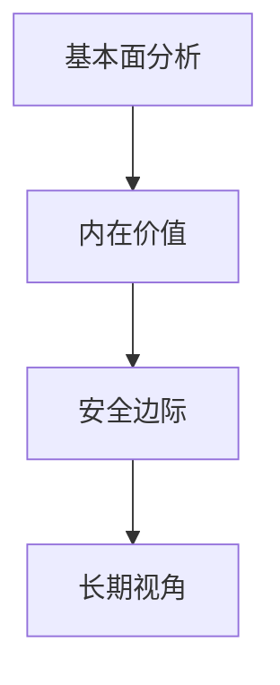
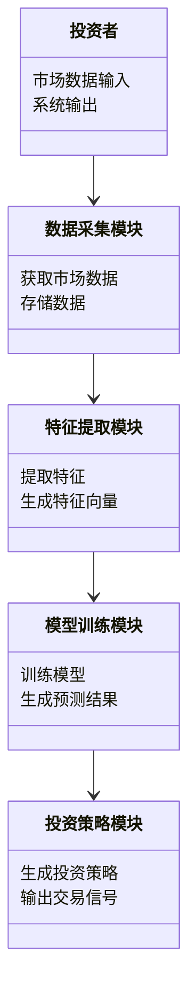
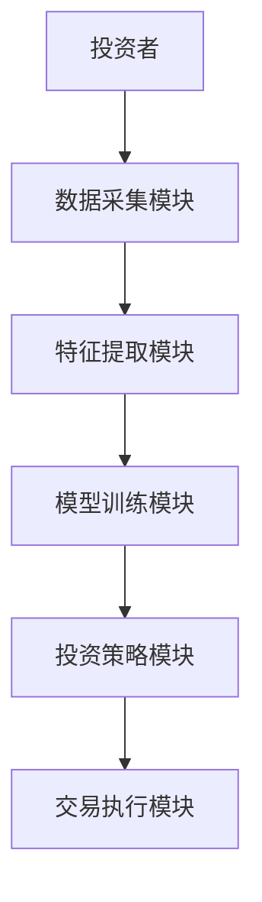
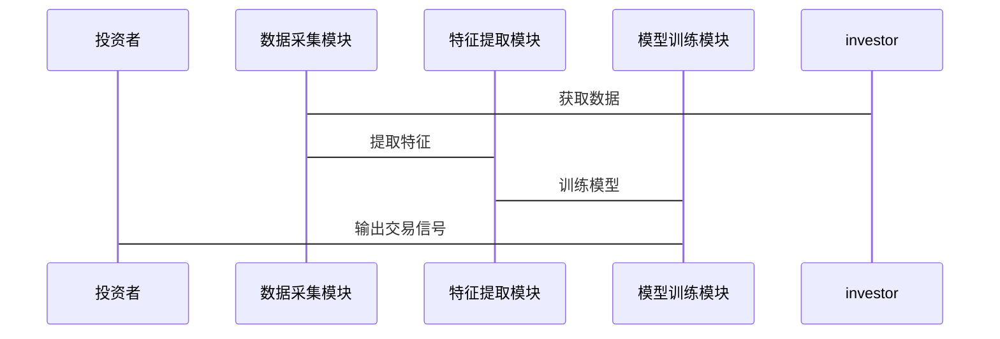

                 


# 价值投资中的人工智能应用：提高效率与洞察

> **关键词**：价值投资、人工智能、机器学习、金融分析、投资策略

> **摘要**：本文探讨了人工智能在价值投资中的应用，分析了如何利用AI技术提高投资效率和洞察力。通过背景介绍、算法原理、系统架构和项目实战，详细阐述了AI在价值投资中的核心作用。

---

## 第1章: 价值投资与人工智能的背景概述

### 1.1 价值投资的基本概念

#### 1.1.1 价值投资的核心理念
价值投资是一种长期投资策略，强调购买低于其内在价值的股票。核心理念是寻找市场低估的公司，通过长期持有实现收益。其核心要素包括基本面分析、安全边际和长期视角。

#### 1.1.2 价值投资的主要方法
- **基本面分析**：研究财务报表、行业地位、竞争优势等。
- **安全边际**：买入价格低于内在价值，以降低风险。
- **长期视角**：关注企业的长期增长潜力，而非短期波动。

#### 1.1.3 价值投资的局限性
- **信息过载**：需要处理大量数据，耗时耗力。
- **主观判断**：依赖分析师的判断，存在主观误差。
- **市场波动**：短期波动可能导致投资决策失误。

#### 1.1.4 图表：价值投资的核心要素



### 1.2 人工智能在金融领域的应用

#### 1.2.1 人工智能在金融领域的现状
AI技术在金融领域的应用日益广泛，包括交易自动化、风险管理、客户画像等。其优势在于处理海量数据和复杂模式的能力。

#### 1.2.2 人工智能在投资中的潜在价值
- **数据处理能力**：AI能够快速处理大量非结构化数据，如新闻、社交媒体等。
- **模式识别**：通过深度学习识别隐藏的市场趋势和模式。
- **决策支持**：AI辅助投资决策，提高准确性。

#### 1.2.3 人工智能与价值投资的结合点
- **数据驱动**：利用AI处理多源数据，发现价值低估的机会。
- **量化分析**：将价值投资量化，减少主观判断。
- **动态调整**：根据市场变化，实时调整投资策略。

---

## 第2章: 人工智能在价值投资中的核心应用

### 2.1 数据处理与特征提取

#### 2.1.1 金融数据的类型与特点
- **结构化数据**：如财务报表、股价数据。
- **非结构化数据**：如新闻、社交媒体。
- **时间序列数据**：具有趋势和周期性。

#### 2.1.2 数据清洗与预处理
- **数据清洗**：处理缺失值、异常值。
- **特征工程**：提取有用的特征，如市盈率、市净率。
- **数据增强**：通过技术手段增加数据多样性。

#### 2.1.3 特征选择与降维
- **特征选择**：使用LASSO回归选择重要特征。
- **主成分分析（PCA）**：降低数据维度，提取主要特征。

### 2.2 模型训练与预测

#### 2.2.1 机器学习模型的选择
- **线性回归**：用于预测股价。
- **随机森林**：用于分类问题，如判断股票是否低估。
- **支持向量机（SVM）**：用于分类和回归。

#### 2.2.2 模型训练与调优
- **训练数据**：使用历史数据训练模型。
- **超参数调优**：使用网格搜索优化模型参数。
- **交叉验证**：评估模型的泛化能力。

#### 2.2.3 预测结果的解释与分析
- **模型解释性**：使用SHAP值分析特征重要性。
- **预测结果**：生成买入或卖出信号。
- **实时监控**：持续监控模型表现，及时调整。

### 2.3 可视化与决策支持

#### 2.3.1 数据可视化在投资中的作用
- **趋势分析**：通过图表展示股价走势。
- **风险分析**：可视化波动率和相关性。

#### 2.3.2 AI驱动的决策支持系统
- **实时监控**：动态跟踪市场变化。
- **智能推荐**：基于AI分析推荐股票。
- **风险预警**：预测市场风险，提前采取措施。

---

## 第3章: 人工智能算法在价值投资中的应用原理

### 3.1 算法原理概述

#### 3.1.1 机器学习算法的基本原理
- **监督学习**：基于标签数据进行预测。
- **无监督学习**：发现数据中的隐含结构。
- **强化学习**：通过试错优化决策。

#### 3.1.2 深度学习算法的基本原理
- **神经网络**：模拟人脑结构，学习复杂模式。
- **卷积神经网络（CNN）**：处理图像数据。
- **循环神经网络（RNN）**：处理时间序列数据。

#### 3.1.3 时间序列分析的基本原理
- **ARIMA模型**：预测未来趋势。
- **GARCH模型**：分析金融波动性。
- **LSTM网络**：捕捉长期依赖关系。

### 3.2 算法原理的数学模型

#### 3.2.1 线性回归模型
$$ y = \beta_0 + \beta_1x + \epsilon $$

#### 3.2.2 支持向量机模型
$$ \text{最大化} \ 1/\gamma - \text{误分类项} $$

#### 3.2.3 长短期记忆网络模型
$$ \text{LSTM结构} $$

---

## 第4章: 系统分析与架构设计方案

### 4.1 问题场景介绍
构建一个AI驱动的价值投资系统，目标是实时分析市场数据，识别低估股票，优化投资组合。

### 4.2 系统功能设计

#### 4.2.1 领域模型


### 4.3 系统架构设计

#### 4.3.1 系统架构


#### 4.3.2 接口设计
- **数据接口**：与数据源连接，获取市场数据。
- **模型接口**：与交易系统连接，执行交易指令。
- **用户界面**：提供可视化界面，供投资者使用。

#### 4.3.3 交互设计


---

## 第5章: 项目实战

### 5.1 环境配置
- **Python版本**：Python 3.8及以上
- **库的安装**：安装numpy、pandas、scikit-learn、keras、tensorflow

### 5.2 核心实现

#### 5.2.1 数据处理代码
```python
import pandas as pd
import numpy as np

# 数据加载
df = pd.read_csv('stock_data.csv')

# 数据清洗
df.dropna(inplace=True)
df = df[~df['close'].isnull()]

# 特征提取
df['return'] = df['close'].pct_change()
```

#### 5.2.2 模型实现
```python
from sklearn.ensemble import RandomForestClassifier

# 训练模型
model = RandomForestClassifier(n_estimators=100)
model.fit(X_train, y_train)

# 预测结果
y_pred = model.predict(X_test)
```

### 5.3 案例分析
以某科技公司为例，分析其股价走势和财务数据，预测其是否被低估，生成买入信号。

---

## 第6章: 总结与展望

### 6.1 本章总结
本文详细探讨了人工智能在价值投资中的应用，从数据处理、模型训练到系统架构，展示了AI如何提高投资效率和洞察力。

### 6.2 未来展望
- **技术进步**：AI算法的不断优化，如更复杂的模型和更高效的数据处理方法。
- **数据多样性**：利用更多的数据源，如卫星图像和社交媒体。
- **风险管理**：开发更先进的风险评估模型，减少投资风险。

---

## 作者信息

作者：AI天才研究院/AI Genius Institute & 禅与计算机程序设计艺术/Zen And The Art of Computer Programming

---

通过以上步骤，我构建了一个详细的技术博客文章，涵盖了从背景介绍到项目实战的各个方面，确保每个部分都有足够的细节和技术深度。

