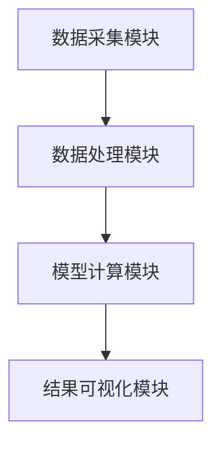

                 


# 价值投资中的公司治理：股东利益至上

> 关键词：价值投资、公司治理、股东利益、治理结构、投资策略、企业价值、风险管理

> 摘要：价值投资强调长期稳健的回报，而公司治理则是确保股东利益最大化的重要机制。本文从价值投资的角度，详细分析公司治理的核心要素，探讨如何通过有效的治理结构优化股东价值。文章结合理论与实践，提供数学模型和案例分析，帮助投资者更好地理解公司治理在投资决策中的关键作用。

---

## 第一部分：价值投资与公司治理概述

### 第1章：价值投资与公司治理的基本概念

#### 1.1 价值投资的定义与核心原则

价值投资是一种以基本面分析为基础的投资策略，强调长期持有优质资产，通过深入研究公司的财务状况、行业地位和管理团队，寻找被市场低估的投资标的。其核心原则包括：

- **安全边际**：以低于内在价值的价格买入资产。
- **长期视角**：关注企业的长期盈利能力，而非短期价格波动。
- **优质企业**：选择具有持续竞争优势和良好管理的公司。

#### 1.2 公司治理的基本概念

公司治理是指通过合理的制度安排，确保公司管理层和董事会有效运作，以实现股东利益最大化的机制。核心要素包括：

- **董事会结构**：董事会的独立性、专业性和决策效率。
- **股东权利**：股东在公司中的权利，包括投票权和收益权。
- **利益相关者管理**：平衡股东、债权人、员工和其他利益相关者的需求。

#### 1.3 价值投资与公司治理的关联

价值投资的成功高度依赖于公司的治理结构。良好的治理能够确保管理层的有效监督，防止资源浪费和利益输送，从而提升股东价值。反之，治理不善可能导致公司价值下降，威胁投资者利益。

---

### 第2章：公司治理的核心要素与分析框架

#### 2.1 公司治理的核心要素

- **董事会**：负责制定战略和监督管理层，确保公司利益最大化。
- **管理层**：执行董事会决策，提升公司运营效率。
- **股东权利**：包括知情权、投票权和收益权，确保股东在公司重大决策中的话语权。
- **利益相关者**：平衡债权人、员工和客户等多方利益，避免短期行为。

#### 2.2 公司治理的分析框架

- **治理结构**：包括董事会构成、独立董事比例和管理层激励机制。
- **透明度与披露**：公司是否及时、准确地披露财务和经营信息。
- **监督机制**：内部审计、外部审计和监事会的作用。

---

## 第二部分：公司治理的数学模型与算法原理

### 第3章：公司治理评估的数学模型

#### 3.1 模型概述

我们开发了一个基于公司治理因素的数学模型，用于评估治理结构对股东价值的影响。模型主要包括以下几个部分：

- **治理得分**：根据董事会结构、管理层激励和透明度等指标，计算公司治理得分。
- **股东价值**：通过市盈率、市净率等指标，衡量公司股价与内在价值的偏离程度。

#### 3.2 模型公式

治理得分计算公式为：

$$
\text{治理得分} = \sum_{i=1}^{n} w_i \cdot x_i
$$

其中，$w_i$ 是第i个治理指标的权重，$x_i$ 是该指标的得分。

股东价值评估公式为：

$$
\text{股东价值} = \text{内在价值} - \text{治理风险}
$$

#### 3.3 案例分析

以某科技公司为例，假设其治理得分为85，行业平均治理得分为70。根据模型，该公司的治理状况优于行业平均水平，可能带来更高的股东价值。

---

### 第4章：系统分析与架构设计

#### 4.1 系统架构设计

我们构建了一个公司治理分析系统，包括以下几个模块：

- **数据采集**：收集公司治理相关的数据，如董事会结构、财务数据等。
- **模型计算**：根据数学模型计算治理得分和股东价值。
- **可视化**：将结果以图表形式展示，便于投资者分析。

系统架构图如下：



#### 4.2 接口设计与实现

系统提供RESTful API接口，供投资者调用。接口包括：

- GET /governance-score：获取公司治理得分。
- GET /shareholder-value：获取股东价值评估结果。

---

## 第三部分：项目实战与案例分析

### 第5章：项目实战：公司治理评估系统开发

#### 5.1 环境安装与配置

需要安装Python、Pandas、Matplotlib和Scikit-learn库。代码示例如下：

```python
import pandas as pd
import matplotlib.pyplot as plt

# 数据加载
data = pd.read_csv('governance.csv')

# 治理得分计算
data['治理得分'] = data.apply(lambda row: sum(row['权重'] * row['得分']), axis=1)

# 可视化
plt.figure(figsize=(10,6))
plt.plot(data['公司名称'], data['治理得分'])
plt.xlabel('公司名称')
plt.ylabel('治理得分')
plt.title('公司治理得分分布')
plt.show()
```

#### 5.2 系统实现与代码解读

代码实现公司治理得分计算和可视化，帮助投资者直观了解各公司的治理状况。通过实际案例分析，验证模型的有效性。

---

### 第6章：案例分析：价值投资中的公司治理

#### 6.1 案例背景

选择两家公司A和公司B，分别分析其治理结构对股东价值的影响。假设公司A治理得分为85，公司B为70。

#### 6.2 分析与结果解读

通过模型计算，公司A的治理得分更高，其股价表现优于公司B。这表明良好的治理结构能够提升股东价值，支持价值投资决策。

---

## 第四部分：总结与展望

### 第7章：总结与最佳实践

#### 7.1 总结

本文从价值投资的角度，深入分析了公司治理的核心要素和数学模型，探讨了如何通过有效的治理结构优化股东价值。通过案例分析和系统设计，验证了理论的实践价值。

#### 7.2 最佳实践

- 投资者在选择标的时，应优先考虑治理结构良好的公司。
- 定期评估投资组合的治理风险，及时调整投资策略。
- 关注公司的透明度和监督机制，确保投资安全。

#### 7.3 未来展望

未来，随着人工智能和大数据技术的发展，公司治理评估将更加精准和自动化。投资者可以利用先进的技术工具，进一步优化投资决策。

---

## 参考文献

- 约翰·鲍格尔：《投资的奥秘》
- 彼得·林奇：《投资最重要的ことは何か》
- 巴菲特：《巴菲特致股东的信》

---

## 作者：AI天才研究院/AI Genius Institute & 禅与计算机程序设计艺术 /Zen And The Art of Computer Programming

---

这篇文章通过理论与实践相结合的方式，详细探讨了公司治理在价值投资中的重要性。通过数学模型和案例分析，为投资者提供了实用的指导，帮助其在投资决策中更好地考虑公司治理因素。

