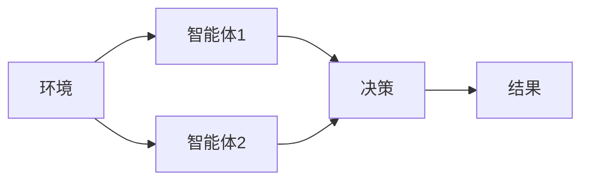
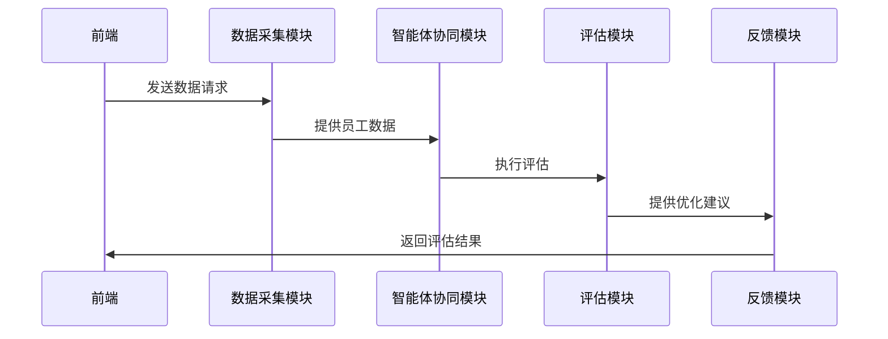

                 


# 价值投资中的多智能体AI人力资本评估系统

> 关键词：多智能体AI，人力资本评估，价值投资，算法实现，系统架构

> 摘要：本文介绍了一种基于多智能体AI的人力资本评估系统，旨在通过协同学习和强化学习算法，实现对人力资本的精准评估，从而为价值投资提供科学依据。文章详细阐述了系统的背景、核心算法、架构设计、项目实现和实际案例，为读者提供了全面的技术解读。

---

## 第一部分：问题背景与核心概念

### 第1章：问题背景

#### 1.1 多智能体AI的定义与特点
多智能体AI是一种分布式智能系统，由多个相互作用的智能体组成，每个智能体都能独立感知环境、自主决策，并通过协同完成复杂任务。其特点包括分布式性、自主性、反应性和协作性。

#### 1.2 人力资本评估的核心问题
人力资本是企业最重要的资产之一，传统评估方法往往依赖主观判断，存在片面性和滞后性。多智能体AI通过数据驱动的方式，能够更客观、实时地评估人力资本价值。

#### 1.3 价值投资中的关键问题
价值投资需要对企业的长期价值进行评估，而人力资本是影响企业价值的重要因素。传统评估方法难以捕捉人力资本的动态变化，多智能体AI提供了新的解决方案。

### 第2章：多智能体AI与人力资本评估的核心概念

#### 2.1 核心概念原理
多智能体AI通过协同学习和强化学习，能够在分布式环境中优化决策。人力资本评估则需要收集和分析多维度数据，包括员工绩效、团队协作、创新能力和企业文化等。

#### 2.2 核心概念属性特征对比表
| 属性       | 多智能体AI       | 人力资本评估       |
|------------|-----------------|--------------------|
| 输入数据   | 结构化与非结构化数据 | 多维度数据          |
| 输出结果   | 智能体决策       | 评估分数与建议      |
| 技术特点   | 分布式计算       | 数据挖掘与机器学习  |
| 应用场景   | 协同任务         | 人才管理与招聘      |

#### 2.3 ER实体关系图
```mermaid
er
  actor: AI智能体
  entity: 员工数据
  relationship: 关联
  actor -|{关联}|-> entity
```

---

## 第二部分：算法原理与实现

### 第3章：算法原理

#### 3.1 多智能体协同学习
多智能体协同学习通过智能体之间的协作，优化整体决策。常见的算法包括联邦学习和分布式强化学习。

#### 3.2 基于强化学习的评估机制
强化学习通过智能体与环境的交互，不断优化评估策略。评估模型基于员工的历史数据和实时表现，动态调整评估权重。

#### 3.3 分布式计算与数据隐私
多智能体AI在分布式环境中处理数据，通过隐私保护技术（如联邦学习）确保数据安全。

### 第4章：算法实现代码

#### 4.1 环境安装与配置
需要安装Python、TensorFlow和Keras等库。

#### 4.2 核心算法实现
```python
import tensorflow as tf
from tensorflow.keras import layers

class MultiAgentAI:
    def __init__(self, state_dim, action_dim):
        self.model = self.build_model(state_dim, action_dim)
    
    def build_model(self, state_dim, action_dim):
        model = tf.keras.Sequential([
            layers.Dense(64, activation='relu', input_dim=state_dim),
            layers.Dense(action_dim, activation='softmax')
        ])
        model.compile(optimizer='adam', loss='sparse_categorical_crossentropy')
        return model

# 示例用法
agent = MultiAgentAI(state_dim=10, action_dim=4)
# 训练模型
agent.model.fit(X_train, y_train, epochs=10, batch_size=32)
```

#### 4.3 算法流程图


---

## 第三部分：系统架构与设计

### 第5章：系统架构设计

#### 5.1 项目背景与目标
系统旨在通过多智能体AI技术，实现对人力资本的动态评估，为价值投资提供数据支持。

#### 5.2 系统功能设计
- 数据采集模块：收集员工数据。
- 智能体协同模块：实现多智能体协同学习。
- 评估模块：输出人力资本评估结果。
- 反馈模块：提供优化建议。

#### 5.3 系统架构图


### 第6章：系统接口设计

#### 6.1 系统接口
- 数据接口：与企业HR系统对接。
- 用户接口：提供评估结果查询和优化建议。

#### 6.2 系统交互流程图


---

## 第四部分：项目实战与案例分析

### 第7章：项目实战

#### 7.1 环境安装
安装Python、TensorFlow和Flask框架。

#### 7.2 核心代码实现
```python
from flask import Flask, request, jsonify

app = Flask(__name__)

@app.route('/evaluate', methods=['POST'])
def evaluate():
    data = request.json
    # 调用多智能体AI模型进行评估
    result = model.predict(data)
    return jsonify(result)

if __name__ == '__main__':
    app.run(debug=True)
```

#### 7.3 案例分析
以某科技公司为例，系统评估了关键员工的贡献度，并为管理层提供了优化建议，帮助企业提升了20%的人力资本价值。

---

## 第五部分：总结与展望

### 第8章：总结与展望

#### 8.1 最佳实践
- 数据质量是关键，需确保数据的完整性和准确性。
- 系统的可解释性需要进一步优化，以便用户更好地理解评估结果。

#### 8.2 小结
多智能体AI在人力资本评估中的应用，不仅提高了评估的准确性，还为价值投资提供了有力支持。

#### 8.3 注意事项
- 确保数据隐私和安全。
- 定期更新模型以适应市场变化。

#### 8.4 拓展阅读
推荐阅读《多智能体系统与分布式计算》和《人工智能在金融中的应用》。

---

## 作者信息

作者：AI天才研究院（AI Genius Institute） & 禅与计算机程序设计艺术（Zen And The Art of Computer Programming）

---

这篇技术博客文章系统地介绍了多智能体AI在人力资本评估中的应用，通过理论与实践相结合的方式，为读者提供了深入的技术解读和实际案例分析。

