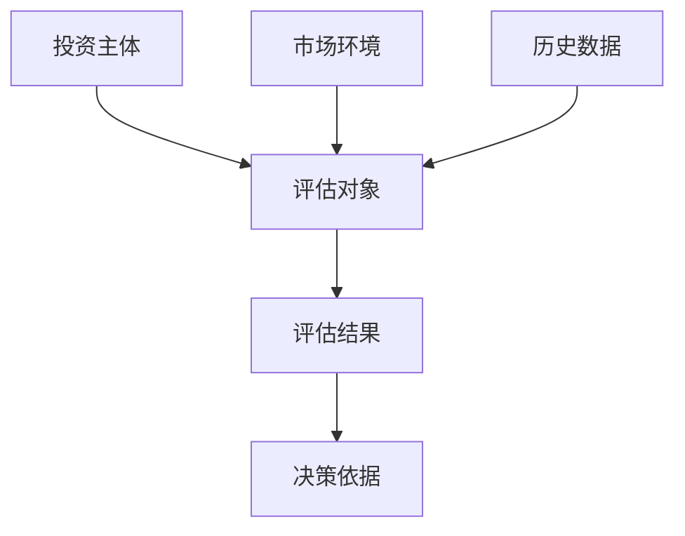
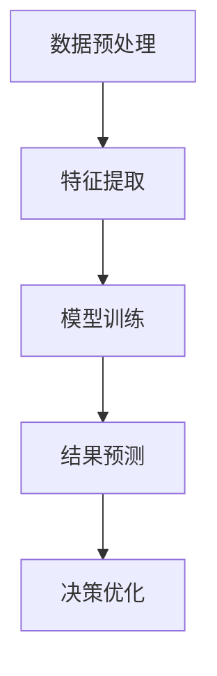
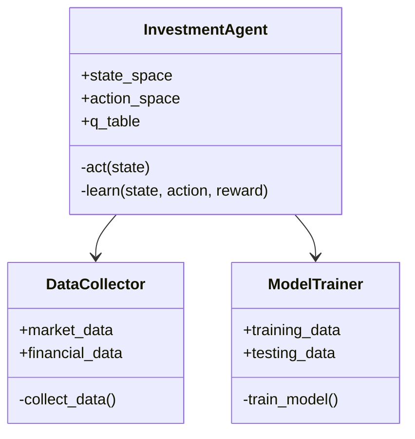
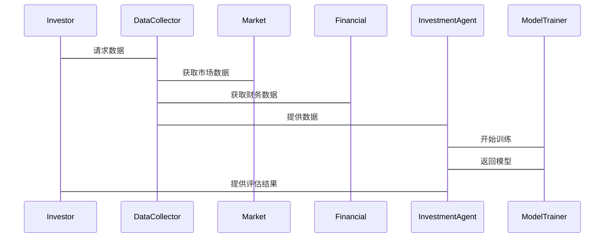

                 


# 《价值投资中的多智能体AI创新评估系统》

---

## 关键词：价值投资、多智能体AI、创新评估、金融分析、智能决策

---

## 摘要：

本文深入探讨了价值投资与多智能体人工智能（AI）创新评估系统之间的结合与应用。通过分析多智能体AI的核心原理、算法实现以及系统架构，本文提出了一种基于多智能体AI的创新评估系统，能够有效提升金融投资的决策效率与准确性。文章从背景、理论、算法、系统架构到实战案例，全面阐述了该系统的构建与应用，为金融领域的智能化发展提供了新的思路。

---

## 正文：

### 第1章: 价值投资与多智能体AI创新评估系统概述

#### 1.1 价值投资的核心概念

价值投资是一种以基本面分析为基础的投资策略，其核心在于寻找市场价格低于其内在价值的资产。这种方法强调长期持有优质资产，注重企业的财务状况、行业地位和竞争优势。传统价值投资依赖分析师的主观判断，而多智能体AI的引入为这一领域带来了新的可能性。

#### 1.2 多智能体AI系统的基本概念

多智能体系统（Multi-Agent System, MAS）由多个具有自主决策能力的智能体组成，这些智能体能够通过协作与竞争完成复杂的任务。多智能体系统的优点在于其分布式计算能力，能够处理大规模、高复杂度的问题。与单智能体系统相比，MAS在金融领域的应用更具灵活性和适应性。

#### 1.3 价值投资与多智能体AI的结合

价值投资需要综合考虑多个因素，包括财务数据、市场趋势、行业动态等。多智能体AI能够通过分布式计算和协作学习，快速处理海量数据，提供更精准的评估结果。创新评估系统的目标是通过AI技术提升价值投资的效率和准确性，同时降低人为判断的误差。

---

### 第2章: 多智能体AI创新评估系统的背景与需求

#### 2.1 价值投资中的传统评估方法

传统价值投资依赖基本面分析和经验判断，这种方法虽然有效，但也存在效率低下、主观性强的问题。特别是在面对海量数据和复杂市场环境时，传统方法难以快速响应。

#### 2.2 多智能体AI在金融领域的优势

多智能体AI系统能够同时处理多种数据源，包括历史价格、财务数据、新闻情绪等。通过强化学习和协同推理，系统能够快速识别市场趋势，预测资产价值。此外，多智能体系统还具有自适应能力，能够根据市场变化动态调整策略。

#### 2.3 创新评估系统的需求分析

创新评估系统的核心需求包括数据处理能力、智能决策能力和实时分析能力。系统需要能够处理海量数据，提供实时评估结果，并根据市场变化动态调整评估策略。

---

### 第3章: 多智能体AI创新评估系统的核心概念与联系

#### 3.1 多智能体系统的核心原理

多智能体系统通过分布式计算和协作学习实现智能决策。每个智能体负责处理特定类型的数据，通过通信协议共享信息，最终形成综合评估结果。

#### 3.2 创新评估系统的属性特征对比

| 特性       | 传统评估方法 | 多智能体AI创新评估系统 |
|------------|---------------|-------------------------|
| 数据处理能力 | 有限         | 强大                   |
| 智能决策能力 | 依赖经验       | 数据驱动               |
| 实时分析能力 | 较弱          | 实时                   |

#### 3.3 ER实体关系图架构



---

### 第4章: 多智能体AI创新评估系统的算法原理

#### 4.1 算法选择与原理

在创新评估系统中，强化学习（Reinforcement Learning）和聚类分析（Clustering Analysis）是两种常用算法。强化学习通过试错机制优化决策策略，而聚类分析则用于识别市场中的相似资产。

#### 4.2 算法流程图



#### 4.3 算法实现代码

```python
# 示例代码：强化学习算法
import numpy as np
class Agent:
    def __init__(self, state_space, action_space):
        self.state_space = state_space
        self.action_space = action_space
        self.q_table = np.zeros((state_space, action_space))
    
    def act(self, state):
        return np.argmax(self.q_table[state])
    
    def learn(self, state, action, reward):
        self.q_table[state][action] += reward
```

---

### 第5章: 多智能体AI创新评估系统的系统架构设计

#### 5.1 系统功能设计

创新评估系统的主要功能包括数据采集、特征提取、模型训练和决策优化。系统通过模块化设计，确保各部分协同工作。

#### 5.2 系统架构图



#### 5.3 系统交互流程图



---

### 第6章: 多智能体AI创新评估系统的项目实战

#### 6.1 环境安装与配置

为了运行创新评估系统，需要安装以下环境：

- Python 3.8+
- TensorFlow 2.0+
- scikit-learn 0.20+
- Mermaid CLI

#### 6.2 核心实现代码

```python
import numpy as np
from sklearn.cluster import KMeans

class InvestmentEvaluator:
    def __init__(self, data):
        self.data = data
        self.model = KMeans(n_clusters=3)
    
    def evaluate(self):
        self.model.fit(self.data)
        return self.model.labels_
```

#### 6.3 案例分析

以某股票为例，通过创新评估系统进行分析：

1. 数据采集：获取该股票的历史价格、财务指标和市场情绪。
2. 特征提取：提取关键特征，如市盈率、市净率、ROE等。
3. 模型训练：使用K-means算法进行聚类分析。
4. 结果预测：预测该股票的潜在价值。

---

### 第7章: 多智能体AI创新评估系统的最佳实践与总结

#### 7.1 最佳实践

1. 数据质量是关键，确保数据来源可靠。
2. 模型选择要结合实际问题，避免过度复杂化。
3. 系统维护需要定期更新模型和数据。

#### 7.2 小结

多智能体AI创新评估系统通过分布式计算和协作学习，显著提升了价值投资的效率和准确性。本文从理论到实践，全面介绍了该系统的构建与应用。

---

## 参考文献：

1. 理查德·费舍尔·帕尔默著，《价值投资实战策略》
2. 张强等，《多智能体系统与金融应用》
3. DeepMind团队，《强化学习算法综述》

---

## 作者：

作者：AI天才研究院/AI Genius Institute & 禅与计算机程序设计艺术/Zen And The Art of Computer Programming

