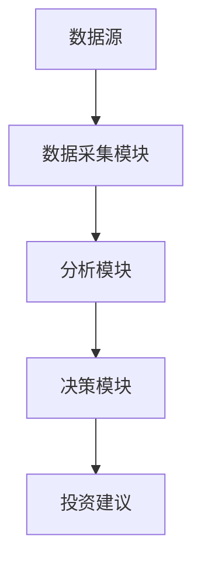

                 


# 价值投资中的多智能体AI工作资本分析系统

---

## 关键词
价值投资，多智能体AI，工作资本分析，金融分析，机器学习

---

## 摘要
在现代金融领域，价值投资作为一种经典的股票投资策略，依赖于对企业的深入分析和市场趋势的准确判断。传统的价值投资方法虽然有效，但在面对海量数据和复杂市场环境时，往往显得效率不足。本文提出了一种基于多智能体AI的工作资本分析系统，通过多个智能体协同工作，提升资本分析的准确性和效率。该系统结合了多智能体协作、强化学习和实时数据分析等技术，能够帮助投资者更精准地识别投资机会和风险，实现价值投资的智能化和自动化。

---

# 第一部分: 价值投资与多智能体AI的背景与概念

## 第1章: 价值投资的基本概念与方法论

### 1.1 价值投资的核心理念
#### 1.1.1 价值投资的定义与历史发展
价值投资是一种以基本面分析为基础的长期投资策略，其核心在于寻找被市场低估的企业。该方法由本杰明·格雷厄姆等投资大师提出，强调通过对企业财务状况、行业地位和管理团队的深入分析，发现具有长期增长潜力的优质企业。

#### 1.1.2 价值投资的基本原则与策略
价值投资的原则包括：
1. **安全边际**：买入价格低于内在价值。
2. **长期视角**：关注企业的长期增长潜力。
3. **分散投资**：降低风险，避免过度集中。
4. **逆向思维**：在市场恐慌时寻找机会。

#### 1.1.3 价值投资在现代金融中的地位与作用
尽管价值投资在传统金融中占据重要地位，但随着市场的复杂化和数据量的爆炸式增长，传统的手工分析方法已难以应对。因此，引入人工智能技术成为提升价值投资效率的必然选择。

---

### 1.2 传统价值投资的局限性与挑战
#### 1.2.1 传统价值投资的分析框架
传统价值投资依赖于财务报表分析、行业分析和市场分析，但这些方法存在以下问题：
1. 数据处理效率低。
2. 人工分析的主观性。
3. 市场波动难以预测。

#### 1.2.2 数据分析与决策的局限性
传统方法难以处理以下问题：
1. 数据量大，难以快速分析。
2. 无法实时捕捉市场变化。
3. 难以发现隐藏的关联性。

#### 1.2.3 市场波动与人为因素的影响
市场波动和投资者情绪往往影响投资决策，而传统方法难以有效应对这些不确定性。

---

### 1.3 多智能体AI的定义与特点
#### 1.3.1 多智能体AI的基本概念
多智能体AI是指由多个具有特定功能的智能体组成的系统，这些智能体能够协同工作，共同完成复杂任务。每个智能体都有自己的目标和决策机制，能够独立或协作地解决问题。

#### 1.3.2 多智能体AI的核心优势
1. **分布式计算**：提高处理效率。
2. **协同合作**：智能体之间可以互补优势。
3. **适应性**：能够根据环境变化动态调整。

#### 1.3.3 多智能体AI与传统AI的区别
| 特性               | 多智能体AI                   | 传统AI                     |
|--------------------|-----------------------------|-----------------------------|
| 决策主体           | 多个智能体                  | 单个或少数几个             |
| 协作性             | 强                           | 弱或无                     |
| 适应性             | 高                           | 中或低                     |

---

## 第2章: 多智能体AI在金融领域的应用前景

### 2.1 多智能体AI在金融分析中的优势
#### 2.1.1 数据处理与分析能力
多智能体AI能够高效处理海量数据，识别潜在的投资机会。

#### 2.1.2 多维度决策支持
通过多个智能体协作，提供全面的决策支持。

#### 2.1.3 实时市场反馈与优化
系统能够实时捕捉市场变化，动态优化投资策略。

---

### 2.2 价值投资中的多智能体AI系统架构
#### 2.2.1 系统整体架构概述
- **数据采集**：收集企业财务数据、市场数据等。
- **智能体协同分析**：多个智能体分别负责不同的分析任务。
- **结果整合与优化**：整合分析结果，生成最终的投资建议。

#### 2.2.2 各智能体的功能与角色
| 智能体类型       | 功能描述                         |
|------------------|---------------------------------|
| 财务分析智能体   | 分析企业财务报表                 |
| 市场分析智能体   | 监测市场趋势和竞争对手动态       |
| 风险评估智能体   | 评估投资风险                     |
| 投资决策智能体   | 综合分析结果，制定投资策略       |

#### 2.2.3 智能体之间的协作机制
智能体之间的协作可以通过消息传递和任务分配实现。例如，财务分析智能体完成对企业财务状况的评估后，将结果传递给投资决策智能体，供其制定投资策略。

---

## 第3章: 价值投资中的工作资本分析系统

### 3.1 工作资本分析的核心概念
#### 3.1.1 工作资本的定义与分类
工作资本（Working Capital）是指企业日常运营所需的流动资产减去流动负债，包括现金、应收账款、存货等。

#### 3.1.2 工作资本分析的指标体系
常用的指标包括：
1. **流动比率**：流动资产/流动负债。
2. **速动比率**：(流动资产 - 存货)/流动负债。
3. **现金周期**：企业将原材料转换为现金所需的时间。

#### 3.1.3 工作资本与企业价值的关系
良好的工作资本管理能够提高企业的流动性和抗风险能力，从而增强企业价值。

---

### 3.2 多智能体AI在工作资本分析中的应用
#### 3.2.1 数据采集与预处理
通过爬取企业财报、市场数据等，进行清洗和标准化处理。

#### 3.2.2 智能体协同分析与决策
多个智能体分别负责不同维度的分析，如财务状况、市场趋势等。

#### 3.2.3 分析结果的可视化与反馈
通过可视化工具展示分析结果，并提供实时反馈，优化投资策略。

---

# 第二部分: 多智能体AI系统的算法原理与实现

## 第4章: 多智能体AI的算法原理

### 4.1 多智能体AI的核心算法
#### 4.1.1 强化学习（Reinforcement Learning）
智能体通过与环境交互，学习最优策略。例如，使用Q-learning算法：

$$ Q(s, a) = Q(s, a) + \alpha \cdot [r + \max Q(s', a') - Q(s, a)] $$

其中：
- \( s \)：状态
- \( a \)：动作
- \( r \)：奖励
- \( \alpha \)：学习率

#### 4.1.2 协作与竞争机制
通过智能体之间的协作与竞争，优化整体决策。例如，使用分布式强化学习框架：

```python
def distributed_reinforcement_learning():
    workers = []
    for i in range(num_workers):
        workers.append(Worker())
    while True:
        for worker in workers:
            worker.update_policy()
```

---

### 4.2 算法实现与优化
#### 4.2.1 算法实现步骤
1. 初始化智能体。
2. 智能体与环境交互，获取状态和奖励。
3. 更新智能体的策略。

#### 4.2.2 算法优化技巧
- 使用分布式计算加速训练。
- 采用经验重放机制提高学习效率。

---

## 第5章: 系统架构设计与实现

### 5.1 系统架构设计
#### 5.1.1 系统模块划分
- 数据采集模块：负责数据的收集与预处理。
- 分析模块：包括多个智能体，分别执行不同的分析任务。
- 决策模块：综合分析结果，生成投资建议。

#### 5.1.2 系统架构图


---

### 5.2 系统实现细节
#### 5.2.1 数据采集与预处理
使用爬虫技术收集企业财报数据，清洗后存储在数据库中。

#### 5.2.2 智能体协作实现
通过消息队列（如Kafka）实现智能体之间的通信与协作。

#### 5.2.3 系统接口设计
提供API接口，方便其他系统调用分析结果。

---

## 第6章: 项目实战与案例分析

### 6.1 环境安装与配置
#### 6.1.1 安装Python与相关库
```bash
pip install numpy pandas scikit-learn tensorflow
```

#### 6.1.2 安装可视化工具
```bash
pip install matplotlib seaborn
```

---

### 6.2 核心代码实现
#### 6.2.1 数据采集与预处理
```python
import pandas as pd
import requests

def fetch_data(url):
    response = requests.get(url)
    data = response.json()
    return pd.DataFrame(data)
```

#### 6.2.2 多智能体协作实现
```python
from concurrent.futures import ThreadPoolExecutor

class Worker:
    def __init__(self, id):
        self.id = id
    def process_data(self, data):
        # 分析数据并返回结果
        pass
```

---

### 6.3 实际案例分析
以某企业为例，分析其工作资本状况，生成投资建议。例如，通过财务分析智能体评估企业的偿债能力，通过市场分析智能体预测行业前景。

---

## 第7章: 总结与展望

### 7.1 本章总结
多智能体AI在价值投资中的应用，显著提升了资本分析的效率和准确性。通过智能体的协同工作，能够更好地捕捉市场机会，降低投资风险。

### 7.2 未来展望
未来，随着AI技术的进一步发展，多智能体系统将在金融领域发挥更大的作用，如实时监控、动态调整投资策略等。

---

## 作者：AI天才研究院 & 禅与计算机程序设计艺术

