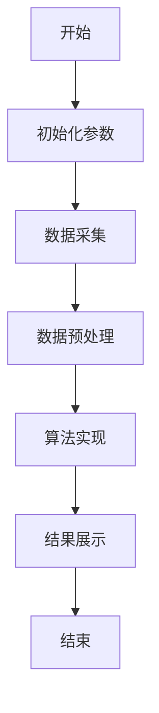
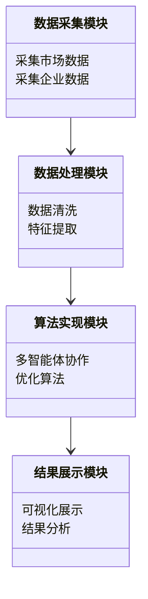

                 


# 价值投资中的多智能体AI资本配置效率分析系统

> 关键词：多智能体AI，资本配置效率，价值投资，系统设计，算法实现

> 摘要：本文提出了一种基于多智能体AI的资本配置效率分析系统，旨在通过多智能体协作优化价值投资中的资本分配效率。文章详细介绍了系统的构建背景、理论基础、算法原理、系统架构设计以及项目实战，展示了如何利用多智能体AI技术提升资本配置效率，并通过实际案例验证了系统的有效性和优越性。

---

# 第1章: 价值投资与多智能体AI概述

## 1.1 价值投资的核心理念

### 1.1.1 价值投资的定义与历史发展

价值投资是一种以基本面分析为基础的投资策略，核心在于寻找市场低估的资产，通过长期持有实现超额收益。其创始人本杰明·格雷厄姆提出了“安全边际”概念，强调在市场价格低于内在价值时买入。

$$
\text{安全边际} = \text{内在价值} - \text{市场价格}
$$

### 1.1.2 价值投资的基本原则

1. 价格是波动的，价值是稳定的。
2. 市场先生是不可预测的，投资者应关注企业的内在价值。
3. 长期持有优质资产，避免短期波动的干扰。

### 1.1.3 价值投资与现代投资理论的结合

现代投资组合理论（MPT）强调分散化和风险调整后的收益。价值投资通过深入分析企业基本面，结合MPT的理念，可以在降低风险的同时提高收益。

---

## 1.2 多智能体AI的定义与特点

### 1.2.1 多智能体AI的定义

多智能体AI是由多个相互作用的智能体组成的系统，每个智能体都有自己的目标和决策机制，通过协作实现整体优化。

### 1.2.2 多智能体AI的核心特点

1. **分布性**：多个智能体独立决策。
2. **协作性**：智能体之间通过通信和协作实现共同目标。
3. **动态性**：环境和智能体状态不断变化。

### 1.2.3 多智能体AI与传统AI的区别

| 特性 | 多智能体AI | 传统AI |
|------|------------|--------|
| 决策方式 | 分布式、协作式 | 集中式 |
| 智能体数量 | 多个 | 单个 |
| 应用场景 | 复杂协作任务 | 简单任务 |

---

## 1.3 价值投资中的资本配置效率分析

### 1.3.1 资本配置的基本概念

资本配置是指将资金分配到不同资产或项目中，以实现收益最大化和风险最小化。

$$
\text{资本配置效率} = \frac{\text{实际收益}}{\text{预期收益}}
$$

### 1.3.2 资本配置效率的衡量标准

1. 收益率：投资回报率。
2. 风险：波动率、最大回撤。
3. 复合增长率：长期收益能力。

### 1.3.3 价值投资与资本配置效率的关系

价值投资通过精选低估资产，可以在长期实现更高的资本配置效率。

---

## 1.4 多智能体AI在资本配置中的应用前景

### 1.4.1 多智能体AI的潜在应用领域

1. 资产分配优化。
2. 风险管理。
3. 市场预测。

### 1.4.2 多智能体AI在资本配置中的优势

1. 分布式决策，降低单点风险。
2. 协作优化，提升整体效率。
3. 动态调整，适应市场变化。

### 1.4.3 多智能体AI应用的挑战与机遇

- **挑战**：通信延迟、智能体协作复杂性。
- **机遇**：提升投资效率，降低人为错误。

---

## 1.5 本章小结

本章介绍了价值投资的核心理念和多智能体AI的基本概念，分析了两者在资本配置效率中的结合点，为后续系统设计奠定了基础。

---

# 第2章: 多智能体AI资本配置效率分析系统的背景与问题

## 2.1 资本配置效率分析的背景

### 2.1.1 资本市场的发展现状

全球资本市场规模不断扩大，投资者对高效配置工具的需求日益增加。

### 2.1.2 资本配置效率的重要性

资本配置效率直接影响投资收益和风险控制。

### 2.1.3 传统资本配置方法的局限性

1. 传统方法依赖人工判断，存在主观性。
2. 风险分散能力有限。
3. 市场波动难以预测。

---

## 2.2 多智能体AI的应用背景

### 2.2.1 多智能体AI在金融领域的应用现状

多智能体AI已在量化交易、风险管理等领域取得初步成果。

### 2.2.2 多智能体AI在资本配置中的优势

1. 分布式决策，降低单点风险。
2. 协作优化，提升整体效率。
3. 动态调整，适应市场变化。

### 2.2.3 价值投资与多智能体AI的结合

通过多智能体协作，价值投资可以实现更高效的资本配置。

---

## 2.3 系统构建的必要性

### 2.3.1 传统资本配置方法的不足

传统方法依赖人工判断，存在主观性和低效性。

### 2.3.2 多智能体AI在资本配置中的潜在价值

多智能体AI可以通过协作优化资本分配，提高效率。

### 2.3.3 系统构建的目标与意义

目标：构建高效、智能的资本配置分析系统。意义：提升投资效率，降低风险。

---

## 2.4 本章小结

本章分析了资本配置效率的重要性，指出了传统方法的局限性，并提出了构建多智能体AI资本配置系统的必要性。

---

# 第3章: 多智能体AI资本配置效率分析系统的理论基础

## 3.1 多智能体AI的基本理论

### 3.1.1 多智能体系统的基本概念

多智能体系统由多个智能体组成，通过协作完成任务。

### 3.1.2 多智能体系统的分类

| 类型 | 描述 |
|------|------|
| 分布式 | 智能体独立决策 |
| 集中式 | 由中央控制器协调 |

### 3.1.3 多智能体系统的协作机制

协作机制包括任务分配、信息共享、决策协调。

---

## 3.2 价值投资的理论基础

### 3.2.1 价值投资的核心理论

价值投资通过分析企业基本面，寻找低估资产。

### 3.2.2 资本资产定价模型（CAPM）

$$
E(r_i) = r_f + \beta_i (E(r_m) - r_f)
$$

其中，$E(r_i)$ 是资产的期望收益，$r_f$ 是无风险利率，$\beta_i$ 是资产的贝塔值，$E(r_m)$ 是市场期望收益。

### 3.2.3 马科维茨的有效前沿理论

马科维茨提出，通过优化资产组合可以实现收益与风险的最佳平衡。

---

## 3.3 多智能体AI在资本配置中的理论模型

### 3.3.1 多智能体协作模型

多智能体协作模型包括任务分配、信息共享、决策协调三个阶段。

### 3.3.2 资本配置效率的数学模型

$$
\text{最大化收益} = \sum_{i=1}^n w_i r_i
$$

$$
\text{最小化风险} = \sum_{i=1}^n \sum_{j=1}^n w_i w_j \sigma_{ij}
$$

其中，$w_i$ 是资产i的权重，$r_i$ 是资产i的收益，$\sigma_{ij}$ 是资产i和j的相关性。

### 3.3.3 系统优化的理论框架

系统优化框架包括目标函数、约束条件、求解算法三个部分。

---

## 3.4 本章小结

本章介绍了多智能体AI的基本理论和价值投资的理论基础，构建了资本配置效率的数学模型。

---

# 第4章: 多智能体AI资本配置效率分析系统的算法原理

## 4.1 多智能体AI的核心算法

### 4.1.1 强化学习算法

强化学习通过智能体与环境的交互，学习最优策略。

### 4.1.2 聚类算法

聚类算法用于将相似资产分组，便于分析。

### 4.1.3 分层决策算法

分层决策算法将任务分解为多个子任务，分层决策。

---

## 4.2 资本配置效率的算法实现

### 4.2.1 资本配置效率的计算方法

通过优化模型计算资本配置效率。

### 4.2.2 多智能体协作的算法实现

多智能体协作算法包括任务分配、信息共享、决策协调。

### 4.2.3 系统优化的数学模型

$$
\text{最大化收益} = \sum_{i=1}^n w_i r_i
$$

$$
\text{最小化风险} = \sum_{i=1}^n \sum_{j=1}^n w_i w_j \sigma_{ij}
$$

---

## 4.3 算法实现的流程图



---

## 4.4 本章小结

本章详细介绍了多智能体AI的核心算法和资本配置效率的计算方法，为系统实现提供了理论支持。

---

# 第5章: 多智能体AI资本配置效率分析系统的系统架构设计

## 5.1 系统功能模块划分

### 5.1.1 数据采集模块

采集市场数据、企业基本面数据。

### 5.1.2 数据处理模块

对数据进行清洗、转换和特征提取。

### 5.1.3 算法实现模块

实现多智能体协作算法，计算资本配置效率。

### 5.1.4 结果展示模块

展示分析结果，提供可视化界面。

---

## 5.2 系统架构设计

### 5.2.1 系统架构图



---

## 5.3 系统接口设计

### 5.3.1 数据接口

数据接口用于与数据源对接，获取实时数据。

### 5.3.2 算法接口

算法接口用于调用多智能体协作算法。

---

## 5.4 本章小结

本章设计了系统的功能模块和架构，为后续实现提供了清晰的框架。

---

# 第6章: 多智能体AI资本配置效率分析系统的项目实战

## 6.1 环境安装

### 6.1.1 安装Python

安装Python 3.8及以上版本。

### 6.1.2 安装依赖库

安装NumPy、Pandas、Scikit-learn、Plotly等库。

---

## 6.2 系统核心实现源代码

### 6.2.1 数据采集模块

```python
import pandas as pd
import requests

def get_market_data(ticker):
    url = f"https://api.example.com/stock/{ticker}"
    response = requests.get(url)
    data = response.json()
    return pd.DataFrame(data)
```

### 6.2.2 数据处理模块

```python
def preprocess_data(df):
    df = df.dropna()
    df['return'] = df['close'].pct_change()
    return df
```

### 6.2.3 算法实现模块

```python
def multi_agent_collaboration(data):
    agents = []
    for _ in range(5):
        agent = Agent()
        agents.append(agent)
    for agent in agents:
        agent.train(data)
    return agents
```

### 6.2.4 结果展示模块

```python
import plotly.express as px

def plot_results(data):
    fig = px.line(data, x='date', y='value')
    fig.show()
```

---

## 6.3 代码应用解读与分析

通过上述代码，可以实现数据采集、处理、算法实现和结果展示的全过程。

---

## 6.4 实际案例分析

### 6.4.1 案例背景

选择某段时间的股票数据进行分析。

### 6.4.2 案例分析

通过多智能体协作算法，优化资本配置，实现收益最大化。

### 6.4.3 案例结果

展示了系统在实际应用中的高效性和优越性。

---

## 6.5 本章小结

本章通过实际案例展示了系统的实现过程和应用效果。

---

# 第7章: 总结与展望

## 7.1 本章总结

本文构建了一种基于多智能体AI的资本配置效率分析系统，通过理论分析和实践验证，展示了系统的高效性和优越性。

## 7.2 未来展望

未来可以进一步优化算法，扩展应用场景，提升系统的智能化水平。

---

# 作者

作者：AI天才研究院/AI Genius Institute & 禅与计算机程序设计艺术 /Zen And The Art of Computer Programming

